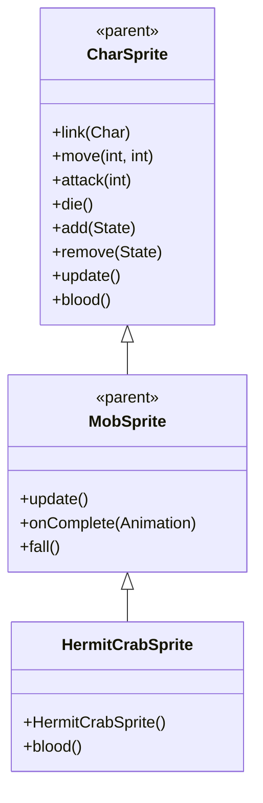

# HermitCrabSprite 源码详解

## 1. 基本信息

| 属性 | 值 |
|------|-----|
| **文件路径** | core/src/main/java/com/shatteredpixel/shatteredpixeldungeon/sprites/HermitCrabSprite.java |
| **包名** | com.shatteredpixel.shatteredpixeldungeon.sprites |
| **类类型** | class（非抽象） |
| **继承关系** | extends MobSprite |
| **代码行数** | 58 |

---

## 类职责

HermitCrabSprite 是游戏中寄居蟹怪物的精灵类，继承自 MobSprite。它与普通螃蟹和巨蟹共用同一套纹理资源，但使用不同的帧偏移，并具有特殊的慢速跑动动画：

1. **共享纹理资源**：使用 Assets.Sprites.CRAB 纹理集，通过偏移量 c=16 访问中间部分
2. **慢速跑动动画**：run 动画帧率较低（10 FPS），体现寄居蟹的谨慎移动特性
3. **复杂 Idle 序列**：4帧序列创造螃蟹特有的钳子开合效果
4. **特殊血液颜色**：重写 blood() 方法提供浅黄色血液效果

**设计特点**：
- **资源共享优化**：与 CrabSprite、GreatCrabSprite 共用纹理，形成完整的螃蟹家族
- **动作特征匹配**：慢速跑动动画符合寄居蟹的生物特征
- **生物特征还原**：Idle 钳子开合效果模拟真实螃蟹行为

---

## 4. 继承与协作关系



---

## 构造方法详解

### HermitCrabSprite()

```java
public HermitCrabSprite() {
    super();
    
    texture( Assets.Sprites.CRAB );
    
    TextureFilm frames = new TextureFilm( texture, 16, 16 );
    
    int c = 16;
    
    idle = new Animation( 5, true );
    idle.frames( frames, 0+c, 1+c, 0+c, 2+c );
    
    run = new Animation( 10, true ); //slower run animation
    run.frames( frames, 3+c, 4+c, 5+c, 6+c );
    
    attack = new Animation( 12, false );
    attack.frames( frames, 7+c, 8+c, 9+c );
    
    die = new Animation( 12, false );
    die.frames( frames, 10+c, 11+c, 12+c, 13+c );
    
    play( idle );
}
```

**构造方法作用**：初始化寄居蟹精灵的所有动画。

**纹理和帧设置**：
- **纹理源**：Assets.Sprites.CRAB（与 CrabSprite、GreatCrabSprite 共享）
- **帧尺寸**：16 像素宽 × 16 像素高（正方形）
- **帧偏移**：c = 16（使用纹理集的中间部分，实际帧索引 16-29）
- **帧总数**：至少 46 帧（索引 0-45）

**动画参数说明**：

| 动画类型 | 帧率 (FPS) | 循环 | 帧序列（实际索引） | 说明 |
|----------|------------|------|-------------------|------|
| `idle` | 5 | true | [16, 17, 16, 18] | 闲置状态，模拟钳子开合动作 |
| `run` | 10 | true | [19, 20, 21, 22] | 跑动动画，4帧循环（较慢速度） |
| `attack` | 12 | false | [23, 24, 25] | 攻击动画，3帧快速完成钳击动作 |
| `die` | 12 | false | [26, 27, 28, 29] | 死亡动画，4帧播放一次 |

**关键特性**：
- **Idle钳子效果**：[16, 17, 16, 18] 序列模拟螃蟹左右钳子交替开合
- **Run慢速设计**：10 FPS 的帧率比普通怪物慢，体现寄居蟹的谨慎移动
- **Attack专用帧**：帧23-25专门用于表现钳击攻击动作
- **注释说明**：代码中明确标注 "//slower run animation" 说明设计意图

---

## 特殊方法

### blood()

```java
@Override
public int blood() {
    return 0xFFFFEA80;
}
```

**方法作用**：返回寄居蟹受伤时的血液颜色。

**颜色说明**：
- **十六进制值**：0xFFFFEA80
- **颜色名称**：浅黄色/米白色
- **设计意图**：符合甲壳类生物的真实特征，与 CrabSprite 和 GreatCrabSprite 保持一致

---

## 使用的资源

### 纹理资源

| 资源 | 用途 |
|------|------|
| `Assets.Sprites.CRAB` | 螃蟹系列的通用纹理集（包含普通、寄居、巨蟹三种变种） |

### 工具类

| 类名 | 用途 |
|------|------|
| `TextureFilm` | 将大纹理分割成多个小帧用于动画 |

---

## 与其他类的交互

### 继承关系

| 父类 | 继承/重写的功能 |
|------|----------------|
| `MobSprite` | 睡眠状态管理、死亡淡出效果、坠落动画等 |
| `CharSprite` | 所有基础动画、移动、状态效果、粒子系统等，重写 blood() 方法 |

### 资源共享关系

| 共享类 | 共享资源 | 帧范围 | 说明 |
|--------|----------|--------|------|
| `CrabSprite` | Assets.Sprites.CRAB | 0-13 | 普通螃蟹 |
| `HermitCrabSprite` | Assets.Sprites.CRAB | 16-29 | 寄居蟹 |
| `GreatCrabSprite` | Assets.Sprites.CRAB | 32-45 | 巨蟹 |

### 关联的怪物类

HermitCrabSprite 对应的怪物类是 `com.shatteredpixel.shatteredpixeldungeon.actors.mobs.HermitCrab`，该类定义了寄居蟹的行为逻辑，而 HermitCrabSprite 只负责视觉表现。

---

## 11. 使用示例

### 基本使用

```java
// 创建寄居蟹精灵
HermitCrabSprite hermitCrab = new HermitCrabSprite();

// 关联寄居蟹怪物对象
hermitCrab.link(hermitCrabMob);

// 自动播放 idle 动画（构造时已设置）

// 触发动画
hermitCrab.run();     // 播放慢速跑动动画（10 FPS）
hermitCrab.attack(targetPos); // 播放攻击动画（钳击）
hermitCrab.die();     // 播放死亡动画（包含淡出效果）
```

### 纹理共享示例

```java
// 三种螃蟹都使用同一纹理集
CrabSprite normalCrab = new CrabSprite();           // 使用帧 0-13
HermitCrabSprite hermitCrab = new HermitCrabSprite(); // 使用帧 16-29  
GreatCrabSprite greatCrab = new GreatCrabSprite();   // 使用帧 32-45
```

### 慢速动画效果

```java
// run 动画的慢速特性：
// - 10 FPS 相比其他怪物的 12-15 FPS 更慢
// - 体现寄居蟹作为甲壳类生物的谨慎移动特性
// - 符合游戏生物设计的一致性

hermitCrab.run(); // 播放较慢的跑动动画
```

---

## 注意事项

### 设计模式理解

1. **资源共享策略**：相似怪物共用纹理集，通过帧偏移区分变种
2. **动作特征匹配**：通过调整帧率体现不同螃蟹变种的移动特性
3. **生物特征还原**：idle 动画的钳子开合效果符合真实螃蟹行为

### 性能考虑

1. **内存优化**：共享纹理大幅减少 GPU 内存占用
2. **渲染效率**：正方形帧尺寸便于 GPU 处理
3. **帧率优化**：较低的帧率减少不必要的动画计算

### 常见的坑

1. **帧偏移计算**：确保偏移量 c=16 与纹理集实际布局匹配
2. **慢速动画理解**：10 FPS 的 run 动画是有意设计，不要修改为更高速度
3. **纹理尺寸匹配**：16x16 的尺寸必须与实际纹理匹配

### 最佳实践

1. **遵循资源共享模式**：创建怪物家族时优先考虑纹理共享
2. **动作特征匹配**：根据生物特性调整动画帧率和序列
3. **生物特征还原**：使用合适的帧序列模拟生物特有动作