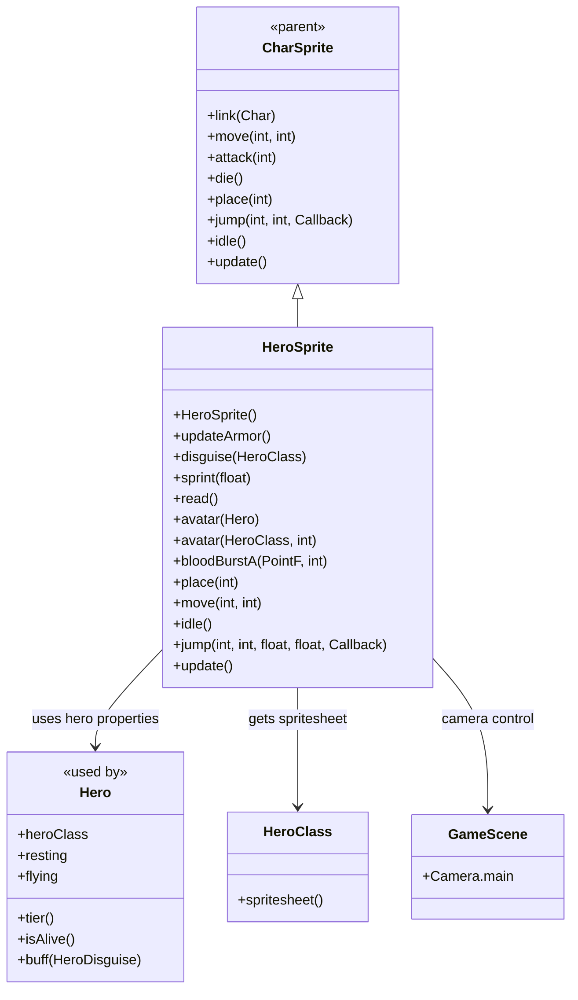

# HeroSprite 源码详解

## 1. 基本信息

| 属性 | 值 |
|------|-----|
| **文件路径** | core/src/main/java/com/shatteredpixel/shatteredpixeldungeon/sprites/HeroSprite.java |
| **包名** | com.shatteredpixel.shatteredpixeldungeon.sprites |
| **类类型** | class（非抽象） |
| **继承关系** | extends CharSprite |
| **代码行数** | 195 |

---

## 类职责

HeroSprite 是游戏中英雄角色的专用精灵类，继承自 CharSprite。它处理英雄特有的视觉表现和交互逻辑：

1. **职业外观系统**：支持不同英雄职业的外观切换和装备等级显示
2. **飞行状态处理**：处理英雄飞行时的特殊动画（使用飞行动画替代奔跑）
3. **相机跟随控制**：控制游戏相机跟随英雄移动，提供流畅的视角体验
4. **阅读动画**：专门的阅读书籍/卷轴动画
5. **暴力内容过滤**：重写血液效果方法以减少暴力内容（符合内容评级要求）
6. **头像生成**：为UI界面生成英雄头像

**设计特点**：
- **动态外观更新**：支持运行时更换职业外观和装备等级
- **平滑相机控制**：根据移动类型调整相机跟随速度
- **内容合规性**：主动移除英雄相关的血液效果以降低暴力评级

---

## 4. 继承与协作关系



---

## 静态常量

### 动画参数

| 字段名 | 类型 | 值 | 说明 |
|--------|------|-----|------|
| `FRAME_WIDTH` | int | 12 | 精灵帧宽度（像素） |
| `FRAME_HEIGHT` | int | 15 | 精灵帧高度（像素） |
| `RUN_FRAMERATE` | int | 20 | 奔跑动画帧率 |

### 静态字段

| 字段名 | 类型 | 说明 |
|--------|------|------|
| `tiers` | TextureFilm | 装备等级纹理胶片（静态缓存） |

---

## 实例字段

| 字段名 | 类型 | 说明 |
|--------|------|------|
| `fly` | Animation | 飞行动画 |
| `read` | Animation | 阅读动画 |

---

## 7. 方法详解

### 构造方法 HeroSprite()

```java
public HeroSprite() {
    super();
    texture(Dungeon.hero.heroClass.spritesheet());
    updateArmor();
    link(Dungeon.hero);
    
    if (ch.isAlive())
        idle();
    else
        die();
}
```

**方法作用**：初始化英雄精灵。

**初始化流程**：
1. 调用父类构造方法
2. 设置纹理为当前英雄职业的精灵表
3. 调用 `updateArmor()` 设置动画帧
4. 关联到 Dungeon.hero 对象
5. 根据英雄存活状态设置初始动画

---

### disguise(HeroClass cls)

```java
public void disguise(HeroClass cls) {
    texture(cls.spritesheet());
    updateArmor();
}
```

**方法作用**：临时伪装成其他英雄职业的外观。

**参数**：
- `cls` (HeroClass)：目标职业

**应用场景**：
- 变形术效果
- 特殊道具伪装效果
- 调试模式切换外观

---

### updateArmor()

```java
public void updateArmor() {
    TextureFilm film = new TextureFilm(tiers(), Dungeon.hero.tier(), FRAME_WIDTH, FRAME_HEIGHT);
    
    idle = new Animation(1, true);
    idle.frames(film, 0, 0, 0, 1, 0, 0, 1, 1);
    
    run = new Animation(RUN_FRAMERATE, true);
    run.frames(film, 2, 3, 4, 5, 6, 7);
    
    die = new Animation(20, false);
    die.frames(film, 8, 9, 10, 11, 12, 11);
    
    attack = new Animation(15, false);
    attack.frames(film, 13, 14, 15, 0);
    
    zap = attack.clone();
    
    operate = new Animation(8, false);
    operate.frames(film, 16, 17, 16, 17);
    
    fly = new Animation(1, true);
    fly.frames(film, 18);
    
    read = new Animation(20, false);
    read.frames(film, 19, 20, 20, 20, 20, 20, 20, 20, 20, 19);
    
    if (Dungeon.hero.isAlive())
        idle();
    else
        die();
}
```

**方法作用**：根据当前英雄的装备等级更新所有动画帧。

**关键特性**：
- **TextureFilm 分区**：从完整的精灵表中提取对应装备等级的区域
- **帧序列定义**：每个动画都有特定的帧序列
- **动态更新**：装备升级后立即反映在动画中

**各动画帧说明**：
- **idle**：空闲动画，包含轻微的呼吸效果
- **run**：奔跑动画，6帧循环
- **die**：死亡动画，播放后停留在最后帧
- **attack**：攻击动画，4帧序列
- **operate**：操作动画（开门、拾取等），2帧交替
- **fly**：飞行动画，单帧（悬浮状态）
- **read**：阅读动画，10帧序列，大部分时间为静止阅读状态

---

### place(int p)

```java
@Override
public void place(int p) {
    super.place(p);
    if (Game.scene() instanceof GameScene) Camera.main.panFollow(this, 5f);
}
```

**方法作用**：放置英雄精灵并启动相机跟随。

**参数**：
- `p` (int)：放置位置

**相机控制**：
- 使用 `panFollow(this, 5f)` 启动平滑跟随
- 跟随速度为5f（相对适中的速度）

---

### move(int from, int to)

```java
@Override
public void move(int from, int to) {
    super.move(from, to);
    if (ch != null && ch.flying) {
        play(fly);
    }
    Camera.main.panFollow(this, 20f);
}
```

**方法作用**：执行移动动画并处理飞行状态和相机控制。

**特殊处理**：
- **飞行状态**：如果英雄在飞行，播放飞行动画而不是奔跑动画
- **相机速度**：移动时相机跟随速度加快到20f（更灵敏）

---

### idle()

```java
@Override
public void idle() {
    super.idle();
    if (ch != null && ch.flying) {
        play(fly);
    }
}
```

**方法作用**：进入空闲状态，处理飞行状态。

**飞行优先级**：即使调用 `idle()`，如果英雄在飞行也会显示飞行动画。

---

### jump(int from, int to, float height, float duration, Callback callback)

```java
@Override
public void jump(int from, int to, float height, float duration, Callback callback) {
    super.jump(from, to, height, duration, callback);
    play(fly);
    Camera.main.panFollow(this, 20f);
}
```

**方法作用**：执行跳跃动画，强制使用飞行动画并控制相机。

**特点**：
- 跳跃时始终使用飞行动画
- 相机跟随速度与移动时相同（20f）

---

### read()

```java
public synchronized void read() {
    animCallback = new Callback() {
        @Override
        public void call() {
            idle();
            ch.onOperateComplete();
        }
    };
    play(read);
}
```

**方法作用**：执行阅读动画（用于阅读书籍、卷轴等）。

**同步机制**：使用 `synchronized` 确保线程安全。

**回调逻辑**：
- 动画完成后回到空闲状态
- 通知英雄操作完成

---

### bloodBurstA(PointF from, int damage)

```java
@Override
public void bloodBurstA(PointF from, int damage) {
    // Does nothing.
    /*
     * This is both for visual clarity, and also for content ratings regarding violence
     * towards human characters. The heroes are the only human or human-like characters which
     * participate in combat, so removing all blood associated with them is a simple way to
     * reduce the violence rating of the game.
     */
}
```

**方法作用**：重写为空方法，不显示任何血液效果。

**设计原因**：
- **视觉清晰度**：避免过多血液效果干扰游戏画面
- **内容评级**：减少对人类角色的暴力表现，降低游戏暴力评级
- **一致性**：英雄作为唯一的人类战斗角色，移除其血液效果可显著降低整体暴力程度

---

### update()

```java
@Override
public void update() {
    sleeping = ch.isAlive() && ((Hero)ch).resting;
    super.update();
}
```

**方法作用**：更新英雄精灵状态，特别处理休息（睡眠）状态。

**休息状态判断**：
- `ch.isAlive()`：英雄必须存活
- `((Hero)ch).resting`：英雄处于休息状态

**与 MobSprite 的区别**：
- MobSprite 使用 `mob.state == SLEEPING`
- HeroSprite 使用 `hero.resting`（英雄没有复杂的状态机）

---

### sprint(float speed)

```java
public void sprint(float speed) {
    run.delay = 1f / speed / RUN_FRAMERATE;
}
```

**方法作用**：调整奔跑动画的播放速度以匹配冲刺速度。

**参数计算**：
- `speed`：冲刺速度倍数
- 动画延迟 = 1 / (速度 × 帧率)
- 速度越快，动画播放越快

---

## 静态方法详解

### tiers()

```java
public static TextureFilm tiers() {
    if (tiers == null) {
        SmartTexture texture = TextureCache.get(Assets.Sprites.ROGUE);
        tiers = new TextureFilm(texture, texture.width, FRAME_HEIGHT);
    }
    return tiers;
}
```

**方法作用**：获取装备等级纹理胶片（静态缓存）。

**缓存机制**：
- 第一次调用时创建并缓存
- 后续调用直接返回缓存实例
- 使用 Rogue 职业的精灵表作为基础（所有职业装备等级布局相同）

**TextureFilm 创建**：
- 宽度：完整纹理宽度
- 高度：FRAME_HEIGHT (15像素)
- 将纹理水平分割为多个装备等级区域

---

### avatar(Hero hero)

```java
public static Image avatar(Hero hero) {
    if (hero.buff(HeroDisguise.class) != null) {
        return avatar(hero.buff(HeroDisguise.class).getDisguise(), hero.tier());
    } else {
        return avatar(hero.heroClass, hero.tier());
    }
}
```

**方法作用**：为指定英雄生成头像图像。

**伪装处理**：如果英雄有伪装效果，使用伪装的职业外观。

---

### avatar(HeroClass cl, int armorTier)

```java
public static Image avatar(HeroClass cl, int armorTier) {
    RectF patch = tiers().get(armorTier);
    Image avatar = new Image(cl.spritesheet());
    RectF frame = avatar.texture.uvRect(1, 0, FRAME_WIDTH, FRAME_HEIGHT);
    frame.shift(patch.left, patch.top);
    avatar.frame(frame);
    return avatar;
}
```

**方法作用**：为指定职业和装备等级生成头像。

**头像生成步骤**：
1. 获取对应装备等级的纹理区域 (`patch`)
2. 创建基于职业精灵表的图像
3. 定义头像帧区域（第2列，第1行）
4. 将帧区域偏移到对应装备等级位置
5. 设置图像帧并返回

**坐标说明**：
- 头像使用精灵表中第2列（索引1）的帧
- 装备等级通过垂直偏移实现

---

## 与其他类的交互

### 继承关系

| 父类 | 继承的功能 |
|------|-----------|
| `CharSprite` | 所有基础动画、移动、状态效果、粒子系统等 |

### 使用的类

| 类名 | 用途 |
|------|------|
| `Hero` | 获取英雄属性（职业、装备等级、飞行状态、休息状态等） |
| `HeroClass` | 获取职业精灵表 |
| `HeroDisguise` | 检查伪装效果 |
| `Dungeon` | 访问当前英雄对象 |
| `GameScene` | 相机控制和场景访问 |
| `Camera` | 相机跟随控制 |
| `TextureFilm` | 精灵帧管理 |
| `TextureCache` | 纹理缓存 |
| `SmartTexture` | 纹理处理 |
| `Image` | 头像图像创建 |
| `RectF` | 纹理坐标计算 |
| `Assets.Sprites` | 资源路径 |

### 被哪些类使用

| 使用场景 | 说明 |
|----------|------|
| `Dungeon.hero.sprite` | 英雄对象的sprite引用 |
| `GameScene` | 场景中的英雄显示 |
| `QuickSlot` | 快捷栏头像显示 |
| `Statistics` | 统计界面英雄显示 |
| `InterlevelScene` | 过场动画中的英雄显示 |

---

## 11. 使用示例

### 英雄精灵基本使用

```java
// 创建英雄精灵（通常由游戏自动创建）
HeroSprite heroSprite = new HeroSprite();

// 装备升级后更新外观
hero.upgradeEquipment();
heroSprite.updateArmor(); // 立即反映新装备等级

// 伪装效果
heroSprite.disguise(HeroClass.WARRIOR); // 临时显示为战士外观

// 冲刺状态
heroSprite.sprint(1.5f); // 奔跑动画加快50%

// 阅读动作
heroSprite.read(); // 播放阅读动画
```

### 相机控制

```java
// 移动时自动处理相机跟随
heroSprite.move(currentPos, targetPos);

// 放置时启动相机跟随
heroSprite.place(startingPosition);

// 跳跃时保持相机跟随
heroSprite.jump(fromPos, toPos, callback);
```

### 头像生成

```java
// 生成当前英雄头像
Image currentAvatar = HeroSprite.avatar(Dungeon.hero);

// 生成特定职业和等级的头像
Image warriorAvatar = HeroSprite.avatar(HeroClass.WARRIOR, 3);
```

### 飞行状态处理

```java
// 英雄获得飞行能力
hero.flying = true;

// 后续的 idle() 和 move() 会自动使用飞行动画
heroSprite.idle(); // 显示悬浮动画而非空闲动画
heroSprite.move(from, to); // 移动时显示悬浮动画
```

---

## 注意事项

### 内容合规性

1. **无血液效果**：英雄永远不会显示血液效果，这是有意设计
2. **评级考虑**：此设计帮助游戏获得更低的暴力内容评级
3. **一致性维护**：所有涉及英雄受伤的场景都不应有血液

### 相机控制

1. **跟随速度差异**：
   - 静止放置：5f（较慢，平稳）
   - 移动/跳跃：20f（较快，响应灵敏）
2. **场景限制**：只有在 GameScene 中才启用相机跟随
3. **性能影响**：频繁的位置变化会影响相机性能

### 动画管理

1. **装备等级同步**：每次装备升级后必须调用 `updateArmor()`
2. **帧率固定**：奔跑动画帧率固定为20，通过 `sprint()` 调整速度
3. **飞行动画优先级**：飞行状态下会覆盖其他动画（idle、move）

### 常见的坑

1. **忘记更新装备外观**：装备升级后忘记调用 `updateArmor()` 导致外观不匹配
2. **手动控制相机**：不应该手动控制相机，应该依赖 HeroSprite 的自动跟随
3. **重复动画播放**：注意 `zap = attack.clone()`，施法和攻击使用相同动画

### 最佳实践

1. **利用自动状态管理**：让 HeroSprite 自动处理飞行、休息等状态
2. **及时更新外观**：装备变化时立即调用 `updateArmor()`
3. **使用头像静态方法**：UI中需要英雄头像时使用 `avatar()` 静态方法
4. **尊重内容政策**：不要尝试恢复英雄的血液效果