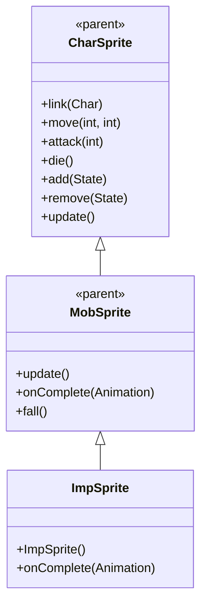

# ImpSprite 源码详解

## 1. 基本信息

| 属性 | 值 |
|------|-----|
| **文件路径** | core/src/main/java/com/shatteredpixel/shatteredpixeldungeon/sprites/ImpSprite.java |
| **包名** | com.shatteredpixel.shatteredpixeldungeon.sprites |
| **类类型** | class（非抽象） |
| **继承关系** | extends MobSprite |
| **代码行数** | 62 |

---

## 类职责

ImpSprite 是游戏中小恶魔（Imp）怪物的精灵类，继承自 MobSprite。它具有以下特殊功能：

1. **极其复杂的 Idle 动画**：包含43帧的超长序列，创造生动的小恶魔行为表现
2. **静止跑动动画**：run 动画使用单帧，体现小恶魔的特殊移动方式
3. **倒放死亡动画**：die 动画使用反向帧序列 [0,3,2,1,0,...] 创造特殊的死亡效果
4. **羊毛粒子特效**：死亡时爆发15个 Speck.WOOL 粒子效果

**设计特点**：
- **超复杂 Idle 序列**：43帧序列模拟小恶魔的各种小动作和行为
- **简化跑动逻辑**：单帧 run 动画可能表示瞬移或特殊移动方式
- **死亡特效增强**：大量羊毛粒子配合倒放死亡动画创造独特的视觉效果

---

## 4. 继承与协作关系



---

## 构造方法详解

### ImpSprite()

```java
public ImpSprite() {
    super();
    
    texture( Assets.Sprites.IMP );
    
    TextureFilm frames = new TextureFilm( texture, 12, 14 );
    
    idle = new Animation( 10, true );
    idle.frames( frames,
        0, 1, 2, 3, 0, 1, 2, 3, 0, 0, 0, 4, 4, 4, 4, 4, 4, 4, 4, 4, 4,
        0, 1, 2, 3, 0, 1, 2, 3, 0, 1, 3, 0, 0, 0, 4, 4, 4, 4, 4, 4, 4, 4, 0, 0, 0, 4, 4, 4, 4, 4, 4, 4, 4 );
    
    run = new Animation( 20, true );
    run.frames( frames, 0 );
    
    die = new Animation( 10, false );
    die.frames( frames, 0, 3, 2, 1, 0, 3, 2, 1, 0 );
    
    play( idle );
}
```

**构造方法作用**：初始化小恶魔精灵的所有动画。

**纹理和帧设置**：
- **纹理源**：Assets.Sprites.IMP
- **帧尺寸**：12 像素宽 × 14 像素高
- **帧总数**：至少5帧（索引 0-4）

**动画参数说明**：

| 动画类型 | 帧率 (FPS) | 循环 | 帧序列 | 说明 |
|----------|------------|------|--------|------|
| `idle` | 10 | true | 43帧超长序列 | 复杂的闲散行为序列 |
| `run` | 20 | true | [0] | 单帧静止动画 |
| `die` | 10 | false | [0, 3, 2, 1, 0, 3, 2, 1, 0] | 倒放死亡序列 |

**关键特性**：
- **Idle超复杂序列**：43帧序列包含多种模式重复，模拟小恶魔的复杂行为
- **Run单帧设计**：可能表示小恶魔使用瞬移而非传统移动
- **Die倒放序列**：[0,3,2,1,0] 的反向播放创造特殊的死亡回放效果

### Idle 序列分析

Idle 序列可以分解为几个模式：

1. **基础循环**：[0,1,2,3] - 基础动作循环
2. **静止等待**：[0,0,0] - 静止姿态
3. **特殊动作**：[4,4,4...] - 使用帧4的特殊动作（可能是魔法准备）
4. **混合序列**：各种模式的组合创造自然的行为变化

这种设计让小恶魔看起来非常生动，不断做各种小动作而不是简单重复。

---

## 核心方法详解

### onComplete(Animation anim)

```java
@Override
public void onComplete( Animation anim ) {
    if (anim == die) {
        emitter().burst( Speck.factory( Speck.WOOL ), 15 );
        killAndErase();
    } else {
        super.onComplete( anim );
    }
}
```

**方法作用**：处理死亡动画完成后的特殊效果。

**死亡特效**：
- **粒子类型**：Speck.WOOL（羊毛粒子）
- **粒子数量**：15个（大量粒子增强视觉效果）
- **清理逻辑**：调用 killAndErase() 彻底从场景中移除

**设计理念**：
- 小恶魔死亡时爆发出大量羊毛粒子，符合其混乱邪恶的特征
- 直接调用 killAndErase() 而不是 super.die()，跳过父类的淡出效果

---

## 使用的资源

### 纹理资源

| 资源 | 用途 |
|------|------|
| `Assets.Sprites.IMP` | 小恶魔的完整纹理集 |

### 效果和工具类

| 类名 | 用途 |
|------|------|
| `TextureFilm` | 将大纹理分割成多个小帧用于动画 |
| `Speck.WOOL` | 羊毛粒子效果 |

---

## 与其他类的交互

### 继承关系

| 父类 | 继承/重写的功能 |
|------|----------------|
| `MobSprite` | 睡眠状态管理、死亡淡出效果、坠落动画等（但 die() 被特殊处理） |
| `CharSprite` | 所有基础动画、移动、状态效果、粒子系统等 |

### 关联的怪物类

ImpSprite 对应的怪物类是 `com.shatteredpixel.shatteredpixeldungeon.actors.mobs.Imp`，该类定义了小恶魔的行为逻辑。

### 特殊设计考虑

- **无 Attack 动画**：Imp 可能使用远程攻击或特殊机制，不需要近战 attack 动画
- **Run 动画特殊**：单帧 run 动画可能配合特殊的移动机制（如瞬移）

---

## 11. 使用示例

### 基本使用

```java
// 创建小恶魔精灵
ImpSprite imp = new ImpSprite();

// 关联小恶魔怪物对象
imp.link(impMob);

// 自动播放复杂的 idle 动画（43帧序列）

// 触发动画
imp.run();     // 播放单帧 run 动画
// imp.attack(); // Imp 可能没有标准 attack 动画
imp.die();     // 播放倒放死亡动画（包含15个羊毛粒子）
```

### 复杂 Idle 效果

```java
// Idle 动画的复杂性体现在：
// - 43帧的不同组合
// - 包含基础动作、静止、特殊动作等多种模式
// - 创造非常生动的小恶魔形象，不断做各种小动作

imp.idle(); // 播放超长复合序列
```

### 死亡特效

```java
// 死亡特效自动触发：
imp.die();

// 自动执行：
// 1. 播放倒放死亡序列 [0,3,2,1,0,3,2,1,0]
// 2. 爆发15个羊毛粒子
// 3. 直接从场景中移除（无淡出效果）
```

---

## 注意事项

### 设计模式理解

1. **超复杂动画**：通过超长帧序列创造生动的角色行为
2. **特殊移动方式**：单帧 run 动画暗示非传统移动机制
3. **死亡特效强化**：大量粒子配合特殊死亡动画

### 性能考虑

1. **内存效率**：虽然 idle 序列很长，但只使用5个纹理帧，内存占用小
2. **渲染开销**：43帧序列需要更多 CPU 计算，但帧率适中（10 FPS）
3. **粒子开销**：15个羊毛粒子在死亡时爆发，性能开销可控

### 常见的坑

1. **序列长度**：43帧的 idle 序列容易被误认为错误，实际是有意设计
2. **缺少 Attack**：Imp 没有 attack 动画，可能使用其他攻击机制
3. **死亡处理**：直接调用 killAndErase() 跳过了父类的淡出逻辑

### 最佳实践

1. **复杂角色动画**：为重要角色设计超长复合动画序列增加生动性
2. **特殊机制配合**：动画设计要与游戏机制相匹配（如瞬移配合单帧 run）
3. **死亡特效差异化**：使用大量粒子和特殊动画创造独特的死亡体验