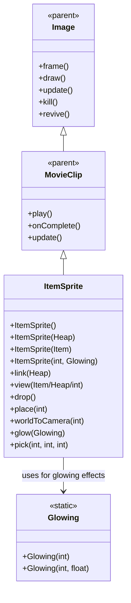

# ItemSprite 源码详解

## 1. 基本信息

| 属性 | 值 |
|------|-----|
| **文件路径** | core/src/main/java/com/shatteredpixel/shatteredpixeldungeon/sprites/ItemSprite.java |
| **包名** | com.shatteredpixel.shatteredpixeldungeon.sprites |
| **类类型** | class（非抽象） |
| **继承关系** | extends MovieClip |
| **代码行数** | 418 |

---

## 类职责

ItemSprite 是游戏中所有物品精灵的基础类，继承自 MovieClip。它负责处理游戏中所有物品的显示、动画、交互和视觉效果：

1. **多构造函数支持**：支持从 Item、Heap、image index 等多种方式创建
2. **复杂的掉落动画**：实现物理真实的物品掉落效果，包括速度、加速度和音效
3. **阴影渲染系统**：自定义阴影矩阵和渲染逻辑，提供逼真的物品投影效果
4. **发光效果管理**：Glowing 内部类支持动态发光效果，可调节颜色和闪烁周期
5. **粒子特效集成**：支持物品自身的 emitter 粒子效果
6. **环境交互**：根据地面类型播放不同的落地音效（水、草地、石板等）

**设计特点**：
- **高度可配置**：通过多个 protected 字段允许子类自定义视觉效果
- **完整的生命周期管理**：从创建、显示、掉落、到销毁的完整流程
- **性能优化**：使用对象池、缓存和条件渲染提高性能
- **环境感知**：根据地面类型和可见性自动调整行为

---

## 4. 继承与协作关系



---

## 核心字段

### 静态常量

| 字段名 | 类型 | 值 | 说明 |
|--------|------|-----|------|
| `SIZE` | int | 16 | 物品纹理的标准尺寸 |
| `DROP_INTERVAL` | float | 0.4f | 掉落动画持续时间（秒） |

### 实例字段

| 字段名 | 类型 | 说明 |
|--------|------|------|
| `heap` | Heap | 关联的物品堆，用于状态同步 |
| `glowing` | Glowing | 发光效果配置 |
| `emitter` | Emitter | 物品粒子发射器 |
| `dropInterval` | float | 掉落动画计时器 |
| `perspectiveRaise` | float | 透视提升高度（默认 5/16f = 0.3125） |
| `renderShadow` | boolean | 是否渲染阴影（默认 false） |
| `shadowWidth/Height/Offset` | float | 阴影尺寸和偏移配置 |

---

## 构造函数详解

### 多重构造函数

```java
public ItemSprite() { this( ItemSpriteSheet.SOMETHING, null ); }
public ItemSprite( Heap heap ){ super(Assets.Sprites.ITEMS); view( heap ); }
public ItemSprite( Item item ) { super(Assets.Sprites.ITEMS); view( item ); }
public ItemSprite( int image ){ this( image, null ); }
public ItemSprite( int image, Glowing glowing ) { super( Assets.Sprites.ITEMS ); view(image, glowing); }
```

**设计理念**：
- **灵活性**：支持多种创建场景（空物品、物品堆、单个物品、指定纹理等）
- **默认值**：提供合理的默认参数减少调用复杂度
- **统一初始化**：所有构造函数最终都调用 view() 方法进行统一初始化

---

## 核心方法详解

### link(Heap heap)

```java
public void link( Heap heap ) {
    this.heap = heap;
    view(heap);
    renderShadow = true;
    visible = heap.seen;
    place(heap.pos);
}
```

**方法作用**：绑定物品堆并初始化显示状态。

**关键配置**：
- **renderShadow = true**：物品始终显示阴影
- **visible 同步**：与物品堆的 seen 状态保持一致
- **位置设置**：自动放置到物品堆位置

### drop() 和 drop(int from)

```java
public void drop() {
    if (heap.isEmpty()) return;
    else if (heap.size() == 1) place(heap.pos);
        
    dropInterval = DROP_INTERVAL;
    speed.set( 0, -100 );
    acc.set(0, -speed.y / DROP_INTERVAL * 2);
    
    if (heap != null && heap.seen && heap.peek() instanceof Gold) {
        CellEmitter.center( heap.pos ).burst( Speck.factory( Speck.COIN ), 5 );
        Sample.INSTANCE.play( Assets.Sounds.GOLD, 1, 1, Random.Float( 0.9f, 1.1f ) );
    }
}

public void drop( int from ) {
    if (heap.pos == from) drop();
    else {
        float px = x; float py = y;
        drop(); place(from);
        speed.offset((px - x) / DROP_INTERVAL, (py - y) / DROP_INTERVAL);
    }
}
```

**掉落物理模拟**：
- **初始速度**：向上 100 像素/秒（负Y方向）
- **加速度**：向下加速度 = -speed.y / DROP_INTERVAL * 2
- **金币特效**：掉落金币时播放特殊音效和粒子效果
- **位置偏移**：支持从指定位置开始掉落动画

### update()

```java
@Override
public synchronized void update() {
    super.update();
    visible = (heap == null || heap.seen);
    
    // emitter 可见性同步
    if (emitter != null) emitter.visible = visible;
    
    // 掉落动画更新
    if (dropInterval > 0){
        shadowOffset -= speed.y * Game.elapsed * 0.8f;
        if ((dropInterval -= Game.elapsed) <= 0){
            // 重置状态并播放落地音效
            speed.set(0); acc.set(0); shadowOffset = 0.25f;
            place(heap.pos);
            playLandingSound();
        }
    }
    
    // 发光效果更新
    if (visible && glowing != null) {
        // 周期性闪烁效果
        float value = phase / glowing.period * 0.6f;
        rm = gm = bm = 1 - value;
        ra = glowing.red * value;
        ga = glowing.green * value;
        ba = glowing.blue * value;
    }
}
```

**核心功能**：
- **可见性同步**：自动与物品堆的 seen 状态同步
- **掉落动画**：物理模拟的掉落过程，包含阴影偏移
- **环境音效**：根据地面类型播放不同的落地音效
- **发光动画**：周期性的颜色混合发光效果

### draw()

```java
@Override
public void draw() {
    if (texture == null || (!dirty && buffer == null)) return;
    
    if (renderShadow) {
        // 自定义阴影渲染
        NoosaScript script = script();
        texture.bind();
        script.camera(camera());
        updateMatrix();
        script.uModel.valueM4(shadowMatrix);
        script.lighting(0, 0, 0, am * .6f, 0, 0, 0, aa * .6f);
        script.drawQuad(buffer);
    }
    
    super.draw(); // 正常物品渲染
}
```

**阴影渲染技术**：
- **自定义矩阵**：使用 shadowMatrix 实现独立的阴影变换
- **降低透明度**：阴影透明度为正常物品的 60% (am * .6f)
- **分离渲染**：先渲染阴影，再渲染正常物品

### 其他重要方法

- **view() 系列**：统一的物品显示接口，处理不同类型的物品
- **glow()**：设置发光效果，支持动态颜色变化
- **frame()**：设置纹理帧，自动调整 perspectiveRaise 适应小物品
- **pick()**：静态工具方法，从物品纹理中提取指定像素颜色

---

## Glowing 内部类

```java
public static class Glowing {
    public int color;
    public float red, green, blue;
    public float period;
    
    public Glowing( int color ) { this( color, 1f ); }
    public Glowing( int color, float period ) {
        this.color = color;
        red = (color >> 16) / 255f;
        green = ((color >> 8) & 0xFF) / 255f;
        blue = (color & 0xFF) / 255f;
        this.period = period;
    }
}
```

**发光效果特性**：
- **颜色分解**：将 RGB 颜色分解为归一化的浮点分量
- **周期控制**：支持自定义闪烁周期
- **混合模式**：在 update() 中实现颜色混合发光效果

---

## 使用的资源

### 纹理和音频资源

| 资源 | 用途 |
|------|------|
| `Assets.Sprites.ITEMS` | 所有物品的完整纹理集 |
| `Assets.Sounds.GOLD` | 金币掉落音效 |
| `Assets.Sounds.WATER` | 水面落地音效 |
| `Assets.Sounds.STURDY` | 石板地面音效 |
| `Assets.Sounds.GRASS` | 草地落地音效 |
| `Assets.Sounds.STEP` | 其他地面音效 |

### 效果和工具类

| 类名 | 用途 |
|------|------|
| `ItemSpriteSheet` | 物品纹理帧管理 |
| `CellEmitter` | 格子粒子发射器 |
| `Speck.COIN` | 金币粒子效果 |
| `Dungeon.level` | 关卡信息（地面类型、水域等） |
| `GameScene.ripple` | 水面涟漪效果 |
| `PixelScene.align` | 像素对齐计算 |

---

## 与其他类的交互

### 继承关系

| 父类 | 继承/重写的功能 |
|------|----------------|
| `MovieClip` | 动画播放、帧管理、完成回调 |
| `Image` | 基础图像渲染、位置、缩放、旋转等 |

### 关联的物品类

- **Heap**：物品堆，包含多个物品的集合
- **Item**：单个物品，提供 image() 和 glowing() 方法
- **Gold**：特殊物品，触发金币掉落特效

### 系统交互

- **渲染系统**：自定义阴影矩阵和 OpenGL 脚本
- **音频系统**：根据环境播放不同的落地音效  
- **粒子系统**：集成物品自身的 emitter 粒子
- **物理系统**：实现真实的掉落物理模拟

---

## 11. 使用示例

### 基本使用

```java
// 创建物品精灵的多种方式
ItemSprite item1 = new ItemSprite();                    // 空物品
ItemSprite item2 = new ItemSprite(someHeap);           // 物品堆
ItemSprite item3 = new ItemSprite(someItem);           // 单个物品
ItemSprite item4 = new ItemSprite(10, someGlowing);    // 指定纹理和发光

// 绑定物品堆
item2.link(itemHeap);

// 触发掉落动画
item2.drop();          // 从当前位置掉落
item2.drop(fromPos);   // 从指定位置掉落

// 设置发光效果
item3.glow(new ItemSprite.Glowing(0xFF00FF)); // 紫色发光
```

### 环境交互

```java
// 掉落音效自动根据地面类型选择：
// - water: Assets.Sounds.WATER
// - EMPTY_SP: Assets.Sounds.STURDY  
// - GRASS/EMBERS/FURROWED_GRASS: Assets.Sounds.GRASS
// - HIGH_GRASS: Assets.Sounds.STEP
// - 其他: Assets.Sounds.STEP

item.drop(); // 自动播放合适的落地音效
```

### 自定义效果

```java
// 子类可以自定义视觉效果
public class CustomItemSprite extends ItemSprite {
    public CustomItemSprite(Item item) {
        super(item);
        perspectiveRaise = 0.5f;    // 更高的透视提升
        renderShadow = true;         // 始终显示阴影
        shadowWidth = 1.2f;         // 更宽的阴影
        shadowHeight = 0.3f;        // 更矮的阴影
    }
}
```

---

## 注意事项

### 设计模式理解

1. **工厂模式**：多重构造函数提供灵活的对象创建方式
2. **策略模式**：通过 protected 字段允许子类自定义渲染策略
3. **观察者模式**：visible 状态自动与 heap.seen 同步

### 性能考虑

1. **内存管理**：完善的 emitter 生命周期管理避免内存泄漏
2. **条件渲染**：仅在必要时执行阴影渲染和发光计算
3. **对象复用**：使用对象池和缓存减少内存分配

### 常见的坑

1. **线程安全**：glow() 方法使用 synchronized 确保线程安全
2. **空值检查**：所有操作前必须检查 heap 和 emitter 是否为空
3. **纹理坐标**：frame() 方法使用 ItemSpriteSheet.film.get() 获取正确纹理坐标

### 最佳实践

1. **环境感知设计**：根据游戏环境（地面类型、可见性）调整行为
2. **物理真实性**：使用真实的物理参数（速度、加速度）创造可信的动画
3. **视觉层次**：通过阴影、发光、粒子等多层次效果增强视觉表现力