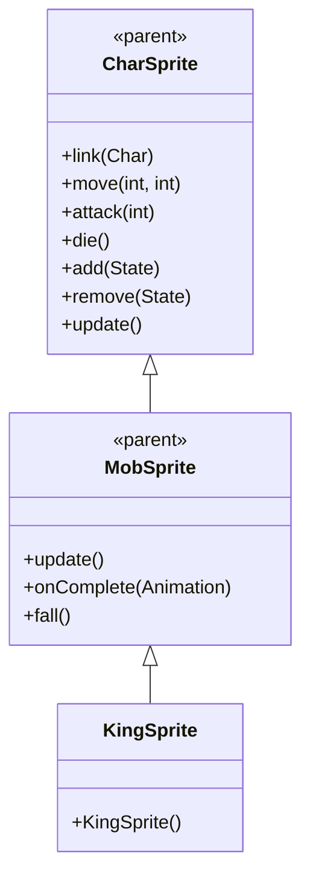

# KingSprite 源码详解

## 1. 基本信息

| 属性 | 值 |
|------|-----|
| **文件路径** | core/src/main/java/com/shatteredpixel/shatteredpixeldungeon/sprites/KingSprite.java |
| **包名** | com.shatteredpixel.shatteredpixeldungeon.sprites |
| **类类型** | class（非抽象） |
| **继承关系** | extends MobSprite |
| **代码行数** | 50 |

---

## 类职责

KingSprite 是游戏中国王怪物的精灵类，继承自 MobSprite。作为重要的Boss角色，它具有以下特点：

1. **极其复杂的 Idle 动画**：包含15帧的超长序列，其中前12帧都是静止姿态，后3帧展示特殊动作
2. **流畅的跑动动画**：6帧跑动序列提供平滑的移动效果
3. **简洁的攻击动画**：3帧快速完成攻击动作
4. **完整的死亡动画**：4帧死亡序列提供完整的死亡过程

**设计特点**：
- **帝王威严表现**：长时间的静止姿态体现国王的威严和稳重
- **偶尔动作点缀**：在长时间静止后加入特殊动作，避免完全僵硬
- **生物特征匹配**：动画节奏符合大型Boss的行动特征

---

## 4. 继承与协作关系



---

## 构造方法详解

### KingSprite()

```java
public KingSprite() {
    super();
    
    texture( Assets.Sprites.KING );
    
    TextureFilm frames = new TextureFilm( texture, 16, 16 );
    
    idle = new Animation( 12, true );
    idle.frames( frames, 0, 0, 0, 0, 0, 0, 0, 0, 0, 0, 0, 0, 1, 2 );
    
    run = new Animation( 15, true );
    run.frames( frames, 3, 4, 5, 6, 7, 8 );
    
    attack = new Animation( 15, false );
    attack.frames( frames, 9, 10, 11 );
    
    die = new Animation( 8, false );
    die.frames( frames, 12, 13, 14, 15 );
    
    play( idle );
}
```

**构造方法作用**：初始化国王精灵的所有动画。

**纹理和帧设置**：
- **纹理源**：Assets.Sprites.KING
- **帧尺寸**：16 像素宽 × 16 像素高（正方形）
- **帧总数**：16 帧（索引 0-15）

**动画参数说明**：

| 动画类型 | 帧率 (FPS) | 循环 | 帧序列 | 说明 |
|----------|------------|------|--------|------|
| `idle` | 12 | true | [0×12, 1, 2] | 闲置状态，前12帧静止，后2帧特殊动作 |
| `run` | 15 | true | [3, 4, 5, 6, 7, 8] | 跑动动画，6帧循环 |
| `attack` | 15 | false | [9, 10, 11] | 攻击动画，3帧完成 |
| `die` | 8 | false | [12, 13, 14, 15] | 死亡动画，4帧完整播放 |

**关键特性**：
- **Idle帝王姿态**：15帧序列中前12帧（80%时间）保持完全静止，体现国王的威严
- **Run流畅性**：6帧跑动序列提供平滑的大型角色移动效果
- **Attack简洁性**：3帧快速攻击符合Boss的直接攻击风格
- **Death完整性**：4帧死亡动画提供完整的死亡过程

### Idle 序列分析

Idle 序列 [0, 0, 0, 0, 0, 0, 0, 0, 0, 0, 0, 0, 1, 2] 的设计理念：

1. **长时间静止**：连续12帧显示基础姿态（帧0），创造庄重威严的效果
2. **偶尔小动作**：最后2帧（帧1和帧2）展示特殊动作，避免完全僵硬
3. **节奏控制**：12 FPS 的帧率配合15帧序列，每个循环约1.25秒，提供自然的等待节奏

这种设计让国王看起来既有王者威严（大部分时间静止），又不失生动性（偶尔的小动作）。

---

## 使用的资源

### 纹理资源

| 资源 | 用途 |
|------|------|
| `Assets.Sprites.KING` | 国王的完整纹理集 |

### 工具类

| 类名 | 用途 |
|------|------|
| `TextureFilm` | 将大纹理分割成多个小帧用于动画 |

---

## 与其他类的交互

### 继承关系

| 父类 | 继承的功能 |
|------|-----------|
| `MobSprite` | 睡眠状态管理、死亡淡出效果、坠落动画等 |
| `CharSprite` | 所有基础动画、移动、状态效果、粒子系统等 |

### 关联的怪物类

KingSprite 对应的怪物类是 `com.shatteredpixel.shatteredpixeldungeon.actors.mobs.King`，该类定义了国王的行为逻辑。

### Boss 设计考虑

- **威严表现**：通过长时间静止体现Boss的压迫感
- **动作节奏**：偶尔的小动作增加生动性而不破坏威严感
- **动画完整性**：完整的四套动画确保Boss在各种状态下都有合适的视觉表现

---

## 11. 使用示例

### 基本使用

```java
// 创建国王精灵
KingSprite king = new KingSprite();

// 关联国王怪物对象
king.link(kingMob);

// 自动播放复杂的 idle 动画（15帧序列，大部分时间静止）

// 触发动画
king.run();     // 播放流畅的跑动动画
king.attack(targetPos); // 播放简洁的攻击动画
king.die();     // 播放完整的死亡动画
```

### Idle 威严效果

```java
// Idle 动画的威严特性体现在：
// - 12/15 = 80% 的时间保持完全静止
// - 仅在序列末尾展示2帧特殊动作
// - 创造帝王般的庄重威严感

king.idle(); // 播放威严的等待动画
```

### 动画控制

```java
// 手动控制动画（通常不需要，由游戏逻辑自动触发）
king.play(king.idle);   // 播放威严的闲置动画
king.play(king.run);    // 播放流畅的跑动动画
king.play(king.attack); // 播放直接的攻击动画
```

---

## 注意事项

### 设计模式理解

1. **威严表现**：通过长时间静止体现Boss的压迫感和威严
2. **生动性平衡**：在静止中加入偶尔动作，避免完全僵硬
3. **节奏控制**：12 FPS 配合15帧序列创造自然的等待节奏

### 性能考虑

1. **内存效率**：合理的纹理帧数量（16帧），适合Boss级别角色
2. **渲染优化**：正方形帧尺寸便于 GPU 处理
3. **动画优化**：大部分时间显示相同帧，减少不必要的渲染计算

### 常见的坑

1. **序列长度理解**：15帧的 idle 序列是有意设计，不要误认为错误
2. **静止比例**：80%的静止时间是核心设计，不要随意修改
3. **帧率匹配**：12 FPS 的帧率与15帧序列配合创造正确的时间节奏

### 最佳实践

1. **Boss 威严设计**：重要Boss可通过长时间静止体现威严和压迫感
2. **生动性平衡**：在静止中加入少量动作保持角色生动性
3. **节奏控制**：合理搭配帧率和序列长度创造自然的动画节奏