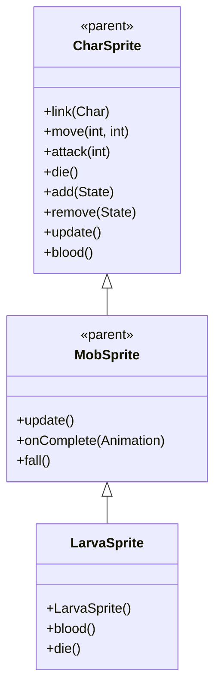

# LarvaSprite 源码详解

## 1. 基本信息

| 属性 | 值 |
|------|-----|
| **文件路径** | core/src/main/java/com/shatteredpixel/shatteredpixeldungeon/sprites/LarvaSprite.java |
| **包名** | com.shatteredpixel.shatteredpixeldungeon.sprites |
| **类类型** | class（非抽象） |
| **继承关系** | extends MobSprite |
| **代码行数** | 62 |

---

## 类职责

LarvaSprite 是游戏中幼虫怪物的精灵类，继承自 MobSprite。它具有以下特点：

1. **简单高效的动画设计**：使用最少的纹理帧实现完整的动画效果
2. **特殊血液颜色**：重写 blood() 方法提供绿色血液效果
3. **溅血特效**：die() 方法重写，使用 Splash.at() 创建血液溅射效果
4. **单帧死亡动画**：death 动画仅使用单帧，体现幼虫的脆弱性

**设计特点**：
- **资源优化**：仅使用9个纹理帧，适合大量生成的幼虫怪物
- **生物特征匹配**：绿色血液符合幼虫/昆虫的生物特征
- **视觉反馈增强**：Splash 溅血特效提供清晰的死亡反馈

---

## 4. 继承与协作关系



---

## 构造方法详解

### LarvaSprite()

```java
public LarvaSprite() {
    super();
    
    texture( Assets.Sprites.LARVA );
    
    TextureFilm frames = new TextureFilm( texture, 12, 8 );
    
    idle = new Animation( 5, true );
    idle.frames( frames, 4, 4, 4, 4, 4, 5, 5 );
    
    run = new Animation( 12, true );
    run.frames( frames, 0, 1, 2, 3 );
    
    attack = new Animation( 15, false );
    attack.frames( frames, 6, 5, 7 );
    
    die = new Animation( 10, false );
    die.frames( frames, 8 );
    
    play( idle );
}
```

**构造方法作用**：初始化幼虫精灵的所有动画。

**纹理和帧设置**：
- **纹理源**：Assets.Sprites.LARVA
- **帧尺寸**：12 像素宽 × 8 像素高（较矮的幼虫形状）
- **帧总数**：9 帧（索引 0-8）

**动画参数说明**：

| 动画类型 | 帧率 (FPS) | 循环 | 帧序列 | 说明 |
|----------|------------|------|--------|------|
| `idle` | 5 | true | [4,4,4,4,4,5,5] | 闲置状态，大部分时间显示帧4，偶尔切换到帧5 |
| `run` | 12 | true | [0,1,2,3] | 跑动动画，4帧循环 |
| `attack` | 15 | false | [6,5,7] | 攻击动画，3帧完成 |
| `die` | 10 | false | [8] | 死亡动画，单帧显示 |

**关键特性**：
- **Idle节奏控制**：5/7 ≈ 71% 时间显示基础姿态（帧4），29% 时间显示动作姿态（帧5）
- **Run流畅性**：4帧跑动序列提供基本的移动动画
- **Attack中间姿态**：攻击动画使用帧5作为中间姿态，与 idle 动画关联
- **Die简洁性**：单帧死亡动画体现幼虫的脆弱性

---

## 特殊方法详解

### blood()

```java
@Override
public int blood() {
    return 0xbbcc66;
}
```

**方法作用**：返回幼虫受伤时的血液颜色。

**颜色说明**：
- **十六进制值**：0xbbcc66
- **颜色名称**：黄绿色/橄榄绿
- **设计意图**：符合幼虫/昆虫类生物的真实特征，区别于普通红色血液

### die()

```java
@Override
public void die() {
    Splash.at( center(), blood(), 10 );
    super.die();
}
```

**方法作用**：重写死亡方法，在播放死亡动画前添加血液溅射特效。

**溅血特效**：
- **位置**：center() - 精灵中心位置
- **颜色**：blood() - 黄绿色血液
- **数量**：10个溅血粒子
- **时机**：在调用 super.die() 之前，确保特效可见

**设计理念**：
- 幼虫死亡时产生明显的血液溅射，提供清晰的视觉反馈
- 单帧死亡动画配合溅血特效，创造快速死亡的效果
- 符合幼虫作为脆弱小怪物的游戏定位

---

## 使用的资源

### 纹理资源

| 资源 | 用途 |
|------|------|
| `Assets.Sprites.LARVA` | 幼虫的完整纹理集 |

### 效果和工具类

| 类名 | 用途 |
|------|------|
| `TextureFilm` | 将大纹理分割成多个小帧用于动画 |
| `Splash` | 血液溅射特效 |

---

## 与其他类的交互

### 继承关系

| 父类 | 继承/重写的功能 |
|------|----------------|
| `MobSprite` | 睡眠状态管理、死亡淡出效果、坠落动画等，重写 die() 方法 |
| `CharSprite` | 所有基础动画、移动、状态效果、粒子系统等，重写 blood() 方法 |

### 关联的怪物类

LarvaSprite 对应的怪物类是 `com.shatteredpixel.shatteredpixeldungeon.actors.mobs.Larva`，该类定义了幼虫的行为逻辑。

### 特效系统交互

- **Splash 系统**：Splash.at() 提供标准的血液溅射效果
- **颜色同步**：blood() 方法确保溅血颜色与生物特征一致
- **时机控制**：特效在死亡动画开始前触发，确保最佳视觉效果

---

## 11. 使用示例

### 基本使用

```java
// 创建幼虫精灵
LarvaSprite larva = new LarvaSprite();

// 关联幼虫怪物对象
larva.link(larvaMob);

// 自动播放 idle 动画（大部分时间静止）

// 触发动画
larva.run();     // 播放跑动动画
larva.attack(targetPos); // 播放攻击动画
larva.die();     // 播放死亡动画（包含血液溅射特效）
```

### 溅血特效细节

```java
// 溅血特效自动触发，无需手动干预
larva.die();

// 自动执行：
// 1. 在精灵中心位置创建10个黄绿色血液粒子
// 2. 血液向四周溅射
// 3. 开始播放单帧死亡动画
// 4. 死亡淡出效果正常执行
```

### 生物特征表现

```java
// 幼虫的生物特征通过以下方式体现：
// - 黄绿色血液 (0xbbcc66)
// - 较矮的帧尺寸 (12x8)
// - 单帧死亡动画（脆弱性）
// - 简单的动画序列（低级怪物）

int bloodColor = larva.blood(); // 返回 0xbbcc66 (黄绿色)
```

---

## 注意事项

### 设计模式理解

1. **资源优化**：使用最少的纹理帧实现完整功能，适合大量生成的怪物
2. **生物特征匹配**：通过血液颜色和动画设计体现幼虫特征
3. **视觉反馈增强**：Splash 溅血特效提供清晰的死亡确认

### 性能考虑

1. **内存效率**：仅9个纹理帧，资源占用极小
2. **渲染优化**：固定帧尺寸便于 GPU 批处理
3. **特效开销**：一次性 Splash 特效性能开销可控

### 常见的坑

1. **单帧死亡**：die 动画只有单帧是有意设计，不要误认为错误
2. **颜色格式**：blood() 返回的是 RGB 颜色值，不含 alpha 通道
3. **特效时机**：Splash 必须在 super.die() 之前调用，确保特效可见

### 最佳实践

1. **低级怪物设计**：为大量生成的小怪物采用简洁高效的动画设计
2. **生物特征还原**：使用合适的血液颜色和动画体现怪物类型
3. **视觉反馈重要性**：即使是简单怪物也要提供清晰的视觉反馈