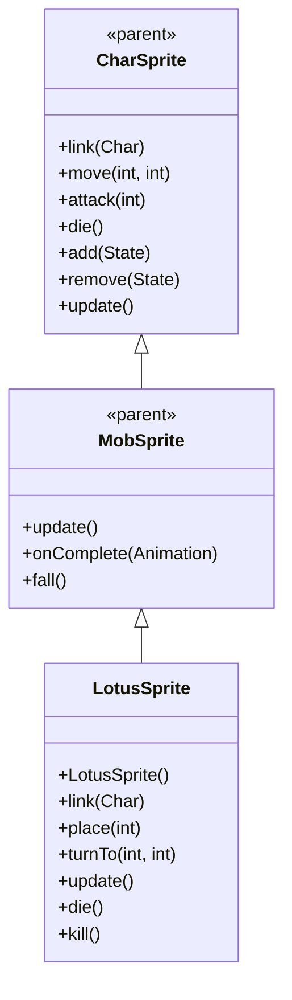

# LotusSprite 源码详解

## 1. 基本信息

| 属性 | 值 |
|------|-----|
| **文件路径** | core/src/main/java/com/shatteredpixel/shatteredpixeldungeon/sprites/LotusSprite.java |
| **包名** | com.shatteredpixel.shatteredpixeldungeon.sprites |
| **类类型** | class（非抽象） |
| **继承关系** | extends MobSprite |
| **代码行数** | 123 |

---

## 类职责

LotusSprite 是游戏中莲花怪物的精灵类，继承自 MobSprite。作为由再生法杖召唤的特殊植物单位，它具有以下特点：

1. **静态外观设计**：所有动画状态都使用单帧（帧0），体现莲花的静止特性
2. **范围草地特效**：在作用范围内显示 LeafParticle.LEVEL_SPECIFIC 草地粒子效果
3. **特殊渲染属性**：禁用透视提升和阴影，确保正确显示
4. **层级管理**：自动将精灵置于渲染队列后方
5. **强制可见性**：update() 方法强制 visible = true，确保始终可见

**设计特点**：
- **极简动画**：所有动画都使用相同的单帧，突出莲花的静止本质
- **范围可视化**：通过草地粒子效果直观显示莲花的作用范围
- **环境融合**：特殊的渲染设置确保莲花与环境完美融合

---

## 4. 继承与协作关系



---

## 核心字段

### 特效字段

| 字段名 | 类型 | 说明 |
|--------|------|------|
| `grassVfx` | ArrayList<Emitter> | 草地粒子发射器列表，覆盖莲花作用范围 |

---

## 构造方法详解

### LotusSprite()

```java
public LotusSprite(){
    super();
    
    perspectiveRaise = 0f;
    
    texture( Assets.Sprites.LOTUS );
    
    TextureFilm frames = new TextureFilm( texture, 19, 16 );
    
    idle = new MovieClip.Animation( 1, true );
    idle.frames( frames, 0 );
    
    run = new MovieClip.Animation( 1, true );
    run.frames( frames, 0 );
    
    attack = new MovieClip.Animation( 1, false );
    attack.frames( frames, 0 );
    
    die = new MovieClip.Animation( 1, false );
    die.frames( frames, 0 );
    
    play( idle );
}
```

**构造方法作用**：初始化莲花精灵的基础动画框架。

**特殊渲染设置**：
- **perspectiveRaise**：0f（禁用透视提升）
- **renderShadow**：false（在 link() 中设置，禁用阴影）

**纹理和帧设置**：
- **纹理源**：Assets.Sprites.LOTUS
- **帧尺寸**：19 像素宽 × 16 像素高
- **帧总数**：至少1帧（索引0）

**动画参数说明**：

| 动画类型 | 帧率 (FPS) | 循环 | 帧序列 | 说明 |
|----------|------------|------|--------|------|
| `idle` | 1 | true | [0] | 闲置状态，单帧静止显示 |
| `run` | 1 | true | [0] | 跑动状态，单帧静止显示（实际上不移动） |
| `attack` | 1 | false | [0] | 攻击动画，单帧显示 |
| `die` | 1 | false | [0] | 死亡动画，单帧显示 |

**关键特性**：
- **完全静止**：所有动画都是单帧，帧率为1，表示完全静止
- **无攻击动画**：实际没有攻击动作，只是占位符
- **简单高效**：最简化的动画设计，资源占用最小

---

## 核心方法详解

### link(Char ch)

```java
@Override
public void link( Char ch ) {
    super.link( ch );
    
    renderShadow = false;
    
    if (grassVfx == null && ch instanceof WandOfRegrowth.Lotus){
        WandOfRegrowth.Lotus l = (WandOfRegrowth.Lotus) ch;
        grassVfx = new ArrayList<>();
        for (int i = 0; i < Dungeon.level.length(); i++){
            if (!Dungeon.level.solid[i] && l.inRange(i)) {
                Emitter e = CellEmitter.get(i);
                e.pour(LeafParticle.LEVEL_SPECIFIC, 0.5f);
                grassVfx.add(e);
            }
        }
    }
}
```

**方法作用**：关联角色时初始化草地粒子效果并配置渲染属性。

**草地粒子创建逻辑**：
- **条件检查**：仅当关联的是 WandOfRegrowth.Lotus 对象时创建粒子
- **范围遍历**：遍历整个关卡的所有格子
- **位置筛选**：
  - `!Dungeon.level.solid[i]`：非固体格子（可通行区域）
  - `l.inRange(i)`：在莲花作用范围内
- **粒子配置**：
  - **类型**：LeafParticle.LEVEL_SPECIFIC（关卡特定的树叶粒子）
  - **发射率**：0.5f（每秒5个粒子）
  - **存储**：添加到 grassVfx 列表中用于后续管理

### place(int cell)

```java
@Override
public void place(int cell) {
    if (parent != null) parent.sendToBack(this);
    super.place(cell);
}
```

**方法作用**：放置精灵时确保其显示在渲染队列的后方。

**设计理念**：
- 莲花作为环境装饰元素，应该位于其他角色后方
- 避免遮挡玩家或其他重要游戏元素

### update()

```java
@Override
public void update() {
    visible = true;
    super.update();
}
```

**方法作用**：强制莲花始终可见。

**特殊处理**：
- **强制可见**：visible = true 覆盖任何可能的隐藏逻辑
- **确保效果**：保证草地粒子效果始终正常显示

### turnTo(int from, int to)

```java
@Override
public void turnTo(int from, int to) {
    //do nothing
}
```

**方法作用**：莲花不会转向，因此为空实现。

### 生命周期方法

```java
@Override
public void die() {
    super.die();
    if (grassVfx != null){
        for (Emitter e : grassVfx){
            e.on = false;
        }
        grassVfx = null;
    }
}

@Override
public void kill() {
    super.kill();
    if (grassVfx != null){
        for (Emitter e : grassVfx){
            e.on = false;
        }
        grassVfx = null;
    }
}
```

**方法作用**：死亡和销毁时清理所有草地粒子效果。

**清理逻辑**：
- 关闭所有粒子发射器
- 清空 grassVfx 列表
- 避免内存泄漏和无效粒子渲染

---

## 使用的资源

### 纹理资源

| 资源 | 用途 |
|------|------|
| `Assets.Sprites.LOTUS` | 莲花的完整纹理集 |

### 效果和工具类

| 类名 | 用途 |
|------|------|
| `TextureFilm` | 纹理帧管理 |
| `LeafParticle.LEVEL_SPECIFIC` | 关卡特定的草地粒子效果 |
| `CellEmitter` | 格子粒子发射器 |
| `Dungeon.level` | 关卡信息（solid数组、长度等） |
| `WandOfRegrowth.Lotus` | 再生法杖莲花的具体实现类 |

---

## 与其他类的交互

### 继承关系

| 父类 | 继承/重写的功能 |
|------|----------------|
| `MobSprite` | 睡眠状态管理、死亡淡出效果、坠落动画等 |
| `CharSprite` | 所有基础动画、移动、状态效果、粒子系统等 |

### 关联的怪物类

LotusSprite 专门对应 `com.shatteredpixel.shatteredpixeldungeon.items.wands.WandOfRegrowth.Lotus`，这是再生法杖的内部类，定义了莲花的行为逻辑。

### 系统交互

- **粒子系统**：完善的草地粒子生命周期管理
- **关卡系统**：访问 Dungeon.level.solid 和长度信息
- **范围系统**：通过 inRange() 方法确定作用范围
- **渲染系统**：sendToBack() 控制渲染层级

---

## 11. 使用示例

### 基本使用

```java
// 创建莲花精灵
LotusSprite lotus = new LotusSprite();

// 关联莲花怪物对象（必须是 WandOfRegrowth.Lotus 类型）
lotus.link(lotusMob);

// 自动配置渲染属性（sendToBack, 无阴影, 无透视提升）
// 自动创建范围内的草地粒子效果

// 触发动画（实际上都是单帧静止显示）
lotus.run();     // 显示单帧（实际上不移动）
lotus.attack(targetPos); // 显示单帧（无实际攻击）
lotus.die();     // 显示单帧死亡状态并清理粒子
```

### 范围可视化

```java
// 草地粒子效果自动创建和管理：
// 1. 遍历整个关卡
// 2. 在莲花作用范围内的非固体格子创建粒子
// 3. 以 0.5f 的频率持续发射 Level-Specific 树叶粒子
// 4. 死亡时自动清理所有粒子

lotus.link(lotusMob); // 自动初始化范围可视化
```

### 特殊渲染属性

```java
// 渲染属性自动配置，无需手动干预：
// - 精灵置于渲染队列后方 (sendToBack)
// - 禁用阴影效果 (renderShadow = false)
// - 禁用透视高度提升 (perspectiveRaise = 0f)
// - 强制始终可见 (visible = true in update)
```

---

## 注意事项

### 设计模式理解

1. **静态对象设计**：通过单帧和零动画体现莲花的静止特性
2. **范围可视化**：使用粒子效果直观显示作用范围
3. **环境融合**：特殊的渲染设置确保与游戏环境完美融合

### 性能考虑

1. **内存效率**：仅使用1个纹理帧，资源占用极小
2. **粒子开销**：草地粒子数量取决于作用范围大小，可能较大
3. **范围计算**：每次 link() 时遍历整个关卡，有一定计算开销

### 常见的坑

1. **类型检查**：只有 WandOfRegrowth.Lotus 类型才会创建粒子效果
2. **强制可见**：visible = true 可能与其他系统冲突，需要特别注意
3. **范围依赖**：inRange() 方法必须由具体的 Lotus 实现提供

### 最佳实践

1. **静态对象设计**：为不需要动画的对象采用类似的极简设计
2. **范围可视化**：使用粒子效果直观显示技能或物品的作用范围
3. **环境融合**：通过特殊的渲染属性确保对象与环境协调一致