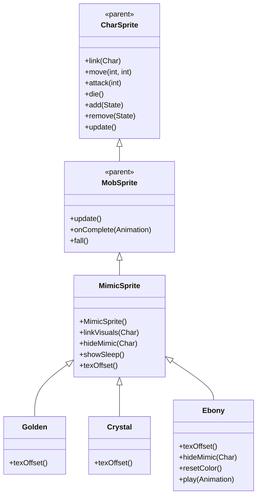

# MimicSprite 源码详解

## 1. 基本信息

| 属性 | 值 |
|------|-----|
| **文件路径** | core/src/main/java/com/shatteredpixel/shatteredpixeldungeon/sprites/MimicSprite.java |
| **包名** | com.shatteredpixel.shatteredpixeldungeon.sprites |
| **类类型** | class（非抽象） |
| **继承关系** | extends MobSprite |
| **代码行数** | 144 |
| **嵌套类** | Golden, Crystal, Ebony（3个静态内部类） |

---

## 类职责

MimicSprite 是游戏中拟态宝箱怪物的精灵类，继承自 MobSprite。它提供了一个通用框架，支持三种不同类型的拟态宝箱变种（金色、水晶、乌木），每种变种具有不同的纹理偏移和特殊效果：

1. **隐藏动画系统**：提供 hiding 和 advancedHiding 两种隐藏状态动画
2. **变种模式**：通过 texOffset() 抽象方法支持多种拟态宝箱变种
3. **智能状态切换**：根据角色对齐状态自动切换隐藏/显现状态
4. **特殊透明度效果**：Ebony 变种使用 alpha(0.2f) 实现半透明隐藏效果
5. **睡眠状态管理**：隐藏状态下禁用睡眠表情显示

**设计特点**：
- **伪装机制**：通过隐藏动画实现拟态宝箱的伪装效果
- **变种扩展**：支持多种材质的拟态宝箱（普通、金色、水晶、乌木）
- **视觉欺骗**：Ebony 变种的半透明效果增强伪装能力

---

## 4. 继承与协作关系



---

## 核心字段和初始化块

### 特殊渲染设置（初始化块）

```java
{
    //adjust shadow slightly to account for 1 empty bottom pixel (used for border while hiding)
    perspectiveRaise    = 5 / 16f; //5 pixels
    shadowWidth         = 1f;
    shadowOffset        = -0.4f;
}
```

**设计理念**：
- **阴影调整**：shadowOffset = -0.4f 向上偏移阴影，补偿隐藏时底部1像素的边框
- **透视提升**：perspectiveRaise = 5/16f 提供适当的立体感

### 动画字段

| 字段名 | 类型 | 说明 |
|--------|------|------|
| `advancedHiding` | Animation | 高级隐藏动画（单帧，用于 stealthy 拟态） |
| `hiding` | Animation | 普通隐藏动画（6帧循环，模拟轻微动作） |

---

## 构造方法详解

### MimicSprite()

```java
public MimicSprite() {
    super();
    
    int c = texOffset();
    
    texture( Assets.Sprites.MIMIC );
    
    TextureFilm frames = new TextureFilm( texture, 16, 16 );
    
    advancedHiding = new Animation( 1, true );
    advancedHiding.frames( frames, 0+c);
    
    hiding = new Animation( 1, true );
    hiding.frames( frames, 1+c, 1+c, 1+c, 1+c, 1+c, 2+c);
    
    idle = new Animation( 5, true );
    idle.frames( frames, 3+c, 3+c, 3+c, 4+c, 4+c );
    
    run = new Animation( 10, true );
    run.frames( frames, 3+c, 4+c, 5+c, 6+c, 6+c, 5+c, 4+c );
    
    attack = new Animation( 10, false );
    attack.frames( frames, 3+c, 7+c, 8+c, 9+c );
    
    die = new Animation( 5, false );
    die.frames( frames, 10+c, 11+c, 12+c );
    
    play( idle );
}
```

**构造方法作用**：初始化拟态宝箱精灵的通用动画框架。

**纹理和帧设置**：
- **纹理源**：Assets.Sprites.MIMIC
- **帧尺寸**：16 像素宽 × 16 像素高（正方形）
- **帧偏移**：通过 texOffset() 方法动态获取（普通: 0, Golden: 16, Crystal: 32, Ebony: 48）
- **帧分配**：每种变种有16帧（0-15），总共64帧

**动画参数说明**：

| 动画类型 | 帧率 (FPS) | 循环 | 帧序列模式 | 说明 |
|----------|------------|------|------------|------|
| `advancedHiding` | 1 | true | [0+c] | 高级隐藏，完全静止（用于 stealthy 拟态） |
| `hiding` | 1 | true | [1+c×5, 2+c] | 普通隐藏，大部分时间静止，偶尔小动作 |
| `idle` | 5 | true | [3+c×3, 4+c×2] | 闲置状态，主要显示基础姿态 |
| `run` | 10 | true | [3+c,4+c,5+c,6+c,6+c,5+c,4+c] | 跑动动画，对称循环 |
| `attack` | 10 | false | [3+c,7+c,8+c,9+c] | 攻击动画，从基础姿态开始 |
| `die` | 5 | false | [10+c,11+c,12+c] | 死亡动画，3帧完成 |

**关键特性**：
- **Hiding动画差异**：advancedHiding 完全静止，hiding 偶尔有小动作
- **Run动画对称性**：[3,4,5,6,6,5,4] 创造自然的来回移动效果
- **Attack起始姿态**：从帧3+c（基础姿态）开始攻击动作

---

## 核心方法详解

### linkVisuals(Char ch)

```java
@Override
public void linkVisuals(Char ch) {
    super.linkVisuals(ch);
    if (ch.alignment == Char.Alignment.NEUTRAL) {
        hideMimic(ch);
    }
}
```

**方法作用**：关联视觉时检查角色对齐状态，中立对齐时进入隐藏状态。

**伪装逻辑**：
- **中立对齐**：Char.Alignment.NEUTRAL 表示拟态宝箱的伪装状态
- **自动隐藏**：检测到中立对齐时自动调用 hideMimic()

### hideMimic(Char ch)

```java
public void hideMimic(Char ch){
    if (ch instanceof Mimic && ((Mimic) ch).stealthy()){
        play(advancedHiding);
    } else {
        play(hiding);
    }
    hideSleep();
}
```

**方法作用**：根据拟态类型选择合适的隐藏动画。

**隐藏策略**：
- **Stealthy 拟态**：使用 advancedHiding（完全静止）
- **普通拟态**：使用 hiding（偶尔小动作）
- **睡眠隐藏**：调用 hideSleep() 确保不显示睡眠表情

### showSleep()

```java
@Override
public void showSleep() {
    if (curAnim == hiding || curAnim == advancedHiding){
        return;
    }
    super.showSleep();
}
```

**方法作用**：隐藏状态下禁止显示睡眠表情。

**设计理念**：
- 拟态宝箱在隐藏时不应该显示任何表情（包括睡眠）
- 保持伪装的一致性，避免暴露真实身份

---

## 静态内部类详解

### Golden 类

```java
public static class Golden extends MimicSprite{
    @Override protected int texOffset() { return 16; }
}
```

- **帧偏移**：16（使用帧 16-31）
- **材质特征**：金色拟态宝箱

### Crystal 类

```java
public static class Crystal extends MimicSprite{
    @Override protected int texOffset() { return 32; }
}
```

- **帧偏移**：32（使用帧 32-47）
- **材质特征**：水晶拟态宝箱

### Ebony 类

```java
public static class Ebony extends MimicSprite{
    @Override protected int texOffset() { return 48; }
    
    @Override
    public void hideMimic(Char ch) {
        super.hideMimic(ch);
        alpha(0.2f);
    }
    
    @Override
    public void resetColor() {
        super.resetColor();
        if (advancedHiding != null && curAnim == advancedHiding){
            alpha(0.2f);
        }
    }
    
    @Override
    public void play(Animation anim) {
        if (curAnim == advancedHiding && anim != advancedHiding){
            alpha(1f);
        }
        super.play(anim);
    }
}
```

- **帧偏移**：48（使用帧 48-63）
- **材质特征**：乌木拟态宝箱
- **特殊效果**：半透明隐藏（alpha=0.2f）

**Ebony 特殊逻辑**：
- **隐藏透明度**：调用 alpha(0.2f) 实现80%透明的隐藏效果
- **颜色重置保护**：resetColor() 时保持透明度
- **状态切换恢复**：离开 advancedHiding 状态时恢复完全不透明（alpha=1f）

---

## 使用的资源

### 纹理资源

| 资源 | 用途 |
|------|------|
| `Assets.Sprites.MIMIC` | 拟态宝箱的完整纹理集（包含4种材质变种） |

### 工具类

| 类名 | 用途 |
|------|------|
| `TextureFilm` | 纹理帧管理 |
| `Char.Alignment` | 角色对齐状态检查 |

---

## 与其他类的交互

### 继承关系

| 父类 | 继承/重写的功能 |
|------|----------------|
| `MobSprite` | 睡眠状态管理、死亡淡出效果、坠落动画等 |
| `CharSprite` | 所有基础动画、移动、状态效果、粒子系统等 |

### 关联的怪物类

MimicSprite 对应的怪物类是 `com.shatteredpixel.shatteredpixeldungeon.actors.mobs.Mimic`，该类定义了拟态宝箱的行为逻辑，包括：
- **alignment**：对齐状态控制伪装/攻击状态
- **stealthy()**：是否为高级伪装类型

### 实际使用方式

由于 MimicSprite 支持多种变种，实际使用时需要实例化具体的类型：

```java
// 创建普通拟态宝箱
MimicSprite normalMimic = new MimicSprite();

// 创建金色拟态宝箱  
MimicSprite goldenMimic = new MimicSprite.Golden();

// 创建水晶拟态宝箱
MimicSprite crystalMimic = new MimicSprite.Crystal();

// 创建乌木拟态宝箱
MimicSprite ebonyMimic = new MimicSprite.Ebony();
```

---

## 11. 使用示例

### 基本使用

```java
// 创建具体类型的拟态宝箱精灵
MimicSprite mimic = new MimicSprite.Golden();

// 关联拟态宝箱怪物对象
mimic.link(mimicMob);

// 自动处理伪装逻辑：
// - 中立对齐：进入隐藏状态
// - 其他对齐：正常显示 idle 动画

// 触发动画
mimic.run();     // 播放跑动动画  
mimic.attack(targetPos); // 播放攻击动画
mimic.die();     // 播放死亡动画
```

### 伪装状态管理

```java
// 伪装状态自动管理：
if (mimicMob.alignment == Char.Alignment.NEUTRAL) {
    // 自动进入隐藏状态
    // Golden/Crystal: 播放 hiding/advancedHiding 动画
    // Ebony: 播放 hiding 动画 + 设置 alpha(0.2f)
} else {
    // 显示正常动画（idle/run/attack/die）
}
```

### Ebony 透明效果

```java
// Ebony 拟态宝箱的特殊透明效果：
MimicSprite.Ebony ebony = new MimicSprite.Ebony();

// 隐藏时自动设置透明度：
ebony.hideMimic(ebonyMob); // alpha(0.2f)

// 显现时自动恢复不透明：
ebony.play(ebony.idle); // alpha(1f)
```

---

## 注意事项

### 设计模式理解

1. **模板方法模式**：基类定义算法骨架，子类提供具体实现（texOffset）
2. **状态模式**：通过 alignment 控制伪装/攻击状态切换
3. **变种模式**：通过静态内部类提供具体的拟态变种

### 性能考虑

1. **内存优化**：四种变种共用同一纹理，大幅减少资源占用
2. **渲染效率**：固定帧尺寸便于 GPU 批处理
3. **透明度开销**：Ebony 的 alpha 效果会增加混合计算开销

### 常见的坑

1. **状态同步**：确保 alignment 状态与动画状态保持同步
2. **透明度管理**：Ebony 的 alpha 状态需要在所有相关方法中正确维护
3. **帧偏移计算**：确保 texOffset() 返回值间隔16（每种变种16帧）

### 最佳实践

1. **遵循变种模式**：为需要多变种的怪物采用类似的抽象基类设计
2. **伪装一致性**：确保隐藏状态下不显示任何可能暴露身份的视觉元素
3. **特殊效果匹配**：为不同材质的变种设计符合其特征的视觉效果（如 Ebony 的透明效果）