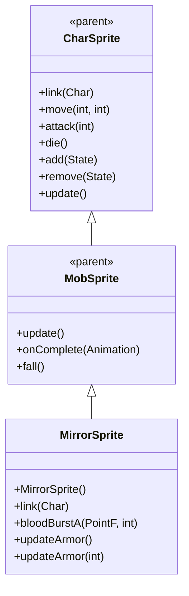

# MirrorSprite 源码详解

## 1. 基本信息

| 属性 | 值 |
|------|-----|
| **文件路径** | core/src/main/java/com/shatteredpixel/shatteredpixeldungeon/sprites/MirrorSprite.java |
| **包名** | com.shatteredpixel.shatteredpixeldungeon.sprites |
| **类类型** | class（非抽象） |
| **继承关系** | extends MobSprite |
| **代码行数** | 76 |

---

## 类职责

MirrorSprite 是游戏中镜像分身怪物的精灵类，继承自 MobSprite。作为英雄的镜像复制体，它具有以下特殊功能：

1. **动态纹理加载**：根据当前英雄的职业自动加载对应的英雄精灵表
2. **装甲等级系统**：通过 updateArmor() 方法动态切换不同装甲等级的外观
3. **英雄动画复用**：使用 HeroSprite 的帧序列实现镜像的动画效果
4. **无血液特效**：重写 bloodBurstA() 方法禁用血液粒子效果

**设计特点**：
- **动态适配**：自动匹配当前英雄的职业和装甲外观
- **资源复用**：直接使用英雄精灵的纹理和动画序列
- **视觉一致性**：确保镜像分身与英雄外观保持一致

---

## 4. 继承与协作关系



---

## 核心常量

### 帧尺寸常量

| 常量名 | 类型 | 值 | 说明 |
|--------|------|-----|------|
| `FRAME_WIDTH` | int | 12 | 镜像精灵帧的标准宽度 |
| `FRAME_HEIGHT` | int | 15 | 镜像精灵帧的标准高度 |

---

## 构造方法详解

### MirrorSprite()

```java
public MirrorSprite() {
    super();
    
    texture( Dungeon.hero != null ? Dungeon.hero.heroClass.spritesheet() : HeroClass.WARRIOR.spritesheet() );
    updateArmor( 0 );
    idle();
}
```

**构造方法作用**：初始化镜像分身精灵，动态加载英雄纹理。

**纹理加载逻辑**：
- **条件检查**：Dungeon.hero != null 判断是否有当前英雄
- **动态加载**：使用 Dungeon.hero.heroClass.spritesheet() 获取当前英雄的精灵表
- **默认回退**：如果没有英雄则使用 HeroClass.WARRIOR.spritesheet() 作为默认
- **初始装甲**：调用 updateArmor(0) 设置初始装甲等级为0
- **初始状态**：调用 idle() 开始播放闲置动画

**设计理念**：
- 确保镜像分身的外观始终与当前英雄保持一致
- 提供合理的默认值避免空指针异常
- 初始化时就设置正确的视觉表现

---

## 核心方法详解

### link(Char ch)

```java
@Override
public void link( Char ch ) {
    super.link( ch );
    updateArmor();
}
```

**方法作用**：关联角色后更新装甲等级。

**更新逻辑**：
- 调用父类 link() 方法完成基本关联
- 调用 updateArmor() 根据镜像分身的实际装甲等级更新外观

### bloodBurstA(PointF from, int damage)

```java
@Override
public void bloodBurstA(PointF from, int damage) {
    //do nothing
}
```

**方法作用**：禁用血液粒子效果。

**设计理念**：
- 镜像分身作为魔法复制体，不应该产生真实的血液效果
- 保持镜像的魔法/幻象特性
- 减少不必要的粒子特效开销

### updateArmor() 和 updateArmor(int tier)

```java
public void updateArmor(){
    updateArmor( ((MirrorImage)ch).armTier );
}

public void updateArmor( int tier ) {
    TextureFilm film = new TextureFilm( HeroSprite.tiers(), tier, FRAME_WIDTH, FRAME_HEIGHT );
    
    idle = new Animation( 1, true );
    idle.frames( film, 0, 0, 0, 1, 0, 0, 1, 1 );
    
    run = new Animation( 20, true );
    run.frames( film, 2, 3, 4, 5, 6, 7 );
    
    die = new Animation( 20, false );
    die.frames( film, 0 );
    
    attack = new Animation( 15, false );
    attack.frames( film, 13, 14, 15, 0 );
    
    idle();
}
```

**方法作用**：根据装甲等级更新所有动画帧序列。

**装甲系统实现**：
- **TextureFilm 创建**：HeroSprite.tiers() 提供装甲等级纹理，tier 参数指定等级
- **帧尺寸固定**：使用常量 FRAME_WIDTH(12) 和 FRAME_HEIGHT(15)
- **动画帧映射**：
  - **idle**: [0,0,0,1,0,0,1,1] - 复杂的闲置序列
  - **run**: [2,3,4,5,6,7] - 6帧跑动序列
  - **die**: [0] - 单帧死亡（简单消失）
  - **attack**: [13,14,15,0] - 攻击后回到基础姿态

**关键特性**：
- **装甲等级支持**：通过 tier 参数支持不同装甲等级
- **英雄动画复用**：直接使用英雄的帧序列，确保视觉一致性
- **攻击完整性**：attack 动画最后回到帧0，确保基础姿态正确

---

## 使用的资源

### 纹理资源

| 资源 | 用途 |
|------|------|
| `HeroClass.spritesheet()` | 英雄职业的精灵表（动态加载） |
| `HeroSprite.tiers()` | 英雄装甲等级的纹理集 |

### 工具类

| 类名 | 用途 |
|------|------|
| `TextureFilm` | 装甲等级纹理帧管理 |
| `Dungeon.hero` | 获取当前英雄信息 |
| `HeroClass` | 英雄职业枚举 |

---

## 与其他类的交互

### 继承关系

| 父类 | 继承/重写的功能 |
|------|----------------|
| `MobSprite` | 睡眠状态管理、死亡淡出效果、坠落动画等，重写血特效 |
| `CharSprite` | 所有基础动画、移动、状态效果、粒子系统等 |

### 关联的怪物类

MirrorSprite 专门对应 `com.shatteredpixel.shatteredpixeldungeon.actors.mobs.npcs.MirrorImage`，该类定义了镜像分身的行为逻辑，包括：
- **armTier**：装甲等级属性，用于外观切换
- **英雄复制逻辑**：复制英雄的能力和外观

### 系统交互

- **英雄系统**：通过 Dungeon.hero 获取当前英雄信息
- **装甲系统**：使用 HeroSprite.tiers() 纹理集支持多级装甲
- **职业系统**：动态加载对应英雄职业的精灵表

---

## 11. 使用示例

### 基本使用

```java
// 创建镜像分身精灵
MirrorSprite mirror = new MirrorSprite();

// 关联镜像分身怪物对象
mirror.link(mirrorMob);

// 自动加载当前英雄的纹理和装甲
// 自动播放 idle 动画

// 触发动画
mirror.run();     // 播放跑动动画  
mirror.attack(targetPos); // 播放攻击动画
mirror.die();     // 播放死亡动画（单帧消失）
```

### 动态纹理加载

```java
// 镜像精灵自动匹配当前英雄：
if (Dungeon.hero != null) {
    // 使用当前英雄的职业纹理
    texture(Dungeon.hero.heroClass.spritesheet());
} else {
    // 默认使用战士纹理
    texture(HeroClass.WARRIOR.spritesheet());
}
```

### 装甲等级更新

```java
// 装甲等级自动从 MirrorImage 对象获取：
mirror.updateArmor(); // 实际调用 updateArmor(mirrorImage.armTier)

// 手动更新特定装甲等级：
mirror.updateArmor(2); // 切换到2级装甲外观
```

---

## 注意事项

### 设计模式理解

1. **动态适配模式**：运行时根据游戏状态动态加载合适的资源
2. **资源复用**：直接复用英雄系统的纹理和动画，确保一致性
3. **魔法特性**：通过禁用血液特效体现镜像的魔法本质

### 性能考虑

1. **内存效率**：复用现有英雄纹理，避免重复资源
2. **渲染优化**：固定帧尺寸便于 GPU 批处理
3. **动画简化**：死亡动画使用单帧，减少不必要的计算

### 常见的坑

1. **空值检查**：Dungeon.hero 可能为 null，需要默认回退
2. **类型转换**：updateArmor() 中强制转换为 MirrorImage，确保类型正确
3. **纹理一致性**：HeroSprite.tiers() 必须与英雄纹理保持同步

### 最佳实践

1. **动态资源加载**：为需要适配游戏状态的对象采用动态加载策略
2. **视觉一致性**：复用现有系统的资源确保整体风格统一
3. **特性匹配**：根据对象的本质特性调整视觉效果（如禁用血液特效）