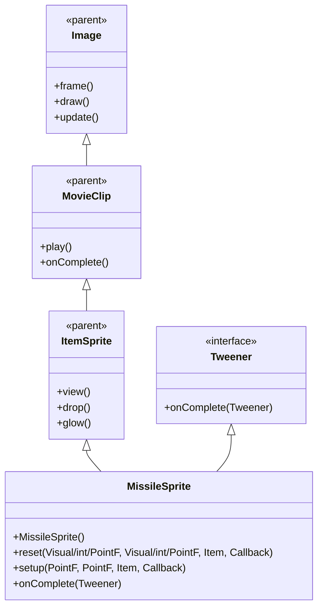

# MissileSprite 源码详解

## 1. 基本信息

| 属性 | 值 |
|------|-----|
| **文件路径** | core/src/main/java/com/shatteredpixel/shatteredpixeldungeon/sprites/MissileSprite.java |
| **包名** | com.shatteredpixel.shatteredpixeldungeon.sprites |
| **类类型** | class（非抽象） |
| **继承关系** | extends ItemSprite implements Tweener.Listener |
| **代码行数** | 187 |

---

## 类职责

MissileSprite 是游戏中所有导弹/投掷武器特效的精灵类，继承自 ItemSprite 并实现 Tweener.Listener 接口。它负责处理游戏中所有远程武器和魔法弹丸的飞行轨迹、旋转效果和物理模拟：

1. **多重构函数支持**：提供5种不同的 reset() 方法重载，支持从不同类型的源和目标创建导弹
2. **角速度配置系统**：通过 ANGULAR_SPEEDS HashMap 为不同武器类型配置不同的旋转速度
3. **物理轨迹模拟**：使用 PosTweener 实现平滑的抛物线飞行轨迹
4. **方向自动调整**：根据飞行方向自动计算角度和水平翻转
5. **速度增强机制**：特定武器组合（如弩+飞镖）提供速度加成
6. **回调通知系统**：飞行完成后通过 Callback 通知调用者

**设计特点**：
- **高度通用性**：支持所有类型的投掷武器和魔法弹丸
- **物理真实性**：真实的飞行轨迹和旋转效果
- **性能优化**：使用对象池和缓存提高性能
- **扩展性强**：易于添加新的武器类型和特殊效果

---

## 4. 继承与协作关系



---

## 核心常量

### 物理参数

| 常量名 | 类型 | 值 | 说明 |
|--------|------|-----|------|
| `SPEED` | float | 240f | 导弹的基础飞行速度（像素/秒） |
| `DEFAULT_ANGULAR_SPEED` | int | 720 | 默认角速度（度/秒，2圈/秒） |

### 角速度配置

```java
private static final HashMap<Class<?extends Item>, Integer> ANGULAR_SPEEDS = new HashMap<>();
static {
    // 无旋转武器（飞镖、匕首等）
    ANGULAR_SPEEDS.put(Dart.class, 0);
    ANGULAR_SPEEDS.put(ThrowingKnife.class, 0);
    // ... 其他无旋转武器
    
    // 慢速旋转（巨石）
    ANGULAR_SPEEDS.put(GnollGeomancer.Boulder.class, 90);
    
    // 快速旋转（回旋镖、流星锤）
    ANGULAR_SPEEDS.put(HeavyBoomerang.class, 1440);
    ANGULAR_SPEEDS.put(Bolas.class, 1440);
    
    // 超快速旋转（手里剑）
    ANGULAR_SPEEDS.put(Shuriken.class, 2160);
    ANGULAR_SPEEDS.put(TenguSprite.TenguShuriken.class, 2160);
}
```

**角速度等级**：
- **0°/秒**：直线飞行，无旋转（飞镖、匕首等小型武器）
- **90°/秒**：极慢速旋转（巨石等重型投掷物）
- **720°/秒**：默认旋转速度（2圈/秒）
- **1440°/秒**：快速旋转（2圈/秒，回旋镖等）
- **2160°/秒**：超快速旋转（6圈/秒，手里剑等）

---

## 核心方法详解

### reset() 方法族

```java
// 5种重载方法，支持不同的源和目标类型
public void reset(int from, int to, Item item, Callback listener)
public void reset(Visual from, int to, Item item, Callback listener)  
public void reset(int from, Visual to, Item item, Callback listener)
public void reset(Visual from, Visual to, Item item, Callback listener)
public void reset(PointF from, PointF to, Item item, Callback listener)
```

**设计理念**：
- **灵活性**：支持格子坐标、Visual 对象、PointF 坐标等多种输入格式
- **便利性**：自动处理坐标转换和中心点计算
- **统一接口**：所有重载最终都调用 PointF 版本的 reset()

### setup(PointF from, PointF to, Item item, Callback listener)

```java
private void setup( PointF from, PointF to, Item item, Callback listener ){
    originToCenter();
    
    // 调整坐标到精灵中心
    from.x -= width()/2; to.x -= width()/2;
    from.y -= height()/2; to.y -= height()/2;
    
    this.callback = listener;
    point(from);
    
    PointF d = PointF.diff(to, from);
    speed.set(d).normalize().scale(SPEED);
    
    // 角速度配置
    angularSpeed = DEFAULT_ANGULAR_SPEED;
    for (Class<?extends Item> cls : ANGULAR_SPEEDS.keySet()){
        if (cls.isAssignableFrom(item.getClass())){
            angularSpeed = ANGULAR_SPEEDS.get(cls);
            break;
        }
    }
    
    // 角度计算
    angle = 135 - (float)(Math.atan2(d.x, d.y) / 3.1415926 * 180);
    
    // 水平翻转处理
    if (d.x >= 0){
        flipHorizontal = false;
        updateFrame();
    } else {
        angularSpeed = -angularSpeed;
        angle += 90;
        flipHorizontal = true;
        updateFrame();
    }
    
    // 特殊物品处理
    if (item instanceof GnollGeomancer.Boulder){
        angle = 0;
        flipHorizontal = false;
        updateFrame();
    }
    
    // 速度增强
    float speed = SPEED;
    if (item instanceof Dart && (Crossbow equipped)){
        speed *= 3f;
    } else if (spirit weapons){
        speed *= 1.5f;
    }
    
    // 创建飞行动画
    PosTweener tweener = new PosTweener(this, to, d.length() / speed);
    tweener.listener = this;
    parent.add(tweener);
}
```

**核心功能**：

1. **坐标调整**：
   - 将输入坐标从角点调整为中心点
   - 确保导弹从正确位置开始飞行

2. **物理参数计算**：
   - **速度向量**：speed.set(d).normalize().scale(SPEED)
   - **飞行时间**：d.length() / speed（距离/速度）
   - **角度计算**：使用 Math.atan2 计算飞行方向

3. **视觉效果配置**：
   - **角速度**：根据武器类型从 HashMap 获取
   - **水平翻转**：根据飞行方向自动设置 flipHorizontal
   - **角度偏移**：负X方向飞行时额外增加90度

4. **特殊处理**：
   - **巨石**：强制 angle = 0，无翻转
   - **弩+飞镖**：3倍速度增强
   - **灵能武器**：1.5倍速度增强

5. **动画创建**：
   - 使用 PosTweener 实现平滑的位置插值
   - 设置监听器处理完成事件

### onComplete(Tweener tweener)

```java
@Override
public void onComplete( Tweener tweener ) {
    kill();
    if (callback != null) {
        callback.call();
    }
}
```

**方法作用**：
- **清理资源**：调用 kill() 从场景中移除导弹
- **回调通知**：执行完成回调，通知调用者导弹已到达目标

---

## 使用的资源

### 武器类型支持

MissileSprite 支持以下武器类型：

**无旋转武器（angularSpeed = 0）**：
- Dart（飞镖）
- ThrowingKnife（投掷匕首）
- ThrowingSpike（投掷尖刺）
- FishingSpear（钓鱼矛）
- ThrowingSpear（投掷长矛）
- Kunai（苦无）
- Javelin（标枪）
- Trident（三叉戟）
- SpiritArrow（灵能箭）
- ScorpioShot（天蝎射击）
- HolyLanceVFX（神圣长枪特效）

**慢速旋转武器（angularSpeed = 90）**：
- Boulder（巨石）

**快速旋转武器（angularSpeed = 1440）**：
- HeavyBoomerang（重型回旋镖）
- Bolas（流星锤）

**超快速旋转武器（angularSpeed = 2160）**：
- Shuriken（手里剑）
- TenguShuriken（天狗手里剑）

### 工具类

| 类名 | 用途 |
|------|------|
| `PosTweener` | 位置插值动画 |
| `PointF` | 2D坐标计算 |
| `DungeonTilemap` | 坐标转换工具 |
| `Callback` | 异步完成通知 |

---

## 与其他类的交互

### 继承关系

| 父类 | 继承/重写的功能 |
|------|----------------|
| `ItemSprite` | 所有物品显示、纹理管理、发光效果等 |
| `MovieClip` | 动画播放、帧管理 |
| `Image` | 基础图像渲染、位置、缩放、旋转等 |

### 接口实现

| 接口 | 实现的方法 |
|------|-----------|
| `Tweener.Listener` | onComplete(Tweener) - 处理动画完成事件 |

### 系统交互

- **武器系统**：与各种投掷武器和远程武器集成
- **装备系统**：检测弩等装备提供速度加成
- **动画系统**：使用 PosTweener 实现平滑飞行
- **回调系统**：通过 Callback 通知攻击完成

---

## 11. 使用示例

### 基本使用

```java
// 创建导弹精灵（通常通过对象池获取）
MissileSprite missile = (MissileSprite)parent.recycle(MissileSprite.class);

// 重置导弹参数
missile.reset(
    attackerSprite,     // 发射源（Visual对象）
    targetPosition,     // 目标位置（int格子坐标）
    throwingKnife,      // 武器物品
    new Callback() {    // 完成回调
        @Override
        public void call() {
            // 导弹到达目标，执行攻击逻辑
            target.onAttackComplete();
        }
    }
);

// 导弹会自动：
// 1. 计算飞行轨迹和旋转参数
// 2. 开始平滑飞行动画
// 3. 到达目标后自动清理并执行回调
```

### 不同武器效果

```java
// 飞镖（无旋转）
missile.reset(from, to, new Dart(), callback);

// 回旋镖（快速旋转）
missile.reset(from, to, new HeavyBoomerang(), callback);

// 手里剑（超快速旋转）
missile.reset(from, to, new Shuriken(), callback);

// 巨石（慢速旋转，特殊角度）
missile.reset(from, to, new Boulder(), callback);
```

### 速度增强示例

```java
// 如果英雄装备了弩，飞镖速度提升3倍
if (Dungeon.hero.belongings.weapon() instanceof Crossbow) {
    missile.reset(from, to, new Dart(), callback);
    // 自动应用3倍速度增强
}

// 灵能箭自动获得1.5倍速度增强
missile.reset(from, to, new SpiritArrow(), callback);
```

---

## 注意事项

### 设计模式理解

1. **策略模式**：通过 HashMap 配置不同武器的角速度策略
2. **工厂模式**：多重 reset() 方法提供灵活的对象创建方式
3. **观察者模式**：Callback 机制实现完成事件通知

### 性能考虑

1. **对象池**：通常通过 parent.recycle() 获取实例，避免频繁创建
2. **缓存优化**：ANGULAR_SPEEDS HashMap 避免重复计算
3. **内存管理**：onComplete() 中自动 kill() 避免内存泄漏

### 常见的坑

1. **坐标系统**：确保理解从角点到中心点的坐标转换
2. **角度计算**：Math.atan2 参数顺序 (x, y) 和角度偏移 (135度)
3. **空值检查**：callback 可能为 null，需要安全调用

### 最佳实践

1. **武器平衡**：合理配置不同武器的角速度体现其特性
2. **物理真实**：使用真实的物理参数创造可信的飞行效果
3. **扩展设计**：易于添加新武器类型和特殊效果
4. **性能优化**：通过对象池和缓存提高运行效率