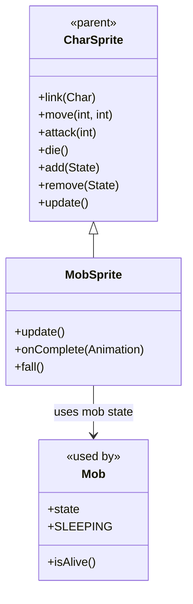

# MobSprite 源码详解

## 1. 基本信息

| 属性 | 值 |
|------|-----|
| **文件路径** | core/src/main/java/com/shatteredpixel/shatteredpixeldungeon/sprites/MobSprite.java |
| **包名** | com.shatteredpixel.shatteredpixeldungeon.sprites |
| **类类型** | class（非抽象） |
| **继承关系** | extends CharSprite |
| **代码行数** | 84 |

---

## 类职责

MobSprite 是游戏中所有怪物精灵的基类，继承自 CharSprite。它专门处理怪物特有的行为和视觉效果：

1. **睡眠状态管理**：自动检测并显示怪物的睡眠状态
2. **死亡淡出效果**：死亡后渐隐消失而非立即移除
3. **坠落动画**：被击落时的特殊坠落效果（如从高处掉落）
4. **继承基础功能**：复用 CharSprite 的所有动画、移动、状态效果等功能

**设计特点**：
- **轻量级扩展**：只添加怪物特有的少量功能
- **自动状态同步**：与底层 Mob 对象的状态保持同步
- **视觉反馈优化**：提供更符合怪物特性的死亡和坠落效果

---

## 4. 继承与协作关系



---

## 静态常量

| 字段名 | 类型 | 值 | 说明 |
|--------|------|-----|------|
| `FADE_TIME` | float | 3f | 死亡后淡出时间（秒） |
| `FALL_TIME` | float | 1f | 坠落动画持续时间（秒） |

---

## 7. 方法详解

### update()

```java
@Override
public void update() {
    sleeping = ch != null && ch.isAlive() && ((Mob)ch).state == ((Mob)ch).SLEEPING;
    super.update();
}
```

**方法作用**：每帧更新怪物精灵状态，特别处理睡眠状态。

**睡眠状态判断条件**：
1. `ch != null`：关联的角色存在
2. `ch.isAlive()`：角色存活
3. `((Mob)ch).state == ((Mob)ch).SLEEPING`：怪物处于睡眠状态

**关键特性**：
- 自动同步底层 Mob 对象的睡眠状态
- 调用父类 `update()` 处理其他通用逻辑
- 触发 `showSleep()` / `hideSleep()` 表情图标显示

---

### onComplete(Animation anim)

```java
@Override
public void onComplete(Animation anim) {
    super.onComplete(anim);
    
    if (anim == die && parent != null) {
        parent.add(new AlphaTweener(this, 0, FADE_TIME) {
            @Override
            protected void onComplete() {
                MobSprite.this.killAndErase();
            }
        });
    }
}
```

**方法作用**：处理动画完成事件，特别为死亡动画添加淡出效果。

**死亡淡出流程**：
1. 调用父类完成处理（通知角色死亡完成）
2. 创建 AlphaTweener 透明度补间器
3. 在淡出完成后调用 `killAndErase()` 彻底移除精灵

**设计优势**：
- 视觉上更平滑的死亡效果
- 避免突兀的精灵消失
- 给玩家更好的视觉反馈

---

### fall()

```java
public void fall() {
    origin.set(width / 2, height - DungeonTilemap.SIZE / 2);
    angularSpeed = Random.Int(2) == 0 ? -720 : 720;
    am = 1;

    hideEmo();

    if (health != null) {
        health.killAndErase();
    }
    
    if (parent != null) parent.add(new ScaleTweener(this, new PointF(0, 0), FALL_TIME) {
        @Override
        protected void onComplete() {
            MobSprite.this.killAndErase();
            parent.erase(this);
        }
        @Override
        protected void updateValues(float progress) {
            super.updateValues(progress);
            y += 12 * Game.elapsed;
            am = 1 - progress;
        }
    });
}
```

**方法作用**：执行怪物坠落动画（通常用于从高处掉落或被击落）。

**坠落效果组成**：
1. **旋转效果**：随机顺时针或逆时针旋转（±720度/秒）
2. **缩放效果**：逐渐缩小到0
3. **下落效果**：Y坐标持续增加（模拟重力下落）
4. **透明度**：逐渐变透明（am = 1 - progress）

**参数说明**：
- `origin`：设置旋转中心点（底部中心）
- `angularSpeed`：角速度，随机正负值实现不同旋转方向
- `am`：alpha multiplier，控制透明度

**内部 ScaleTweener**：
- 目标缩放：PointF(0, 0) 表示完全缩小
- 持续时间：FALL_TIME (1秒)
- 自定义 updateValues：同时处理下落和透明度

---

## 与其他类的交互

### 继承关系

| 父类 | 继承的功能 |
|------|-----------|
| `CharSprite` | 所有基础动画、移动、状态效果、粒子系统等 |

### 使用的类

| 类名 | 用途 |
|------|------|
| `Mob` | 获取怪物状态信息（睡眠状态） |
| `DungeonTilemap` | 获取格子大小用于设置旋转原点 |
| `Random` | 随机选择旋转方向 |
| `AlphaTweener` | 死亡淡出效果 |
| `ScaleTweener` | 坠落缩放效果 |
| `PointF` | 表示缩放目标 |
| `Game` | 获取帧时间间隔 |

### 被哪些类继承

MobSprite 本身不被其他 sprite 类继承，但所有的具体怪物 sprite 类（如 RatSprite、GnollSprite 等）都直接或间接继承自 CharSprite，并在实现中体现出 MobSprite 的行为模式。

实际上，在 Shattered Pixel Dungeon 中，具体的怪物 sprite 类通常直接继承 CharSprite，而 MobSprite 更多是作为一个概念性的基类，提供了怪物特有的行为模式参考。

---

## 11. 使用示例

### 基本怪物精灵使用

```java
// 创建具体怪物精灵（以老鼠为例）
RatSprite ratSprite = new RatSprite();

// 关联怪物对象
ratSprite.link(ratMob);

// 正常的怪物行为
ratSprite.move(fromPos, toPos);     // 移动
ratSprite.attack(targetPos);        // 攻击  
ratSprite.die();                    // 死亡（自动淡出）

// 特殊坠落效果
if (monsterFallsFromHeight) {
    ratSprite.fall();               // 坠落动画
}
```

### 睡眠状态自动处理

```java
// 设置怪物为睡眠状态
mob.state = mob.SLEEPING;

// MobSprite.update() 会自动检测并显示睡眠表情
// 无需手动调用 showSleep()

// 唤醒怪物
mob.state = mob.HUNTING; // 或其他非睡眠状态

// MobSprite.update() 会自动隐藏睡眠表情
// 无需手动调用 hideSleep()
```

### 死亡效果对比

```java
// 普通 CharSprite 死亡：立即播放死亡动画，完成后立即移除
charSprite.die();

// MobSprite 死亡：播放死亡动画 → 淡出效果 → 最终移除
mobSprite.die(); // 自动包含淡出
```

---

## 注意事项

### 设计模式理解

1. **MobSprite vs 具体怪物 Sprite**：在实际代码中，具体的怪物 sprite 类（如 RatSprite.java）通常直接继承 CharSprite，而不是 MobSprite。MobSprite 更多是提供了一种行为模式的参考实现。

2. **状态同步时机**：睡眠状态在每帧 `update()` 中检查，确保实时同步。

### 性能考虑

1. **淡出效果开销**：死亡淡出效果会延长精灵的生命周期，增加内存使用时间
2. **坠落动画复杂度**：同时处理旋转、缩放、位移和透明度，计算开销相对较大

### 常见的坑

1. **手动管理睡眠状态**：不应该手动调用 `showSleep()` / `hideSleep()`，应该让 `update()` 自动处理
2. **重复死亡处理**：不要在 `onComplete(die)` 中再次调用死亡相关逻辑，避免重复执行
3. **坠落后状态清理**：`fall()` 方法会自动清理血量指示器和表情图标，无需额外处理

### 最佳实践

1. **利用自动状态管理**：依赖 `update()` 方法自动处理睡眠状态
2. **合理使用坠落效果**：仅在真正需要坠落视觉效果时调用 `fall()`
3. **注意生命周期**：死亡淡出期间精灵仍然存在，避免在此期间进行无效操作