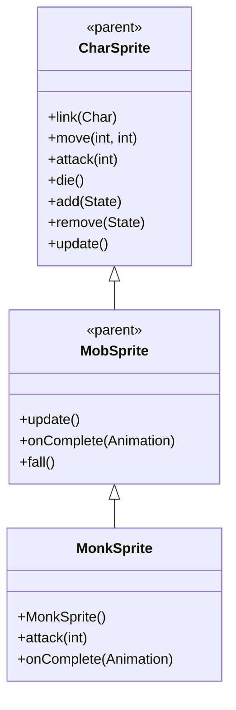

# MonkSprite 源码详解

## 1. 基本信息

| 属性 | 值 |
|------|-----|
| **文件路径** | core/src/main/java/com/shatteredpixel/shatteredpixeldungeon/sprites/MonkSprite.java |
| **包名** | com.shatteredpixel.shatteredpixeldungeon.sprites |
| **类类型** | class（非抽象） |
| **继承关系** | extends MobSprite |
| **代码行数** | 69 |

---

## 类职责

MonkSprite 是游戏中僧侣怪物的精灵类，继承自 MobSprite。它具有以下特殊功能：

1. **随机踢击动画**：attack() 方法有50%概率触发特殊的 kick 动画
2. **复杂 Idle 序列**：4帧序列模拟僧侣的呼吸和冥想姿态
3. **攻击动画多样性**：基本攻击使用 [3,4,3,4] 序列，踢击使用 [5,6,5] 序列
4. **动画状态管理**：onComplete() 方法智能处理 kick 和 attack 动画的完成逻辑

**设计特点**：
- **随机性战斗**：50%的踢击概率增加战斗的不可预测性
- **武术动作还原**：不同的攻击动画体现僧侣的多样化武术技巧
- **流畅状态切换**：kick 动画完成后正确返回到 attack 动画的完成处理

---

## 4. 继承与协作关系



---

## 核心字段

### 动画字段

| 字段名 | 类型 | 说明 |
|--------|------|------|
| `kick` | Animation | 踢击动画，3帧序列 [5,6,5] |

---

## 构造方法详解

### MonkSprite()

```java
public MonkSprite() {
    super();
    
    texture( Assets.Sprites.MONK );
    
    TextureFilm frames = new TextureFilm( texture, 15, 14 );
    
    idle = new Animation( 6, true );
    idle.frames( frames, 1, 0, 1, 2 );
    
    run = new Animation( 15, true );
    run.frames( frames, 11, 12, 13, 14, 15, 16 );
    
    attack = new Animation( 12, false );
    attack.frames( frames, 3, 4, 3, 4 );
    
    kick = new Animation( 10, false );
    kick.frames( frames, 5, 6, 5 );
    
    die = new Animation( 15, false );
    die.frames( frames, 1, 7, 8, 8, 9, 10 );
    
    play( idle );
}
```

**构造方法作用**：初始化僧侣精灵的所有动画。

**纹理和帧设置**：
- **纹理源**：Assets.Sprites.MONK
- **帧尺寸**：15 像素宽 × 14 像素高
- **帧总数**：17 帧（索引 0-16）

**动画参数说明**：

| 动画类型 | 帧率 (FPS) | 循环 | 帧序列 | 说明 |
|----------|------------|------|--------|------|
| `idle` | 6 | true | [1, 0, 1, 2] | 闲置状态，模拟呼吸和冥想姿态 |
| `run` | 15 | true | [11,12,13,14,15,16] | 跑动动画，6帧循环 |
| `attack` | 12 | false | [3,4,3,4] | 基本攻击，交替拳击动作 |
| `kick` | 10 | false | [5,6,5] | 踢击攻击，3帧完成 |
| `die` | 15 | false | [1,7,8,8,9,10] | 死亡动画，6帧完整播放 |

**关键特性**：
- **Idle呼吸效果**：[1,0,1,2] 序列模拟自然的呼吸节奏
- **Attack拳击循环**：[3,4,3,4] 体现快速交替出拳
- **Kick简洁有力**：[5,6,5] 三帧完成踢击动作
- **Die完整过程**：包含死亡、倒地、最终姿态的完整序列

---

## 特殊方法详解

### attack(int cell)

```java
@Override
public void attack( int cell ) {
    super.attack( cell );
    if (Random.Float() < 0.5f) {
        play( kick );
    }
}
```

**方法作用**：执行攻击时有50%概率触发踢击动画。

**随机攻击机制**：
- **基础攻击**：始终调用 super.attack(cell) 开始基本攻击动画
- **随机踢击**：50%概率（Random.Float() < 0.5f）额外播放 kick 动画
- **视觉效果**：踢击动画会覆盖基本攻击动画，创造多样化的攻击表现

**设计理念**：
- 增加战斗的不可预测性
- 体现僧侣武术的多样化技巧
- 通过随机性提升游戏体验

### onComplete(Animation anim)

```java
@Override
public void onComplete( Animation anim ) {
    super.onComplete( anim == kick ? attack : anim );
}
```

**方法作用**：智能处理动画完成事件，确保正确的回调链。

**状态管理逻辑**：
- **Kick动画完成**：调用 super.onComplete(attack)，将 kick 完成视为 attack 完成
- **其他动画完成**：正常调用 super.onComplete(anim)

**设计理念**：
- 确保 kick 动画完成后正确触发攻击完成逻辑
- 避免 kick 动画被误认为独立的动画状态
- 保持与父类和其他系统的兼容性

---

## 使用的资源

### 纹理资源

| 资源 | 用途 |
|------|------|
| `Assets.Sprites.MONK` | 僧侣的完整纹理集 |

### 工具类

| 类名 | 用途 |
|------|------|
| `TextureFilm` | 纹理帧管理 |
| `Random` | 随机数生成（用于50%踢击概率） |

---

## 与其他类的交互

### 继承关系

| 父类 | 继承/重写的功能 |
|------|----------------|
| `MobSprite` | 睡眠状态管理、死亡淡出效果、坠落动画等 |
| `CharSprite` | 所有基础动画、移动、状态效果、粒子系统等 |

### 关联的怪物类

MonkSprite 对应的怪物类是 `com.shatteredpixel.shatteredpixeldungeon.actors.mobs.Monk`，该类定义了僧侣的行为逻辑。

### 战斗系统交互

- **攻击完成回调**：通过 super.onComplete(attack) 确保正确的攻击完成处理
- **随机性设计**：50%的踢击概率增加战斗变数
- **动画覆盖**：kick 动画会覆盖基本 attack 动画的视觉表现

---

## 11. 使用示例

### 基本使用

```java
// 创建僧侣精灵
MonkSprite monk = new MonkSprite();

// 关联僧侣怪物对象
monk.link(monkMob);

// 自动播放 idle 动画（呼吸/冥想效果）

// 触发动画
monk.run();     // 播放跑动动画  
monk.attack(targetPos); // 播放攻击动画（50%概率触发踢击）
monk.die();     // 播放死亡动画
```

### 随机踢击机制

```java
// attack 方法会自动处理随机踢击：
monk.attack(enemyPos);

// 可能的结果：
// - 50% 概率：播放基本 attack 动画 [3,4,3,4]
// - 50% 概率：播放 kick 动画 [5,6,5]（覆盖基本攻击）

// 无论哪种情况，完成时都会正确触发攻击完成逻辑
```

### 动画状态管理

```java
// onComplete 方法确保正确的状态处理：
// - 如果播放的是 kick 动画，完成时调用 super.onComplete(attack)
// - 如果播放的是其他动画，正常处理完成事件

// 这保证了：
// 1. 踢击动画完成后正确通知攻击完成
// 2. 其他动画（如 die）正常处理
// 3. 与父类系统的兼容性
```

---

## 注意事项

### 设计模式理解

1. **随机性设计**：通过50%概率增加战斗的不可预测性和趣味性
2. **状态覆盖**：kick 动画覆盖 attack 动画，但保持相同的逻辑语义
3. **智能回调**：onComplete() 方法正确处理不同动画类型的完成逻辑

### 性能考虑

1. **内存效率**：合理的纹理帧数量（17帧），适合中等复杂度怪物
2. **随机开销**：Random.Float() 调用性能开销极小
3. **动画复用**：kick 和 attack 共享同一纹理集，减少资源占用

### 常见的坑

1. **动画覆盖理解**：kick 动画会覆盖 attack 动画，不是同时播放
2. **回调链正确性**：必须在 onComplete() 中正确处理 kick 到 attack 的映射
3. **概率平衡**：50%的踢击概率经过精心调整，不要随意修改

### 最佳实践

1. **随机性战斗设计**：为武术类角色添加随机的特殊攻击动作
2. **动画状态管理**：确保特殊动画完成后正确触发标准回调逻辑
3. **武术动作还原**：使用不同的帧序列体现多样化的武术技巧