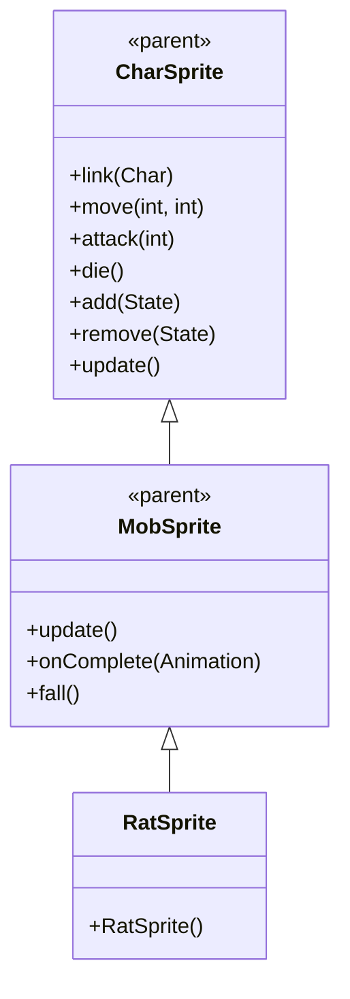

# RatSprite 源码详解

## 1. 基本信息

| 属性 | 值 |
|------|-----|
| **文件路径** | core/src/main/java/com/shatteredpixel/shatteredpixeldungeon/sprites/RatSprite.java |
| **包名** | com.shatteredpixel.shatteredpixeldungeon.sprites |
| **类类型** | class（非抽象） |
| **继承关系** | extends MobSprite |
| **代码行数** | 50 |

---

## 类职责

RatSprite 是游戏中老鼠怪物的精灵类，继承自 MobSprite。它负责加载老鼠的纹理资源并定义其各种动画帧序列：

1. **纹理加载**：使用 Assets.Sprites.RAT 纹理集
2. **动画定义**：为 idle、run、attack、die 四种状态定义具体的帧序列
3. **帧尺寸设置**：指定纹理帧的尺寸为 16x15 像素
4. **默认状态**：初始化时自动播放 idle 动画

**设计特点**：
- **轻量级实现**：仅包含必要的动画定义，复用父类的所有功能
- **资源管理**：通过 TextureFilm 高效管理纹理帧
- **简单直接**：没有额外的特殊效果或复杂逻辑

---

## 4. 继承与协作关系



---

## 构造方法详解

### RatSprite()

```java
public RatSprite() {
    super();
    
    texture( Assets.Sprites.RAT );
    
    TextureFilm frames = new TextureFilm( texture, 16, 15 );
    
    idle = new Animation( 2, true );
    idle.frames( frames, 0, 0, 0, 1 );
    
    run = new Animation( 10, true );
    run.frames( frames, 6, 7, 8, 9, 10 );
    
    attack = new Animation( 15, false );
    attack.frames( frames, 2, 3, 4, 5, 0 );
    
    die = new Animation( 10, false );
    die.frames( frames, 11, 12, 13, 14 );
    
    play( idle );
}
```

**构造方法作用**：初始化老鼠精灵的所有动画。

**纹理和帧设置**：
- **纹理源**：Assets.Sprites.RAT
- **帧尺寸**：16 像素宽 × 15 像素高
- **帧总数**：至少 15 帧（索引 0-14）

**动画参数说明**：

| 动画类型 | 帧率 (FPS) | 循环 | 帧序列 | 说明 |
|----------|------------|------|--------|------|
| `idle` | 2 | true | [0, 0, 0, 1] | 闲置状态，大部分时间显示帧0，偶尔切换到帧1 |
| `run` | 10 | true | [6, 7, 8, 9, 10] | 跑动动画，5帧循环 |
| `attack` | 15 | false | [2, 3, 4, 5, 0] | 攻击动画，从准备到恢复，最后回到帧0 |
| `die` | 10 | false | [11, 12, 13, 14] | 死亡动画，4帧播放一次 |

**关键特性**：
- **Idle动画设计**：帧序列为 [0, 0, 0, 1] 表示老鼠大部分时间保持静止（帧0），偶尔有小动作（帧1）
- **攻击动画完整性**：攻击完成后回到帧0，确保角色回到基础姿态
- **死亡动画简洁**：只有4帧，快速完成死亡效果

---

## 使用的资源

### 纹理资源

| 资源 | 用途 |
|------|------|
| `Assets.Sprites.RAT` | 老鼠精灵的完整纹理集 |

### 工具类

| 类名 | 用途 |
|------|------|
| `TextureFilm` | 将大纹理分割成多个小帧用于动画 |

---

## 与其他类的交互

### 继承关系

| 父类 | 继承的功能 |
|------|-----------|
| `MobSprite` | 睡眠状态管理、死亡淡出效果、坠落动画等 |
| `CharSprite` | 所有基础动画、移动、状态效果、粒子系统等 |

### 关联的怪物类

RatSprite 对应的怪物类是 `com.shatteredpixel.shatteredpixeldungeon.actors.mobs.Rat`，该类定义了老鼠的行为逻辑，而 RatSprite 只负责视觉表现。

---

## 11. 使用示例

### 基本使用

```java
// 创建老鼠精灵
RatSprite ratSprite = new RatSprite();

// 关联老鼠怪物对象
ratSprite.link(ratMob);

// 自动播放 idle 动画（构造时已设置）

// 触发动画
ratSprite.run();     // 播放跑动动画  
ratSprite.attack(targetPos); // 播放攻击动画
ratSprite.die();     // 播放死亡动画（包含淡出效果）
```

### 动画控制

```java
// 手动控制动画（通常不需要，由游戏逻辑自动触发）
ratSprite.play(ratSprite.idle);   // 播放闲置动画
ratSprite.play(ratSprite.run);    // 播跑动动画
```

---

## 注意事项

### 设计模式理解

1. **分离关注点**：RatSprite 只处理视觉表现，行为逻辑在 Rat 类中
2. **资源复用**：通过 TextureFilm 高效管理纹理资源
3. **动画标准化**：遵循游戏统一的动画命名和触发机制

### 性能考虑

1. **内存效率**：所有帧共享同一个纹理，减少内存占用
2. **渲染优化**：固定帧尺寸便于 GPU 批处理

### 常见的坑

1. **不要修改帧率**：帧率经过精心调整以匹配游戏节奏
2. **帧序列完整性**：攻击动画必须以帧0结尾，确保姿态正确
3. **纹理尺寸匹配**：16x15 的尺寸必须与实际纹理匹配

### 最佳实践

1. **遵循现有模式**：创建新怪物精灵时参考此实现
2. **保持简洁**：除非必要，不要添加复杂效果
3. **测试动画流畅性**：确保各状态切换自然