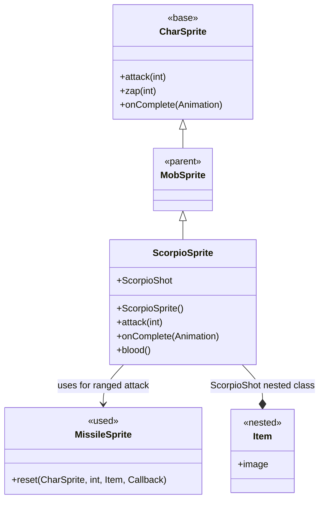

# ScorpioSprite 源码详解

## 1. 基本信息

| 属性 | 值 |
|------|-----|
| **文件路径** | core/src/main/java/com/shatteredpixel/shatteredpixeldungeon/sprites/ScorpioSprite.java |
| **包名** | com.shatteredpixel.shatteredpixeldungeon.sprites |
| **类类型** | class（非抽象） |
| **继承关系** | extends MobSprite |
| **代码行数** | 99 |

---

## 类职责

ScorpioSprite 是蝎子怪物的精灵类，继承自 MobSprite。它处理蝎子特有的战斗行为和视觉表现：

1. **远程攻击系统**：支持近战和远程两种攻击模式
2. **投射物动画**：远程攻击时创建特殊的投射物视觉效果
3. **自定义血液颜色**：绿色血液体现蝎子的毒性特征  
4. **基础动画定义**：基于专用精灵表定义所有动画帧序列
5. **内部投射物类**：包含嵌套的 ScorpioShot 投射物类用于视觉表现

**设计特点**：
- **智能攻击选择**：根据目标距离自动选择近战或远程攻击
- **投射物复用**：使用 MissileSprite 对象池提高性能
- **主题一致性**：绿色血液与毒属性相匹配

---

## 4. 继承与协作关系



---

## 实例字段

| 字段名 | 类型 | 说明 |
|--------|------|------|
| `cellToAttack` | int | 远程攻击的目标格子（用于动画回调） |

---

## 构造方法详解

### ScorpioSprite()

```java
public ScorpioSprite() {
    super();
    texture(Assets.Sprites.SCORPIO);
    TextureFilm frames = new TextureFilm(texture, 17, 17);
    
    idle = new Animation(12, true);
    idle.frames(frames, 0, 0, 0, 0, 0, 0, 0, 0, 1, 2, 1, 2, 1, 2);
    
    run = new Animation(8, true);
    run.frames(frames, 5, 5, 6, 6);
    
    attack = new Animation(15, false);
    attack.frames(frames, 0, 3, 4);
    
    zap = attack.clone();
    
    die = new Animation(12, false);
    die.frames(frames, 0, 7, 8, 9, 10);
    
    play(idle);
}
```

**精灵表规格**：17x17 像素每帧

**动画帧分析**：
- **idle**：14帧复杂序列，长时间静止后有轻微动作
- **run**：4帧奔跑序列，重复帧营造节奏感
- **attack**：3帧近战攻击序列
- **die**：5帧死亡序列，从站立到完全倒下

---

## 方法重写

### blood()

```java
@Override
public int blood() {
    return 0xFF44FF22;
}
```

**血液颜色**：#44FF22（深绿色），比 AcidicSprite 的血液颜色更暗，体现不同毒性强度。

### attack(int cell)

```java
@Override
public void attack(int cell) {
    if (!Dungeon.level.adjacent(cell, ch.pos)) {
        cellToAttack = cell;
        zap(cell);
    } else {
        super.attack(cell);
    }
}
```

**智能攻击逻辑**：
- **远程攻击**：目标不相邻时，调用 `zap()` 触发射程攻击动画
- **近战攻击**：目标相邻时，调用父类近战攻击逻辑
- **状态保存**：远程攻击时保存目标格子到 `cellToAttack`

### onComplete(Animation anim)

```java
@Override
public void onComplete(Animation anim) {
    if (anim == zap) {
        idle();
        ((MissileSprite)parent.recycle(MissileSprite.class)).
        reset(this, cellToAttack, new ScorpioShot(), new Callback() {
            @Override
            public void call() {
                ch.onAttackComplete();
            }
        });
    } else {
        super.onComplete(anim);
    }
}
```

**远程攻击完成处理**：
1. 回到空闲状态
2. 从对象池获取 MissileSprite
3. 重置投射物参数：
   - 起始位置：当前精灵位置
   - 目标位置：`cellToAttack`
   - 投射物外观：`ScorpioShot` 实例
   - 完成回调：通知角色攻击完成
4. 非 zap 动画调用父类处理

---

## 内部类详解

### ScorpioShot

```java
public class ScorpioShot extends Item {
    {
        image = ItemSpriteSheet.FISHING_SPEAR;
    }
}
```

**类作用**：仅为视觉表现服务的内部投射物类。

**设计特点**：
- 继承 Item 但不具有实际物品功能
- 使用 FISHING_SPEAR 图像作为投射物外观
- 仅用于 MissileSprite 的视觉显示

---

## 资源使用

### 精灵表帧布局

| 帧索引 | 用途 | 说明 |
|--------|------|------|
| 0-2 | 空闲状态 | 主体静止，尾部微动 |
| 3-4 | 攻击状态 | 钳子攻击动作 |
| 5-6 | 奔跑状态 | 移动动画 |
| 7-10 | 死亡状态 | 逐步倒下过程 |

---

## 11. 使用示例

### 基本使用

```java
// 创建蝎子精灵
ScorpioSprite scorpioSprite = new ScorpioSprite();

// 关联到蝎子怪物
scorpioSprite.link(scorpioMob);

// 近战攻击（相邻目标）
scorpioSprite.attack(adjacentTarget);

// 远程攻击（非相邻目标）
scorpioSprite.attack(distantTarget); // 自动触发射程攻击
```

### 投射物自定义

```java
// 如果需要修改投射物外观，可以继承 ScorpioSprite 并重写 ScorpioShot
public class CustomScorpioSprite extends ScorpioSprite {
    public class ScorpioShot extends Item {
        {
            image = ItemSpriteSheet.CUSTOM_PROJECTILE; // 自定义图像
        }
    }
}
```

---

## 注意事项

### 攻击机制

1. **距离判断**：使用 `Dungeon.level.adjacent()` 判断目标是否相邻
2. **动画分离**：近战使用 `attack` 动画，远程使用 `zap` 动画
3. **回调时机**：远程攻击的完成回调在投射物到达目标后触发

### 性能优化

1. **对象池**：使用 `parent.recycle()` 复用 MissileSprite 对象
2. **内部类**：ScorpioShot 作为内部类避免额外的类加载开销
3. **状态复用**：`zap = attack.clone()` 避免重复定义相似动画

### 常见的坑

1. **忘记调用父类**：非 zap 动画必须调用 `super.onComplete()`
2. **投射物生命周期**：ScorpioShot 只用于视觉，不应赋予实际物品功能
3. **攻击距离逻辑**：修改攻击逻辑时要注意保持距离判断的一致性

### 最佳实践

1. **利用智能攻击**：无需手动区分近战远程，Sprite 自动处理
2. **自定义投射物**：通过继承和重写 ScorpioShot 类来自定义外观
3. **保持主题一致**：血液颜色和动画风格应与怪物特性匹配