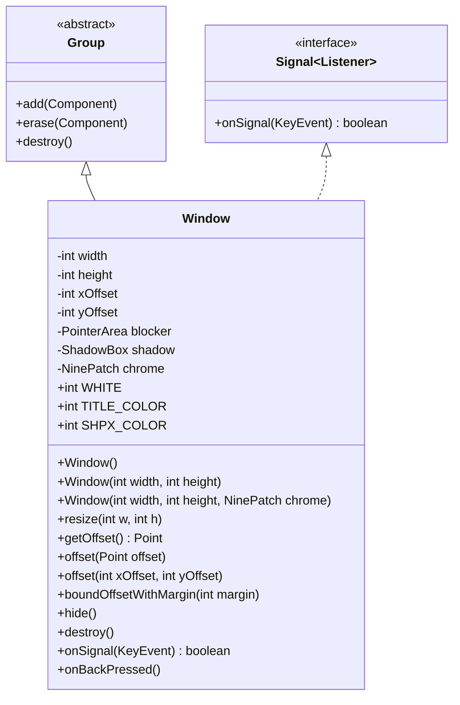

# Window 类文档

## 1. 基本信息

| 属性 | 值 |
|------|-----|
| **文件路径** | core/src/main/java/com/shatteredpixel/shatteredpixeldungeon/ui/Window.java |
| **包名** | com.shatteredpixel.shatteredpixeldungeon.ui |
| **类类型** | class |
| **继承关系** | extends Group implements Signal.Listener<KeyEvent> |
| **代码行数** | 227 |
| **功能概述** | 所有窗口对话框的基类 |

## 2. 文件职责说明

Window 是 Shattered Pixel Dungeon 中所有窗口对话框的基类。它继承自 Group 并实现键盘事件监听接口，提供标准的窗口功能，包括背景边框、阴影效果、专用相机管理以及键盘事件处理。

**主要功能**：
1. **九宫格边框**：使用 Chrome.Type.WINDOW 作为默认边框样式
2. **阴影效果**：自动添加半透明阴影框增强视觉层次
3. **专用相机**：为窗口内容创建独立的相机，支持缩放和偏移
4. **安全区域适配**：自动适配不同设备的安全区域（如刘海屏）
5. **键盘事件处理**：监听返回键（BACK）和等待键（WAIT）以关闭窗口
6. **阻塞层**：点击窗口外部区域会触发 onBackPressed() 方法

## 3. 结构总览



## 4. 继承与协作关系

### 继承关系
- **父类**：Group（Noosa 组件容器）
- **实现接口**：Signal.Listener<KeyEvent>（键盘事件监听器）

### 协作关系
| 协作类 | 关系类型 | 协作说明 |
|--------|----------|----------|
| Chrome | 创建 | 创建九宫格边框 |
| ShadowBox | 创建 | 创建阴影效果 |
| Camera | 创建/管理 | 创建和管理窗口专用相机 |
| PixelScene | 读取 | 获取 UI 相机和默认缩放 |
| KeyEvent | 监听 | 监听键盘事件 |
| KeyBindings | 调用 | 获取按键对应的游戏操作 |
| SPDAction | 读取 | 游戏操作常量 |
| PlatformSupport | 调用 | 获取安全区域信息 |

### 子类
- WndTabbed（带标签页的窗口）
- WndMessage（消息窗口）
- WndTitledMessage（带标题的消息窗口）
- WndSettings（设置窗口）
- 其他所有 Wnd* 类

## 5. 字段与常量详解

### 静态常量

| 常量 | 类型 | 值 | 说明 |
|------|------|-----|------|
| `WHITE` | int | 0xFFFFFF | 白色（默认文本颜色） |
| `TITLE_COLOR` | int | 0xFFFF44 | 标题颜色（黄色） |
| `SHPX_COLOR` | int | 0x33BB33 | Shattered Pixel Dungeon 品牌颜色（绿色） |

### 实例字段

| 字段 | 类型 | 说明 |
|------|------|------|
| `width` | int | 窗口宽度 |
| `height` | int | 窗口高度 |
| `xOffset` | int | X轴偏移量 |
| `yOffset` | int | Y轴偏移量 |
| `blocker` | PointerArea | 阻塞层（检测窗口外部点击） |
| `shadow` | ShadowBox | 阴影框 |
| `chrome` | NinePatch | 九宫格边框 |

## 6. 构造与初始化机制

### 构造函数

#### Window() - 默认构造
```java
public Window() {
    this(0, 0, Chrome.get(Chrome.Type.WINDOW));
}
```
创建默认大小的窗口。

#### Window(int, int) - 指定大小
```java
public Window(int width, int height) {
    this(width, height, Chrome.get(Chrome.Type.WINDOW));
}
```
创建指定大小的窗口。

#### Window(int, int, NinePatch) - 完整构造
```java
public Window(int width, int height, NinePatch chrome) {
    super();
    
    // 1. 创建阻塞层
    blocker = new PointerArea(0, 0, PixelScene.uiCamera.width, PixelScene.uiCamera.height) {
        @Override
        protected void onClick(PointerEvent event) {
            if (Window.this.parent != null && !Window.this.chrome.overlapsScreenPoint(
                (int) event.current.x, (int) event.current.y)) {
                onBackPressed();
            }
        }
    };
    blocker.camera = PixelScene.uiCamera;
    add(blocker);
    
    // 2. 设置边框
    this.chrome = chrome;
    this.width = width;
    this.height = height;
    
    // 3. 创建阴影
    shadow = new ShadowBox();
    shadow.am = 0.5f;
    shadow.camera = PixelScene.uiCamera.visible ? PixelScene.uiCamera : Camera.main;
    add(shadow);
    
    // 4. 设置边框位置和大小
    chrome.x = -chrome.marginLeft();
    chrome.y = -chrome.marginTop();
    chrome.size(width - chrome.x + chrome.marginRight(), height - chrome.y + chrome.marginBottom());
    add(chrome);
    
    // 5. 创建专用相机
    RectF insets = Game.platform.getSafeInsets(PlatformSupport.INSET_BLK);
    int screenW = (int)(Game.width - insets.left - insets.right);
    int screenH = (int)(Game.height - insets.top - insets.bottom);
    
    camera = new Camera(0, 0, (int)chrome.width, (int)chrome.height, PixelScene.defaultZoom);
    camera.x = (int)(insets.left + (screenW - camera.width * camera.zoom) / 2);
    camera.y = (int)(insets.top + (screenH - camera.height * camera.zoom) / 2);
    camera.y -= yOffset * camera.zoom;
    camera.scroll.set(chrome.x, chrome.y);
    Camera.add(camera);
    
    // 6. 设置阴影位置
    shadow.boxRect(camera.x / camera.zoom, camera.y / camera.zoom, chrome.width(), chrome.height);
    
    // 7. 注册键盘监听
    KeyEvent.addKeyListener(this);
}
```

## 7. 方法详解

### 公开方法

#### resize(int, int) - 调整窗口大小
```java
public void resize(int w, int h) {
    this.width = w;
    this.height = h;
    
    chrome.size(width + chrome.marginHor(), height + chrome.marginVer());
    camera.resize((int)chrome.width, (int)chrome.height);
    
    // 重新计算相机位置
    RectF insets = Game.platform.getSafeInsets(PlatformSupport.INSET_BLK);
    int screenW = (int)(Game.width - insets.left - insets.right);
    int screenH = (int)(Game.height - insets.top - insets.bottom);
    
    camera.x = (int)(screenW - camera.screenWidth()) / 2;
    camera.x += insets.left;
    camera.x += xOffset * camera.zoom;
    
    camera.y = (int)(screenH - camera.screenHeight()) / 2;
    camera.y += insets.top;
    camera.y += yOffset * camera.zoom;
    
    shadow.boxRect(camera.x / camera.zoom, camera.y / camera.zoom, chrome.width(), chrome.height);
}
```

#### getOffset() - 获取偏移量
```java
public Point getOffset() {
    return new Point(xOffset, yOffset);
}
```

#### offset(Point) / offset(int, int) - 设置偏移量
```java
public void offset(int xOffset, int yOffset) {
    camera.x -= this.xOffset * camera.zoom;
    this.xOffset = xOffset;
    camera.x += xOffset * camera.zoom;
    
    camera.y -= this.yOffset * camera.zoom;
    this.yOffset = yOffset;
    camera.y += yOffset * camera.zoom;
    
    shadow.boxRect(camera.x / camera.zoom, camera.y / camera.zoom, chrome.width(), chrome.height);
}
```

#### boundOffsetWithMargin(int) - 限制偏移范围
```java
public void boundOffsetWithMargin(int margin) {
    float x = camera.x / camera.zoom;
    float y = camera.y / camera.zoom;
    
    Camera sceneCam = PixelScene.uiCamera.visible ? PixelScene.uiCamera : Camera.main;
    
    // 确保 X 偏移不超出边距
    int newXOfs = xOffset;
    if (newXOfs != 0) {
        if (x < margin) {
            newXOfs += margin - x;
        } else if (x + camera.width > sceneCam.width - margin) {
            newXOfs += (sceneCam.width - margin) - (x + camera.width);
        }
    }
    
    // 确保 Y 偏移不超出边距
    int newYOfs = yOffset;
    if (newYOfs != 0) {
        if (y < margin) {
            newYOfs += margin - y;
        } else if (y + camera.height > sceneCam.height - margin) {
            newYOfs += (sceneCam.height - margin) - (y + camera.height);
        }
    }
    
    offset(newXOfs, newYOfs);
}
```

#### hide() - 隐藏窗口
```java
public void hide() {
    if (parent != null) {
        parent.erase(this);
    }
    destroy();
}
```

#### onBackPressed() - 返回键处理
```java
public void onBackPressed() {
    hide();
}
```
子类可重写此方法以自定义返回行为。

### 重写方法

#### destroy() - 销毁窗口
```java
@Override
public void destroy() {
    super.destroy();
    Camera.remove(camera);
    KeyEvent.removeKeyListener(this);
}
```

#### onSignal(KeyEvent) - 键盘事件处理
```java
@Override
public boolean onSignal(KeyEvent event) {
    if (event.pressed) {
        if (KeyBindings.getActionForKey(event) == SPDAction.BACK
            || KeyBindings.getActionForKey(event) == SPDAction.WAIT) {
            onBackPressed();
        }
    }
    return true;
}
```

## 8. 对外暴露能力

### 公开API

| 方法 | 参数 | 返回值 | 说明 |
|------|------|--------|------|
| `Window()` | 无 | 无 | 创建默认窗口 |
| `Window(int, int)` | 宽度, 高度 | 无 | 创建指定大小窗口 |
| `Window(int, int, NinePatch)` | 宽度, 高度, 边框 | 无 | 创建自定义边框窗口 |
| `resize(int, int)` | 宽度, 高度 | void | 调整窗口大小 |
| `getOffset()` | 无 | Point | 获取当前偏移量 |
| `offset(Point)` | 偏移点 | void | 设置偏移量 |
| `offset(int, int)` | X偏移, Y偏移 | void | 设置偏移量 |
| `boundOffsetWithMargin(int)` | 边距 | void | 限制偏移范围 |
| `hide()` | 无 | void | 隐藏并销毁窗口 |
| `onBackPressed()` | 无 | void | 处理返回操作 |

### 静态常量

| 常量 | 值 | 说明 |
|------|-----|------|
| `WHITE` | 0xFFFFFF | 白色 |
| `TITLE_COLOR` | 0xFFFF44 | 标题颜色 |
| `SHPX_COLOR` | 0x33BB33 | 品牌颜色 |

## 9. 运行机制与调用链

### 窗口创建流程
```
创建 Window 实例
    ↓
创建阻塞层（检测外部点击）
    ↓
创建阴影框
    ↓
创建九宫格边框
    ↓
创建专用相机
    ↓
注册键盘监听器
    ↓
窗口显示
```

### 点击外部区域流程
```
用户点击屏幕
    ↓
blocker.onClick() 触发
    ↓
检查点击是否在边框内
    ↓
如果不在边框内 → onBackPressed()
    ↓
默认行为：hide() 销毁窗口
```

### 键盘事件流程
```
用户按下返回键/等待键
    ↓
KeyEvent 分发到监听器
    ↓
onSignal() 接收事件
    ↓
检查是否为 BACK 或 WAIT 操作
    ↓
调用 onBackPressed()
```

## 10. 资源/配置/国际化关联

### 视觉资源
- **边框样式**：Chrome.Type.WINDOW（九宫格纹理）
- **阴影**：ShadowBox（半透明黑色阴影）

### 颜色常量
| 常量 | 用途 |
|------|------|
| WHITE | 默认文本颜色 |
| TITLE_COLOR | 窗口标题颜色 |
| SHPX_COLOR | 品牌标识颜色 |

### 平台适配
- 通过 `Game.platform.getSafeInsets()` 获取安全区域
- 自动适配刘海屏等异形屏幕

## 11. 使用示例

### 创建简单窗口
```java
Window myWindow = new Window(200, 150) {
    @Override
    public void onBackPressed() {
        // 自定义返回逻辑
        super.onBackPressed();
    }
};
```

### 创建自定义边框窗口
```java
NinePatch customChrome = Chrome.get(Chrome.Type.TOAST);
Window toastWindow = new Window(100, 50, customChrome);
```

### 设置窗口偏移
```java
// 添加偏移量
myWindow.offset(new Point(50, 30));

// 限制偏移量在安全范围内
myWindow.boundOffsetWithMargin(20);
```

### 程序化关闭窗口
```java
myWindow.hide();
```

## 12. 开发注意事项

### 相机管理
- 每个窗口有独立的相机实例
- 销毁窗口时必须移除相机（destroy() 中处理）
- 相机位置根据安全区域自动计算

### 键盘事件
- 窗口自动注册键盘监听器
- 销毁时必须移除监听器
- BACK 和 WAIT 键都会触发 onBackPressed()

### 阻塞层
- blocker 覆盖整个屏幕
- 点击边框外部区域触发 onBackPressed()
- 子类可重写 onClick 逻辑

### 偏移量
- offset() 方法会更新相机位置和阴影位置
- 带滚动面板的窗口需要重写 offset() 刷新滚动面板

## 13. 修改建议与扩展点

### 扩展点

1. **自定义返回行为**：
   - 重写 onBackPressed() 方法
   - 例如：显示确认对话框

2. **自定义边框样式**：
   - 使用不同的 Chrome.Type
   - 例如：Chrome.Type.TOAST

3. **偏移量处理**：
   - 重写 offset() 方法
   - 刷新滚动面板等子组件

### 修改建议

1. **动画效果**：添加窗口显示/隐藏动画
2. **模态支持**：添加模态窗口支持
3. **层级管理**：添加窗口层级管理

## 14. 事实核查清单

- [x] 是否已覆盖全部字段（width, height, xOffset, yOffset, blocker, shadow, chrome）
- [x] 是否已覆盖全部常量（WHITE, TITLE_COLOR, SHPX_COLOR）
- [x] 是否已覆盖全部公开方法（构造函数, resize, getOffset, offset, boundOffsetWithMargin, hide, onBackPressed）
- [x] 是否已确认继承关系（extends Group implements Signal.Listener<KeyEvent>）
- [x] 是否已确认协作关系（Chrome, ShadowBox, Camera, KeyEvent等）
- [x] 是否已确认相机管理机制
- [x] 是否已确认键盘事件处理机制
- [x] 是否已确认阻塞层工作机制
