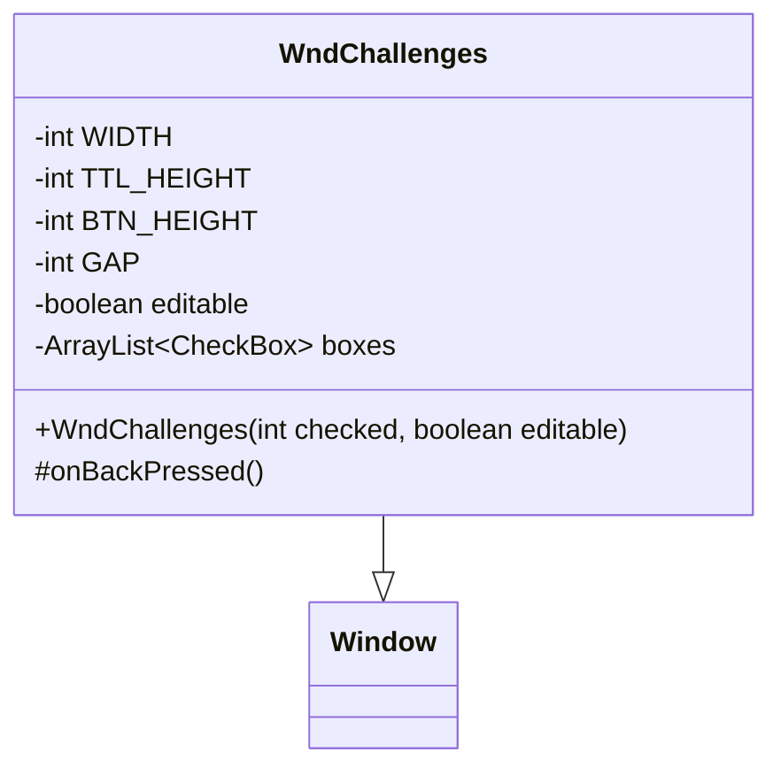

# WndChallenges 类文档

## 1. 基本信息

| 属性 | 值 |
|------|-----|
| **文件路径** | core/src/main/java/com/shatteredpixel/shatteredpixeldungeon/windows/WndChallenges.java |
| **包名** | com.shatteredpixel.shatteredpixeldungeon.windows |
| **类类型** | class |
| **继承关系** | extends Window |
| **代码行数** | 114 |
| **功能概述** | 挑战模式选择窗口 |

## 2. 文件职责说明

WndChallenges 是挑战模式选择窗口，用于在玩家开始新游戏时选择要启用的挑战模式。每个挑战都有复选框和信息按钮，点击信息按钮可查看详细描述。

**主要功能**：
1. **挑战列表显示**：显示所有可用的挑战模式
2. **复选框选择**：支持多选操作，启用/禁用挑战
3. **信息查看**：每个挑战旁边有信息按钮，显示详细描述
4. **状态保存**：返回时自动保存选择到设置

## 3. 结构总览



## 4. 继承与协作关系

### 继承关系
- **父类**：Window（基础窗口类）
- **间接父类**：Component

### 协作关系
| 协作类 | 关系类型 | 协作说明 |
|--------|----------|----------|
| Challenges | 读取 | 获取挑战名称ID和位掩码 |
| SPDSettings | 写入 | 保存挑战选择 |
| Messages | 读取 | 获取本地化文本 |
| CheckBox | 创建 | 创建挑战复选框 |
| IconButton | 创建 | 创建信息按钮 |
| WndMessage | 创建 | 显示挑战描述窗口 |

## 5. 字段与常量详解

### 类常量

| 常量 | 类型 | 值 | 说明 |
|------|------|-----|------|
| `WIDTH` | int | 120 | 窗口宽度 |
| `TTL_HEIGHT` | int | 16 | 标题区域高度 |
| `BTN_HEIGHT` | int | 16 | 按钮高度 |
| `GAP` | int | 1 | 控件间距 |

### 实例字段

| 字段 | 类型 | 说明 |
|------|------|------|
| `editable` | boolean | 是否可编辑 |
| `boxes` | ArrayList<CheckBox> | 复选框列表 |

## 6. 构造与初始化机制

### 构造函数流程

```java
public WndChallenges(int checked, boolean editable) {
    super();
    
    this.editable = editable;
    
    // 1. 创建标题
    RenderedTextBlock title = PixelScene.renderTextBlock(Messages.get(this, "title"), 12);
    title.hardlight(TITLE_COLOR);
    add(title);
    
    // 2. 创建挑战列表
    boxes = new ArrayList<>();
    float pos = TTL_HEIGHT;
    
    for (int i = 0; i < Challenges.NAME_IDS.length; i++) {
        final String challenge = Challenges.NAME_IDS[i];
        
        // 创建复选框
        CheckBox cb = new CheckBox(Messages.titleCase(Messages.get(Challenges.class, challenge)));
        cb.checked((checked & Challenges.MASKS[i]) != 0);
        cb.active = editable;  // 根据editable控制是否可交互
        cb.setRect(0, pos, WIDTH - 16, BTN_HEIGHT);
        add(cb);
        boxes.add(cb);
        
        // 创建信息按钮
        IconButton info = new IconButton(Icons.get(Icons.INFO)) {
            @Override
            protected void onClick() {
                ShatteredPixelDungeon.scene().add(
                    new WndMessage(Messages.get(Challenges.class, challenge + "_desc"))
                );
            }
        };
        info.setRect(cb.right(), pos, 16, BTN_HEIGHT);
        add(info);
        
        pos = cb.bottom();
    }
    
    resize(WIDTH, (int)pos);
}
```

## 7. 方法详解

### 公开方法

#### WndChallenges(int, boolean) - 构造函数
创建挑战选择窗口。

**参数**：
- `checked`：当前启用的挑战位掩码
- `editable`：是否可编辑（false时复选框禁用）

#### onBackPressed() - 返回键处理
```java
@Override
public void onBackPressed() {
    if (editable) {
        // 计算选中的挑战位掩码
        int value = 0;
        for (int i = 0; i < boxes.size(); i++) {
            if (boxes.get(i).checked()) {
                value |= Challenges.MASKS[i];
            }
        }
        // 保存到设置
        SPDSettings.challenges(value);
    }
    super.onBackPressed();
}
```

## 8. 对外暴露能力

### 公开API

| 方法 | 参数 | 返回值 | 说明 |
|------|------|--------|------|
| `WndChallenges(int, boolean)` | 挑战位掩码, 可编辑标志 | 无 | 创建挑战选择窗口 |

## 9. 运行机制与调用链

### 窗口打开流程
```
开始新游戏 → 点击"挑战"按钮
    ↓
创建 WndChallenges(currentChallenges, true)
    ↓
显示挑战列表
    ↓
用户选择挑战
    ↓
按返回键
    ↓
onBackPressed() 保存选择
    ↓
关闭窗口
```

### 查看挑战描述
```
点击挑战旁的信息按钮
    ↓
创建 WndMessage 显示描述
    ↓
用户关闭消息窗口
```

## 10. 资源/配置/国际化关联

### 国际化资源

| 资源键 | 中文翻译 | 说明 |
|--------|----------|------|
| `windows.wndchallenges.title` | 挑战 | 窗口标题 |

### 挑战名称（来自Challenges类）

| 挑战ID | 中文名称 | 说明 |
|--------|----------|------|
| `champion_enemies` | 冠军敌人 | 敌人可能获得特殊能力 |
| `stronger_bosses` | 更强的Boss | Boss获得增强 |
| `no_healing_potions` | 无治疗药水 | 治疗药水被禁用 |
| `no_armor` | 无护甲 | 护甲被禁用 |
| `no_melee` | 无近战 | 近战武器被禁用 |
| `no_food` | 无食物 | 食物被禁用 |
| `no_scrolls` | 无卷轴 | 卷轴被禁用 |
| `no_upgrades` | 无升级 | 升级被禁用 |
| `no_herbal_healing` | 无草药治疗 | 草药治疗被禁用 |

## 11. 使用示例

### 打开挑战选择窗口
```java
// 可编辑模式（开始新游戏时）
ShatteredPixelDungeon.scene().addToFront(new WndChallenges(SPDSettings.challenges(), true));

// 只读模式（查看已启用的挑战）
ShatteredPixelDungeon.scene().addToFront(new WndChallenges(Dungeon.challenges, false));
```

### 获取当前挑战
```java
int challenges = SPDSettings.challenges();
// 检查是否启用了某个挑战
if ((challenges & Challenges.MASKS[0]) != 0) {
    // 第一个挑战已启用
}
```

## 12. 开发注意事项

### 位掩码操作
- 挑战使用位掩码存储，每个挑战对应一个bit
- 使用 `|` 操作启用挑战
- 使用 `&` 操作检查挑战是否启用

### 可编辑状态
- `editable = true`：复选框可交互，返回时保存
- `editable = false`：复选框禁用，仅用于查看

### 布局计算
- 复选框宽度 = WIDTH - 16（为信息按钮留空间）
- 信息按钮宽度 = 16像素

## 13. 修改建议与扩展点

### 扩展点

1. **添加新挑战**：
   - 在 Challenges 类中添加新的 NAME_ID 和 MASK
   - 添加对应的本地化文本

2. **挑战分类**：
   - 可扩展为按难度分类显示
   - 添加挑战预览效果

### 修改建议

1. **挑战预览**：添加挑战启用后的效果预览
2. **挑战推荐**：为新手添加挑战难度提示

## 14. 事实核查清单

- [x] 是否已覆盖全部字段（editable, boxes）
- [x] 是否已覆盖全部常量（WIDTH, TTL_HEIGHT, BTN_HEIGHT, GAP）
- [x] 是否已覆盖全部公开方法（构造函数, onBackPressed）
- [x] 是否已确认继承关系（extends Window）
- [x] 是否已确认协作关系（Challenges, SPDSettings等）
- [x] 是否已验证中文翻译来源（windows_zh.properties）
- [x] 是否已确认位掩码操作逻辑
- [x] 是否已确认可编辑状态控制
