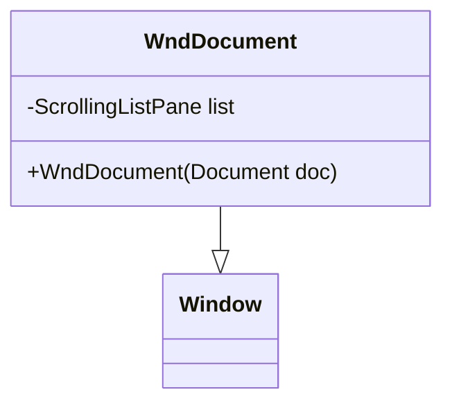

# WndDocument 类文档

## 1. 基本信息

| 属性 | 值 |
|------|-----|
| **文件路径** | core/src/main/java/com/shatteredpixel/shatteredpixeldungeon/windows/WndDocument.java |
| **包名** | com.shatteredpixel.shatteredpixeldungeon.windows |
| **类类型** | class |
| **继承关系** | extends Window |
| **代码行数** | 75 |
| **功能概述** | 文档/书籍页面列表查看器 |

## 2. 文件职责说明

WndDocument 是文档/书籍页面列表查看器，用于显示玩家已找到和未找到的文档页面，并允许查看具体页面内容。

**主要功能**：
1. **页面列表显示**：显示文档的所有页面
2. **发现状态标识**：区分已发现和未发现的页面
3. **页面内容查看**：点击已发现页面查看完整内容
4. **已读状态追踪**：标记已读页面

## 3. 结构总览



## 4. 继承与协作关系

### 继承关系
- **父类**：Window（基础窗口类）
- **间接父类**：Component

### 协作关系
| 协作类 | 关系类型 | 协作说明 |
|--------|----------|----------|
| Document | 读取 | 获取文档页面信息 |
| ScrollingListPane | 创建 | 创建滚动列表 |
| WndStory | 创建 | 显示页面内容 |
| Messages | 读取 | 获取本地化文本 |

## 5. 字段与常量详解

### 实例字段

| 字段 | 类型 | 说明 |
|------|------|------|
| `list` | ScrollingListPane | 滚动列表组件 |

## 6. 构造与初始化机制

### 构造函数流程

```java
public WndDocument(Document doc) {
    // 1. 创建滚动列表
    list = new ScrollingListPane();
    add(list);
    
    // 2. 添加文档标题
    list.addTitle(Messages.titleCase(doc.title()));
    
    // 3. 遍历所有页面
    for (String page : doc.pageNames()) {
        boolean found = doc.isPageFound(page);
        
        // 创建列表项
        ScrollingListPane.ListItem item = new ScrollingListPane.ListItem(
            doc.pageSprite(),
            null,
            found ? Messages.titleCase(doc.pageTitle(page)) : Messages.titleCase(Messages.get(this, "missing"))
        ) {
            @Override
            public boolean onClick(float x, float y) {
                if (inside(x, y) && found) {
                    // 打开故事窗口显示页面内容
                    ShatteredPixelDungeon.scene().addToFront(new WndStory(
                        doc.pageSprite(page),
                        doc.pageTitle(page),
                        doc.pageBody(page)
                    ));
                    doc.readPage(page);  // 标记为已读
                    hardlight(Window.WHITE);  // 更新颜色
                    return true;
                }
                return false;
            }
        };
        
        // 4. 设置颜色
        if (!found) {
            item.hardlight(0x999999);  // 未发现：灰色
            item.hardlightIcon(0x999999);
        } else if (!doc.isPageRead(page)) {
            item.hardlight(Window.TITLE_COLOR);  // 未读：标题色
        }
        // 已读：白色（默认）
        
        list.addItem(item);
    }
    
    // 5. 调整窗口大小
    resize(120, Math.min(144, (int)list.content().height()));
    list.setRect(0, 0, width, height);
}
```

## 7. 方法详解

### 公开方法

#### WndDocument(Document) - 构造函数
创建文档窗口，显示指定文档的所有页面。

### 页面状态颜色编码

| 状态 | 颜色 | 说明 |
|------|------|------|
| 未发现 | 0x999999（灰色） | 页面尚未找到 |
| 已发现未读 | TITLE_COLOR（标题色） | 页面已找到但未阅读 |
| 已读 | WHITE（白色） | 页面已阅读 |

## 8. 对外暴露能力

### 公开API

| 方法 | 参数 | 返回值 | 说明 |
|------|------|--------|------|
| `WndDocument(Document)` | 文档对象 | 无 | 创建文档窗口 |

## 9. 运行机制与调用链

### 窗口打开流程
```
用户打开文档
    ↓
创建 WndDocument(doc)
    ↓
创建滚动列表
    ↓
添加文档标题
    ↓
遍历页面创建列表项
    ↓
设置页面状态颜色
    ↓
显示窗口
```

### 页面查看流程
```
点击已发现页面
    ↓
onClick() 触发
    ↓
创建 WndStory 显示内容
    ↓
标记页面为已读
    ↓
更新列表项颜色
```

## 10. 资源/配置/国际化关联

### 国际化资源

| 资源键 | 中文翻译 | 说明 |
|--------|----------|------|
| `windows.wnddocument.missing` | 缺页 | 未发现页面的显示文本 |

### 文档数据来源

Document 对象提供：
- `doc.title()` - 文档标题
- `doc.pageNames()` - 页面名称列表
- `doc.pageSprite()` - 页面图标
- `doc.pageTitle(page)` - 页面标题
- `doc.pageBody(page)` - 页面内容
- `doc.isPageFound(page)` - 页面是否已发现
- `doc.isPageRead(page)` - 页面是否已阅读
- `doc.readPage(page)` - 标记页面为已读

## 11. 使用示例

### 打开文档窗口
```java
// 打开冒险者指南
Document guide = Document.ADVENTURERS_GUIDE;
ShatteredPixelDungeon.scene().addToFront(new WndDocument(guide));

// 打开炼金指南
Document alchemy = Document.ALCHEMY_GUIDE;
ShatteredPixelDungeon.scene().addToFront(new WndDocument(alchemy));
```

### 检查文档完成度
```java
Document doc = Document.ADVENTURERS_GUIDE;
int found = 0;
for (String page : doc.pageNames()) {
    if (doc.isPageFound(page)) found++;
}
// 计算完成百分比
```

## 12. 开发注意事项

### 页面状态管理
- 未发现页面显示"缺页"
- 点击未发现页面无响应
- 已读页面颜色变为白色

### 窗口尺寸
- 固定宽度：120像素
- 最大高度：144像素
- 内容超出时启用滚动

### 列表项交互
- 仅已发现页面可点击
- 点击后打开 WndStory 窗口
- 自动标记为已读

## 13. 修改建议与扩展点

### 扩展点

1. **添加进度显示**：显示已发现/总页面数
2. **添加搜索功能**：搜索页面内容
3. **添加书签功能**：标记重要页面

### 修改建议

1. **页面预览**：添加页面内容预览
2. **分类显示**：按章节分类显示页面

## 14. 事实核查清单

- [x] 是否已覆盖全部字段（list）
- [x] 是否已覆盖全部公开方法（构造函数）
- [x] 是否已确认继承关系（extends Window）
- [x] 是否已确认协作关系（Document, ScrollingListPane, WndStory等）
- [x] 是否已验证中文翻译来源（windows_zh.properties）
- [x] 是否已确认页面状态颜色编码
- [x] 是否已确认页面点击交互逻辑
