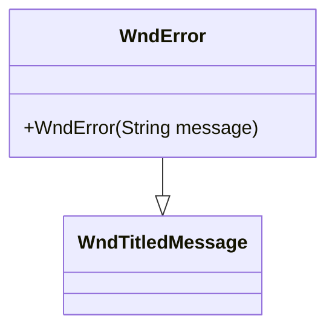

# WndError 类文档

## 1. 基本信息

| 属性 | 值 |
|------|-----|
| **文件路径** | core/src/main/java/com/shatteredpixel/shatteredpixeldungeon/windows/WndError.java |
| **包名** | com.shatteredpixel.shatteredpixeldungeon.windows |
| **类类型** | class |
| **继承关系** | extends WndTitledMessage |
| **代码行数** | 33 |
| **功能概述** | 错误消息对话框 |

## 2. 文件职责说明

WndError 是错误消息对话框，继承自 WndTitledMessage，专门用于显示游戏中的错误信息。它使用警告图标和标准错误消息格式。

**主要功能**：
1. **错误信息显示**：显示错误消息文本
2. **警告图标**：使用标准警告图标
3. **统一格式**：遵循游戏错误处理的标准模式

## 3. 结构总览



## 4. 继承与协作关系

### 继承关系
- **父类**：WndTitledMessage（带标题的消息窗口）
- **间接父类**：Window → Component

### 协作关系
| 协作类 | 关系类型 | 协作说明 |
|--------|----------|----------|
| Icons | 读取 | 获取警告图标 |
| Messages | 读取 | 获取本地化文本 |
| WndTitledMessage | 继承 | 使用父类的消息显示功能 |

## 5. 字段与常量详解

无实例字段或类常量。所有功能通过继承实现。

## 6. 构造与初始化机制

### 构造函数

```java
public WndError(String message) {
    // 调用父类构造函数
    // 参数1: 警告图标
    // 参数2: "错误"标题
    // 参数3: 错误消息内容
    super(Icons.WARNING.get(), Messages.get(WndError.class, "title"), message);
}
```

## 7. 方法详解

### 公开方法

#### WndError(String) - 构造函数
创建错误对话框，显示指定的错误消息。

**参数**：
- `message`：错误消息文本

**实现细节**：
- 图标：Icons.WARNING（警告图标）
- 标题：Messages.get(WndError.class, "title") → "错误"
- 内容：传入的 message 参数

## 8. 对外暴露能力

### 公开API

| 方法 | 参数 | 返回值 | 说明 |
|------|------|--------|------|
| `WndError(String)` | 错误消息 | 无 | 创建错误对话框 |

## 9. 运行机制与调用链

### 窗口打开流程
```
游戏发生错误
    ↓
创建 WndError(message)
    ↓
调用父类 WndTitledMessage 构造函数
    ↓
显示警告图标和错误消息
    ↓
用户点击关闭
```

### 继承链
```
WndError
    ↓ extends
WndTitledMessage
    ↓ extends
Window
    ↓ extends
Component
```

## 10. 资源/配置/国际化关联

### 国际化资源

| 资源键 | 中文翻译 | 说明 |
|--------|----------|------|
| `windows.wnderror.title` | 错误 | 窗口标题 |

### 图标资源

| 图标 | 说明 |
|------|------|
| Icons.WARNING | 警告图标（黄色感叹号） |

## 11. 使用示例

### 显示错误消息
```java
// 显示简单错误
ShatteredPixelDungeon.scene().addToFront(new WndError("发生了一个错误"));

// 显示格式化错误
String errorMsg = "无法加载存档：" + filename;
ShatteredPixelDungeon.scene().addToFront(new WndError(errorMsg));
```

### 在异常处理中使用
```java
try {
    // 尝试执行操作
    performAction();
} catch (Exception e) {
    // 显示错误消息
    ShatteredPixelDungeon.scene().addToFront(new WndError("操作失败：" + e.getMessage()));
}
```

## 12. 开发注意事项

### 简洁实现
- 整个类仅33行代码
- 所有功能通过继承实现
- 仅定义构造函数

### 标准格式
- 使用统一的警告图标
- 使用统一的标题格式
- 确保错误消息的一致性

### 父类功能
- WndTitledMessage 提供完整的消息显示功能
- 包括图标、标题、消息文本
- 支持自动换行和滚动

## 13. 修改建议与扩展点

### 扩展点

1. **错误类型**：可扩展支持不同类型的错误（警告、严重错误等）
2. **错误代码**：添加错误代码支持

### 修改建议

1. **错误日志**：自动记录错误到日志
2. **错误报告**：添加错误报告功能

## 14. 事实核查清单

- [x] 是否已覆盖全部公开方法（构造函数）
- [x] 是否已确认继承关系（extends WndTitledMessage）
- [x] 是否已确认协作关系（Icons, Messages）
- [x] 是否已验证中文翻译来源（windows_zh.properties）
- [x] 是否已确认图标使用（Icons.WARNING）
- [x] 是否已确认父类功能继承
