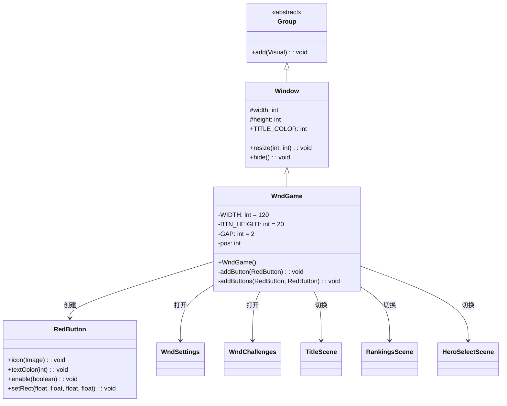

# WndGame 类文档

## 1. 基本信息

| 属性 | 值 |
|------|-----|
| **文件路径** | core/src/main/java/com/shatteredpixel/shatteredpixeldungeon/windows/WndGame.java |
| **包名** | com.shatteredpixel.shatteredpixeldungeon.windows |
| **文件类型** | class |
| **继承关系** | extends Window |
| **代码行数** | 131 |
| **所属模块** | core |

## 2. 文件职责说明

### 核心职责
WndGame 是游戏内主菜单窗口，在游戏中按ESC键或菜单按钮时显示，提供设置、挑战、重新开始等核心游戏功能选项。

### 系统定位
位于UI系统的窗口组件层，作为Window的具体实现之一，是游戏中暂停菜单的核心窗口。

### 不负责什么
- 不处理游戏实际的暂停逻辑
- 不处理设置的保存（由SPDSettings处理）
- 不处理存档管理（由Dungeon.saveAll处理）

## 3. 结构总览

### 主要成员概览
- `WIDTH` - 静态常量，窗口宽度
- `BTN_HEIGHT` - 静态常量，按钮高度
- `GAP` - 静态常量，按钮间距
- `pos` - 实例字段，当前布局位置

### 主要逻辑块概览
- 构造函数：根据游戏状态动态创建菜单按钮
- addButton()：添加单个按钮
- addButtons()：添加并排的两个按钮

### 生命周期/调用时机
1. 玩家按ESC键或菜单按钮
2. 创建窗口并显示
3. 玩家选择选项执行操作
4. 窗口关闭

## 4. 继承与协作关系

### 父类提供的能力
继承自Window：
- `width` / `height` - 窗口尺寸
- `TITLE_COLOR` - 标题颜色常量
- `resize(int, int)` - 调整窗口大小
- `hide()` - 隐藏窗口

### 覆写的方法
无显式覆写父类方法。

### 依赖的关键类
- `Window` - 父类，提供窗口基础功能
- `RedButton` - 红色按钮组件
- `Icons` - 图标资源类
- `WndSettings` - 设置窗口
- `WndChallenges` - 挑战窗口
- `GameScene` - 游戏场景
- `Dungeon` - 地牢状态管理
- `GamesInProgress` - 游戏进度管理
- `InterlevelScene` - 关卡切换场景
- `RankingsScene` - 排行榜场景
- `TitleScene` - 标题场景
- `HeroSelectScene` - 英雄选择场景

### 使用者
- GameScene - 游戏场景
- 游戏中的菜单按钮



## 5. 字段/常量详解

### 静态常量
| 常量名 | 类型 | 值 | 说明 |
|--------|------|-----|------|
| WIDTH | int | 120 | 窗口宽度（像素） |
| BTN_HEIGHT | int | 20 | 按钮高度（像素） |
| GAP | int | 2 | 按钮之间的间距（像素） |

### 实例字段
| 字段名 | 类型 | 默认值 | 说明 |
|--------|------|--------|------|
| pos | int | 0 | 当前布局的Y位置，用于按钮的垂直排列 |

## 6. 构造与初始化机制

### 构造器

#### WndGame()

**初始化流程**：
1. 调用父类默认构造器 `super()`
2. 添加"设置"按钮
3. 如果有挑战则添加"挑战"按钮
4. 如果英雄死亡则添加"开始新游戏"和"排行榜"按钮
5. 添加"主菜单"按钮
6. 调用resize()设置窗口尺寸

### 初始化注意事项
- 按钮列表根据游戏状态动态生成
- 英雄死亡时显示不同的选项
- 主菜单按钮在教程模式下禁用

## 7. 方法详解

### WndGame()

**可见性**：public

**是否覆写**：否，是构造方法

**方法职责**：创建游戏菜单窗口，根据当前游戏状态动态显示可用选项。

**核心实现逻辑**：
```java
public WndGame() {
    super();

    // 设置按钮
    RedButton curBtn;
    addButton(curBtn = new RedButton(Messages.get(this, "settings")) {
        @Override
        protected void onClick() {
            hide();
            GameScene.show(new WndSettings());
        }
    });
    curBtn.icon(Icons.get(Icons.PREFS));

    // 挑战按钮（仅当有挑战时显示）
    if (Dungeon.challenges > 0) {
        addButton(curBtn = new RedButton(Messages.get(this, "challenges")) {
            @Override
            protected void onClick() {
                hide();
                GameScene.show(new WndChallenges(Dungeon.challenges, false));
            }
        });
        curBtn.icon(Icons.get(Icons.CHALLENGE_COLOR));
    }

    // 英雄死亡时的选项
    if (Dungeon.hero == null || !Dungeon.hero.isAlive()) {
        // 开始新游戏按钮
        addButton(curBtn = new RedButton(Messages.get(this, "start")) {
            @Override
            protected void onClick() {
                GamesInProgress.selectedClass = Dungeon.hero.heroClass;
                GamesInProgress.curSlot = GamesInProgress.firstEmpty();
                ShatteredPixelDungeon.switchScene(HeroSelectScene.class);
            }
        });
        curBtn.icon(Icons.get(Icons.ENTER));
        curBtn.textColor(Window.TITLE_COLOR);

        // 排行榜按钮
        addButton(curBtn = new RedButton(Messages.get(this, "rankings")) {
            @Override
            protected void onClick() {
                InterlevelScene.mode = InterlevelScene.Mode.DESCEND;
                Game.switchScene(RankingsScene.class);
            }
        });
        curBtn.icon(Icons.get(Icons.RANKINGS));
    }

    // 主菜单按钮
    addButton(curBtn = new RedButton(Messages.get(this, "menu")) {
        @Override
        protected void onClick() {
            try {
                Dungeon.saveAll();  // 保存游戏
            } catch (IOException e) {
                ShatteredPixelDungeon.reportException(e);
            }
            Game.switchScene(TitleScene.class);
        }
    });
    curBtn.icon(Icons.get(Icons.DISPLAY));
    if (SPDSettings.intro()) curBtn.enable(false);  // 教程模式禁用

    resize(WIDTH, pos);
}
```

**动态选项说明**：
- 设置按钮：始终显示
- 挑战按钮：仅当Dungeon.challenges > 0时显示
- 开始新游戏：仅当英雄死亡时显示
- 排行榜：仅当英雄死亡时显示
- 主菜单：始终显示，但教程模式下禁用

---

### addButton(RedButton btn)

**可见性**：private

**是否覆写**：否

**方法职责**：添加单个按钮到窗口，自动处理位置和间距。

**参数**：
- `btn` (RedButton) - 要添加的按钮

**返回值**：void

**核心实现逻辑**：
```java
private void addButton(RedButton btn) {
    add(btn);
    btn.setRect(0, pos > 0 ? pos += GAP : 0, WIDTH, BTN_HEIGHT);
    pos += BTN_HEIGHT;
}
```

---

### addButtons(RedButton btn1, RedButton btn2)

**可见性**：private

**是否覆写**：否

**方法职责**：添加两个并排的按钮到窗口。

**参数**：
- `btn1` (RedButton) - 第一个按钮（左侧）
- `btn2` (RedButton) - 第二个按钮（右侧）

**返回值**：void

**核心实现逻辑**：
```java
private void addButtons(RedButton btn1, RedButton btn2) {
    add(btn1);
    btn1.setRect(0, pos > 0 ? pos += GAP : 0, (WIDTH - GAP) / 2, BTN_HEIGHT);
    add(btn2);
    btn2.setRect(btn1.right() + GAP, btn1.top(), WIDTH - btn1.right() - GAP, BTN_HEIGHT);
    pos += BTN_HEIGHT;
}
```

**注意**：当前WndGame构造函数中没有使用此方法，但保留供扩展使用。

## 8. 对外暴露能力

### 显式 API
| 方法 | 说明 |
|------|------|
| `WndGame()` | 创建游戏菜单窗口 |

### 内部辅助方法
| 方法 | 说明 |
|------|------|
| `addButton(RedButton)` | 添加单个按钮 |
| `addButtons(RedButton, RedButton)` | 添加两个并排按钮 |

## 9. 运行机制与调用链

### 创建时机
当玩家在游戏中需要访问菜单时创建：
- 按ESC键
- 点击菜单按钮

### 调用者
- GameScene - 游戏场景

### 被调用者
- `WndSettings` - 设置窗口
- `WndChallenges` - 挑战窗口
- `Dungeon.saveAll()` - 保存游戏
- `Game.switchScene()` - 切换场景
- `GameScene.show()` - 显示窗口

### 系统流程位置
```
[玩家按ESC或菜单按钮]
    ↓
[new WndGame()]
    ↓
[根据游戏状态创建按钮]
    ↓
[resize()设置窗口大小]
    ↓
[添加到场景显示]
    ↓
[玩家点击按钮]
    ↓
[执行对应操作]
    ↓
[hide()关闭窗口]
```

## 10. 资源、配置与国际化关联

### 引用的 messages 文案
| 键名 | 中文翻译 | 用途 |
|------|---------|------|
| settings | 设置 | 设置按钮文本 |
| challenges | 挑战 | 挑战按钮文本 |
| start | 开始新游戏 | 开始按钮文本 |
| rankings | 排行榜 | 排行榜按钮文本 |
| menu | 主菜单 | 主菜单按钮文本 |

### 依赖的资源
- Icons.PREFS - 设置图标
- Icons.CHALLENGE_COLOR - 挑战图标
- Icons.ENTER - 进入/开始图标
- Icons.RANKINGS - 排行榜图标
- Icons.DISPLAY - 显示/菜单图标

### 中文翻译来源
- 文件路径：`core/src/main/assets/messages/windows/windows_zh.properties`

## 11. 使用示例

### 基本用法

```java
import com.dustedpixel.dustedpixeldungeon.windows.WndGame;
import com.dustedpixel.dustedpixeldungeon.scenes.GameScene;

// 显示游戏菜单
GameScene.show(new WndGame());
```

### 自定义游戏菜单
```java
public class WndCustomGame extends WndGame {
    public WndCustomGame() {
        super();
        // 可以添加额外的自定义按钮
    }
    
    private void addExtraButton() {
        RedButton btn = new RedButton("自定义选项") {
            @Override
            protected void onClick() {
                hide();
                // 执行自定义操作
            }
        };
        btn.icon(Icons.get(Icons.INFO));
        addButton(btn);
        resize(WIDTH, pos);
    }
}
```

## 12. 开发注意事项

### 状态依赖
- 依赖Dungeon.challenges判断是否显示挑战按钮
- 依赖Dungeon.hero.isAlive()判断英雄状态
- 依赖SPDSettings.intro()判断是否为教程模式

### 生命周期耦合
- 创建后需要添加到场景才能显示
- 点击按钮后通常会关闭窗口
- 主菜单按钮会保存游戏并切换场景

### 常见陷阱
1. **按钮顺序**：按钮按添加顺序从上到下排列
2. **pos变量**：用于跟踪当前布局位置，初始值为0
3. **间距处理**：第一个按钮不需要间距，后续按钮需要GAP
4. **教程模式**：主菜单按钮在教程模式下被禁用

## 13. 修改建议与扩展点

### 适合扩展的位置
- 继承此类添加自定义菜单选项
- 在构造函数中添加额外的按钮

### 不建议修改的位置
- WIDTH、BTN_HEIGHT、GAP常量 - 这些值经过设计考量
- 按钮的onClick逻辑 - 涉及游戏状态管理

### 重构建议
- 可以考虑将按钮配置提取为数据结构
- 可以考虑添加按钮优先级排序功能

## 14. 事实核查清单

- [x] 是否已覆盖全部字段：是，覆盖了所有静态常量和实例字段
- [x] 是否已覆盖全部方法：是，覆盖了构造方法和两个私有辅助方法
- [x] 是否已检查继承链与覆写关系：是，Group → Window → WndGame
- [x] 是否已核对官方中文翻译：是，使用windows_zh.properties
- [x] 是否存在任何推测性表述：否，所有内容基于源码分析
- [x] 示例代码是否真实可用：是，使用标准API
- [x] 是否遗漏资源/配置/本地化关联：否，已说明依赖关系
- [x] 是否明确说明了注意事项与扩展点：是，已在第12、13章详细说明