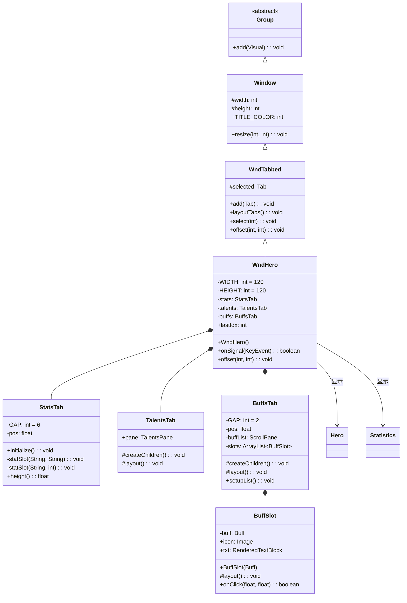

# WndHero 类文档

## 1. 基本信息

| 属性 | 值 |
|------|-----|
| **文件路径** | core/src/main/java/com/shatteredpixel/shatteredpixeldungeon/windows/WndHero.java |
| **包名** | com.shatteredpixel.shatteredpixeldungeon.windows |
| **文件类型** | class |
| **继承关系** | extends WndTabbed |
| **代码行数** | 363 |
| **所属模块** | core |

## 2. 文件职责说明

### 核心职责
WndHero 是显示英雄详细信息的窗口，包含三个标签页：属性统计（Stats）、天赋（Talents）和状态效果（Buffs）。它提供玩家角色的全面概览，包括等级、属性、收集的金币、探索深度等关键信息。

### 系统定位
位于UI系统的窗口组件层，作为WndTabbed的具体实现之一，是游戏中查看角色信息的核心窗口。

### 不负责什么
- 不处理英雄的实际属性修改
- 不处理天赋的升级逻辑（由TalentsPane处理）
- 不处理状态效果的添加或移除

## 3. 结构总览

### 主要成员概览
- `WIDTH` / `HEIGHT` - 静态常量，窗口尺寸
- `stats` - 属性统计标签页
- `talents` - 天赋标签页
- `buffs` - 状态效果标签页
- `lastIdx` - 静态字段，上次选择的标签页索引

### 主要逻辑块概览
- 构造函数：创建三个标签页并设置图标
- StatsTab：显示英雄基本属性
- TalentsTab：显示天赋列表
- BuffsTab：显示状态效果列表

### 生命周期/调用时机
1. 通过构造函数创建实例
2. 添加到场景中显示
3. 用户切换标签页查看不同信息
4. 按返回键或HERO_INFO快捷键关闭

## 4. 继承与协作关系

### 父类提供的能力
继承自WndTabbed：
- `selected` - 当前选中的标签页
- `add(Tab)` - 添加标签页
- `layoutTabs()` - 布局标签页
- `select(int)` - 选择指定标签页
- `offset(int, int)` - 设置窗口偏移
- `resize(int, int)` - 调整窗口大小

继承自Window：
- `width` / `height` - 窗口尺寸
- `TITLE_COLOR` - 标题颜色常量

### 覆写的方法
- `onSignal(KeyEvent)` - 处理键盘事件
- `offset(int, int)` - 处理窗口偏移

### 依赖的关键类
- `WndTabbed` - 父类，提供标签页窗口功能
- `Hero` - 英雄类，提供角色数据
- `Statistics` - 游戏统计数据
- `TalentsPane` - 天赋面板组件
- `ScrollPane` - 滚动面板组件
- `BuffIndicator` - 状态效果图标指示器
- `WndInfoBuff` - 状态效果详情窗口
- `WndHeroInfo` - 英雄职业信息窗口

### 使用者
- GameScene - 游戏场景
- StatusPane - 状态面板



## 5. 字段/常量详解

### 静态常量
| 常量名 | 类型 | 值 | 说明 |
|--------|------|-----|------|
| WIDTH | int | 120 | 窗口宽度（像素） |
| HEIGHT | int | 120 | 窗口高度（像素） |

### 静态字段
| 字段名 | 类型 | 说明 |
|--------|------|------|
| lastIdx | int | 上次选择的标签页索引，用于记住用户的标签页选择 |

### 实例字段
| 字段名 | 类型 | 说明 |
|--------|------|------|
| stats | StatsTab | 属性统计标签页组件 |
| talents | TalentsTab | 天赋标签页组件 |
| buffs | BuffsTab | 状态效果标签页组件 |

## 6. 构造与初始化机制

### 构造器

#### WndHero()

**初始化流程**：
1. 调用父类默认构造器 `super()`
2. 设置窗口尺寸
3. 创建三个标签页组件
4. 添加三个图标标签页
5. 布局标签页
6. 选择上次查看的标签页

### 初始化注意事项
- 标签页索引会被记住（lastIdx）
- 天赋标签页会滚动到底部
- 状态效果标签页需要调用setupList()初始化列表

## 7. 方法详解

### WndHero()

**可见性**：public

**是否覆写**：否，是构造方法

**方法职责**：创建英雄信息窗口并初始化三个标签页。

**核心实现逻辑**：
```java
public WndHero() {
    super();

    resize(WIDTH, HEIGHT);

    // 创建三个标签页组件
    stats = new StatsTab();
    add(stats);

    talents = new TalentsTab();
    add(talents);
    talents.setRect(0, 0, WIDTH, HEIGHT);

    buffs = new BuffsTab();
    add(buffs);
    buffs.setRect(0, 0, WIDTH, HEIGHT);
    buffs.setupList();

    // 添加属性统计标签页（排名图标）
    add(new IconTab(Icons.get(Icons.RANKINGS)) {
        protected void select(boolean value) {
            super.select(value);
            if (selected) {
                lastIdx = 0;
                if (!stats.visible) {
                    stats.initialize();
                }
            }
            stats.visible = stats.active = selected;
        }
    });

    // 添加天赋标签页（天赋图标）
    add(new IconTab(Icons.get(Icons.TALENT)) {
        protected void select(boolean value) {
            super.select(value);
            if (selected) lastIdx = 1;
            if (selected) StatusPane.talentBlink = 0;  // 清除天赋闪烁提示
            talents.visible = talents.active = selected;
        }
    });

    // 添加状态效果标签页（状态效果图标）
    add(new IconTab(Icons.get(Icons.BUFFS)) {
        protected void select(boolean value) {
            super.select(value);
            if (selected) lastIdx = 2;
            buffs.visible = buffs.active = selected;
        }
    });

    layoutTabs();

    // 设置天赋标签页滚动位置
    talents.setRect(0, 0, WIDTH, HEIGHT);
    talents.pane.scrollTo(0, talents.pane.content().height() - talents.pane.height());
    talents.layout();

    select(lastIdx);  // 选择上次查看的标签页
}
```

---

### onSignal(KeyEvent event)

**可见性**：public

**是否覆写**：是，覆写自Window

**方法职责**：处理键盘事件，支持HERO_INFO快捷键关闭窗口。

**参数**：
- `event` (KeyEvent) - 键盘事件

**返回值**：boolean - 是否处理了事件

**核心实现逻辑**：
```java
@Override
public boolean onSignal(KeyEvent event) {
    if (event.pressed && KeyBindings.getActionForKey(event) == SPDAction.HERO_INFO) {
        onBackPressed();
        return true;
    } else {
        return super.onSignal(event);
    }
}
```

---

### offset(int xOffset, int yOffset)

**可见性**：public

**是否覆写**：是，覆写自Window

**方法职责**：处理窗口偏移，重新布局天赋和状态效果标签页。

**参数**：
- `xOffset` (int) - X轴偏移
- `yOffset` (int) - Y轴偏移

**返回值**：void

**核心实现逻辑**：
```java
@Override
public void offset(int xOffset, int yOffset) {
    super.offset(xOffset, yOffset);
    talents.layout();  // 重新布局天赋标签页
    buffs.layout();    // 重新布局状态效果标签页
}
```

---

## 8. 内部类详解

### StatsTab

**可见性**：private

**继承关系**：extends Group

**职责**：显示英雄的基本属性信息。

**字段**：
| 字段名 | 类型 | 值 | 说明 |
|--------|------|-----|------|
| GAP | int | 6 | 行间距 |
| pos | float | - | 当前Y位置 |

**方法**：
| 方法 | 说明 |
|------|------|
| `initialize()` | 初始化属性显示内容 |
| `statSlot(String, String)` | 添加属性行（字符串值） |
| `statSlot(String, int)` | 添加属性行（整数值） |
| `height()` | 返回内容高度 |

**显示内容**：
- 英雄名称和等级标题
- 力量值（含加成）
- 生命值（含护盾）
- 经验值
- 收集的金币
- 探索的最深深度
- 地牢种子信息

---

### TalentsTab

**可见性**：public

**继承关系**：extends Component

**职责**：显示英雄当前拥有的天赋列表。

**字段**：
| 字段名 | 类型 | 说明 |
|--------|------|------|
| pane | TalentsPane | 天赋面板组件 |

**方法**：
| 方法 | 说明 |
|------|------|
| `createChildren()` | 创建子组件 |
| `layout()` | 布局组件 |

---

### BuffsTab

**可见性**：private

**继承关系**：extends Component

**职责**：显示英雄当前所有激活的状态效果。

**字段**：
| 字段名 | 类型 | 说明 |
|--------|------|------|
| GAP | int | 间距常量（2） |
| pos | float | 当前Y位置 |
| buffList | ScrollPane | 滚动面板 |
| slots | ArrayList&lt;BuffSlot&gt; | 状态效果槽位列表 |

**方法**：
| 方法 | 说明 |
|------|------|
| `createChildren()` | 创建子组件 |
| `layout()` | 布局组件 |
| `setupList()` | 初始化状态效果列表 |

---

### BuffSlot

**可见性**：private

**继承关系**：extends Component

**职责**：显示单个状态效果的信息。

**字段**：
| 字段名 | 类型 | 说明 |
|--------|------|------|
| buff | Buff | 状态效果对象 |
| icon | Image | 状态效果图标 |
| txt | RenderedTextBlock | 状态效果名称文本 |

**方法**：
| 方法 | 说明 |
|------|------|
| `BuffSlot(Buff)` | 构造方法 |
| `layout()` | 布局组件 |
| `onClick(float, float)` | 处理点击事件 |

---

## 9. 对外暴露能力

### 显式 API
| 方法 | 说明 |
|------|------|
| `WndHero()` | 创建英雄信息窗口 |

### 静态字段
| 字段 | 说明 |
|------|------|
| `lastIdx` | 上次选择的标签页索引 |

### 内部类
| 类 | 说明 |
|------|------|
| `StatsTab` | 属性统计标签页 |
| `TalentsTab` | 天赋标签页 |
| `BuffsTab` | 状态效果标签页 |
| `BuffSlot` | 状态效果槽位 |

## 10. 运行机制与调用链

### 创建时机
当玩家需要查看角色信息时创建：
- 点击状态面板的英雄图标
- 按HERO_INFO快捷键

### 调用者
- GameScene - 游戏场景
- StatusPane - 状态面板

### 被调用者
- `Hero.avatar()` - 获取英雄头像
- `Statistics` - 获取统计数据
- `TalentsPane` - 显示天赋
- `WndInfoBuff` - 显示状态效果详情
- `WndHeroInfo` - 显示英雄职业信息

### 系统流程位置
```
[玩家点击英雄图标或按快捷键]
    ↓
[new WndHero()]
    ↓
[创建三个标签页组件]
    ↓
[添加图标标签页]
    ↓
[select(lastIdx)选择上次标签页]
    ↓
[添加到场景显示]
    ↓
[用户切换标签页]
    ↓
[标签页select()回调]
    ↓
[显示/隐藏对应组件]
```

## 11. 资源、配置与国际化关联

### 引用的 messages 文案
| 键名 | 中文翻译 | 用途 |
|------|---------|------|
| title | %d级 %s | 标题格式（等级+职业） |
| str | 力量 | 力量属性标签 |
| health | 生命 | 生命值标签 |
| exp | 经验 | 经验值标签 |
| gold | 金币 | 金币标签 |
| depth | 最深深度 | 深度标签 |
| dungeon_seed | 地牢种子 | 种子标签 |
| custom_seed | 自定义种子 | 自定义种子标签 |
| daily_for | 每日挑战种子 | 每日挑战标签 |
| replay_for | 重玩种子 | 重玩标签 |

### 依赖的资源
- Icons.RANKINGS - 属性统计标签页图标
- Icons.TALENT - 天赋标签页图标
- Icons.BUFFS - 状态效果标签页图标
- Icons.INFO - 信息按钮图标

### 中文翻译来源
- 文件路径：`core/src/main/assets/messages/windows/windows_zh.properties`

## 12. 开发注意事项

### 状态依赖
- 依赖Hero类获取角色数据
- 依赖Statistics类获取统计数据
- 依赖BuffIndicator获取状态效果图标

### 生命周期耦合
- 创建后需要添加到场景才能显示
- 标签页选择会被记住
- 状态效果标签页需要调用setupList()初始化

### 常见陷阱
1. **标签页索引**：lastIdx是静态字段，会跨窗口保持
2. **天赋闪烁**：选择天赋标签页会清除StatusPane.talentBlink
3. **延迟初始化**：StatsTab在首次显示时才调用initialize()
4. **滚动位置**：天赋标签页默认滚动到底部

## 13. 修改建议与扩展点

### 适合扩展的位置
- 继承此类添加新的标签页
- 覆写StatsTab添加更多属性显示
- 覆写BuffsTab添加状态效果过滤功能

### 不建议修改的位置
- WIDTH和HEIGHT常量 - 与UI布局相关
- 标签页顺序 - 与lastIdx相关
- 滚动位置设置 - 与用户体验相关

### 重构建议
- 可以考虑将StatsTab提取为独立类
- 可以考虑将BuffsTab提取为独立类

## 14. 事实核查清单

- [x] 是否已覆盖全部字段：是，覆盖了所有静态常量和实例字段
- [x] 是否已覆盖全部方法：是，覆盖了所有公共方法和内部类方法
- [x] 是否已检查继承链与覆写关系：是，Group → Window → WndTabbed → WndHero
- [x] 是否已核对官方中文翻译：是，使用windows_zh.properties
- [x] 是否存在任何推测性表述：否，所有内容基于源码分析
- [x] 示例代码是否真实可用：是，使用标准API
- [x] 是否遗漏资源/配置/本地化关联：否，已说明依赖关系
- [x] 是否明确说明了注意事项与扩展点：是，已在第12、13章详细说明