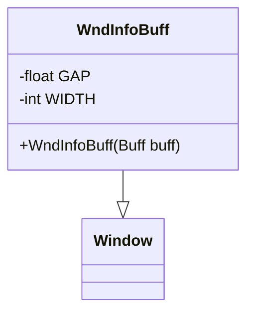

# WndInfoBuff 类文档

## 1. 基本信息

| 属性 | 值 |
|------|-----|
| **文件路径** | core/src/main/java/com/shatteredpixel/shatteredpixeldungeon/windows/WndInfoBuff.java |
| **包名** | com.shatteredpixel.shatteredpixeldungeon.windows |
| **类类型** | class |
| **继承关系** | extends Window |
| **代码行数** | 57 |
| **功能概述** | 显示状态效果详细信息的窗口 |

## 2. 文件职责说明

WndInfoBuff 是显示状态效果（Buff）详细信息的窗口类。它接收 Buff 对象，展示其名称、图标和详细描述，为玩家提供当前激活状态效果的完整信息。

**主要功能**：
1. **状态效果图标显示**：显示状态效果的图标
2. **状态效果名称显示**：显示状态效果的本地化名称
3. **状态效果描述**：显示状态效果的详细描述信息

## 3. 结构总览



## 4. 继承与协作关系

### 继承关系
- **父类**：Window（基础窗口类）
- **间接父类**：Component

### 协作关系
| 协作类 | 关系类型 | 协作说明 |
|--------|----------|----------|
| Buff | 读取 | 获取状态效果数据（名称、描述） |
| BuffIcon | 创建 | 创建状态效果图标 |
| IconTitle | 创建 | 创建图标标题组件 |
| RenderedTextBlock | 创建 | 创建文本块 |
| Messages | 读取 | 获取本地化文本 |

## 5. 字段与常量详解

### 类常量

| 常量 | 类型 | 值 | 说明 |
|------|------|-----|------|
| `GAP` | float | 2 | 控件间距 |
| `WIDTH` | int | 120 | 窗口宽度 |

## 6. 构造与初始化机制

### 构造函数流程

```java
public WndInfoBuff(Buff buff) {
    super();
    
    // 1. 创建标题栏
    IconTitle titlebar = new IconTitle();
    
    // 2. 创建状态效果图标
    Image buffIcon = new BuffIcon(buff, true);  // true = 大图标
    titlebar.icon(buffIcon);
    
    // 3. 设置标题
    titlebar.label(Messages.titleCase(buff.name()), Window.TITLE_COLOR);
    titlebar.setRect(0, 0, WIDTH, 0);
    add(titlebar);
    
    // 4. 创建描述文本
    RenderedTextBlock txtInfo = PixelScene.renderTextBlock(buff.desc(), 6);
    txtInfo.maxWidth(WIDTH);
    txtInfo.setPos(titlebar.left(), titlebar.bottom() + 2 * GAP);
    add(txtInfo);
    
    // 5. 调整窗口大小
    resize(WIDTH, (int)txtInfo.bottom() + 2);
}
```

## 7. 方法详解

### 公开方法

#### WndInfoBuff(Buff) - 构造函数
创建状态效果信息窗口，显示指定状态效果的完整信息。

**参数**：
- `buff`：状态效果对象

**实现细节**：
- 图标：使用 BuffIcon 创建大图标
- 标题：状态效果名称（首字母大写，标题色）
- 内容：状态效果描述文本

## 8. 对外暴露能力

### 公开API

| 方法 | 参数 | 返回值 | 说明 |
|------|------|--------|------|
| `WndInfoBuff(Buff)` | 状态效果对象 | 无 | 创建状态效果信息窗口 |

## 9. 运行机制与调用链

### 窗口打开流程
```
玩家点击状态效果图标
    ↓
创建 WndInfoBuff(buff)
    ↓
创建 BuffIcon 组件
    ↓
创建标题栏
    ↓
创建描述文本
    ↓
调整窗口大小
    ↓
显示窗口
```

## 10. 资源/配置/国际化关联

### 状态效果数据来源

Buff 对象提供：
- `buff.name()` - 状态效果名称
- `buff.desc()` - 状态效果描述

### BuffIcon 参数

```java
new BuffIcon(buff, true)
```
- 第一个参数：状态效果对象
- 第二个参数：是否使用大图标（true = 大图标）

## 11. 使用示例

### 显示状态效果信息
```java
// 玩家点击状态效果图标时
Buff buff = hero.buffs().get(index);
GameScene.show(new WndInfoBuff(buff));
```

### 从BuffIndicator打开
```java
// BuffIndicator 中点击图标
@Override
protected void onClick() {
    GameScene.show(new WndInfoBuff(buff));
}
```

## 12. 开发注意事项

### 图标大小
- `BuffIcon(buff, true)` 创建大图标
- 大图标适合信息窗口显示

### 布局计算
- 固定宽度：120像素
- 高度根据描述文本自动计算

### 标题颜色
- 使用 `Window.TITLE_COLOR` 作为标题颜色
- 与其他信息窗口保持一致

## 13. 修改建议与扩展点

### 扩展点

1. **添加持续时间**：显示状态效果的剩余时间
2. **添加来源信息**：显示状态效果的来源

### 修改建议

1. **状态效果强度**：显示状态效果的当前强度
2. **互动提示**：添加如何移除/增强状态效果的建议

## 14. 事实核查清单

- [x] 是否已覆盖全部常量（GAP, WIDTH）
- [x] 是否已覆盖全部公开方法（构造函数）
- [x] 是否已确认继承关系（extends Window）
- [x] 是否已确认协作关系（Buff, BuffIcon, IconTitle等）
- [x] 是否已确认图标创建方式
- [x] 是否已确认布局计算逻辑
