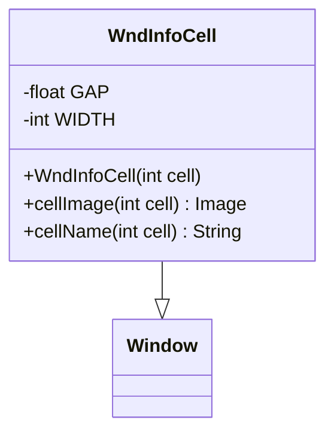

# WndInfoCell 类文档

## 1. 基本信息

| 属性 | 值 |
|------|-----|
| **文件路径** | core/src/main/java/com/shatteredpixel/shatteredpixeldungeon/windows/WndInfoCell.java |
| **包名** | com.shatteredpixel.shatteredpixeldungeon.windows |
| **类类型** | class |
| **继承关系** | extends Window |
| **代码行数** | 161 |
| **功能概述** | 显示地形格子详细信息的窗口 |

## 2. 文件职责说明

WndInfoCell 是显示地形格子（cell）详细信息的窗口类。它展示格子的视觉外观、名称和详细描述，包括地形类型、特殊效果（如粘液、火等）以及相关的游戏机制信息。

**主要功能**：
1. **地形图像显示**：显示格子的视觉外观
2. **地形名称显示**：显示地形的本地化名称
3. **地形描述**：显示地形的详细描述信息
4. **Blob效果信息**：显示格子上的特殊效果（火、毒气等）
5. **自定义地形支持**：支持自定义瓦片的地形信息

## 3. 结构总览



## 4. 继承与协作关系

### 继承关系
- **父类**：Window（基础窗口类）
- **间接父类**：Component

### 协作关系
| 协作类 | 关系类型 | 协作说明 |
|--------|----------|----------|
| Dungeon.level | 读取 | 获取地图数据、地形信息 |
| Terrain | 读取 | 获取地形类型常量 |
| Blob | 读取 | 获取格子上的效果信息 |
| CustomTilemap | 读取 | 获取自定义地形信息 |
| DungeonTerrainTilemap | 调用 | 生成地形图像 |
| DungeonTilemap | 调用 | 获取瓦片尺寸 |
| Messages | 读取 | 获取本地化文本 |
| IconTitle | 创建 | 创建图标标题组件 |

## 5. 字段与常量详解

### 类常量

| 常量 | 类型 | 值 | 说明 |
|------|------|-----|------|
| `GAP` | float | 2 | 控件间距 |
| `WIDTH` | int | 120 | 窗口宽度 |

## 6. 构造与初始化机制

### 构造函数流程

```java
public WndInfoCell(int cell) {
    super();
    
    // 1. 检查自定义地形
    CustomTilemap customTile = null;
    int x = cell % Dungeon.level.width();
    int y = cell / Dungeon.level.width();
    for (CustomTilemap i : Dungeon.level.customTiles) {
        if ((x >= i.tileX && x < i.tileX + i.tileW) &&
            (y >= i.tileY && y < i.tileY + i.tileH)) {
            if (i.image(x - i.tileX, y - i.tileY) != null) {
                customTile = i;
                break;
            }
        }
    }
    
    // 2. 构建描述文本
    String desc = "";
    
    // 3. 创建标题栏
    IconTitle titlebar = new IconTitle();
    titlebar.icon(cellImage(cell));
    titlebar.label(cellName(cell));
    
    // 4. 获取地形描述
    if (customTile != null) {
        String customDesc = customTile.desc(x, y);
        desc += customDesc != null ? customDesc : Dungeon.level.tileDesc(Dungeon.level.map[cell]);
    } else {
        desc += Dungeon.level.tileDesc(Dungeon.level.map[cell]);
    }
    
    // 5. 添加Blob效果描述
    if (Dungeon.level.heroFOV[cell]) {
        for (Blob blob : Dungeon.level.blobs.values()) {
            if (blob.volume > 0 && blob.cur[cell] > 0 && blob.tileDesc() != null) {
                if (desc.length() > 0) desc += "\n\n";
                desc += blob.tileDesc();
            }
        }
    }
    
    // 6. 创建信息文本
    RenderedTextBlock info = PixelScene.renderTextBlock(6);
    info.text(desc.length() == 0 ? Messages.get(this, "nothing") : desc);
    
    // 7. 布局和调整大小
    resize(WIDTH, (int)info.bottom() + 2);
}
```

## 7. 方法详解

### 公开方法

#### WndInfoCell(int) - 构造函数
创建格子信息窗口，显示指定位置的地形信息。

### 静态方法

#### cellImage(int) - 获取格子图像
```java
public static Image cellImage(int cell) {
    int tile = Dungeon.level.map[cell];
    
    // 1. 特殊地形处理
    if (Dungeon.level.water[cell]) {
        tile = Terrain.WATER;
    } else if (Dungeon.level.pit[cell]) {
        tile = Terrain.CHASM;
    }
    
    // 2. 检查自定义地形
    Image customImage = null;
    int x = cell % Dungeon.level.width();
    int y = cell / Dungeon.level.width();
    for (CustomTilemap i : Dungeon.level.customTiles) {
        if ((x >= i.tileX && x < i.tileX + i.tileW) &&
            (y >= i.tileY && y < i.tileY + i.tileH)) {
            if ((customImage = i.image(x - i.tileX, y - i.tileY)) != null) {
                break;
            }
        }
    }
    
    // 3. 返回图像
    if (customImage != null) {
        return customImage;
    } else if (tile == Terrain.WATER) {
        Image water = new Image(Dungeon.level.waterTex());
        water.frame(0, 0, DungeonTilemap.SIZE, DungeonTilemap.SIZE);
        return water;
    } else {
        return DungeonTerrainTilemap.tile(cell, tile);
    }
}
```

#### cellName(int) - 获取格子名称
```java
public static String cellName(int cell) {
    // 1. 检查自定义地形
    CustomTilemap customTile = null;
    int x = cell % Dungeon.level.width();
    int y = cell / Dungeon.level.width();
    for (CustomTilemap i : Dungeon.level.customTiles) {
        if ((x >= i.tileX && x < i.tileX + i.tileW) &&
            (y >= i.tileY && y < i.tileY + i.tileH)) {
            if (i.image(x - i.tileX, y - i.tileY) != null) {
                customTile = i;
                break;
            }
        }
    }
    
    // 2. 返回名称
    if (customTile != null && customTile.name(x, y) != null) {
        return customTile.name(x, y);
    } else {
        return Dungeon.level.tileName(Dungeon.level.map[cell]);
    }
}
```

## 8. 对外暴露能力

### 公开API

| 方法 | 参数 | 返回值 | 说明 |
|------|------|--------|------|
| `WndInfoCell(int)` | 格子位置 | 无 | 创建格子信息窗口 |
| `cellImage(int)` | 格子位置 | Image | 获取格子图像（静态） |
| `cellName(int)` | 格子位置 | String | 获取格子名称（静态） |

## 9. 运行机制与调用链

### 窗口打开流程
```
玩家检视格子（点击/按键）
    ↓
GameScene.show(new WndInfoCell(cell))
    ↓
检查自定义地形
    ↓
获取地形图像和名称
    ↓
获取地形描述
    ↓
添加Blob效果描述
    ↓
创建UI组件
    ↓
显示窗口
```

### 地形图像获取流程
```
cellImage(cell) 被调用
    ↓
检查是否为水域/深渊
    ↓
检查自定义地形
    ↓
返回对应图像
```

## 10. 资源/配置/国际化关联

### 国际化资源

| 资源键 | 中文翻译 | 说明 |
|--------|----------|------|
| `windows.wndinfocell.nothing` | 这里没什么有趣的东西。 | 空描述时的默认文本 |

### 地形名称和描述

地形名称和描述来自 Level 类的方法：
- `Dungeon.level.tileName(tile)` - 地形名称
- `Dungeon.level.tileDesc(tile)` - 地形描述

### Blob效果描述

Blob效果的描述来自各Blob子类的 `tileDesc()` 方法：
- 火焰：显示火焰效果描述
- 毒气：显示毒气效果描述
- 粘液：显示粘液效果描述

## 11. 使用示例

### 显示格子信息
```java
// 在游戏场景中显示格子信息
int cell = Dungeon.hero.pos;  // 英雄所在位置
GameScene.show(new WndInfoCell(cell));
```

### 获取格子图像
```java
// 获取指定位置的图像（用于UI显示）
Image img = WndInfoCell.cellImage(targetCell);
```

### 获取格子名称
```java
// 获取指定位置的名称
String name = WndInfoCell.cellName(targetCell);
```

## 12. 开发注意事项

### 特殊地形处理
- 水域格子优先显示水面图像
- 深渊格子显示深渊图像
- 自定义地形优先于基础地形

### Blob效果显示
- 仅在英雄视野内显示Blob效果
- 多个Blob效果用换行分隔
- Blob必须有 `tileDesc()` 返回值才会显示

### 自定义地形
- CustomTilemap 可以覆盖默认的地形信息
- 支持自定义图像、名称和描述
- 按位置精确匹配

### 空描述处理
- 如果没有任何描述信息，显示"这里没什么有趣的东西"

## 13. 修改建议与扩展点

### 扩展点

1. **添加更多信息**：
   - 显示格子的坐标
   - 显示格子的探索状态
   - 显示格子上的物品列表

2. **交互功能**：
   - 添加快速移动到该格子的选项
   - 添加标记格子的功能

### 修改建议

1. **性能优化**：缓存常用地形图像
2. **信息整合**：显示格子上的所有实体（敌人、物品等）

## 14. 事实核查清单

- [x] 是否已覆盖全部常量（GAP, WIDTH）
- [x] 是否已覆盖全部公开方法（构造函数, cellImage, cellName）
- [x] 是否已确认继承关系（extends Window）
- [x] 是否已确认协作关系（Dungeon.level, Terrain, Blob, CustomTilemap等）
- [x] 是否已验证中文翻译来源（windows_zh.properties）
- [x] 是否已确认特殊地形处理逻辑
- [x] 是否已确认Blob效果显示逻辑
- [x] 是否已确认自定义地形支持
