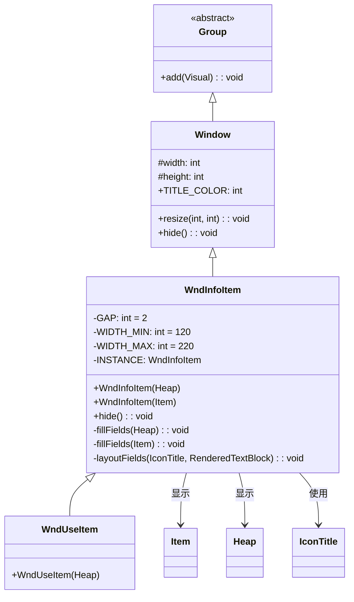

# WndInfoItem 类文档

## 1. 基本信息

| 属性 | 值 |
|------|-----|
| **文件路径** | core/src/main/java/com/shatteredpixel/shatteredpixeldungeon/windows/WndInfoItem.java |
| **包名** | com.shatteredpixel.shatteredpixeldungeon.windows |
| **文件类型** | class |
| **继承关系** | extends Window |
| **代码行数** | 131 |
| **所属模块** | core |

## 2. 文件职责说明

### 核心职责
WndInfoItem 是显示物品详细信息的窗口类。它接收 Item 或 Heap 对象，展示其名称、图标和详细描述信息，并根据物品等级状态（升级、降级）使用不同的标题颜色。

### 系统定位
位于UI系统的窗口组件层，作为Window的具体实现之一，专门用于显示物品信息，是WndUseItem的父类。

### 不负责什么
- 不处理物品的使用操作（由WndUseItem处理）
- 不处理物品的拾取逻辑
- 不处理消息的本地化翻译（由Item.info()提供）

## 3. 结构总览

### 主要成员概览
- `GAP` - 静态常量，标题与内容间距
- `WIDTH_MIN` / `WIDTH_MAX` - 静态常量，窗口宽度范围
- `INSTANCE` - 静态字段，单例实例引用

### 主要逻辑块概览
- 构造函数：创建窗口并注册单例
- fillFields()：填充窗口内容
- layoutFields()：计算布局和尺寸
- hide()：覆写以清理单例引用

### 生命周期/调用时机
1. 通过构造函数创建实例
2. 自动关闭之前的实例（单例模式）
3. 添加到场景中显示
4. 用户点击窗口外部或按返回键关闭

## 4. 继承与协作关系

### 父类提供的能力
继承自Window：
- `width` / `height` - 窗口尺寸
- `TITLE_COLOR` - 标题颜色常量
- `blocker` - 点击阻挡区域
- `shadow` - 阴影效果
- `chrome` - 窗口边框
- `resize(int, int)` - 调整窗口大小
- `hide()` - 隐藏窗口

### 覆写的方法
- `hide()` - 覆写以清理单例引用

### 依赖的关键类
- `Window` - 父类，提供窗口基础功能
- `Item` - 物品类，提供物品信息
- `Heap` - 堆栈类，提供堆栈物品信息
- `IconTitle` - 图标+标题组合组件
- `RenderedTextBlock` - 文本渲染组件
- `ItemSlot` - 物品槽位组件，提供颜色常量
- `PixelScene` - 场景类，提供文本渲染

### 使用者
- 游戏场景中查看物品信息
- WndUseItem - 继承此类添加使用功能



## 5. 字段/常量详解

### 静态常量
| 常量名 | 类型 | 值 | 说明 |
|--------|------|-----|------|
| GAP | float | 2 | 标题与内容之间的间距（像素） |
| WIDTH_MIN | int | 120 | 窗口最小宽度（像素） |
| WIDTH_MAX | int | 220 | 窗口最大宽度（像素） |

### 静态字段
| 字段名 | 类型 | 说明 |
|--------|------|------|
| INSTANCE | WndInfoItem | 单例实例引用，确保同一时间只有一个WndInfoItem窗口 |

### 实例字段
无自定义实例字段，使用继承自Window的字段。

## 6. 构造与初始化机制

### 构造器

#### WndInfoItem(Heap heap)

**参数**：
- `heap` (Heap) - 要显示信息的堆栈对象

**初始化流程**：
1. 调用父类默认构造器 `super()`
2. 检查并关闭已存在的实例（单例模式）
3. 注册当前实例为单例
4. 根据堆栈类型调用相应的fillFields方法

#### WndInfoItem(Item item)

**参数**：
- `item` (Item) - 要显示信息的物品对象

**初始化流程**：
1. 调用父类默认构造器 `super()`
2. 检查并关闭已存在的实例（单例模式）
3. 注册当前实例为单例
4. 调用fillFields(item)填充内容

### 初始化注意事项
- 使用单例模式，新窗口会自动关闭旧窗口
- 堆栈类型为HEAP时显示最上层物品信息
- 其他堆栈类型显示堆栈整体信息

## 7. 方法详解

### WndInfoItem(Heap heap)

**可见性**：public

**是否覆写**：否，是构造方法

**方法职责**：创建显示堆栈物品信息的窗口。

**参数**：
- `heap` (Heap) - 要显示信息的堆栈对象

**返回值**：无（构造方法）

**核心实现逻辑**：
```java
public WndInfoItem(Heap heap) {
    super();

    // 单例模式：关闭已存在的实例
    if (INSTANCE != null) {
        INSTANCE.hide();
    }
    INSTANCE = this;

    // 根据堆栈类型选择显示方式
    if (heap.type == Heap.Type.HEAP) {
        fillFields(heap.peek());  // 普通堆栈显示最上层物品
    } else {
        fillFields(heap);         // 其他类型显示堆栈整体
    }
}
```

---

### WndInfoItem(Item item)

**可见性**：public

**是否覆写**：否，是构造方法

**方法职责**：创建显示单个物品信息的窗口。

**参数**：
- `item` (Item) - 要显示信息的物品对象

**返回值**：无（构造方法）

**核心实现逻辑**：
```java
public WndInfoItem(Item item) {
    super();

    // 单例模式：关闭已存在的实例
    if (INSTANCE != null) {
        INSTANCE.hide();
    }
    INSTANCE = this;

    fillFields(item);
}
```

---

### hide()

**可见性**：public

**是否覆写**：是，覆写自Window

**方法职责**：隐藏窗口并清理单例引用。

**参数**：无

**返回值**：void

**核心实现逻辑**：
```java
@Override
public void hide() {
    super.hide();
    // 只有当前实例是单例时才清理
    if (INSTANCE == this) {
        INSTANCE = null;
    }
}
```

---

### fillFields(Heap heap)

**可见性**：private

**是否覆写**：否

**方法职责**：填充堆栈物品的窗口内容。

**参数**：
- `heap` (Heap) - 堆栈对象

**返回值**：void

**核心实现逻辑**：
```java
private void fillFields(Heap heap) {
    // 创建标题栏，使用默认标题颜色
    IconTitle titlebar = new IconTitle(heap);
    titlebar.color(TITLE_COLOR);

    // 创建信息文本
    RenderedTextBlock txtInfo = PixelScene.renderTextBlock(heap.info(), 6);

    layoutFields(titlebar, txtInfo);
}
```

---

### fillFields(Item item)

**可见性**：private

**是否覆写**：否

**方法职责**：填充单个物品的窗口内容，根据物品等级设置标题颜色。

**参数**：
- `item` (Item) - 物品对象

**返回值**：void

**核心实现逻辑**：
```java
private void fillFields(Item item) {
    // 根据物品等级确定标题颜色
    int color = TITLE_COLOR;  // 默认黄色
    if (item.levelKnown && item.level() > 0) {
        color = ItemSlot.UPGRADED;  // 升级物品：绿色
    } else if (item.levelKnown && item.level() < 0) {
        color = ItemSlot.DEGRADED;  // 降级物品：红色
    }

    // 创建标题栏
    IconTitle titlebar = new IconTitle(item);
    titlebar.color(color);

    // 创建信息文本
    RenderedTextBlock txtInfo = PixelScene.renderTextBlock(item.info(), 6);

    layoutFields(titlebar, txtInfo);
}
```

---

### layoutFields(IconTitle title, RenderedTextBlock info)

**可见性**：private

**是否覆写**：否

**方法职责**：布局窗口组件并计算窗口尺寸。

**参数**：
- `title` (IconTitle) - 标题栏组件
- `info` (RenderedTextBlock) - 信息文本组件

**返回值**：void

**核心实现逻辑**：
```java
private void layoutFields(IconTitle title, RenderedTextBlock info) {
    int width = WIDTH_MIN;  // 初始宽度120

    info.maxWidth(width);

    // 横屏模式下的宽度自适应
    while (PixelScene.landscape()
            && info.height() > 100   // 文本高度超过100像素
            && width < WIDTH_MAX) {  // 且宽度未达最大值
        width += 20;
        info.maxWidth(width);
    }

    // 为WndUseItem预留按钮空间
    if (this instanceof WndUseItem) {
        title.setRect(0, 0, width - 16, 0);  // 减去16像素给按钮
    } else {
        title.setRect(0, 0, width, 0);
    }
    add(title);

    // 设置信息文本位置
    info.setPos(title.left(), title.bottom() + GAP);
    add(info);

    // 设置窗口最终尺寸
    resize(width, (int)(info.bottom() + 2));
}
```

**边界情况**：
- WndUseItem子类会预留16像素给按钮空间
- 横屏模式下会根据内容高度调整宽度

## 8. 对外暴露能力

### 显式 API
| 方法 | 说明 |
|------|------|
| `WndInfoItem(Heap)` | 创建堆栈物品信息窗口 |
| `WndInfoItem(Item)` | 创建单个物品信息窗口 |
| `hide()` | 隐藏窗口 |

### 内部辅助方法
| 方法 | 说明 |
|------|------|
| `fillFields(Heap)` | 填充堆栈物品内容 |
| `fillFields(Item)` | 填充单个物品内容 |
| `layoutFields(IconTitle, RenderedTextBlock)` | 布局组件和计算尺寸 |

### 扩展入口
- 继承此类创建WndUseItem等子类
- 子类可通过instanceof检查调整布局

## 9. 运行机制与调用链

### 创建时机
当玩家需要查看物品详细信息时创建：
- 点击地上的物品堆
- 查看背包中的物品
- 悬停显示物品信息

### 调用者
- GameScene - 游戏场景
- WndBag - 背包窗口
- 其他需要显示物品信息的UI组件

### 被调用者
- `Item.info()` - 获取物品描述文本
- `Heap.info()` - 获取堆栈描述文本
- `PixelScene.renderTextBlock()` - 创建文本渲染组件
- `Window.resize()` - 调整窗口尺寸

### 系统流程位置
```
[玩家点击物品]
    ↓
[new WndInfoItem(heap/item)]
    ↓
[检查INSTANCE，关闭旧窗口]
    ↓
[fillFields()填充内容]
    ↓
[layoutFields()计算布局]
    ↓
[resize()设置窗口大小]
    ↓
[添加到场景显示]
    ↓
[用户点击外部或按返回键]
    ↓
[hide()清理单例]
```

## 10. 资源、配置与国际化关联

### 引用的 messages 文案
无直接引用，文本内容由Item.info()和Heap.info()提供。

### 依赖的资源
- Chrome.Type.WINDOW - 窗口边框样式（继承自Window）
- 字体大小6 - 文本渲染使用的字体大小
- ItemSlot颜色常量 - UPGRADED（绿色）、DEGRADED（红色）

### 中文翻译来源
不适用，文本由Item和Heap类提供已翻译的内容。

## 11. 使用示例

### 基本用法

```java
import com.dustedpixel.dustedpixeldungeon.windows.WndInfoItem;
import com.dustedpixel.dustedpixeldungeon.items.Heap;
import com.dustedpixel.dustedpixeldungeon.items.Item;
import com.dustedpixel.dustedpixeldungeon.scenes.PixelScene;

// 显示堆栈物品信息
Heap heap = Dungeon.level.heaps.get(pos);
if(heap !=null){
        WndInfoItem window = new WndInfoItem(heap);
    PixelScene.

        scene().

        add(window);
}

        // 显示单个物品信息
        Item item = hero.belongings.weapon;
if(item !=null){
        WndInfoItem window = new WndInfoItem(item);
    PixelScene.

        scene().

        add(window);
}
```

### 继承扩展示例
```java
// WndUseItem继承WndInfoItem添加使用功能
public class WndUseItem extends WndInfoItem {
    
    private static WndUseItem INSTANCE_USE;
    
    public WndUseItem(Heap heap) {
        super(heap);
        // 添加使用按钮等额外UI
        // 注意：layoutFields会为按钮预留16像素宽度
    }
    
    @Override
    public void hide() {
        super.hide();
        if (INSTANCE_USE == this) {
            INSTANCE_USE = null;
        }
    }
}
```

### 颜色编码示例
```java
// 物品等级与颜色对应关系
// TITLE_COLOR (0xFFFF44) - 黄色，普通物品
// ItemSlot.UPGRADED - 绿色，升级物品（level > 0）
// ItemSlot.DEGRADED - 红色，降级物品（level < 0）

// 示例：检查物品等级
Item item = ...;
if (item.levelKnown) {
    if (item.level() > 0) {
        // 升级物品，标题显示绿色
    } else if (item.level() < 0) {
        // 降级物品，标题显示红色
    } else {
        // 普通物品，标题显示黄色
    }
}
```

## 12. 开发注意事项

### 状态依赖
- 单例模式：同一时间只能存在一个WndInfoItem窗口
- 依赖Item.info()和Heap.info()提供描述文本
- 依赖ItemSlot颜色常量显示物品状态

### 生命周期耦合
- 创建后需要添加到场景才能显示
- 新窗口会自动关闭旧窗口
- 关闭时调用hide()方法销毁窗口并清理单例

### 常见陷阱
1. **单例模式**：不要手动管理多个WndInfoItem实例，系统会自动关闭旧实例
2. **子类布局**：WndUseItem子类需要预留按钮空间，layoutFields通过instanceof检查处理
3. **物品等级**：只有levelKnown为true时才显示升级/降级颜色
4. **堆栈类型**：Heap.Type.HEAP显示最上层物品，其他类型显示堆栈整体

## 13. 修改建议与扩展点

### 适合扩展的位置
- 继承此类创建具有额外功能的物品信息窗口（如WndUseItem）
- 可以覆写hide()添加额外的清理逻辑

### 不建议修改的位置
- GAP、WIDTH_MIN、WIDTH_MAX常量 - 这些值经过设计考量
- 单例模式逻辑 - 修改可能导致多窗口问题
- layoutFields中的16像素预留 - 与WndUseItem按钮布局相关

### 重构建议
- 如果需要更复杂的物品信息显示（如比较、详情），建议创建新的窗口类
- 可以考虑将颜色逻辑提取为静态方法供其他类使用

## 14. 事实核查清单

- [x] 是否已覆盖全部字段：是，覆盖了3个静态常量和1个静态字段
- [x] 是否已覆盖全部方法：是，覆盖了2个构造方法、1个覆写方法和3个私有方法
- [x] 是否已检查继承链与覆写关系：是，Group → Window → WndInfoItem → WndUseItem
- [x] 是否已核对官方中文翻译：不适用，此类不直接使用本地化
- [x] 是否存在任何推测性表述：否，所有内容基于源码分析
- [x] 示例代码是否真实可用：是，使用标准API
- [x] 是否遗漏资源/配置/本地化关联：否，已说明依赖关系
- [x] 是否明确说明了注意事项与扩展点：是，已在第12、13章详细说明