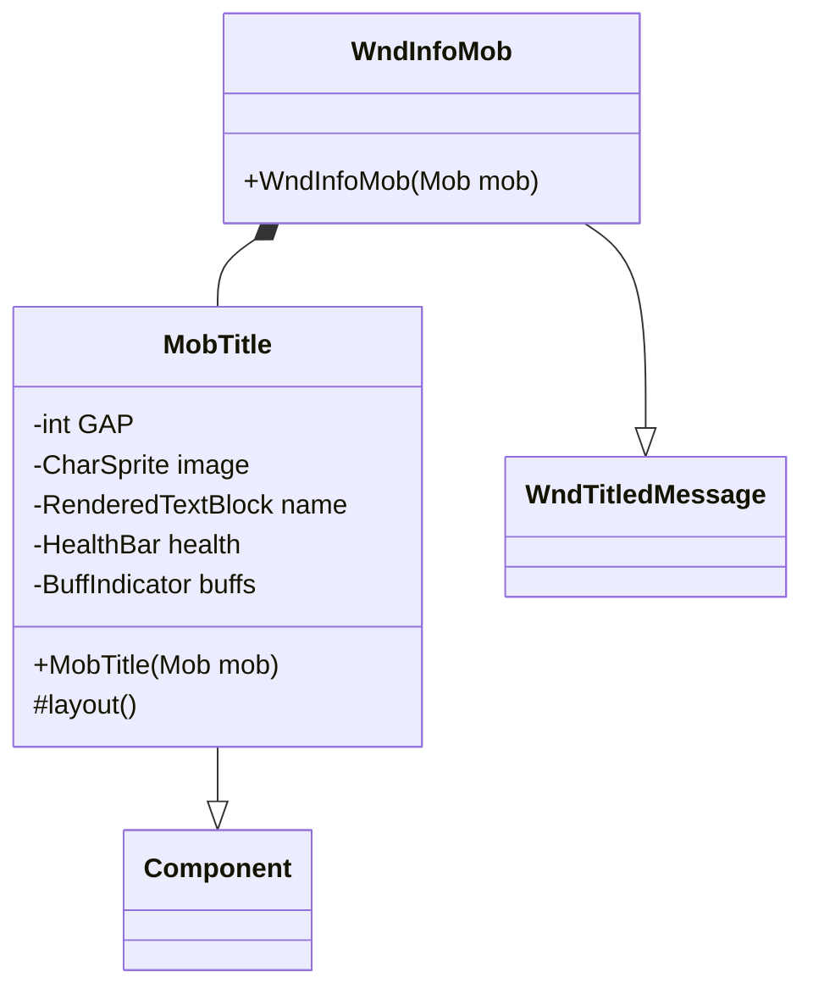

# WndInfoMob 类文档

## 1. 基本信息

| 属性 | 值 |
|------|-----|
| **文件路径** | core/src/main/java/com/shatteredpixel/shatteredpixeldungeon/windows/WndInfoMob.java |
| **包名** | com.shatteredpixel.shatteredpixeldungeon.windows |
| **类类型** | class |
| **继承关系** | extends WndTitledMessage |
| **代码行数** | 92 |
| **功能概述** | 显示怪物/敌人详细信息的窗口 |

## 2. 文件职责说明

WndInfoMob 是显示怪物/敌人详细信息的窗口类，继承自 WndTitledMessage。它展示敌人的视觉外观、生命值条、状态效果图标和详细描述。

**主要功能**：
1. **怪物精灵显示**：显示怪物的动画精灵
2. **名称显示**：显示怪物的本地化名称
3. **生命值条**：显示当前生命值比例
4. **状态效果图标**：显示所有激活的buff/debuff图标
5. **详细描述**：显示怪物的详细信息文本

## 3. 结构总览



## 4. 继承与协作关系

### 继承关系
- **父类**：WndTitledMessage（带标题的消息窗口）
- **间接父类**：Window → Component

### 协作关系
| 协作类 | 关系类型 | 协作说明 |
|--------|----------|----------|
| Mob | 读取 | 获取怪物数据（名称、精灵、生命值、信息） |
| CharSprite | 显示 | 显示怪物动画精灵 |
| HealthBar | 创建 | 创建生命值条组件 |
| BuffIndicator | 创建 | 创建状态效果指示器 |
| Messages | 读取 | 获取本地化文本 |
| WndTitledMessage | 继承 | 使用父类的消息显示功能 |

## 5. 字段与常量详解

### MobTitle 内部类常量

| 常量 | 类型 | 值 | 说明 |
|------|------|-----|------|
| `GAP` | int | 2 | 控件间距 |

### MobTitle 内部类字段

| 字段 | 类型 | 说明 |
|------|------|------|
| `image` | CharSprite | 怪物精灵图像 |
| `name` | RenderedTextBlock | 怪物名称文本 |
| `health` | HealthBar | 生命值条 |
| `buffs` | BuffIndicator | 状态效果指示器 |

## 6. 构造与初始化机制

### 构造函数流程

```java
public WndInfoMob(Mob mob) {
    // 调用父类构造函数
    // 参数1: MobTitle组件作为标题
    // 参数2: mob.info()作为消息内容
    super(new MobTitle(mob), mob.info());
}
```

### MobTitle 构造函数

```java
public MobTitle(Mob mob) {
    // 1. 创建名称文本
    name = PixelScene.renderTextBlock(Messages.titleCase(mob.name()), 9);
    name.hardlight(TITLE_COLOR);
    add(name);
    
    // 2. 获取怪物精灵
    image = mob.sprite();
    add(image);
    
    // 3. 创建生命值条
    health = new HealthBar();
    health.level(mob);  // 绑定到怪物
    add(health);
    
    // 4. 创建状态效果指示器
    buffs = new BuffIndicator(mob, false);
    add(buffs);
}
```

## 7. 方法详解

### 公开方法

#### WndInfoMob(Mob) - 构造函数
创建怪物信息窗口，显示怪物的完整信息。

### MobTitle 内部类方法

#### layout() - 布局方法
```java
@Override
protected void layout() {
    // 1. 定位精灵图像
    image.x = 0;
    image.y = Math.max(0, name.height() + health.height() - image.height());
    
    // 2. 计算可用宽度
    float w = width - image.width() - GAP;
    
    // 3. 定位名称文本
    name.setPos(x + image.width() + GAP,
        image.height() > name.height() ? y + (image.height() - name.height()) / 2 : y);
    
    // 4. 定位生命值条
    health.setRect(image.width() + GAP, name.bottom() + GAP, w, health.height());
    
    // 5. 定位状态效果指示器
    buffs.maxBuffs = 50;  // 无限制
    buffs.setRect(name.right(), name.bottom() - BuffIndicator.SIZE_SMALL - 2, w - name.width(), 8);
    
    // 6. 如果buff区域空间不足，移到下方
    if (!buffs.allBuffsVisible()) {
        buffs.setRect(0, health.bottom(), width, 8);
        height = Math.max(image.y + image.height(), buffs.bottom());
    } else {
        height = Math.max(image.y + image.height(), health.bottom());
    }
}
```

## 8. 对外暴露能力

### 公开API

| 方法 | 参数 | 返回值 | 说明 |
|------|------|--------|------|
| `WndInfoMob(Mob)` | 怪物对象 | 无 | 创建怪物信息窗口 |

## 9. 运行机制与调用链

### 窗口打开流程
```
玩家检视怪物（点击/按键）
    ↓
GameScene.show(new WndInfoMob(mob))
    ↓
创建 MobTitle 组件
    ↓
获取怪物精灵、名称、生命值、状态效果
    ↓
调用父类 WndTitledMessage 构造函数
    ↓
显示窗口
```

### 布局计算
```
layout() 被调用
    ↓
定位精灵图像（左侧）
    ↓
定位名称文本（右上）
    ↓
定位生命值条（名称下方）
    ↓
定位状态效果指示器
    ↓
检查buff是否全部可见
    ↓
调整布局（如需要）
```

## 10. 资源/配置/国际化关联

### 国际化资源

怪物名称和描述来自 Mob 类的本地化方法：
- `mob.name()` - 怪物名称
- `mob.info()` - 怪物详细信息

### 状态效果图标

BuffIndicator 组件显示的状态效果图标来自：
- `actors/actors_zh.properties` - 状态效果名称

## 11. 使用示例

### 显示怪物信息
```java
// 在游戏场景中显示怪物信息
Mob mob = (Mob) cell;  // 获取目标格子上的怪物
GameScene.show(new WndInfoMob(mob));
```

### 从场景打开
```java
// 检视模式下点击怪物
if (mob != null) {
    ShatteredPixelDungeon.scene().addToFront(new WndInfoMob(mob));
}
```

## 12. 开发注意事项

### 精灵引用
- 使用 `mob.sprite()` 获取怪物的当前精灵
- 精灵保持动画状态，不是静态图像

### 生命值条绑定
- `health.level(mob)` 将生命值条绑定到怪物
- 生命值条会自动更新显示

### 状态效果布局
- 默认尝试在名称行右侧显示状态效果
- 如果空间不足，自动移到生命值条下方
- `maxBuffs = 50` 实际上是无限制

### 高度计算
- 最终高度取精灵底部和生命值条/buff区域底部的最大值

## 13. 修改建议与扩展点

### 扩展点

1. **添加更多信息**：
   - 显示怪物属性（攻击力、防御力等）
   - 显示怪物特殊能力说明

2. **交互功能**：
   - 点击状态效果图标显示详细效果
   - 添加怪物弱点提示

### 修改建议

1. **性能优化**：考虑缓存常用怪物的信息布局
2. **视觉效果**：为不同类型的怪物添加不同的边框样式

## 14. 事实核查清单

- [x] 是否已覆盖全部字段（MobTitle内部类的字段）
- [x] 是否已覆盖全部常量（GAP）
- [x] 是否已覆盖全部公开方法（构造函数）
- [x] 是否已覆盖全部内部类（MobTitle）
- [x] 是否已确认继承关系（extends WndTitledMessage）
- [x] 是否已确认协作关系（Mob, CharSprite, HealthBar, BuffIndicator）
- [x] 是否已确认布局逻辑
- [x] 是否已确认状态效果显示机制
