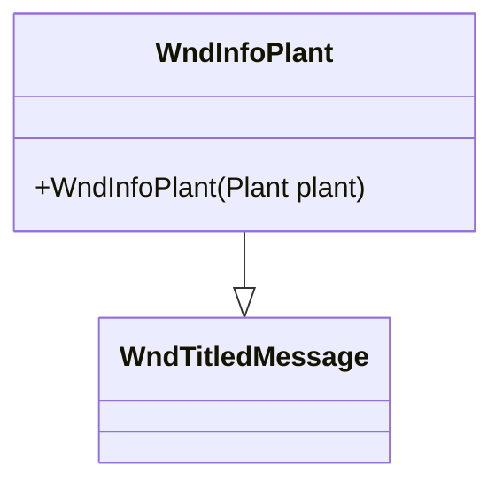

# WndInfoPlant 类文档

## 1. 基本信息

| 属性 | 值 |
|------|-----|
| **文件路径** | core/src/main/java/com/shatteredpixel/shatteredpixeldungeon/windows/WndInfoPlant.java |
| **包名** | com.shatteredpixel.shatteredpixeldungeon.windows |
| **类类型** | class |
| **继承关系** | extends WndTitledMessage |
| **代码行数** | 37 |
| **功能概述** | 显示植物详细信息的窗口 |

## 2. 文件职责说明

WndInfoPlant 是显示植物（Plant）详细信息的窗口类，继承自 WndTitledMessage。它展示植物的视觉外观、名称和游戏内描述。

**主要功能**：
1. **植物图像显示**：显示地形的视觉图像
2. **植物名称显示**：显示植物的本地化名称
3. **植物描述**：显示植物的详细描述信息

## 3. 结构总览



## 4. 继承与协作关系

### 继承关系
- **父类**：WndTitledMessage（带标题的消息窗口）
- **间接父类**：Window → Component

### 协作关系
| 协作类 | 关系类型 | 协作说明 |
|--------|----------|----------|
| Plant | 读取 | 获取植物数据（位置、名称、描述） |
| TerrainFeaturesTilemap | 调用 | 生成地形图像 |
| Dungeon.level | 读取 | 获取地图数据 |
| Messages | 读取 | 获取本地化文本 |

## 5. 字段与常量详解

无实例字段或类常量。所有功能通过继承实现。

## 6. 构造与初始化机制

### 构造函数

```java
public WndInfoPlant(Plant plant) {
    // 调用父类构造函数
    // 参数1: 地形图像（从植物位置获取）
    // 参数2: 植物名称
    // 参数3: 植物描述
    super(
        TerrainFeaturesTilemap.tile(plant.pos, Dungeon.level.map[plant.pos]),
        Messages.titleCase(plant.name()),
        plant.desc()
    );
}
```

## 7. 方法详解

### 公开方法

#### WndInfoPlant(Plant) - 构造函数
创建植物信息窗口，显示指定植物的完整信息。

**参数**：
- `plant`：植物对象

**实现细节**：
- 图标：使用 TerrainFeaturesTilemap 生成地形图像
- 标题：植物名称（首字母大写）
- 内容：植物描述文本

## 8. 对外暴露能力

### 公开API

| 方法 | 参数 | 返回值 | 说明 |
|------|------|--------|------|
| `WndInfoPlant(Plant)` | 植物对象 | 无 | 创建植物信息窗口 |

## 9. 运行机制与调用链

### 窗口打开流程
```
玩家检视植物（点击/踩踏）
    ↓
创建 WndInfoPlant(plant)
    ↓
获取植物位置的地形图像
    ↓
获取植物名称和描述
    ↓
调用父类 WndTitledMessage 构造函数
    ↓
显示窗口
```

## 10. 资源/配置/国际化关联

### 植物数据来源

Plant 对象提供：
- `plant.pos` - 植物位置
- `plant.name()` - 植物名称
- `plant.desc()` - 植物描述

### 地形图像

使用 TerrainFeaturesTilemap 生成：
- 根据植物位置和地形类型生成图像
- 显示植物在地形上的视觉效果

## 11. 使用示例

### 显示植物信息
```java
// 玩家检视植物时
Plant plant = Dungeon.level.plants.get(cell);
if (plant != null) {
    GameScene.show(new WndInfoPlant(plant));
}
```

### 从场景打开
```java
// 踩踏植物时显示信息
Plant plant = Dungeon.level.plants.get(pos);
if (plant != null) {
    ShatteredPixelDungeon.scene().addToFront(new WndInfoPlant(plant));
}
```

## 12. 开发注意事项

### 简洁实现
- 整个类仅37行代码
- 所有功能通过继承实现
- 仅定义构造函数

### 图像生成
- 使用 TerrainFeaturesTilemap.tile() 生成图像
- 结合植物位置和地形类型

### 父类功能
- WndTitledMessage 提供完整的消息显示功能
- 包括图标、标题、消息文本
- 支持自动换行和滚动

## 13. 修改建议与扩展点

### 扩展点

1. **添加种子信息**：显示植物对应的种子
2. **添加效果预览**：显示植物踩踏后的效果

### 修改建议

1. **植物状态**：显示植物的生长状态
2. **互动提示**：添加互动建议

## 14. 事实核查清单

- [x] 是否已覆盖全部公开方法（构造函数）
- [x] 是否已确认继承关系（extends WndTitledMessage）
- [x] 是否已确认协作关系（Plant, TerrainFeaturesTilemap等）
- [x] 是否已确认图像生成方式
- [x] 是否已确认父类功能继承
