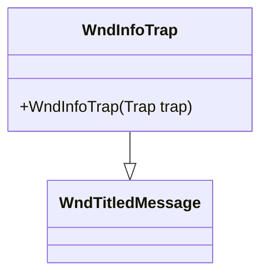

# WndInfoTrap 类文档

## 1. 基本信息

| 属性 | 值 |
|------|-----|
| **文件路径** | core/src/main/java/com/shatteredpixel/shatteredpixeldungeon/windows/WndInfoTrap.java |
| **包名** | com.shatteredpixel.shatteredpixeldungeon.windows |
| **类类型** | class |
| **继承关系** | extends WndTitledMessage |
| **代码行数** | 39 |
| **功能概述** | 显示陷阱详细信息的窗口 |

## 2. 文件职责说明

WndInfoTrap 是显示陷阱（Trap）详细信息的窗口类，继承自 WndTitledMessage。它展示陷阱的视觉外观、名称、描述以及激活状态信息。

**主要功能**：
1. **陷阱图像显示**：显示地形的视觉图像
2. **陷阱名称显示**：显示陷阱的本地化名称
3. **激活状态标识**：显示陷阱是否已失效
4. **陷阱描述**：显示陷阱的详细描述信息

## 3. 结构总览



## 4. 继承与协作关系

### 继承关系
- **父类**：WndTitledMessage（带标题的消息窗口）
- **间接父类**：Window → Component

### 协作关系
| 协作类 | 关系类型 | 协作说明 |
|--------|----------|----------|
| Trap | 读取 | 获取陷阱数据（位置、名称、描述、状态） |
| TerrainFeaturesTilemap | 调用 | 生成地形图像 |
| Dungeon.level | 读取 | 获取地图数据 |
| Messages | 读取 | 获取本地化文本 |

## 5. 字段与常量详解

无实例字段或类常量。所有功能通过继承实现。

## 6. 构造与初始化机制

### 构造函数

```java
public WndInfoTrap(Trap trap) {
    // 调用父类构造函数
    // 参数1: 地形图像（从陷阱位置获取）
    // 参数2: 陷阱名称
    // 参数3: 陷阱描述（含状态信息）
    super(
        TerrainFeaturesTilemap.tile(trap.pos, Dungeon.level.map[trap.pos]),
        Messages.titleCase(trap.name()),
        (!trap.active ? Messages.get(WndInfoTrap.class, "inactive") + "\n\n" : "") + trap.desc()
    );
}
```

### 描述文本构建
- 如果陷阱不活跃（`!trap.active`），在描述前添加"这个陷阱已经失效了，且不会被再次触发。"
- 然后添加陷阱的标准描述

## 7. 方法详解

### 公开方法

#### WndInfoTrap(Trap) - 构造函数
创建陷阱信息窗口，显示指定陷阱的完整信息。

**参数**：
- `trap`：陷阱对象

**实现细节**：
- 图标：使用 TerrainFeaturesTilemap 生成地形图像
- 标题：陷阱名称（首字母大写）
- 内容：状态信息 + 陷阱描述

## 8. 对外暴露能力

### 公开API

| 方法 | 参数 | 返回值 | 说明 |
|------|------|--------|------|
| `WndInfoTrap(Trap)` | 陷阱对象 | 无 | 创建陷阱信息窗口 |

## 9. 运行机制与调用链

### 窗口打开流程
```
玩家检视陷阱（点击/触发）
    ↓
创建 WndInfoTrap(trap)
    ↓
获取陷阱位置的地形图像
    ↓
获取陷阱名称和描述
    ↓
检查陷阱激活状态
    ↓
构建描述文本（含状态信息）
    ↓
调用父类 WndTitledMessage 构造函数
    ↓
显示窗口
```

## 10. 资源/配置/国际化关联

### 国际化资源

| 资源键 | 中文翻译 | 说明 |
|--------|----------|------|
| `windows.wndinfotrap.inactive` | 这个陷阱已经失效了，且不会被再次触发。 | 失效陷阱提示 |

### 陷阱数据来源

Trap 对象提供：
- `trap.pos` - 陷阱位置
- `trap.name()` - 陷阱名称
- `trap.desc()` - 陷阱描述
- `trap.active` - 陷阱是否激活

## 11. 使用示例

### 显示陷阱信息
```java
// 玩家检视陷阱时
Trap trap = Dungeon.level.traps.get(cell);
if (trap != null) {
    GameScene.show(new WndInfoTrap(trap));
}
```

### 检查陷阱状态
```java
if (!trap.active) {
    // 陷阱已失效，显示特殊提示
    GameScene.show(new WndInfoTrap(trap));
}
```

## 12. 开发注意事项

### 简洁实现
- 整个类仅39行代码
- 所有功能通过继承实现
- 仅定义构造函数

### 状态显示
- 失效陷阱在描述前添加提示
- 激活陷阱仅显示标准描述

### 父类功能
- WndTitledMessage 提供完整的消息显示功能
- 包括图标、标题、消息文本
- 支持自动换行和滚动

## 13. 修改建议与扩展点

### 扩展点

1. **添加触发次数**：显示陷阱已触发次数
2. **添加危险等级**：显示陷阱的危险程度

### 修改建议

1. **视觉效果**：失效陷阱使用灰色图标
2. **互动提示**：添加如何避免陷阱的建议

## 14. 事实核查清单

- [x] 是否已覆盖全部公开方法（构造函数）
- [x] 是否已确认继承关系（extends WndTitledMessage）
- [x] 是否已确认协作关系（Trap, TerrainFeaturesTilemap等）
- [x] 是否已验证中文翻译来源（windows_zh.properties）
- [x] 是否已确认状态显示逻辑
- [x] 是否已确认父类功能继承
