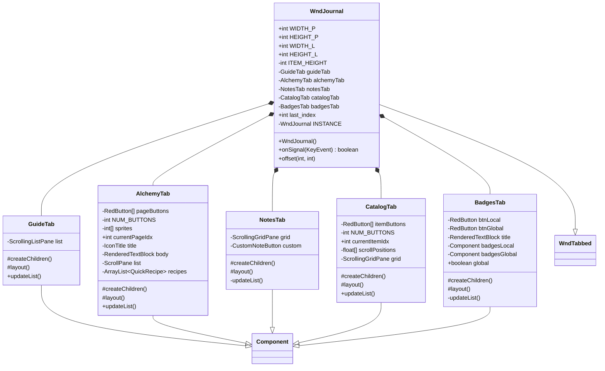

# WndJournal 类文档

## 1. 基本信息

| 属性 | 值 |
|------|-----|
| **文件路径** | core/src/main/java/com/shatteredpixel/shatteredpixeldungeon/windows/WndJournal.java |
| **包名** | com.shatteredpixel.shatteredpixeldungeon.windows |
| **类类型** | class |
| **继承关系** | extends WndTabbed |
| **代码行数** | 1156 |
| **功能概述** | 游戏日志主窗口，提供指南、炼金、笔记、图鉴、徽章等功能 |

## 2. 文件职责说明

WndJournal 是游戏日志主窗口，继承自 WndTabbed（带标签页导航的窗口基类）。它提供五个标签页用于查看游戏指南、炼金配方、笔记、图鉴和徽章信息。

**主要功能**：
1. **笔记标签页（NotesTab）**：显示探险手册，记录重要信息和自定义笔记
2. **指南标签页（GuideTab）**：显示冒险者指南文档
3. **炼金标签页（AlchemyTab）**：显示炼金配方指南
4. **图鉴标签页（CatalogTab）**：显示装备、消耗品、单位图鉴和背景故事
5. **徽章标签页（BadgesTab）**：显示本局和全局徽章

## 3. 结构总览



## 4. 继承与协作关系

### 继承关系
- **父类**：WndTabbed（带标签页导航的窗口基类）
- **间接父类**：Window → Component

### 协作关系
| 协作类 | 关系类型 | 协作说明 |
|--------|----------|----------|
| Document | 读取 | 获取指南和炼金文档页面 |
| Notes | 读取 | 获取笔记记录 |
| Catalog | 读取 | 获取图鉴数据 |
| Bestiary | 读取 | 获取单位图鉴数据 |
| Badges | 读取 | 获取徽章数据 |
| Statistics | 读取 | 获取统计数据 |
| Dungeon | 读取 | 获取当前深度 |
| Messages | 读取 | 获取本地化文本 |
| WndStory | 创建 | 显示故事文档 |
| WndJournalItem | 创建 | 显示图鉴条目详情 |
| QuickRecipe | 创建 | 显示炼金配方 |
| BadgesList | 创建 | 徽章列表组件 |
| BadgesGrid | 创建 | 徽章网格组件 |
| CustomNoteButton | 创建 | 自定义笔记按钮 |

## 5. 字段与常量详解

### 类常量

| 常量 | 类型 | 值 | 说明 |
|------|------|-----|------|
| `WIDTH_P` | int | 126 | 竖屏模式窗口宽度 |
| `HEIGHT_P` | int | 180 | 竖屏模式窗口高度 |
| `WIDTH_L` | int | 216 | 横屏模式窗口宽度 |
| `HEIGHT_L` | int | 130 | 横屏模式窗口高度 |
| `ITEM_HEIGHT` | int | 18 | 列表项高度 |

### 实例字段

| 字段 | 类型 | 说明 |
|------|------|------|
| `guideTab` | GuideTab | 指南标签页 |
| `alchemyTab` | AlchemyTab | 炼金标签页 |
| `notesTab` | NotesTab | 笔记标签页 |
| `catalogTab` | CatalogTab | 图鉴标签页 |
| `badgesTab` | BadgesTab | 徽章标签页 |
| `INSTANCE` | WndJournal (static) | 单例引用 |
| `last_index` | int (static) | 上次选中的标签页索引 |

### AlchemyTab 常量

| 常量 | 类型 | 值 | 说明 |
|------|------|-----|------|
| `NUM_BUTTONS` | int | 9 | 炼金分类按钮数量 |
| `sprites` | int[] | 种子/石头/食物/药水/卷轴/炸弹/投掷/药剂/法术 | 分类图标 |

### CatalogTab 常量

| 常量 | 类型 | 值 | 说明 |
|------|------|-----|------|
| `NUM_BUTTONS` | int | 4 | 图鉴分类按钮数量 |
| `EQUIP_IDX` | int | 0 | 装备索引 |
| `CONSUM_IDX` | int | 1 | 消耗品索引 |
| `BESTIARY_IDX` | int | 2 | 单位图鉴索引 |
| `LORE_IDX` | int | 3 | 背景故事索引 |

## 6. 构造与初始化机制

### 构造函数流程

```java
public WndJournal() {
    // 1. 单例检查
    if (INSTANCE != null) {
        INSTANCE.hide();
    }
    
    // 2. 确定窗口尺寸
    int width = PixelScene.landscape() ? WIDTH_L : WIDTH_P;
    int height = PixelScene.landscape() ? HEIGHT_L : HEIGHT_P;
    resize(width, height);
    
    // 3. 创建各标签页
    guideTab = new GuideTab();
    add(guideTab);
    guideTab.updateList();
    
    alchemyTab = new AlchemyTab();
    add(alchemyTab);
    
    notesTab = new NotesTab();
    add(notesTab);
    notesTab.updateList();
    
    catalogTab = new CatalogTab();
    add(catalogTab);
    catalogTab.updateList();
    
    badgesTab = new BadgesTab();
    add(badgesTab);
    badgesTab.updateList();
    
    // 4. 创建标签页图标
    Tab[] tabs = { /* 5个IconTab */ };
    for (Tab tab : tabs) {
        add(tab);
    }
    
    // 5. 布局和选择
    layoutTabs();
    select(last_index);
    
    INSTANCE = this;
}
```

### 标签页顺序
1. 笔记（NotesTab）- 日记图标
2. 指南（GuideTab）- 掌握图标
3. 炼金（AlchemyTab）- 炼金图标
4. 图鉴（CatalogTab）- 目录图标
5. 徽章（BadgesTab）- 徽章图标

## 7. 方法详解

### 公开方法

#### WndJournal() - 构造函数
创建日志窗口，初始化所有标签页。

#### onSignal(KeyEvent) - 键盘事件处理
```java
@Override
public boolean onSignal(KeyEvent event) {
    if (event.pressed && KeyBindings.getActionForKey(event) == SPDAction.JOURNAL) {
        onBackPressed();  // 按日志键关闭窗口
        return true;
    } else {
        return super.onSignal(event);
    }
}
```

#### offset(int, int) - 偏移处理
```java
@Override
public void offset(int xOffset, int yOffset) {
    super.offset(xOffset, yOffset);
    // 重新布局所有标签页
    guideTab.layout();
    alchemyTab.layout();
    notesTab.layout();
    catalogTab.layout();
}
```

### GuideTab 内部类

#### updateList() - 更新列表
```java
public void updateList() {
    list.addTitle(Document.ADVENTURERS_GUIDE.title());
    
    for (String page : Document.ADVENTURERS_GUIDE.pageNames()) {
        boolean found = Document.ADVENTURERS_GUIDE.isPageFound(page);
        ScrollingListPane.ListItem item = new ScrollingListPane.ListItem(...) {
            @Override
            public boolean onClick(float x, float y) {
                if (inside(x, y) && found) {
                    // 打开故事窗口显示页面内容
                    ShatteredPixelDungeon.scene().addToFront(new WndStory(...));
                    Document.ADVENTURERS_GUIDE.readPage(page);
                    return true;
                }
                return false;
            }
        };
        if (!found) {
            item.hardlight(0x999999);  // 未发现页面显示灰色
        }
        list.addItem(item);
    }
}
```

### AlchemyTab 内部类

#### updateList() - 更新炼金配方列表
```java
public void updateList() {
    // 1. 更新按钮颜色
    for (int i = 0; i < NUM_BUTTONS; i++) {
        if (i == currentPageIdx) {
            pageButtons[i].icon().color(TITLE_COLOR);
        } else {
            pageButtons[i].icon().resetColor();
        }
    }
    
    // 2. 清除旧配方
    for (QuickRecipe r : recipes) {
        r.killAndErase();
        r.destroy();
    }
    recipes.clear();
    
    // 3. 添加标题和描述
    title.label(Document.ALCHEMY_GUIDE.pageTitle(currentPageIdx));
    body.text(Document.ALCHEMY_GUIDE.pageBody(currentPageIdx));
    
    // 4. 添加配方
    ArrayList<QuickRecipe> toAdd = QuickRecipe.getRecipes(currentPageIdx);
    // 布局配方...
}
```

### NotesTab 内部类

#### updateList() - 更新笔记列表
```java
private void updateList() {
    // 1. 添加标题
    grid.addHeader("_" + Messages.get(this, "title") + "_", 9, true);
    grid.addHeader(Messages.get(this, "desc"), 6, true);
    
    // 2. 添加自定义笔记
    ArrayList<Notes.CustomRecord> customRecs = Notes.getRecords(Notes.CustomRecord.class);
    if (!customRecs.isEmpty()) {
        grid.addHeader("_" + Messages.get(this, "custom_notes") + "_ (" + customRecs.size() + "/" + Notes.customRecordLimit() + ")");
        for (Notes.CustomRecord rec : customRecs) {
            // 添加可点击的笔记条目
        }
    }
    
    // 3. 添加各层笔记
    for (int i = Statistics.deepestFloor; i > 0; i--) {
        ArrayList<Notes.Record> recs = Notes.getRecords(i);
        grid.addHeader(Messages.get(this, "floor_header", i));
        for (Notes.Record rec : recs) {
            // 添加笔记条目
        }
    }
    
    // 4. 添加自定义笔记按钮
    custom = new CustomNoteButton();
    grid.content().add(custom);
}
```

### CatalogTab 内部类

#### updateList() - 更新图鉴列表
```java
public void updateList() {
    grid.clear();
    
    // 更新按钮颜色
    for (int i = 0; i < NUM_BUTTONS; i++) {
        if (i == currentItemIdx) {
            itemButtons[i].icon().color(TITLE_COLOR);
        } else {
            itemButtons[i].icon().resetColor();
        }
    }
    
    // 根据当前分类显示内容
    if (currentItemIdx == EQUIP_IDX) {
        // 显示装备图鉴
        for (Catalog catalog : Catalog.equipmentCatalogs) {
            addGridItems(grid, catalog.items());
        }
    } else if (currentItemIdx == CONSUM_IDX) {
        // 显示消耗品图鉴
        for (Catalog catalog : Catalog.consumableCatalogs) {
            addGridItems(grid, catalog.items());
        }
    } else if (currentItemIdx == BESTIARY_IDX) {
        // 显示单位图鉴
        for (Bestiary bestiary : Bestiary.values()) {
            addGridEntities(grid, bestiary.entities());
        }
    } else {
        // 显示背景故事
        for (Document doc : Document.values()) {
            if (doc.isLoreDoc()) {
                addGridDocuments(grid, doc);
            }
        }
    }
}
```

### BadgesTab 内部类

#### updateList() - 更新徽章列表
```java
private void updateList() {
    if (btnLocal != null) {
        // 游戏中：切换本局/全局徽章
        badgesLocal.visible = badgesLocal.active = !global;
        badgesGlobal.visible = badgesGlobal.active = global;
        
        btnLocal.textColor(global ? Window.WHITE : Window.TITLE_COLOR);
        btnGlobal.textColor(global ? Window.TITLE_COLOR : Window.WHITE);
    } else {
        // 主菜单：仅显示全局徽章
        badgesGlobal.visible = badgesGlobal.active = true;
    }
}
```

### 静态辅助方法

#### addGridItems() - 添加物品网格
```java
private static void addGridItems(ScrollingGridPane grid, Collection<Class<?>> classes) {
    for (Class<?> itemClass : classes) {
        boolean seen = Catalog.isSeen(itemClass);
        // 创建物品图标和描述
        // 处理物品、附魔、刻印等不同类型
        // 添加点击事件打开详情窗口
    }
}
```

#### addGridEntities() - 添加实体网格
```java
private static void addGridEntities(ScrollingGridPane grid, Collection<Class<?>> classes) {
    for (Class<?> entityCls : classes) {
        boolean seen = Bestiary.isSeen(entityCls);
        // 处理Mob、陷阱、植物等不同类型
        // 创建精灵图标和描述
    }
}
```

#### addGridDocuments() - 添加文档网格
```java
private static void addGridDocuments(ScrollingGridPane grid, Document doc) {
    for (String page : doc.pageNames()) {
        boolean seen = doc.isPageFound(page);
        boolean read = doc.isPageRead(page);
        // 创建文档图标，显示页码
        // 未读页面高亮显示
    }
}
```

## 8. 对外暴露能力

### 公开API

| 方法 | 参数 | 返回值 | 说明 |
|------|------|--------|------|
| `WndJournal()` | 无 | 无 | 创建日志窗口 |
| `onSignal(KeyEvent)` | 键盘事件 | boolean | 处理键盘事件 |
| `offset(int, int)` | 偏移量 | void | 处理窗口偏移 |

### 静态访问

| 字段 | 类型 | 说明 |
|------|------|------|
| `last_index` | int | 上次选中的标签页索引 |
| `INSTANCE` | WndJournal | 当前窗口实例 |

### 公开内部类

| 类 | 说明 |
|------|------|
| `GuideTab` | 指南标签页，可外部访问 |
| `AlchemyTab` | 炼金标签页，可外部访问 |
| `BadgesTab` | 徽章标签页，可外部访问 |

## 9. 运行机制与调用链

### 窗口打开流程
```
用户打开日志（按J键或点击UI）
    ↓
创建 WndJournal()
    ↓
关闭之前的实例（如有）
    ↓
创建各标签页组件
    ↓
创建标签页图标
    ↓
layoutTabs() 布局标签页
    ↓
select(last_index) 恢复上次选中
    ↓
窗口显示
```

### 图鉴条目点击流程
```
点击图鉴条目
    ↓
GridItem.onClick() 触发
    ↓
创建 WndJournalItem 窗口
    ↓
显示条目详情（图标、标题、描述）
```

### 炼金配方浏览流程
```
点击炼金分类按钮
    ↓
currentPageIdx 更新
    ↓
updateList() 刷新配方列表
    ↓
清除旧配方，添加新配方
    ↓
标记页面为已读
```

## 10. 资源/配置/国际化关联

### 国际化资源

| 资源键 | 中文翻译 | 说明 |
|--------|----------|------|
| `windows.wndjournal$guidetab.title` | 地牢指南 | 指南标题 |
| `windows.wndjournal$guidetab.missing` | 缺页 | 未发现页面 |
| `windows.wndjournal$alchemytab.title` | 炼金指南 | 炼金标题 |
| `windows.wndjournal$notestab.title` | 探险手册 | 笔记标题 |
| `windows.wndjournal$notestab.desc` | 随着你在地牢中的旅途逐渐推进，这里会自动为你记录下重要信息。 | 笔记描述 |
| `windows.wndjournal$notestab.custom_notes` | 自定义 | 自定义笔记 |
| `windows.wndjournal$notestab.floor_header` | 第%d层 | 楼层标题 |
| `windows.wndjournal$catalogtab.title` | 图鉴 | 图鉴标题 |
| `windows.wndjournal$catalogtab.title_equipment` | 装备 | 装备分类 |
| `windows.wndjournal$catalogtab.title_consumables` | 消耗品 | 消耗品分类 |
| `windows.wndjournal$catalogtab.title_bestiary` | 单位图鉴 | 单位图鉴分类 |
| `windows.wndjournal$catalogtab.title_lore` | 背景故事 | 背景故事分类 |
| `windows.wndjournal$catalogtab.not_seen_item` | 你还没在任何一局游戏中发现并鉴定过这种物品。 | 未发现物品提示 |
| `windows.wndjournal$catalogtab.not_seen_enemy` | 你还没在任何一局游戏中击败过这种敌人。 | 未发现敌人提示 |
| `windows.wndjournal$badgestab.title` | 徽章 | 徽章标题 |
| `windows.wndjournal$badgestab.title_main_menu` | 你的徽章 | 主菜单徽章标题 |
| `windows.wndjournal$badgestab.this_run` | 本局 | 本局徽章按钮 |
| `windows.wndjournal$badgestab.overall` | 全局 | 全局徽章按钮 |

## 11. 使用示例

### 打开日志窗口
```java
// 在游戏场景中打开
GameScene.show(new WndJournal());

// 或从其他场景打开
ShatteredPixelDungeon.scene().addToFront(new WndJournal());
```

### 获取当前日志实例
```java
// 检查日志窗口是否打开
if (WndJournal.INSTANCE != null) {
    // 日志窗口已打开
}
```

### 程序化切换标签页
```java
// 切换到图鉴标签页
WndJournal.last_index = 3;  // CatalogTab索引
// 下次打开日志时会显示图鉴标签页
```

## 12. 开发注意事项

### 单例模式
- 使用静态 `INSTANCE` 字段确保同时只有一个日志窗口
- 新窗口打开时自动关闭旧窗口

### 响应式布局
- 横屏和竖屏使用不同的窗口尺寸
- 炼金按钮在窄屏时使用两行布局

### 滚动位置记忆
- CatalogTab 使用 `scrollPositions` 数组记住每个分类的滚动位置
- 切换分类时恢复之前的滚动位置

### 图鉴发现状态
- 未发现的条目显示为"???"，图标变暗
- 已发现但未鉴定的物品显示特殊提示

### 徽章显示优化
- 徽章数量≤8时使用列表形式
- 徽章数量>8时使用网格形式

## 13. 修改建议与扩展点

### 扩展点

1. **添加新标签页**：
   - 创建新的 Component 子类
   - 在构造函数中添加标签页实例和对应的 IconTab
   - 更新 last_index 的索引映射

2. **添加新图鉴分类**：
   - 在 CatalogTab 中添加新的分类按钮
   - 更新 NUM_BUTTONS 常量
   - 在 updateList() 中添加分类处理逻辑

3. **自定义笔记扩展**：
   - 扩展 NotesTab 支持更多笔记类型
   - 添加笔记分类和筛选功能

### 修改建议

1. **性能优化**：延迟加载标签页内容，仅在切换到该标签时更新
2. **缓存机制**：缓存图鉴图标和描述，避免重复创建
3. **搜索功能**：为图鉴添加搜索功能，方便查找特定条目

## 14. 事实核查清单

- [x] 是否已覆盖全部字段（guideTab, alchemyTab, notesTab, catalogTab, badgesTab, INSTANCE）
- [x] 是否已覆盖全部常量（WIDTH_P, HEIGHT_P, WIDTH_L, HEIGHT_L, ITEM_HEIGHT）
- [x] 是否已覆盖全部公开方法（构造函数, onSignal, offset）
- [x] 是否已覆盖全部内部类（GuideTab, AlchemyTab, NotesTab, CatalogTab, BadgesTab）
- [x] 是否已确认继承关系（extends WndTabbed）
- [x] 是否已确认协作关系（Document, Notes, Catalog, Bestiary, Badges等）
- [x] 是否已验证中文翻译来源（windows_zh.properties）
- [x] 是否已确认单例模式实现
- [x] 是否已确认响应式布局逻辑
- [x] 是否已确认滚动位置记忆机制
