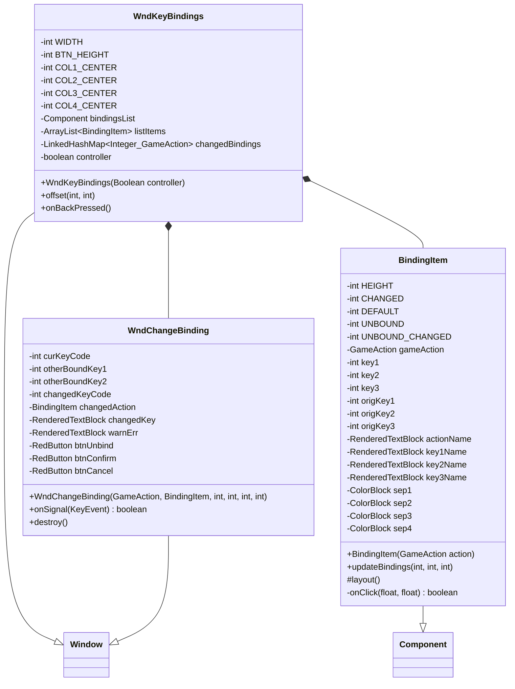

# WndKeyBindings 类文档

## 1. 基本信息

| 属性 | 值 |
|------|-----|
| **文件路径** | core/src/main/java/com/shatteredpixel/shatteredpixeldungeon/windows/WndKeyBindings.java |
| **包名** | com.shatteredpixel.shatteredpixeldungeon.windows |
| **类类型** | class |
| **继承关系** | extends Window |
| **代码行数** | 557 |
| **功能概述** | 键盘/控制器按键绑定配置窗口 |

## 2. 文件职责说明

WndKeyBindings 是键盘/控制器按键绑定配置窗口，允许玩家自定义游戏中的各种操作对应的按键或按钮，支持多键绑定和实时按键捕获。

**主要功能**：
1. **按键绑定列表**：显示所有可绑定的游戏操作及其当前绑定的按键
2. **多键绑定**：每个操作支持最多3个按键绑定
3. **实时按键捕获**：点击按键槽位后等待玩家按下新键
4. **冲突检测**：自动检测按键绑定冲突并提示
5. **默认重置**：支持恢复默认按键绑定
6. **双模式支持**：同时支持键盘和控制器绑定配置

## 3. 结构总览



## 4. 继承与协作关系

### 继承关系
- **父类**：Window（基础窗口类）
- **间接父类**：Component

### 协作关系
| 协作类 | 关系类型 | 协作说明 |
|--------|----------|----------|
| KeyBindings | 读取/写入 | 读取和保存按键绑定 |
| SPDAction | 读取 | 获取默认按键绑定 |
| GameAction | 读取 | 获取所有游戏操作列表 |
| Messages | 读取 | 获取本地化文本 |
| KeyEvent | 处理 | 处理键盘事件 |
| ControllerHandler | 读取 | 检测控制器按键 |

## 5. 字段与常量详解

### 类常量

| 常量 | 类型 | 值 | 说明 |
|------|------|-----|------|
| `WIDTH` | int | 135 | 窗口宽度 |
| `BTN_HEIGHT` | int | 16 | 按钮高度 |
| `COL1_CENTER` | int | WIDTH/5 | 第一列中心位置（操作名称） |
| `COL2_CENTER` | int | 5*WIDTH/10 | 第二列中心位置（按键1） |
| `COL3_CENTER` | int | 7*WIDTH/10 | 第三列中心位置（按键2） |
| `COL4_CENTER` | int | 9*WIDTH/10 | 第四列中心位置（按键3） |

### 实例字段

| 字段 | 类型 | 说明 |
|------|------|------|
| `bindingsList` | Component | 绑定列表容器 |
| `listItems` | ArrayList<BindingItem> | 所有绑定项列表 |
| `changedBindings` | LinkedHashMap<Integer, GameAction> | 修改后的绑定映射 |
| `controller` | boolean (static) | 是否为控制器模式 |

### BindingItem 常量

| 常量 | 类型 | 值 | 说明 |
|------|------|-----|------|
| `HEIGHT` | int | 13 | 绑定项高度 |
| `CHANGED` | int | TITLE_COLOR | 已修改颜色 |
| `DEFAULT` | int | 0xFFFFFF | 默认颜色 |
| `UNBOUND` | int | 0x888888 | 未绑定颜色 |
| `UNBOUND_CHANGED` | int | 0x888822 | 未绑定但已修改颜色 |

## 6. 构造与初始化机制

### 构造函数流程

```java
public WndKeyBindings(Boolean controller) {
    this.controller = controller;
    
    // 1. 获取当前绑定
    changedBindings = controller ? 
        KeyBindings.getAllControllerBindings() : 
        KeyBindings.getAllBindings();
    
    // 2. 创建表头
    RenderedTextBlock ttlAction = PixelScene.renderTextBlock(Messages.get(this, "ttl_action"), 9);
    RenderedTextBlock ttlKey1 = PixelScene.renderTextBlock(Messages.get(this, "ttl_key1"), 6);
    RenderedTextBlock ttlKey2 = PixelScene.renderTextBlock(Messages.get(this, "ttl_key2"), 6);
    RenderedTextBlock ttlKey3 = PixelScene.renderTextBlock(Messages.get(this, "ttl_key3"), 6);
    
    // 3. 创建滚动列表
    bindingsList = new Component();
    ScrollPane scrollingList = new ScrollPane(bindingsList) { ... };
    add(scrollingList);
    
    // 4. 添加控制器信息（仅控制器模式）
    if (controller) {
        RenderedTextBlock controllerInfo = PixelScene.renderTextBlock(Messages.get(this, "controller_info"), 6);
        bindingsList.add(controllerInfo);
    }
    
    // 5. 添加所有操作绑定项
    LinkedHashMap<Integer, GameAction> defaults = controller ? 
        SPDAction.getControllerDefaults() : SPDAction.getDefaults();
    ArrayList<GameAction> actionList = GameAction.allActions();
    
    for (GameAction action : actionList) {
        // 过滤无效操作
        if (action.code() < 1) continue;
        if (!controller && isMouseBinding(action)) continue;
        
        BindingItem item = new BindingItem(action);
        bindingsList.addToBack(item);
        listItems.add(item);
    }
    
    // 6. 添加底部按钮
    RedButton btnDefaults = new RedButton(Messages.get(this, "default"), 9) { ... };
    RedButton btnConfirm = new RedButton(Messages.get(this, "confirm"), 9) { ... };
    RedButton btnCancel = new RedButton(Messages.get(this, "cancel"), 9) { ... };
    
    // 7. 调整窗口大小
    resize(WIDTH, Math.min(BTN_HEIGHT * 3 + 3 + BindingItem.HEIGHT * listItems.size(), 
                           PixelScene.uiCamera.height - 20));
}
```

### 操作列表过滤
- 跳过 code < 1 的操作（NONE）
- 键盘模式下跳过鼠标绑定（LEFT_CLICK, RIGHT_CLICK, MIDDLE_CLICK）
- 无默认绑定的操作移到列表末尾

## 7. 方法详解

### 公开方法

#### WndKeyBindings(Boolean) - 构造函数
创建按键绑定窗口，根据参数决定是键盘模式还是控制器模式。

#### offset(int, int) - 偏移处理
```java
@Override
public void offset(int xOffset, int yOffset) {
    super.offset(xOffset, yOffset);
    bindingsList.setPos(bindingsList.left(), bindingsList.top());  // 触发布局
}
```

#### onBackPressed() - 返回键处理
```java
@Override
public void onBackPressed() {
    // 不执行任何操作，防止意外返回丢失进度
}
```

### BindingItem 内部类

#### BindingItem(GameAction) - 构造函数
```java
public BindingItem(GameAction action) {
    gameAction = action;
    
    // 创建操作名称文本
    actionName = PixelScene.renderTextBlock(Messages.get(WndKeyBindings.class, action.name()), 6);
    
    // 获取当前绑定的按键
    ArrayList<Integer> keys = controller ? 
        KeyBindings.getControllerKeysForAction(action) : 
        KeyBindings.getKeyboardKeysForAction(action);
    
    origKey1 = key1 = keys.isEmpty() ? 0 : keys.remove(0);
    origKey2 = key2 = keys.isEmpty() ? 0 : keys.remove(0);
    origKey3 = key3 = keys.isEmpty() ? 0 : keys.remove(0);
    
    // 创建按键名称文本
    key1Name = PixelScene.renderTextBlock(KeyBindings.getKeyName(key1), 6);
    if (key1 == 0) key1Name.hardlight(UNBOUND);
    
    // ... key2Name, key3Name 类似
}
```

#### updateBindings(int, int, int) - 更新绑定
```java
public void updateBindings(int first, int second, int third) {
    // 自动填充空位
    if (second == 0 && third != 0) { second = third; third = 0; }
    if (first == 0 && second != 0) { first = second; second = 0; }
    
    key1 = first;
    key2 = second;
    key3 = third;
    
    // 更新显示文本和颜色
    key1Name.text(KeyBindings.getKeyName(key1));
    if (key1 != origKey1) key1Name.hardlight(key1 == 0 ? UNBOUND_CHANGED : CHANGED);
    else key1Name.hardlight(key1 == 0 ? UNBOUND : DEFAULT);
    
    // ... key2Name, key3Name 类似
    layout();
}
```

#### onClick(float, float) - 点击处理
```java
private boolean onClick(float x, float y) {
    if (inside(x, y)) {
        // 根据点击位置确定要修改的按键槽位
        if (x >= this.x + 4*width()/5 - 1 && key2 != 0) {
            // 修改第三按键
            ShatteredPixelDungeon.scene().addToFront(
                new WndChangeBinding(gameAction, this, 3, key3, key1, key2));
        } else if (x >= this.x + 3*width()/5 - 1 && key1 != 0) {
            // 修改第二按键
            ShatteredPixelDungeon.scene().addToFront(
                new WndChangeBinding(gameAction, this, 2, key2, key1, key3));
        } else if (x >= this.x + 2*width()/5) {
            // 修改第一按键
            ShatteredPixelDungeon.scene().addToFront(
                new WndChangeBinding(gameAction, this, 1, key1, key2, key3));
        }
        return true;
    }
    return false;
}
```

### WndChangeBinding 内部类

#### WndChangeBinding(...) - 构造函数
```java
public WndChangeBinding(GameAction action, BindingItem listItem, int keyAssigning, 
                        int curKeyCode, int otherBoundKey1, int otherBoundKey2) {
    // 保存参数
    this.curKeyCode = curKeyCode;
    this.otherBoundKey1 = otherBoundKey1;
    this.otherBoundKey2 = otherBoundKey2;
    
    // 创建描述文本
    String descKey = keyAssigning == 1 ? "desc_first" : 
                     keyAssigning == 2 ? "desc_second" : "desc_third";
    RenderedTextBlock desc = PixelScene.renderTextBlock(Messages.get(this, descKey, ...));
    
    // 创建当前绑定显示
    RenderedTextBlock curBind = PixelScene.renderTextBlock(Messages.get(this, "desc_current", ...));
    
    // 创建修改后的按键显示
    changedKey = PixelScene.renderTextBlock(6);
    
    // 创建警告/错误显示
    warnErr = RenderedTextBlock(6);
    
    // 创建按钮
    btnUnbind = new RedButton(Messages.get(this, "unbind"), 9) { ... };
    btnConfirm = new RedButton(Messages.get(this, "confirm"), 9) { ... };
    btnCancel = new RedButton(Messages.get(this, "cancel"), 9) { ... };
    
    // 启用按键捕获模式
    KeyBindings.bindingKey = true;
}
```

#### onSignal(KeyEvent) - 按键事件处理
```java
@Override
public boolean onSignal(KeyEvent event) {
    // 忽略按钮上的左键点击
    if (KeyBindings.getActionForKey(event) == GameAction.LEFT_CLICK) {
        PointF hoverPos = camera().screenToCamera(...);
        if (btnUnbind.inside(hoverPos.x, hoverPos.y)) return true;
        if (btnConfirm.inside(hoverPos.x, hoverPos.y)) return true;
        if (btnCancel.inside(hoverPos.x, hoverPos.y)) return true;
    }
    
    // 忽略控制器/键盘不匹配的按键
    if (controller && !ControllerHandler.icControllerKey(event.code)) return true;
    if (!controller && !KeyEvent.isKeyboardKey(event.code)) return true;
    
    if (event.pressed) {
        changedKeyCode = event.code;
        changedAction = null;
        
        // 更新显示
        changedKey.text(Messages.get(this, "changed_bind", KeyBindings.getKeyName(event.code)));
        
        // 检查冲突
        if (event.code != 0 && (event.code == curKeyCode || 
            event.code == otherBoundKey1 || event.code == otherBoundKey2)) {
            // 同一操作的按键冲突
            warnErr.text(Messages.get(this, "error"));
            btnConfirm.enable(false);
        } else if (event.code != 0 && changedBindings.get(changedKeyCode) != null) {
            // 与其他操作的按键冲突
            for (BindingItem i : listItems) {
                if (i.gameAction == changedBindings.get(changedKeyCode)) {
                    changedAction = i;
                    break;
                }
            }
            warnErr.text(Messages.get(this, "warning", ...));
            btnConfirm.enable(true);
        } else {
            // 无冲突
            warnErr.text(" ");
            btnConfirm.enable(true);
        }
    }
    return true;
}
```

#### destroy() - 销毁处理
```java
@Override
public void destroy() {
    super.destroy();
    KeyBindings.bindingKey = false;  // 退出按键捕获模式
}
```

## 8. 对外暴露能力

### 公开API

| 方法 | 参数 | 返回值 | 说明 |
|------|------|--------|------|
| `WndKeyBindings(Boolean)` | 是否控制器模式 | 无 | 创建按键绑定窗口 |
| `offset(int, int)` | 偏移量 | void | 处理窗口偏移 |
| `onBackPressed()` | 无 | void | 返回键处理（空实现） |

## 9. 运行机制与调用链

### 窗口打开流程
```
用户打开设置 → 点击"键鼠键位"或"控制器键位"
    ↓
创建 WndKeyBindings(controller)
    ↓
获取当前按键绑定
    ↓
创建表头和滚动列表
    ↓
遍历所有操作创建绑定项
    ↓
添加底部按钮
    ↓
窗口显示
```

### 按键修改流程
```
点击按键槽位
    ↓
打开 WndChangeBinding 窗口
    ↓
KeyBindings.bindingKey = true（启用捕获模式）
    ↓
玩家按下新按键
    ↓
onSignal(KeyEvent) 处理按键
    ↓
检查冲突并显示警告
    ↓
玩家点击确认
    ↓
更新 changedBindings 映射
    ↓
更新 BindingItem 显示
    ↓
关闭 WndChangeBinding
    ↓
KeyBindings.bindingKey = false
```

### 保存绑定流程
```
点击"确定"按钮
    ↓
KeyBindings.setAllBindings(changedBindings)
    ↓
SPDAction.saveBindings()
    ↓
关闭窗口
```

## 10. 资源/配置/国际化关联

### 国际化资源

| 资源键 | 中文翻译 | 说明 |
|--------|----------|------|
| `windows.wndkeybindings.controller_info` | 使用左摇杆移动你的角色\n使用右摇杆移动光标 | 控制器提示 |
| `windows.wndkeybindings.ttl_action` | 行动 | 操作列标题 |
| `windows.wndkeybindings.ttl_key1` | 按键1 | 按键1列标题 |
| `windows.wndkeybindings.ttl_key2` | 按键2 | 按键2列标题 |
| `windows.wndkeybindings.ttl_key3` | 按键3 | 按键3列标题 |
| `windows.wndkeybindings.default` | 恢复默认键位 | 默认按钮 |
| `windows.wndkeybindings.confirm` | 确定 | 确认按钮 |
| `windows.wndkeybindings.cancel` | 取消 | 取消按钮 |
| `windows.wndkeybindings.none` | 无按键 | 无按键 |
| `windows.wndkeybindings.back` | 返回 | 返回操作 |
| `windows.wndkeybindings.left_click` | 左键单击 | 左键操作 |
| `windows.wndkeybindings.right_click` | 右键单击 | 右键操作 |
| `windows.wndkeybindings.middle_click` | 中键单击 | 中键操作 |
| `windows.wndkeybindings.menu` | 菜单 | 菜单操作 |
| `windows.wndkeybindings.hero_info` | 英雄信息 | 英雄信息操作 |
| `windows.wndkeybindings.journal` | 事件记录 | 日志操作 |
| `windows.wndkeybindings.wait` | 等待 | 等待操作 |
| `windows.wndkeybindings.examine` | 检视 | 检视操作 |
| `windows.wndkeybindings.rest` | 休息 | 休息操作 |
| `windows.wndkeybindings.inventory` | 打开背包 | 背包操作 |
| `windows.wndkeybindings.quickslot_1` | 快捷栏1 | 快捷栏操作 |
| `windows.wndkeybindings$wndchangebinding.desc_first` | 按下一个按键以替代_%s_的第一键位。 | 第一键位提示 |
| `windows.wndkeybindings$wndchangebinding.desc_second` | 按下一个按键以替代_%s_的第二键位。 | 第二键位提示 |
| `windows.wndkeybindings$wndchangebinding.desc_third` | 按下一个按键以替代_%s_的第三键位。 | 第三键位提示 |
| `windows.wndkeybindings$wndchangebinding.desc_current` | 当前键位：_%s_ | 当前键位显示 |
| `windows.wndkeybindings$wndchangebinding.changed_bind` | 新的键位：_%s_ | 新键位显示 |
| `windows.wndkeybindings$wndchangebinding.warning` | 这个按键将不再应用于_%s_。 | 冲突警告 |
| `windows.wndkeybindings$wndchangebinding.error` | 这个按键已经应用于该行动。 | 错误提示 |
| `windows.wndkeybindings$wndchangebinding.unbind` | 无按键 | 解绑按钮 |
| `windows.wndkeybindings$wndchangebinding.cant_unbind` | 至少要有一个键位对应此行动。 | 无法解绑提示 |

## 11. 使用示例

### 打开键盘绑定窗口
```java
// 打开键盘绑定窗口
ShatteredPixelDungeon.scene().addToFront(new WndKeyBindings(false));

// 打开控制器绑定窗口
ShatteredPixelDungeon.scene().addToFront(new WndKeyBindings(true));
```

### 恢复默认绑定
```java
// 点击"恢复默认键位"按钮后
changedBindings = SPDAction.getDefaults();  // 或 getControllerDefaults()
for (BindingItem i : listItems) {
    // 更新每个绑定项的显示
    i.updateBindings(key1, key2, key3);
}
```

## 12. 开发注意事项

### 按键捕获模式
- `KeyBindings.bindingKey = true` 时，游戏不会处理按键的游戏操作
- 必须在 `destroy()` 中设置 `bindingKey = false`

### 冲突检测
- 同一操作的按键不能重复
- 不同操作使用相同按键会显示警告但允许绑定
- 左键点击操作至少需要一个绑定

### 颜色编码
- **白色**：默认绑定
- **标题色**：已修改
- **灰色**：未绑定
- **暗黄色**：未绑定但已修改

### 控制器/键盘分离
- 控制器模式仅接受控制器按键
- 键盘模式仅接受键盘按键
- 鼠标绑定仅在控制器模式下可用

## 13. 修改建议与扩展点

### 扩展点

1. **添加新操作**：
   - 在 SPDAction 枚举中添加新操作
   - 添加对应的本地化文本
   - 设置默认绑定

2. **自定义绑定数量**：
   - 修改 BindingItem 支持更多按键槽位
   - 更新列布局

3. **导入导出**：
   - 添加按键配置导入导出功能
   - 支持配置文件分享

### 修改建议

1. **搜索功能**：添加操作搜索功能，方便查找
2. **分类显示**：按功能分类显示操作（移动、战斗、界面等）
3. **快捷修改**：支持直接在游戏中修改按键绑定

## 14. 事实核查清单

- [x] 是否已覆盖全部字段（bindingsList, listItems, changedBindings, controller）
- [x] 是否已覆盖全部常量（WIDTH, BTN_HEIGHT, COL*_CENTER）
- [x] 是否已覆盖全部公开方法（构造函数, offset, onBackPressed）
- [x] 是否已覆盖全部内部类（BindingItem, WndChangeBinding）
- [x] 是否已确认继承关系（extends Window）
- [x] 是否已确认协作关系（KeyBindings, SPDAction, GameAction等）
- [x] 是否已验证中文翻译来源（windows_zh.properties）
- [x] 是否已确认按键捕获模式机制
- [x] 是否已确认冲突检测逻辑
- [x] 是否已确认控制器/键盘分离逻辑
