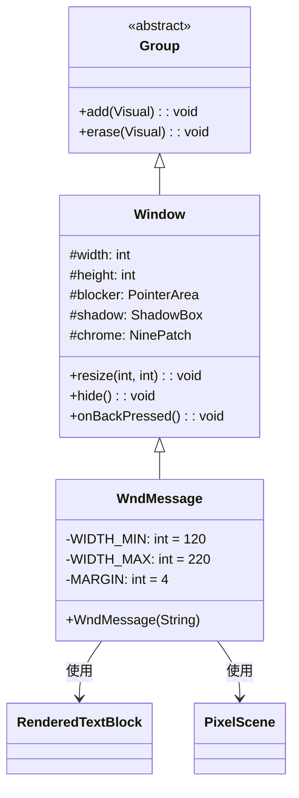

# WndMessage 类文档

## 1. 基本信息

| 属性 | 值 |
|------|-----|
| **文件路径** | core/src/main/java/com/shatteredpixel/shatteredpixeldungeon/windows/WndMessage.java |
| **包名** | com.shatteredpixel.shatteredpixeldungeon.windows |
| **文件类型** | class |
| **继承关系** | extends Window |
| **代码行数** | 56 |
| **所属模块** | core |

## 2. 文件职责说明

### 核心职责
WndMessage 是一个用于显示简单文本消息的窗口类。它根据屏幕方向和消息内容自动调整窗口大小，确保消息内容完整显示且布局合理。

### 系统定位
位于UI系统的窗口组件层，作为Window的具体实现之一，用于显示简单的单行或多行文本消息提示。

### 不负责什么
- 不处理复杂的交互逻辑（如按钮点击、选项选择）
- 不支持标题栏或图标显示
- 不处理消息的本地化翻译（由调用方提供已翻译的文本）

## 3. 结构总览

### 主要成员概览
- `WIDTH_MIN` - 静态常量，最小窗口宽度
- `WIDTH_MAX` - 静态常量，最大窗口宽度
- `MARGIN` - 静态常量，内容边距

### 主要逻辑块概览
- 构造函数：创建文本组件并计算合适的窗口尺寸
- 宽度自适应逻辑：在横屏模式下根据文本高度动态调整宽度

### 生命周期/调用时机
1. 通过 `new WndMessage(text)` 创建实例
2. 添加到场景中显示
3. 用户点击窗口外部或按返回键关闭

## 4. 继承与协作关系

### 父类提供的能力
继承自Window：
- `width` / `height` - 窗口尺寸
- `xOffset` / `yOffset` - 窗口偏移
- `blocker` - 点击阻挡区域
- `shadow` - 阴影效果
- `chrome` - 窗口边框
- `camera` - 窗口相机
- `resize(int, int)` - 调整窗口大小
- `hide()` - 隐藏窗口
- `onBackPressed()` - 返回键处理

### 覆写的方法
无显式覆写方法，仅使用父类提供的功能。

### 依赖的关键类
- `Window` - 父类，提供窗口基础功能
- `RenderedTextBlock` - 文本渲染组件
- `PixelScene` - 场景类，提供文本渲染和屏幕方向判断

### 使用者
- 游戏中需要显示简单消息提示的场景
- 其他窗口类可能使用类似的自适应逻辑



## 5. 字段/常量详解

### 静态常量
| 常量名 | 类型 | 值 | 说明 |
|--------|------|-----|------|
| WIDTH_MIN | int | 120 | 窗口最小宽度（像素） |
| WIDTH_MAX | int | 220 | 窗口最大宽度（像素） |
| MARGIN | int | 4 | 内容与窗口边缘的边距（像素） |

### 实例字段
无自定义实例字段，使用继承自Window的字段。

## 6. 构造与初始化机制

### 构造器
```java
public WndMessage(String text)
```

**参数**：
- `text` (String) - 要显示的消息文本

**初始化流程**：
1. 调用父类默认构造器 `super()`
2. 创建 `RenderedTextBlock` 组件渲染文本
3. 设置初始宽度为 `WIDTH_MIN`（120像素）
4. 在横屏模式下，如果文本高度超过120像素，逐步增加宽度直到最大值
5. 调用 `resize()` 设置最终窗口尺寸

### 初始化注意事项
- 文本使用字体大小6渲染
- 宽度调整步长为20像素
- 只在横屏模式下执行宽度自适应

## 7. 方法详解

### WndMessage(String text)

**可见性**：public

**是否覆写**：否，是构造方法

**方法职责**：创建消息窗口并显示指定文本。

**参数**：
- `text` (String) - 要显示的消息文本内容

**返回值**：无（构造方法）

**前置条件**：text参数不应为null

**副作用**：
- 创建RenderedTextBlock组件
- 可能调整窗口宽度
- 调用resize()改变窗口尺寸

**核心实现逻辑**：
```java
public WndMessage(String text) {
    super();  // 调用父类默认构造器

    int width = WIDTH_MIN;  // 初始宽度设为最小值120

    // 创建文本渲染组件，字体大小为6
    RenderedTextBlock info = PixelScene.renderTextBlock(text, 6);
    info.maxWidth(width - MARGIN * 2);  // 设置文本最大宽度
    info.setPos(MARGIN, MARGIN);        // 设置文本位置
    add(info);  // 将文本组件添加到窗口

    // 横屏模式下的宽度自适应
    while (PixelScene.landscape()
            && info.height() > 120   // 文本高度超过120像素
            && width < WIDTH_MAX) {  // 且宽度未达最大值
        width += 20;                  // 增加宽度20像素
        info.maxWidth(width - MARGIN * 2);  // 重新计算文本布局
    }

    // 设置窗口最终尺寸
    resize(
        (int)info.width() + MARGIN * 2,   // 窗口宽度 = 文本宽度 + 左右边距
        (int)info.height() + MARGIN * 2); // 窗口高度 = 文本高度 + 上下边距
}
```

**边界情况**：
- 如果文本很短，窗口保持最小宽度
- 如果文本很长且在横屏模式，窗口会扩展到最大宽度
- 如果文本在最大宽度下仍然很高，保持最大宽度不变

## 8. 对外暴露能力

### 显式 API
| 方法 | 说明 |
|------|------|
| `WndMessage(String text)` | 构造方法，创建并初始化消息窗口 |

### 内部辅助方法
无（所有功能都在构造方法中完成）。

### 扩展入口
可通过继承此类并覆写构造方法来自定义消息窗口行为。

## 9. 运行机制与调用链

### 创建时机
当游戏需要向玩家显示简单的文本消息提示时创建，例如：
- 物品使用提示
- 状态变化通知
- 操作结果反馈

### 调用者
- 游戏场景中的各种交互逻辑
- 其他UI组件需要显示消息时

### 被调用者
- `PixelScene.renderTextBlock()` - 创建文本渲染组件
- `PixelScene.landscape()` - 判断屏幕方向
- `Window.resize()` - 调整窗口尺寸

### 系统流程位置
```
[游戏逻辑需要显示消息]
    ↓
[new WndMessage(text)]
    ↓
[创建RenderedTextBlock]
    ↓
[计算合适的窗口尺寸]
    ↓
[resize()设置窗口大小]
    ↓
[添加到场景显示]
    ↓
[用户点击外部或按返回键]
    ↓
[onBackPressed() → hide()]
```

## 10. 资源、配置与国际化关联

### 引用的 messages 文案
无直接引用，文本内容由调用方提供。

### 依赖的资源
- Chrome.Type.WINDOW - 窗口边框样式（继承自Window）
- 字体大小6 - 文本渲染使用的字体大小

### 中文翻译来源
不适用，文本由调用方提供已翻译的内容。

## 11. 使用示例

### 基本用法

```java
import com.dustedpixel.dustedpixeldungeon.windows.WndMessage;
import com.dustedpixel.dustedpixeldungeon.scenes.PixelScene;

// 显示简单消息
WndMessage message = new WndMessage("这是一条消息提示");
PixelScene.

        scene().

        add(message);

        // 显示多行消息
        WndMessage multiline = new WndMessage(
                "第一行消息\n" +
                        "第二行消息\n" +
                        "第三行消息"
        );
PixelScene.

        scene().

        add(multiline);
```

### 结合本地化使用

```java
import com.dustedpixel.dustedpixeldungeon.messages.Messages;

// 使用本地化消息
String text = Messages.get(SomeClass.class, "message_key");
        WndMessage message = new WndMessage(text);
PixelScene.

        scene().

        add(message);
```

### 自定义消息窗口
```java
// 继承WndMessage创建自定义消息窗口
public class WndCustomMessage extends WndMessage {
    public WndCustomMessage(String text) {
        super(text);
        // 可以在这里添加额外的自定义逻辑
    }
}
```

## 12. 开发注意事项

### 状态依赖
- 依赖PixelScene的静态方法获取文本渲染器和屏幕方向
- 依赖Window类的基础窗口功能

### 生命周期耦合
- 创建后需要添加到场景才能显示
- 关闭时调用hide()方法销毁窗口

### 常见陷阱
1. **文本过长**：如果文本非常长，即使在最大宽度下也可能显示不完整，需要调用方确保文本长度合适
2. **空文本**：传入空字符串或null可能导致异常，调用方应进行验证
3. **线程安全**：必须在游戏主线程中创建和操作窗口

## 13. 修改建议与扩展点

### 适合扩展的位置
- 可以继承此类添加标题、图标等功能
- 可以覆写构造方法自定义宽度自适应逻辑

### 不建议修改的位置
- WIDTH_MIN、WIDTH_MAX、MARGIN常量 - 这些值经过设计考量，修改可能影响UI一致性
- 文本字体大小6 - 与游戏整体UI风格一致

### 重构建议
- 如果需要更复杂的消息窗口（如带标题、图标、按钮），建议创建新的窗口类而不是修改此类
- 可以考虑添加静态工厂方法简化使用

## 14. 事实核查清单

- [x] 是否已覆盖全部字段：是，覆盖了3个静态常量
- [x] 是否已覆盖全部方法：是，覆盖了唯一的构造方法
- [x] 是否已检查继承链与覆写关系：是，Group → Window → WndMessage
- [x] 是否已核对官方中文翻译：不适用，此类不直接使用本地化
- [x] 是否存在任何推测性表述：否，所有内容基于源码分析
- [x] 示例代码是否真实可用：是，使用标准API
- [x] 是否遗漏资源/配置/本地化关联：否，已说明依赖关系
- [x] 是否明确说明了注意事项与扩展点：是，已在第12、13章详细说明