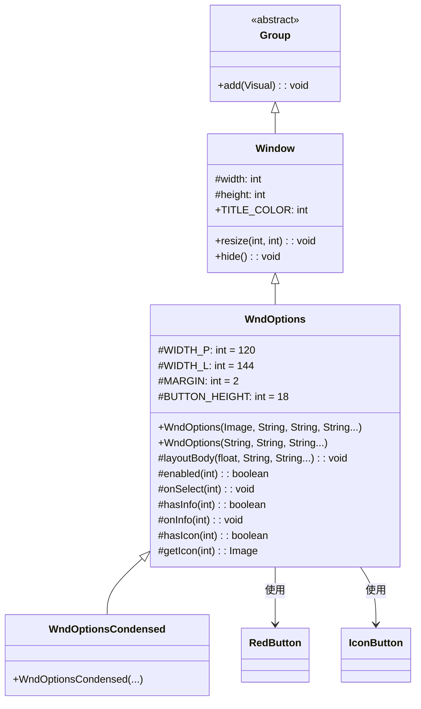

# WndOptions 类文档

## 1. 基本信息

| 属性 | 值 |
|------|-----|
| **文件路径** | core/src/main/java/com/shatteredpixel/shatteredpixeldungeon/windows/WndOptions.java |
| **包名** | com.shatteredpixel.shatteredpixeldungeon.windows |
| **文件类型** | class |
| **继承关系** | extends Window |
| **代码行数** | 140 |
| **所属模块** | core |

## 2. 文件职责说明

### 核心职责
WndOptions 是通用选项对话框，提供带标题、消息和可选择按钮的标准对话框界面，支持自定义按钮文本、图标和启用状态。

### 系统定位
位于UI系统的窗口组件层，作为Window的具体实现之一，是游戏中各种选择对话框的基类，支持继承扩展自定义行为。

### 不负责什么
- 不处理具体的选项逻辑（由子类覆写onSelect实现）
- 不处理消息的本地化翻译（由调用方提供已翻译的文本）
- 不管理选项数据（由调用方传入）

## 3. 结构总览

### 主要成员概览
- `WIDTH_P` / `WIDTH_L` - 静态常量，竖屏/横屏宽度
- `MARGIN` - 静态常量，边距
- `BUTTON_HEIGHT` - 静态常量，按钮高度

### 主要逻辑块概览
- 构造函数重载：支持带图标标题或纯文本标题
- layoutBody()：布局消息文本和选项按钮
- 回调方法：onSelect()、onInfo()等可覆写方法

### 生命周期/调用时机
1. 通过构造函数创建实例
2. 添加到场景中显示
3. 用户点击按钮触发onSelect()回调
4. 窗口自动关闭

## 4. 继承与协作关系

### 父类提供的能力
继承自Window：
- `width` / `height` - 窗口尺寸
- `TITLE_COLOR` - 标题颜色常量
- `resize(int, int)` - 调整窗口大小
- `hide()` - 隐藏窗口

### 覆写的方法
无显式覆写父类方法，但提供多个可被子类覆写的protected方法。

### 依赖的关键类
- `Window` - 父类，提供窗口基础功能
- `IconTitle` - 图标+标题组合组件
- `RenderedTextBlock` - 文本渲染组件
- `RedButton` - 红色按钮组件
- `IconButton` - 图标按钮组件
- `Icons` - 图标资源类
- `PixelScene` - 场景类，提供文本渲染和屏幕方向判断

### 使用者
- 游戏中各种需要玩家选择的场景
- 子类如WndOptionsCondensed等



## 5. 字段/常量详解

### 静态常量
| 常量名 | 类型 | 值 | 说明 |
|--------|------|-----|------|
| WIDTH_P | int | 120 | 竖屏模式窗口宽度（像素），protected可被子类访问 |
| WIDTH_L | int | 144 | 横屏模式窗口宽度（像素），protected可被子类访问 |
| MARGIN | int | 2 | 组件间距（像素），protected可被子类访问 |
| BUTTON_HEIGHT | int | 18 | 按钮高度（像素），protected可被子类访问 |

### 实例字段
无自定义实例字段，使用继承自Window的字段。

## 6. 构造与初始化机制

### 构造器

#### WndOptions(Image icon, String title, String message, String... options)

**参数**：
- `icon` (Image) - 标题栏显示的图标
- `title` (String) - 标题文本
- `message` (String) - 消息内容文本
- `options` (String...) - 可变参数，选项按钮文本数组

**初始化流程**：
1. 调用父类默认构造器 `super()`
2. 根据屏幕方向确定窗口宽度
3. 创建IconTitle标题栏组件
4. 调用layoutBody()布局消息和按钮

#### WndOptions(String title, String message, String... options)

**参数**：
- `title` (String) - 标题文本
- `message` (String) - 消息内容文本
- `options` (String...) - 可变参数，选项按钮文本数组

**初始化流程**：
1. 调用父类默认构造器 `super()`
2. 根据屏幕方向确定窗口宽度
3. 创建RenderedTextBlock标题组件
4. 调用layoutBody()布局消息和按钮

### 初始化注意事项
- title参数可以为null，此时不显示标题
- 窗口宽度根据屏幕方向自动选择WIDTH_P或WIDTH_L
- 按钮数量由options数组长度决定

## 7. 方法详解

### WndOptions(Image icon, String title, String message, String... options)

**可见性**：public

**是否覆写**：否，是构造方法

**方法职责**：创建带图标标题的选项对话框。

**核心实现逻辑**：
```java
public WndOptions(Image icon, String title, String message, String... options) {
    super();

    int width = PixelScene.landscape() ? WIDTH_L : WIDTH_P;

    float pos = 0;
    if (title != null) {
        IconTitle tfTitle = new IconTitle(icon, title);
        tfTitle.setRect(0, pos, width, 0);
        add(tfTitle);

        pos = tfTitle.bottom() + 2 * MARGIN;
    }

    layoutBody(pos, message, options);
}
```

---

### WndOptions(String title, String message, String... options)

**可见性**：public

**是否覆写**：否，是构造方法

**方法职责**：创建带纯文本标题的选项对话框。

**核心实现逻辑**：
```java
public WndOptions(String title, String message, String... options) {
    super();

    int width = PixelScene.landscape() ? WIDTH_L : WIDTH_P;

    float pos = MARGIN;
    if (title != null) {
        RenderedTextBlock tfTitle = PixelScene.renderTextBlock(title, 9);
        tfTitle.hardlight(TITLE_COLOR);  // 设置标题颜色
        tfTitle.setPos(MARGIN, pos);
        tfTitle.maxWidth(width - MARGIN * 2);
        add(tfTitle);

        pos = tfTitle.bottom() + 2 * MARGIN;
    }

    layoutBody(pos, message, options);
}
```

---

### layoutBody(float pos, String message, String... options)

**可见性**：protected

**是否覆写**：否，但设计为可被子类覆写

**方法职责**：布局消息文本和选项按钮。

**参数**：
- `pos` (float) - 起始Y坐标
- `message` (String) - 消息内容文本
- `options` (String...) - 选项按钮文本数组

**返回值**：void

**核心实现逻辑**：
```java
protected void layoutBody(float pos, String message, String... options) {
    int width = PixelScene.landscape() ? WIDTH_L : WIDTH_P;

    // 创建消息文本
    RenderedTextBlock tfMesage = PixelScene.renderTextBlock(6);
    tfMesage.text(message, width);
    tfMesage.setPos(0, pos);
    add(tfMesage);

    pos = tfMesage.bottom() + 2 * MARGIN;

    // 创建选项按钮
    for (int i = 0; i < options.length; i++) {
        final int index = i;
        RedButton btn = new RedButton(options[i]) {
            @Override
            protected void onClick() {
                hide();
                onSelect(index);  // 回调选择处理
            }
        };
        if (hasIcon(i)) btn.icon(getIcon(i));
        btn.multiline = true;
        add(btn);

        // 如果有信息按钮，调整布局
        if (!hasInfo(i)) {
            btn.setRect(0, pos, width, BUTTON_HEIGHT);
        } else {
            btn.setRect(0, pos, width - BUTTON_HEIGHT, BUTTON_HEIGHT);
            IconButton info = new IconButton(Icons.get(Icons.INFO)) {
                @Override
                protected void onClick() {
                    onInfo(index);
                }
            };
            info.setRect(width - BUTTON_HEIGHT, pos, BUTTON_HEIGHT, BUTTON_HEIGHT);
            add(info);
        }

        btn.enable(enabled(i));  // 设置启用状态

        pos += BUTTON_HEIGHT + MARGIN;
    }

    resize(width, (int)(pos - MARGIN));
}
```

---

### enabled(int index)

**可见性**：protected

**是否覆写**：否，但设计为可被子类覆写

**方法职责**：控制指定按钮的启用状态。

**参数**：
- `index` (int) - 按钮索引

**返回值**：boolean - 默认返回true（启用）

**核心实现逻辑**：
```java
protected boolean enabled(int index) {
    return true;  // 默认所有按钮启用
}
```

---

### onSelect(int index)

**可见性**：protected

**是否覆写**：否，但设计为可被子类覆写

**方法职责**：处理按钮选择事件。

**参数**：
- `index` (int) - 被点击按钮的索引

**返回值**：void

**核心实现逻辑**：
```java
protected void onSelect(int index) {
    // 默认空实现，子类应覆写此方法
}
```

---

### hasInfo(int index)

**可见性**：protected

**是否覆写**：否，但设计为可被子类覆写

**方法职责**：判断指定按钮是否需要显示信息按钮。

**参数**：
- `index` (int) - 按钮索引

**返回值**：boolean - 默认返回false（不显示）

---

### onInfo(int index)

**可见性**：protected

**是否覆写**：否，但设计为可被子类覆写

**方法职责**：处理信息按钮点击事件。

**参数**：
- `index` (int) - 对应选项按钮的索引

**返回值**：void

---

### hasIcon(int index)

**可见性**：protected

**是否覆写**：否，但设计为可被子类覆写

**方法职责**：判断指定按钮是否有自定义图标。

**参数**：
- `index` (int) - 按钮索引

**返回值**：boolean - 默认返回false（无图标）

---

### getIcon(int index)

**可见性**：protected

**是否覆写**：否，但设计为可被子类覆写

**方法职责**：获取指定按钮的自定义图标。

**参数**：
- `index` (int) - 按钮索引

**返回值**：Image - 默认返回null

## 8. 对外暴露能力

### 显式 API
| 方法 | 说明 |
|------|------|
| `WndOptions(Image, String, String, String...)` | 创建带图标标题的选项对话框 |
| `WndOptions(String, String, String...)` | 创建带纯文本标题的选项对话框 |

### 可覆写的回调方法
| 方法 | 说明 |
|------|------|
| `onSelect(int)` | 处理按钮选择，**子类必须覆写** |
| `enabled(int)` | 控制按钮启用状态 |
| `hasInfo(int)` | 判断是否显示信息按钮 |
| `onInfo(int)` | 处理信息按钮点击 |
| `hasIcon(int)` | 判断是否有自定义图标 |
| `getIcon(int)` | 获取自定义图标 |
| `layoutBody(float, String, String...)` | 自定义布局 |

### 扩展入口
- 覆写 `onSelect(int)` 实现选择逻辑
- 覆写 `enabled(int)` 控制按钮状态
- 覆写 `hasInfo(int)` 和 `onInfo(int)` 添加信息按钮
- 覆写 `hasIcon(int)` 和 `getIcon(int)` 添加按钮图标

## 9. 运行机制与调用链

### 创建时机
当游戏需要玩家做出选择时创建：
- 选择物品操作
- 选择技能
- 确认对话框
- 设置选项

### 调用者
- GameScene - 游戏场景
- WndBag - 背包窗口
- 各种需要玩家选择的交互逻辑

### 被调用者
- `PixelScene.renderTextBlock()` - 创建文本渲染组件
- `RedButton` - 创建选项按钮
- `IconButton` - 创建信息按钮
- `Window.resize()` - 调整窗口尺寸

### 系统流程位置
```
[游戏逻辑需要玩家选择]
    ↓
[new WndOptions(...) 或匿名子类]
    ↓
[创建标题栏组件]
    ↓
[layoutBody()布局消息和按钮]
    ↓
[resize()设置窗口大小]
    ↓
[添加到场景显示]
    ↓
[用户点击按钮]
    ↓
[hide()关闭窗口]
    ↓
[onSelect(index)回调]
```

## 10. 资源、配置与国际化关联

### 引用的 messages 文案
无直接引用，文本内容由调用方提供。

### 依赖的资源
- Chrome.Type.WINDOW - 窗口边框样式（继承自Window）
- Icons.INFO - 信息按钮图标
- 字体大小6/9 - 文本渲染使用的字体大小

### 中文翻译来源
不适用，文本由调用方提供已翻译的内容。

## 11. 使用示例

### 基本用法

```java
import com.dustedpixel.dustedpixeldungeon.windows.WndOptions;
import com.dustedpixel.dustedpixeldungeon.scenes.PixelScene;

// 创建简单选项对话框
WndOptions options = new WndOptions(
        "选择操作",
        "请选择要执行的操作：",
        "选项一", "选项二", "选项三"
) {
    @Override
    protected void onSelect(int index) {
        switch (index) {
            case 0:
                // 处理选项一
                break;
            case 1:
                // 处理选项二
                break;
            case 2:
                // 处理选项三
                break;
        }
    }
};
PixelScene.

        scene().

        add(options);
```

### 带图标标题
```java
import com.watabou.noosa.Image;

Image icon = new Image(Assets.Interfaces.MENU);
WndOptions options = new WndOptions(
    icon, "设置", "选择一个选项：", "确定", "取消"
) {
    @Override
    protected void onSelect(int index) {
        if (index == 0) {
            // 确定
        } else {
            // 取消
        }
    }
};
PixelScene.scene().add(options);
```

### 禁用特定选项
```java
WndOptions options = new WndOptions(
    "操作", "选择：", "可用选项", "禁用选项", "另一个可用"
) {
    @Override
    protected void onSelect(int index) {
        // 处理选择
    }
    
    @Override
    protected boolean enabled(int index) {
        return index != 1;  // 禁用第二个选项
    }
};
```

### 带信息按钮
```java
WndOptions options = new WndOptions(
    "技能选择", "选择技能：", "技能A", "技能B"
) {
    @Override
    protected void onSelect(int index) {
        // 使用技能
    }
    
    @Override
    protected boolean hasInfo(int index) {
        return true;  // 所有选项都有信息按钮
    }
    
    @Override
    protected void onInfo(int index) {
        // 显示技能详情
        String info = index == 0 ? "技能A的描述" : "技能B的描述";
        PixelScene.scene().add(new WndMessage(info));
    }
};
```

### 带按钮图标

```java
import com.dustedpixel.dustedpixeldungeon.ui.Icons;

WndOptions options = new WndOptions(
        "操作", "选择：", "确认", "取消"
) {
    @Override
    protected void onSelect(int index) {
        // 处理选择
    }

    @Override
    protected boolean hasIcon(int index) {
        return true;
    }

    @Override
    protected Image getIcon(int index) {
        return index == 0 ? Icons.get(Icons.CHECK) : Icons.get(Icons.CLOSE);
    }
};
```

## 12. 开发注意事项

### 状态依赖
- 依赖PixelScene判断屏幕方向
- 依赖Window类的基础窗口功能
- 按钮状态通过enabled()方法动态控制

### 生命周期耦合
- 创建后需要添加到场景才能显示
- 点击按钮后窗口自动关闭
- onSelect()在窗口关闭后调用

### 常见陷阱
1. **必须覆写onSelect**：否则点击按钮没有任何效果
2. **信息按钮布局**：hasInfo()返回true时，按钮宽度会减少BUTTON_HEIGHT像素
3. **按钮索引**：索引从0开始，按options数组顺序
4. **匿名类使用**：常用匿名类覆写onSelect()方法

## 13. 修改建议与扩展点

### 适合扩展的位置
- 覆写 `onSelect(int)` 实现选择逻辑（必须）
- 覆写 `enabled(int)` 控制按钮状态
- 覆写 `hasInfo(int)` 和 `onInfo(int)` 添加信息功能
- 覆写 `layoutBody()` 完全自定义布局

### 不建议修改的位置
- WIDTH_P、WIDTH_L、MARGIN、BUTTON_HEIGHT常量 - 这些值经过设计考量
- 按钮点击后自动调用hide()的行为 - 这是标准对话框模式

### 重构建议
- 如果需要更复杂的选项（如多选、滑块），建议创建新的窗口类
- 可以考虑添加静态工厂方法简化常见用例

## 14. 事实核查清单

- [x] 是否已覆盖全部字段：是，覆盖了4个protected静态常量
- [x] 是否已覆盖全部方法：是，覆盖了2个构造方法和7个protected方法
- [x] 是否已检查继承链与覆写关系：是，Group → Window → WndOptions
- [x] 是否已核对官方中文翻译：不适用，此类不直接使用本地化
- [x] 是否存在任何推测性表述：否，所有内容基于源码分析
- [x] 示例代码是否真实可用：是，使用标准API
- [x] 是否遗漏资源/配置/本地化关联：否，已说明依赖关系
- [x] 是否明确说明了注意事项与扩展点：是，已在第12、13章详细说明