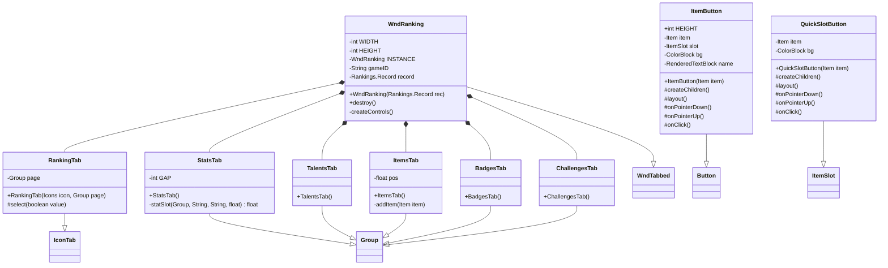

# WndRanking 类文档

## 1. 基本信息

| 属性 | 值 |
|------|-----|
| **文件路径** | core/src/main/java/com/shatteredpixel/shatteredpixeldungeon/windows/WndRanking.java |
| **包名** | com.shatteredpixel.shatteredpixeldungeon.windows |
| **类类型** | class |
| **继承关系** | extends WndTabbed |
| **代码行数** | 612 |
| **功能概述** | 游戏结束后的排名/总结窗口 |

## 2. 文件职责说明

WndRanking 是游戏结束后的排名/总结窗口，继承自 WndTabbed（带标签页导航的窗口基类）。它提供多个标签页展示英雄的最终状态、获得的天赋、收集的物品、解锁的徽章和完成的挑战。

**主要功能**：
1. **统计标签页（StatsTab）**：显示英雄的最终属性、等级、收集的金币、探索的深度等基本信息
2. **天赋标签页（TalentsTab）**：列出英雄在游戏中获得的所有天赋
3. **物品标签页（ItemsTab）**：展示背包中的装备和快捷栏物品
4. **徽章标签页（BadgesTab）**：显示本次游戏中解锁的徽章
5. **挑战标签页（ChallengesTab）**：列出启用的挑战模式（仅当有挑战时显示）

## 3. 结构总览



## 4. 继承与协作关系

### 继承关系
- **父类**：WndTabbed（带标签页导航的窗口基类）
- **间接父类**：Window → Component

### 协作关系
| 协作类 | 关系类型 | 协作说明 |
|--------|----------|----------|
| Rankings.Record | 读取 | 排名记录数据，包含英雄类、等级、日期等 |
| Rankings | 调用 | 加载游戏数据 |
| Dungeon | 读取 | 获取英雄实例、挑战状态、种子信息 |
| Statistics | 读取 | 获取游戏统计数据（击杀、金币等） |
| Badges | 读取/调用 | 加载全局徽章、过滤已替换徽章 |
| Messages | 读取 | 获取本地化文本 |
| WndScoreBreakdown | 创建 | 显示得分详情窗口 |
| WndInfoItem | 创建 | 显示物品详情窗口 |
| WndMessage | 创建 | 显示挑战描述窗口 |
| TalentsPane | 创建 | 显示天赋面板 |
| BadgesList | 创建 | 徽章列表组件 |
| BadgesGrid | 创建 | 徽章网格组件 |

## 5. 字段与常量详解

### 类常量

| 常量 | 类型 | 值 | 说明 |
|------|------|-----|------|
| `WIDTH` | int | 115 | 窗口宽度 |
| `HEIGHT` | int | 144 | 窗口高度 |

### 实例字段

| 字段 | 类型 | 说明 |
|------|------|------|
| `INSTANCE` | WndRanking (static) | 单例引用，确保同时只有一个排名窗口 |
| `gameID` | String | 游戏唯一标识符 |
| `record` | Rankings.Record | 排名记录数据 |

### 内部类常量

**ItemButton**:
| 常量 | 类型 | 值 | 说明 |
|------|------|-----|------|
| `HEIGHT` | int | 23 | 物品按钮高度 |

## 6. 构造与初始化机制

### 构造函数流程

```java
public WndRanking(final Rankings.Record rec) {
    super();
    resize(WIDTH, HEIGHT);
    
    // 1. 单例检查：关闭之前的实例
    if (INSTANCE != null) {
        INSTANCE.hide();
    }
    INSTANCE = this;
    
    // 2. 保存记录引用
    this.gameID = rec.gameID;
    this.record = rec;
    
    // 3. 加载数据并创建控件
    try {
        Badges.loadGlobal();
        Rankings.INSTANCE.loadGameData(rec);
        createControls();
    } catch (Exception e) {
        // 加载失败时创建错误显示
        Game.reportException(new RuntimeException("Rankings Display Failed!", e));
        Dungeon.hero = null;
        createControls();
    }
}
```

### createControls() 控件创建
```java
private void createControls() {
    if (Dungeon.hero != null) {
        // 正常情况：创建所有标签页
        Icons[] icons = {Icons.RANKINGS, Icons.TALENT, Icons.BACKPACK_LRG, Icons.BADGES, Icons.CHALLENGE_COLOR};
        Group[] pages = {new StatsTab(), new TalentsTab(), new ItemsTab(), new BadgesTab(), null};
        
        // 仅当有挑战时添加挑战标签页
        if (Dungeon.challenges != 0) pages[4] = new ChallengesTab();
        
        // 添加所有标签页
        for (int i = 0; i < pages.length; i++) {
            if (pages[i] == null) break;
            add(pages[i]);
            Tab tab = new RankingTab(icons[i], pages[i]);
            add(tab);
        }
        
        layoutTabs();
        select(0);
    } else {
        // 错误情况：仅显示统计标签页
        StatsTab tab = new StatsTab();
        add(tab);
    }
}
```

## 7. 方法详解

### 公开方法

#### WndRanking(Rankings.Record) - 构造函数
初始化排名窗口，加载游戏数据并创建标签页。

#### destroy() - 重写销毁方法
```java
@Override
public void destroy() {
    super.destroy();
    if (INSTANCE == this) {
        INSTANCE = null;
    }
}
```

### StatsTab 内部类

#### StatsTab() - 构造函数
创建统计标签页，显示英雄的最终属性。

**显示内容**：
- 英雄头像和等级
- 游戏日期和版本
- 得分（可点击查看详情）
- 力量值（含加成/减益）
- 游戏时长
- 最深层数/最远返程
- 地牢种子（如有）
- 击杀敌人数
- 收集金币数
- 食物消耗量
- 炼金制造数

#### statSlot() - 统计槽位
```java
private float statSlot(Group parent, String label, String value, float pos) {
    // 创建标签文本（自动缩小以适应宽度）
    // 创建值文本（自动缩小以适应宽度）
    // 返回下一个槽位的位置
}
```

### TalentsTab 内部类

#### TalentsTab() - 构造函数
创建天赋标签页，使用 TalentsPane 显示所有天赋。

**天赋层数计算**：
- 1层：基础天赋
- 2层：等级≥6解锁
- 3层：等级≥12且有专精解锁
- 4层：等级≥20且有护甲技能解锁

### ItemsTab 内部类

#### ItemsTab() - 构造函数
创建物品标签页，显示装备和快捷栏物品。

**显示顺序**：
1. 武器
2. 护甲
3. 饰品
4. 杂项装备
5. 戒指
6. 饰物（Trinket）
7. 快捷栏物品

#### addItem() - 添加物品按钮
```java
private void addItem(Item item) {
    ItemButton slot = new ItemButton(item);
    slot.setRect(0, pos, width, ItemButton.HEIGHT);
    add(slot);
    pos += slot.height() + 1;
}
```

### BadgesTab 内部类

#### BadgesTab() - 构造函数
创建徽章标签页，根据徽章数量选择列表或网格显示。

```java
public BadgesTab() {
    super();
    camera = WndRanking.this.camera;
    
    Component badges;
    if (Badges.filterReplacedBadges(false).size() <= 8) {
        badges = new BadgesList(false);  // 列表形式
    } else {
        badges = new BadgesGrid(false);  // 网格形式
    }
    add(badges);
    badges.setSize(WIDTH, HEIGHT);
}
```

### ChallengesTab 内部类

#### ChallengesTab() - 构造函数
创建挑战标签页，显示所有启用的挑战。

**每个挑战条目包含**：
- 复选框（显示是否启用，不可交互）
- 信息按钮（点击显示挑战描述）

### ItemButton 内部类

#### ItemButton(Item) - 构造函数
创建物品按钮，根据物品状态设置背景颜色。

**背景颜色逻辑**：
- 诅咒且已知：红色调（+0.3, -0.15, -0.15）
- 未鉴定且可装备：蓝紫色调（+0.35, +0.35）
- 未鉴定且已知非诅咒：蓝色调（+0.3, -0.1）

#### onClick() - 点击事件
点击时打开物品详情窗口（WndInfoItem）。

### QuickSlotButton 内部类

#### QuickSlotButton(Item) - 构造函数
创建快捷栏物品按钮，继承自 ItemSlot。

**背景颜色逻辑**：
- 诅咒且已知：红色调
- 未鉴定：轻微高亮

## 8. 对外暴露能力

### 公开API

| 方法 | 参数 | 返回值 | 说明 |
|------|------|--------|------|
| `WndRanking(Rankings.Record)` | 排名记录 | 无 | 创建排名窗口 |
| `destroy()` | 无 | void | 销毁窗口并清理单例引用 |

## 9. 运行机制与调用链

### 窗口打开流程
```
游戏结束/查看排名
    ↓
创建 WndRanking(record)
    ↓
关闭之前的实例（如有）
    ↓
加载全局徽章数据
    ↓
Rankings.INSTANCE.loadGameData(rec)
    ↓
createControls() 创建标签页
    ↓
显示窗口
```

### 数据加载失败处理
```
loadGameData() 抛出异常
    ↓
捕获异常并报告
    ↓
Dungeon.hero = null
    ↓
createControls() 仅创建 StatsTab
    ↓
显示错误信息
```

### 得分详情查看
```
点击得分旁的信息按钮
    ↓
打开 WndScoreBreakdown 窗口
    ↓
显示得分分解详情
```

## 10. 资源/配置/国际化关联

### 国际化资源

| 资源键 | 中文翻译 | 说明 |
|--------|----------|------|
| `windows.wndranking.error` | 无法载入更多信息。 | 错误提示 |
| `windows.wndranking$statstab.title` | %1$d级%2$s | 标题格式 |
| `windows.wndranking$statstab.score` | 得分 | 得分标签 |
| `windows.wndranking$statstab.str` | 力量 | 力量标签 |
| `windows.wndranking$statstab.duration` | 游戏时长 | 时长标签 |
| `windows.wndranking$statstab.depth` | 最高层数 | 深度标签 |
| `windows.wndranking$statstab.ascent` | 最远返程 | 返程标签 |
| `windows.wndranking$statstab.seed` | 地牢种子 | 种子标签 |
| `windows.wndranking$statstab.custom_seed` | _自定义种子_ | 自定义种子 |
| `windows.wndranking$statstab.daily_for` | _日常挑战于_ | 日常挑战 |
| `windows.wndranking$statstab.replay_for` | _重玩于_ | 重玩 |
| `windows.wndranking$statstab.enemies` | 怪物击杀数 | 击杀标签 |
| `windows.wndranking$statstab.gold` | 金币收集数 | 金币标签 |
| `windows.wndranking$statstab.food` | 食物消耗量 | 食物标签 |
| `windows.wndranking$statstab.alchemy` | 制造完成 | 炼金标签 |
| `windows.wndranking$statstab.talents` | 天赋 | 天赋标签 |
| `windows.wndranking$statstab.copy_seed` | 复制种子 | 复制种子按钮 |
| `windows.wndranking$statstab.copy_seed_desc` | 你确定要使用这条记录对应的地牢种子开始一场游戏吗？... | 确认描述 |
| `windows.wndranking$statstab.copy_seed_copy` | 使用这个种子 | 确认按钮 |
| `windows.wndranking$statstab.copy_seed_cancel` | 取消 | 取消按钮 |

## 11. 使用示例

### 打开排名窗口
```java
// 从排名列表打开
Rankings.Record record = rankings.get(index);
Game.scene().add(new WndRanking(record));
```

### 复制种子
```java
// 点击"复制种子"按钮后
SPDSettings.customSeed(DungeonSeed.convertToCode(Dungeon.seed));
// 下次新游戏将使用该种子
```

## 12. 开发注意事项

### 单例模式
- 使用静态 `INSTANCE` 字段确保同时只有一个排名窗口
- 新窗口打开时自动关闭旧窗口

### 错误处理
- 加载游戏数据失败时，设置 `Dungeon.hero = null`
- 错误状态下仅显示统计标签页，显示错误图标和提示

### 种子复制限制
- 仅在非日常挑战、已通关或调试模式下显示复制种子按钮
- 复制种子后图标会高亮显示

### 徽章显示优化
- 徽章数量≤8时使用列表形式（BadgesList）
- 徽章数量>8时使用网格形式（BadgesGrid）

## 13. 修改建议与扩展点

### 扩展点

1. **添加新标签页**：
   - 在 `createControls()` 中添加新的 Group 子类
   - 更新 icons 和 pages 数组

2. **自定义统计项**：
   - 在 StatsTab 中添加新的 statSlot() 调用
   - 可从 Statistics 类获取更多数据

3. **物品显示扩展**：
   - 在 ItemsTab 中添加新的物品类型显示
   - 可扩展显示更多物品槽位

### 修改建议

1. **性能优化**：考虑延迟加载标签页内容，仅在切换到该标签时创建
2. **数据缓存**：缓存已加载的游戏数据，避免重复加载

## 14. 事实核查清单

- [x] 是否已覆盖全部字段（INSTANCE, gameID, record）
- [x] 是否已覆盖全部常量（WIDTH, HEIGHT）
- [x] 是否已覆盖全部公开方法（构造函数, destroy）
- [x] 是否已覆盖全部内部类（RankingTab, StatsTab, TalentsTab, ItemsTab, BadgesTab, ChallengesTab, ItemButton, QuickSlotButton）
- [x] 是否已确认继承关系（extends WndTabbed）
- [x] 是否已确认协作关系（Rankings, Dungeon, Statistics, Badges等）
- [x] 是否已验证中文翻译来源（windows_zh.properties）
- [x] 是否已确认单例模式实现
- [x] 是否已确认错误处理逻辑
- [x] 是否已确认标签页动态创建逻辑
