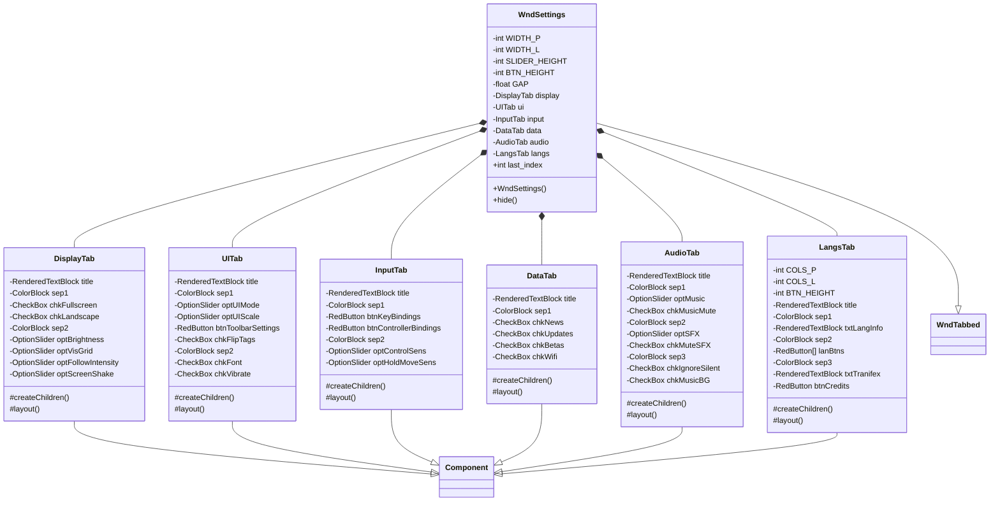

# WndSettings 类文档

## 1. 基本信息

| 属性 | 值 |
|------|-----|
| **文件路径** | core/src/main/java/com/shatteredpixel/shatteredpixeldungeon/windows/WndSettings.java |
| **包名** | com.shatteredpixel.shatteredpixeldungeon.windows |
| **类类型** | class |
| **继承关系** | extends WndTabbed |
| **代码行数** | 1261 |
| **功能概述** | 游戏设置主窗口，提供全面的配置选项 |

## 2. 文件职责说明

WndSettings 是游戏设置主窗口，继承自 WndTabbed（带标签页导航的窗口基类）。它提供全面的游戏配置选项，包含六个标签页：

1. **显示设置（DisplayTab）**：全屏模式、亮度、视觉网格、镜头追踪、震屏
2. **界面设置（UITab）**：UI模式、缩放比例、工具栏配置、字体、振动
3. **输入设置（InputTab）**：键鼠键位、控制器键位、灵敏度设置
4. **网络设置（DataTab）**：新闻检查、更新检查、Beta测试、WiFi限制
5. **音频设置（AudioTab）**：音乐/音效音量、静音选项
6. **语言设置（LangsTab）**：语言选择、翻译贡献者信息

该窗口会根据平台能力和构建配置动态调整可见的标签页和选项。

## 3. 结构总览



## 4. 继承与协作关系

### 继承关系
- **父类**：WndTabbed（带标签页导航的窗口基类）
- **间接父类**：Window → Component

### 协作关系
| 协作类 | 关系类型 | 协作说明 |
|--------|----------|----------|
| SPDSettings | 读取/写入 | 读取和保存所有游戏设置 |
| Messages | 读取 | 获取本地化文本 |
| PixelScene | 读取 | 获取屏幕尺寸和缩放信息 |
| DeviceCompat | 读取 | 检测设备特性（硬键盘、平台类型） |
| ControllerHandler | 读取 | 检测控制器连接状态 |
| WndKeyBindings | 创建 | 打开键位设置窗口 |
| Toolbar | 调用 | 更新工具栏布局 |
| GameScene | 调用 | 更新标签布局 |
| News | 调用 | 清除新闻缓存 |
| Updates | 调用 | 清除更新缓存 |
| Languages | 读取 | 获取支持的语言列表 |
| Chrome | 创建 | 创建窗口背景样式 |

## 5. 字段与常量详解

### 类常量

| 常量 | 类型 | 值 | 说明 |
|------|------|-----|------|
| `WIDTH_P` | int | 122 | 竖屏模式窗口宽度 |
| `WIDTH_L` | int | 223 | 横屏模式窗口宽度 |
| `SLIDER_HEIGHT` | int | 21 | 滑块控件高度 |
| `BTN_HEIGHT` | int | 16 | 按钮控件高度 |
| `GAP` | float | 1 | 控件间距 |

### 实例字段

| 字段 | 类型 | 说明 |
|------|------|------|
| `display` | DisplayTab | 显示设置标签页 |
| `ui` | UITab | 界面设置标签页 |
| `input` | InputTab | 输入设置标签页 |
| `data` | DataTab | 网络设置标签页 |
| `audio` | AudioTab | 音频设置标签页 |
| `langs` | LangsTab | 语言设置标签页 |

### 静态字段

| 字段 | 类型 | 说明 |
|------|------|------|
| `last_index` | int | 记住上次选中的标签页索引，用于窗口重新打开时恢复 |

## 6. 构造与初始化机制

### 构造函数流程

```java
public WndSettings() {
    super();
    
    // 1. 确定窗口宽度（根据横竖屏）
    int width = PixelScene.landscape() ? WIDTH_L : WIDTH_P;
    
    // 2. 创建并添加各标签页内容
    display = new DisplayTab();
    display.setSize(width, 0);
    height = display.height();
    add(display);
    
    // 3. 添加标签页图标（使用IconTab）
    add(new IconTab(Icons.get(Icons.DISPLAY)) { ... });
    
    // 4. 依次创建其他标签页...
    
    // 5. 调整窗口大小
    resize(width, (int)Math.ceil(height));
    
    // 6. 布局标签页
    layoutTabs();
    
    // 7. 恢复上次选中的标签页
    select(last_index);
}
```

### 动态标签页创建
- **InputTab**：仅在检测到硬键盘或控制器连接时才创建
- **语言标签图标高亮**：根据翻译状态显示不同颜色警告

## 7. 方法详解

### 公开方法

#### WndSettings() - 构造函数
初始化设置窗口，创建所有标签页及其对应的图标标签。

**关键逻辑**：
- 根据横竖屏选择窗口宽度
- 动态创建5-6个标签页（InputTab条件创建）
- 计算所有标签页的最大高度
- 恢复上次选中的标签页

#### hide() - 重写隐藏方法
```java
@Override
public void hide() {
    super.hide();
    // 重置字符生成器，释放未选中语言的资源
    ShatteredPixelDungeon.seamlessResetScene(new Game.SceneChangeCallback() {
        @Override
        public void beforeCreate() {
            Game.platform.resetGenerators();
        }
        @Override
        public void afterCreate() {
            //do nothing
        }
    });
}
```

### DisplayTab 内部类

#### createChildren() - 创建子组件
创建显示设置相关的所有UI组件：
- **全屏复选框**：根据平台显示不同文本（Android: 隐藏导航栏, iOS: 隐藏手势栏）
- **横屏复选框**：仅Android设备显示
- **亮度滑块**：范围-1到1（暗到亮）
- **视觉网格滑块**：范围-1到2（关闭到最高）
- **镜头追踪滑块**：范围1到4（低到高）
- **震屏滑块**：范围0到4（关闭到最高）

#### layout() - 布局组件
响应式布局，横屏时使用双列布局，竖屏时使用单列布局。

### UITab 内部类

#### createChildren() - 创建子组件
创建界面设置相关的所有UI组件：
- **UI模式滑块**：仅当屏幕空间足够时显示（移动端/全尺寸）
- **界面缩放滑块**：仅当有多个缩放级别可选时显示
- **工具栏设置按钮**：仅移动端界面模式显示，点击弹出详细设置窗口
- **翻转指示器复选框**：非移动端模式直接显示
- **系统字体复选框**：切换系统字体/游戏字体
- **振动复选框**：仅支持振动的设备启用

#### 工具栏设置弹出窗口
点击"工具栏设置"按钮会弹出一个新窗口，包含：
- 工具栏模式选择（分散/组合/居中）
- 切换快捷栏选项
- 翻转工具栏选项
- 翻转指示器选项

### InputTab 内部类

#### createChildren() - 创建子组件
创建输入设置相关的所有UI组件：
- **键鼠键位按钮**：仅当有硬键盘时显示
- **控制器键位按钮**：仅当控制器连接时显示
- **控制器光标灵敏度滑块**：范围1-10
- **移动灵敏度滑块**：范围0-4（关闭到最高）

### DataTab 内部类

#### createChildren() - 创建子组件
创建网络设置相关的所有UI组件：
- **新闻检查复选框**：启用/禁用自动新闻检查
- **更新检查复选框**：仅当平台支持更新提示时显示
- **Beta测试复选框**：仅当平台支持Beta通道时显示
- **WiFi限制复选框**：仅非桌面平台显示

### AudioTab 内部类

#### createChildren() - 创建子组件
创建音频设置相关的所有UI组件：
- **音乐音量滑块**：范围0-10
- **关闭音乐复选框**：静音音乐
- **音效音量滑块**：范围0-10，调整时播放随机音效预览
- **关闭音效复选框**：静音音效
- **忽略静音模式复选框**：仅iOS显示
- **后台播放音乐复选框**：仅桌面平台显示

### LangsTab 内部类

#### createChildren() - 创建子组件
创建语言设置相关的所有UI组件：
- **当前语言信息文本**：显示语言名称和翻译状态
- **语言按钮数组**：所有可用语言的按钮
- **Transifex说明文本**：翻译来源说明
- **制作名单按钮**：仅非英语显示，点击显示翻译贡献者

#### 语言按钮颜色编码
- **TITLE_COLOR**：当前选中的语言
- **0x888888**：未完成翻译的语言
- **0xBBBBBB**：未审核翻译的语言
- **WHITE**：已完成翻译的语言

## 8. 对外暴露能力

### 公开API

| 方法 | 参数 | 返回值 | 说明 |
|------|------|--------|------|
| `WndSettings()` | 无 | 无 | 创建设置窗口 |
| `hide()` | 无 | void | 隐藏窗口并重置资源 |

### 静态访问

| 字段 | 类型 | 说明 |
|------|------|------|
| `last_index` | int | 上次选中的标签页索引，可外部读写 |

## 9. 运行机制与调用链

### 窗口打开流程
```
用户点击"设置"
    ↓
GameScene.addToFront(new WndSettings())
    ↓
WndSettings构造函数执行
    ↓
创建各标签页内容组件
    ↓
创建标签页图标（IconTab）
    ↓
layoutTabs() 布局标签页
    ↓
select(last_index) 恢复上次选中
    ↓
窗口显示
```

### 设置保存流程
```
用户修改设置（如调整亮度）
    ↓
滑块onChange()回调
    ↓
SPDSettings.brightness(value)
    ↓
设置自动保存到本地存储
    ↓
游戏画面实时更新
```

### 语言切换流程
```
用户点击语言按钮
    ↓
Messages.setup(newLang)
    ↓
ShatteredPixelDungeon.seamlessResetScene()
    ↓
beforeCreate(): SPDSettings.language(newLang), GameLog.wipe()
    ↓
afterCreate(): 场景重建完成
```

## 10. 资源/配置/国际化关联

### 国际化资源

| 资源键 | 中文翻译 | 说明 |
|--------|----------|------|
| `windows.wndsettings$displaytab.title` | 显示设置 | DisplayTab标题 |
| `windows.wndsettings$displaytab.fullscreen` | 全屏模式 | 全屏复选框 |
| `windows.wndsettings$displaytab.brightness` | 亮度 | 亮度滑块 |
| `windows.wndsettings$displaytab.visual_grid` | 网格可视度 | 视觉网格滑块 |
| `windows.wndsettings$displaytab.camera_follow` | 镜头追踪强度 | 镜头追踪滑块 |
| `windows.wndsettings$displaytab.screenshake` | 震屏 | 震屏滑块 |
| `windows.wndsettings$uitab.title` | 界面设置 | UITab标题 |
| `windows.wndsettings$uitab.ui_mode` | 界面模式 | UI模式滑块 |
| `windows.wndsettings$uitab.scale` | 界面尺寸 | 界面缩放滑块 |
| `windows.wndsettings$uitab.toolbar_settings` | 工具栏设置 | 工具栏设置按钮 |
| `windows.wndsettings$uitab.system_font` | 系统字体 | 系统字体复选框 |
| `windows.wndsettings$uitab.vibration` | 振动 | 振动复选框 |
| `windows.wndsettings$inputtab.title` | 输入设置 | InputTab标题 |
| `windows.wndsettings$inputtab.key_bindings` | 键鼠键位 | 键鼠键位按钮 |
| `windows.wndsettings$inputtab.controller_bindings` | 控制器键位 | 控制器键位按钮 |
| `windows.wndsettings$datatab.title` | 网络设置 | DataTab标题 |
| `windows.wndsettings$datatab.news` | 自动检查新闻 | 新闻复选框 |
| `windows.wndsettings$datatab.updates` | 自动检查更新 | 更新复选框 |
| `windows.wndsettings$audiotab.title` | 音频设置 | AudioTab标题 |
| `windows.wndsettings$audiotab.music_vol` | 音乐音量 | 音乐音量滑块 |
| `windows.wndsettings$audiotab.sfx_vol` | 音效音量 | 音效音量滑块 |
| `windows.wndsettings$langstab.title` | 语言设置 | LangsTab标题 |
| `windows.wndsettings$langstab.credits` | 制作名单 | 制作名单按钮 |

### 配置依赖

| 配置项 | 配置类 | 说明 |
|--------|--------|------|
| 全屏模式 | SPDSettings.fullscreen() | 全屏设置 |
| 横屏模式 | SPDSettings.landscape() | 横屏设置 |
| 亮度 | SPDSettings.brightness() | 亮度值(-1到1) |
| 视觉网格 | SPDSettings.visualGrid() | 网格可见度 |
| 镜头追踪 | SPDSettings.cameraFollow() | 追踪强度 |
| 震屏 | SPDSettings.screenShake() | 震屏强度 |
| 界面尺寸 | SPDSettings.interfaceSize() | UI模式 |
| 缩放 | SPDSettings.scale() | 界面缩放 |
| 工具栏模式 | SPDSettings.toolbarMode() | 工具栏布局 |
| 系统字体 | SPDSettings.systemFont() | 字体选择 |
| 振动 | SPDSettings.vibration() | 振动开关 |
| 音乐音量 | SPDSettings.musicVol() | 音量值 |
| 音效音量 | SPDSettings.SFXVol() | 音效值 |
| 语言 | SPDSettings.language() | 当前语言 |

## 11. 使用示例

### 打开设置窗口
```java
// 在游戏场景中打开设置窗口
ShatteredPixelDungeon.scene().addToFront(new WndSettings());

// 在主菜单中打开设置窗口
Game.scene().addToFront(new WndSettings());
```

### 恢复上次选中的标签页
```java
// last_index 静态字段会记住上次选中的标签页
// 下次打开窗口时会自动恢复
// 例如：用户上次在"音频设置"标签页，下次打开仍显示该标签页
```

### 程序化修改设置
```java
// 直接通过 SPDSettings 修改设置
SPDSettings.brightness(1);  // 设置最亮
SPDSettings.musicVol(5);    // 设置音乐音量为50%
SPDSettings.language(Languages.CHINESE);  // 切换到中文
```

## 12. 开发注意事项

### 平台差异处理
1. **Android特有**：横屏强制选项、隐藏导航栏
2. **iOS特有**：隐藏手势栏、忽略静音模式选项
3. **桌面特有**：后台播放音乐选项
4. **控制器检测**：InputTab仅在检测到控制器或硬键盘时显示

### 响应式布局
- 横屏模式使用双列布局（width > 200）
- 竖屏模式使用单列布局
- 组件位置在 layout() 方法中动态计算

### 资源管理
- hide() 时重置字符生成器，释放未使用语言的字体资源
- 语言切换时清除游戏日志（GameLog.wipe()）

### 翻译状态显示
- 语言标签图标根据翻译状态高亮：
  - 红色（1.5f, 0, 0）：未完成翻译
  - 橙色（1.5f, 0.75f, 0f）：未审核翻译

## 13. 修改建议与扩展点

### 扩展点

1. **添加新标签页**：
   - 创建新的内部类继承 Component
   - 在构造函数中添加标签页实例和对应的 IconTab
   - 更新 last_index 的索引映射

2. **添加新设置项**：
   - 在对应标签页的 createChildren() 中添加新组件
   - 在 layout() 中调整布局
   - 添加对应的 SPDSettings 读写方法

3. **自定义标签页样式**：
   - 重写 tabHeight() 方法调整标签页高度
   - 自定义 IconTab 的选中效果

### 修改建议

1. **代码组织**：考虑将各标签页内部类提取为独立类，减少单文件代码量
2. **设置验证**：添加设置值范围验证，防止非法值
3. **设置导入导出**：可扩展支持设置的导入导出功能

## 14. 事实核查清单

- [x] 是否已覆盖全部字段（display, ui, input, data, audio, langs）
- [x] 是否已覆盖全部常量（WIDTH_P, WIDTH_L, SLIDER_HEIGHT, BTN_HEIGHT, GAP）
- [x] 是否已覆盖全部公开方法（构造函数, hide）
- [x] 是否已覆盖全部内部类（DisplayTab, UITab, InputTab, DataTab, AudioTab, LangsTab）
- [x] 是否已确认继承关系（extends WndTabbed）
- [x] 是否已确认协作关系（SPDSettings, Messages, DeviceCompat等）
- [x] 是否已验证中文翻译来源（windows_zh.properties）
- [x] 是否已确认平台差异处理逻辑
- [x] 是否已确认响应式布局逻辑
- [x] 是否已确认设置保存机制（SPDSettings自动保存）
