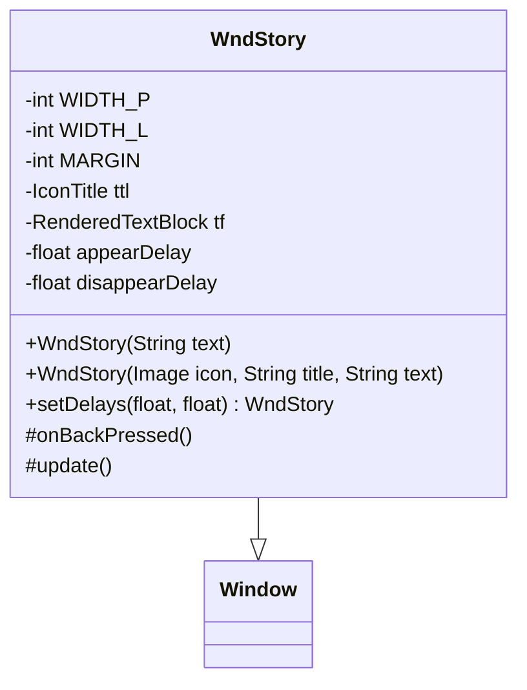

# WndStory 类文档

## 1. 基本信息

| 属性 | 值 |
|------|-----|
| **文件路径** | core/src/main/java/com/shatteredpixel/shatteredpixeldungeon/windows/WndStory.java |
| **包名** | com.shatteredpixel.shatteredpixeldungeon.windows |
| **类类型** | class |
| **继承关系** | extends Window |
| **代码行数** | 113 |
| **功能概述** | 故事/传说文本显示窗口 |

## 2. 文件职责说明

WndStory 是故事/传说文本显示窗口，用于展示游戏中的背景故事、传说和长篇叙述内容。它使用卷轴样式的视觉效果，支持淡入淡出动画。

**主要功能**：
1. **故事文本显示**：显示长篇故事文本
2. **标题栏支持**：可选的图标和标题
3. **卷轴样式**：使用 Chrome.Type.SCROLL 背景
4. **淡入淡出动画**：支持延迟出现和消失
5. **全屏点击关闭**：点击任意位置关闭窗口

## 3. 结构总览



## 4. 继承与协作关系

### 继承关系
- **父类**：Window（基础窗口类）
- **间接父类**：Component

### 协作关系
| 协作类 | 关系类型 | 协作说明 |
|--------|----------|----------|
| Chrome | 创建 | 创建卷轴样式背景 |
| IconTitle | 创建 | 创建图标标题组件 |
| RenderedTextBlock | 创建 | 创建文本块 |
| PixelScene | 调用 | 获取屏幕尺寸、渲染文本 |
| PointerArea | 创建 | 创建全屏点击区域 |

## 5. 字段与常量详解

### 类常量

| 常量 | 类型 | 值 | 说明 |
|------|------|-----|------|
| `WIDTH_P` | int | 125 | 竖屏模式窗口宽度 |
| `WIDTH_L` | int | 180 | 横屏模式窗口宽度 |
| `MARGIN` | int | 2 | 边距 |

### 实例字段

| 字段 | 类型 | 说明 |
|------|------|------|
| `ttl` | IconTitle | 图标标题组件 |
| `tf` | RenderedTextBlock | 文本块 |
| `appearDelay` | float | 出现延迟时间 |
| `disappearDelay` | float | 消失延迟时间 |

## 6. 构造与初始化机制

### 构造函数

#### WndStory(String) - 简单构造
```java
public WndStory(String text) {
    this(null, null, text);  // 无标题，仅文本
}
```

#### WndStory(Image, String, String) - 完整构造
```java
public WndStory(Image icon, String title, String text) {
    super(0, 0, Chrome.get(Chrome.Type.SCROLL));  // 卷轴样式背景
    
    // 1. 计算宽度
    int width = PixelScene.landscape() ? WIDTH_L - MARGIN * 2 : WIDTH_P - MARGIN * 2;
    
    // 2. 创建标题栏（如有）
    float y = MARGIN;
    if (icon != null && title != null) {
        ttl = new IconTitle(icon, title);
        ttl.setRect(MARGIN, y, width - 2 * MARGIN, 0);
        y = ttl.bottom() + MARGIN;
        add(ttl);
        ttl.tfLabel.invert();  // 反转颜色（深色背景浅色文字）
    }
    
    // 3. 创建文本块
    tf = PixelScene.renderTextBlock(text, 6);
    tf.maxWidth(width);
    tf.invert();  // 反转颜色
    tf.setPos(MARGIN, y);
    add(tf);
    
    // 4. 创建全屏点击区域
    PointerArea blocker = new PointerArea(0, 0, PixelScene.uiCamera.width, PixelScene.uiCamera.height) {
        @Override
        protected void onClick(PointerEvent event) {
            onBackPressed();  // 点击任意位置关闭
        }
    };
    blocker.camera = PixelScene.uiCamera;
    add(blocker);
    
    // 5. 调整窗口大小
    resize(width + 2 * MARGIN, (int)(tf.bottom() + MARGIN));
}
```

## 7. 方法详解

### 公开方法

#### WndStory(String) - 构造函数
创建简单故事窗口，仅显示文本。

#### WndStory(Image, String, String) - 构造函数
创建带图标和标题的故事窗口。

#### setDelays(float, float) - 设置延迟
```java
public WndStory setDelays(float appearDelay, float disappearDelay) {
    this.appearDelay = appearDelay;
    if (appearDelay > 0) {
        // 延迟出现时隐藏所有组件
        shadow.visible = chrome.visible = tf.visible = false;
        if (ttl != null) ttl.visible = false;
    }
    
    this.disappearDelay = disappearDelay;
    return this;  // 支持链式调用
}
```

### 重写方法

#### onBackPressed() - 返回键处理
```java
@Override
public void onBackPressed() {
    // 有延迟时禁止关闭
    if (appearDelay <= 0 && disappearDelay <= 0) {
        super.onBackPressed();
    }
}
```

#### update() - 更新逻辑
```java
@Override
public void update() {
    super.update();
    
    if (appearDelay > 0) {
        appearDelay -= Game.elapsed;
        if (appearDelay <= 0) {
            // 延迟结束，显示所有组件
            shadow.visible = chrome.visible = tf.visible = true;
            if (ttl != null) ttl.visible = true;
        }
    } else if (disappearDelay > 0) {
        disappearDelay -= Game.elapsed;
    }
}
```

## 8. 对外暴露能力

### 公开API

| 方法 | 参数 | 返回值 | 说明 |
|------|------|--------|------|
| `WndStory(String)` | 文本 | 无 | 创建简单故事窗口 |
| `WndStory(Image, String, String)` | 图标, 标题, 文本 | 无 | 创建完整故事窗口 |
| `setDelays(float, float)` | 出现延迟, 消失延迟 | WndStory | 设置动画延迟 |

## 9. 运行机制与调用链

### 窗口打开流程
```
触发故事显示
    ↓
创建 WndStory(icon, title, text)
    ↓
创建卷轴样式背景
    ↓
创建标题栏（如有）
    ↓
创建文本块
    ↓
创建全屏点击区域
    ↓
显示窗口
```

### 延迟动画流程
```
setDelays(appear, disappear) 被调用
    ↓
appearDelay > 0 时隐藏组件
    ↓
update() 每帧检查
    ↓
appearDelay <= 0 时显示组件
    ↓
用户可交互
```

## 10. 资源/配置/国际化关联

### 视觉样式
- **背景**：Chrome.Type.SCROLL（卷轴样式）
- **文字颜色**：反转模式（深色背景浅色文字）
- **字体大小**：6号字体

### 响应式布局
- 竖屏：WIDTH_P = 125
- 横屏：WIDTH_L = 180

## 11. 使用示例

### 显示简单故事
```java
String storyText = "很久以前，在这片土地上...";
ShatteredPixelDungeon.scene().addToFront(new WndStory(storyText));
```

### 显示带标题的故事
```java
Image icon = Icons.STAIRS.get();
String title = "第一章";
String text = "冒险开始了...";
ShatteredPixelDungeon.scene().addToFront(new WndStory(icon, title, text));
```

### 带延迟动画
```java
new WndStory(text).setDelays(1.0f, 0.5f);
// 1秒后出现，0.5秒后可关闭
```

## 12. 开发注意事项

### 颜色反转
- 文本使用 `invert()` 方法反转颜色
- 适用于深色背景（卷轴样式）

### 全屏点击
- PointerArea 覆盖整个屏幕
- 点击任意位置都会关闭窗口

### 延迟机制
- `appearDelay` 控制出现延迟
- `disappearDelay` 控制消失延迟
- 延迟期间禁止关闭

### 链式调用
- `setDelays()` 返回 `this`
- 支持链式调用：`new WndStory(text).setDelays(1, 0)`

## 13. 修改建议与扩展点

### 扩展点

1. **添加滚动支持**：长文本时添加滚动功能
2. **添加翻页功能**：支持多页故事
3. **添加音效**：打开/关闭时播放音效

### 修改建议

1. **动画效果**：添加淡入淡出动画效果
2. **打字机效果**：文本逐字显示

## 14. 事实核查清单

- [x] 是否已覆盖全部字段（ttl, tf, appearDelay, disappearDelay）
- [x] 是否已覆盖全部常量（WIDTH_P, WIDTH_L, MARGIN）
- [x] 是否已覆盖全部公开方法（构造函数, setDelays）
- [x] 是否已覆盖全部重写方法（onBackPressed, update）
- [x] 是否已确认继承关系（extends Window）
- [x] 是否已确认协作关系（Chrome, IconTitle, RenderedTextBlock等）
- [x] 是否已确认颜色反转机制
- [x] 是否已确认延迟动画机制
