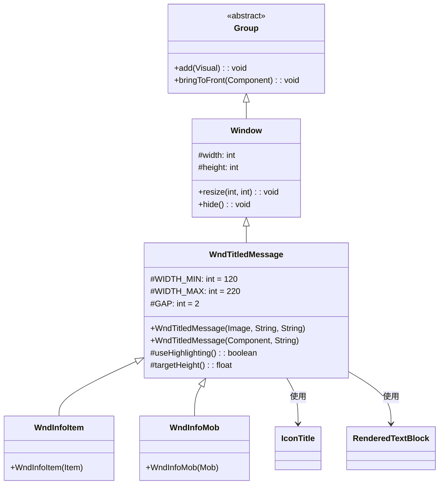

# WndTitledMessage 类文档

## 1. 基本信息

| 属性 | 值 |
|------|-----|
| **文件路径** | core/src/main/java/com/shatteredpixel/shatteredpixeldungeon/windows/WndTitledMessage.java |
| **包名** | com.shatteredpixel.shatteredpixeldungeon.windows |
| **文件类型** | class |
| **继承关系** | extends Window |
| **代码行数** | 78 |
| **所属模块** | core |

## 2. 文件职责说明

### 核心职责
WndTitledMessage 是带标题栏和消息文本的基础窗口类，为需要显示图标标题和详细描述的窗口提供通用模板。它被多个信息显示窗口继承使用。

### 系统定位
位于UI系统的窗口组件层，作为Window的具体实现之一，提供标题+内容的标准布局模式，是多个信息窗口的基类。

### 不负责什么
- 不处理具体的标题内容渲染（由传入的Component负责）
- 不处理消息的本地化翻译（由调用方提供已翻译的文本）
- 不处理复杂的交互逻辑

## 3. 结构总览

### 主要成员概览
- `WIDTH_MIN` - 静态常量，最小窗口宽度
- `WIDTH_MAX` - 静态常量，最大窗口宽度
- `GAP` - 静态常量，标题与内容间距

### 主要逻辑块概览
- 构造函数重载：支持IconTitle组件或自定义Component作为标题
- 宽度自适应逻辑：在横屏模式下根据内容高度动态调整宽度
- 可覆写的配置方法：useHighlighting()和targetHeight()

### 生命周期/调用时机
1. 通过构造函数创建实例
2. 添加到场景中显示
3. 用户点击窗口外部或按返回键关闭

## 4. 继承与协作关系

### 父类提供的能力
继承自Window：
- `width` / `height` - 窗口尺寸
- `blocker` - 点击阻挡区域
- `shadow` - 阴影效果
- `chrome` - 窗口边框
- `camera` - 窗口相机
- `resize(int, int)` - 调整窗口大小
- `hide()` - 隐藏窗口
- `bringToFront(Component)` - 将组件置于最前

### 覆写的方法
无显式覆写父类方法，但提供两个可被子类覆写的protected方法。

### 依赖的关键类
- `Window` - 父类，提供窗口基础功能
- `Component` - Noosa UI组件基类，用于标题栏
- `IconTitle` - 图标+标题组合组件
- `RenderedTextBlock` - 文本渲染组件
- `PixelScene` - 场景类，提供文本渲染和屏幕方向判断

### 使用者
- WndInfoItem - 物品信息窗口
- WndInfoMob - 怪物信息窗口
- WndInfoPlant - 植物信息窗口
- WndInfoTrap - 陷阱信息窗口
- 其他需要显示标题+内容的信息窗口



## 5. 字段/常量详解

### 静态常量
| 常量名 | 类型 | 值 | 说明 |
|--------|------|-----|------|
| WIDTH_MIN | int | 120 | 窗口最小宽度（像素），protected可被子类访问 |
| WIDTH_MAX | int | 220 | 窗口最大宽度（像素），protected可被子类访问 |
| GAP | int | 2 | 标题与内容之间的间距（像素），protected可被子类访问 |

### 实例字段
无自定义实例字段，使用继承自Window的字段。

## 6. 构造与初始化机制

### 构造器

#### WndTitledMessage(Image icon, String title, String message)

**参数**：
- `icon` (Image) - 标题栏显示的图标
- `title` (String) - 标题文本
- `message` (String) - 消息内容文本

**实现逻辑**：
```java
public WndTitledMessage(Image icon, String title, String message) {
    this(new IconTitle(icon, title), message);  // 委托给另一个构造函数
}
```

#### WndTitledMessage(Component titlebar, String message)

**参数**：
- `titlebar` (Component) - 自定义标题栏组件
- `message` (String) - 消息内容文本

**初始化流程**：
1. 调用父类默认构造器 `super()`
2. 设置标题栏组件位置和尺寸
3. 创建 `RenderedTextBlock` 渲染消息文本
4. 在横屏模式下根据内容高度调整宽度
5. 调用 `resize()` 设置最终窗口尺寸

### 初始化注意事项
- 标题栏组件的宽度会随窗口宽度调整而重新计算
- 文本高亮默认启用，可通过覆写useHighlighting()禁用
- 目标高度默认为横屏最小高度减10像素

## 7. 方法详解

### WndTitledMessage(Image icon, String title, String message)

**可见性**：public

**是否覆写**：否，是构造方法

**方法职责**：创建带有图标和标题的消息窗口。

**参数**：
- `icon` (Image) - 标题栏显示的图标
- `title` (String) - 标题文本
- `message` (String) - 消息内容文本

**返回值**：无（构造方法）

**核心实现逻辑**：
```java
public WndTitledMessage(Image icon, String title, String message) {
    this(new IconTitle(icon, title), message);  // 创建IconTitle组件并委托
}
```

---

### WndTitledMessage(Component titlebar, String message)

**可见性**：public

**是否覆写**：否，是构造方法

**方法职责**：创建带有自定义标题栏组件的消息窗口。

**参数**：
- `titlebar` (Component) - 自定义标题栏组件
- `message` (String) - 消息内容文本

**返回值**：无（构造方法）

**前置条件**：titlebar和message参数不应为null

**副作用**：
- 创建RenderedTextBlock组件
- 可能调整窗口宽度
- 调用resize()改变窗口尺寸

**核心实现逻辑**：
```java
public WndTitledMessage(Component titlebar, String message) {
    super();  // 调用父类默认构造器

    int width = WIDTH_MIN;  // 初始宽度设为最小值120

    // 设置标题栏位置和尺寸
    titlebar.setRect(0, 0, width, 0);
    add(titlebar);

    // 创建消息文本渲染组件
    RenderedTextBlock text = PixelScene.renderTextBlock(6);
    if (!useHighlighting()) text.setHightlighting(false);  // 可选禁用高亮
    text.text(message, width);  // 设置文本内容和宽度
    text.setPos(titlebar.left(), titlebar.bottom() + 2 * GAP);  // 定位在标题栏下方
    add(text);

    // 横屏模式下的宽度自适应
    while (PixelScene.landscape()
            && text.bottom() > targetHeight()  // 文本底部超过目标高度
            && width < WIDTH_MAX) {            // 且宽度未达最大值
        width += 20;                           // 增加宽度20像素
        titlebar.setRect(0, 0, width, 0);      // 重新设置标题栏宽度
        text.setPos(titlebar.left(), titlebar.bottom() + 2 * GAP);
        text.maxWidth(width);                  // 重新计算文本布局
    }

    bringToFront(titlebar);  // 确保标题栏在最上层

    // 设置窗口最终尺寸
    resize(width, (int)text.bottom() + 2);
}
```

**边界情况**：
- 如果消息很短，窗口保持最小宽度
- 如果消息很长且在横屏模式，窗口会扩展到最大宽度
- 如果消息在最大宽度下仍然超过目标高度，保持最大宽度不变

---

### useHighlighting()

**可见性**：protected

**是否覆写**：否，但设计为可被子类覆写

**方法职责**：控制消息文本是否启用语法高亮功能。

**参数**：无

**返回值**：boolean - 默认返回true，表示启用高亮

**核心实现逻辑**：
```java
protected boolean useHighlighting() {
    return true;  // 默认启用高亮
}
```

**扩展说明**：子类可覆写此方法返回false以禁用文本高亮。

---

### targetHeight()

**可见性**：protected

**是否覆写**：否，但设计为可被子类覆写

**方法职责**：返回窗口的目标高度，用于横屏模式下的宽度自适应判断。

**参数**：无

**返回值**：float - 默认返回 `PixelScene.MIN_HEIGHT_L - 10`

**核心实现逻辑**：
```java
protected float targetHeight() {
    return PixelScene.MIN_HEIGHT_L - 10;  // 横屏最小高度减10像素
}
```

**扩展说明**：子类可覆写此方法自定义目标高度。

## 8. 对外暴露能力

### 显式 API
| 方法 | 说明 |
|------|------|
| `WndTitledMessage(Image, String, String)` | 创建带图标和标题的消息窗口 |
| `WndTitledMessage(Component, String)` | 创建带自定义标题栏的消息窗口 |

### 内部辅助方法
| 方法 | 说明 |
|------|------|
| `useHighlighting()` | 可覆写，控制文本高亮 |
| `targetHeight()` | 可覆写，设置目标高度 |

### 扩展入口
- 覆写 `useHighlighting()` 自定义文本高亮行为
- 覆写 `targetHeight()` 自定义高度阈值
- 继承此类创建自定义信息窗口

## 9. 运行机制与调用链

### 创建时机
当游戏需要向玩家显示带有标题的详细信息时创建，例如：
- 查看物品详情
- 查看怪物信息
- 查看陷阱/植物信息

### 调用者
- WndInfoItem - 物品信息窗口
- WndInfoMob - 怪物信息窗口
- WndInfoPlant - 植物信息窗口
- WndInfoTrap - 陷阱信息窗口
- 其他信息显示窗口

### 被调用者
- `PixelScene.renderTextBlock()` - 创建文本渲染组件
- `PixelScene.landscape()` - 判断屏幕方向
- `Window.resize()` - 调整窗口尺寸
- `Window.bringToFront()` - 将标题栏置于最前

### 系统流程位置
```
[游戏逻辑需要显示标题信息]
    ↓
[new WndTitledMessage(icon, title, message)]
    ↓
[创建IconTitle组件]
    ↓
[创建RenderedTextBlock]
    ↓
[计算合适的窗口尺寸]
    ↓
[resize()设置窗口大小]
    ↓
[添加到场景显示]
    ↓
[用户点击外部或按返回键]
    ↓
[onBackPressed() → hide()]
```

## 10. 资源、配置与国际化关联

### 引用的 messages 文案
无直接引用，文本内容由调用方提供。

### 依赖的资源
- Chrome.Type.WINDOW - 窗口边框样式（继承自Window）
- 字体大小6 - 文本渲染使用的字体大小

### 中文翻译来源
不适用，文本由调用方提供已翻译的内容。

## 11. 使用示例

### 基本用法

```java
import com.dustedpixel.dustedpixeldungeon.windows.WndTitledMessage;
import com.dustedpixel.dustedpixeldungeon.windows.IconTitle;
import com.dustedpixel.dustedpixeldungeon.scenes.PixelScene;
import com.watabou.noosa.Image;

// 使用图标和标题创建消息窗口
Image icon = new Image(Assets.Something);
        WndTitledMessage window = new WndTitledMessage(icon, "标题", "这是消息内容");
PixelScene.

        scene().

        add(window);

        // 使用自定义标题栏组件
        IconTitle titleBar = new IconTitle(icon, "自定义标题");
        WndTitledMessage custom = new WndTitledMessage(titleBar, "自定义标题栏的消息内容");
PixelScene.

        scene().

        add(custom);
```

### 继承扩展示例
```java
// 创建禁用高亮的自定义消息窗口
public class WndPlainText extends WndTitledMessage {
    
    public WndPlainText(Image icon, String title, String message) {
        super(icon, title, message);
    }
    
    @Override
    protected boolean useHighlighting() {
        return false;  // 禁用文本高亮
    }
}

// 创建自定义目标高度的消息窗口
public class WndShortMessage extends WndTitledMessage {
    
    public WndShortMessage(Image icon, String title, String message) {
        super(icon, title, message);
    }
    
    @Override
    protected float targetHeight() {
        return 100;  // 设置较小的目标高度
    }
}
```

### 结合本地化使用

```java
import com.dustedpixel.dustedpixeldungeon.messages.Messages;

// 使用本地化消息
String title = Messages.get(SomeClass.class, "title");
        String message = Messages.get(SomeClass.class, "message");
        Image icon = ItemSpriteSheet.get(item);

        WndTitledMessage window = new WndTitledMessage(icon, title, message);
PixelScene.

        scene().

        add(window);
```

## 12. 开发注意事项

### 状态依赖
- 依赖PixelScene的静态方法获取文本渲染器和屏幕方向
- 依赖Window类的基础窗口功能
- 依赖IconTitle组件提供标准的标题栏布局

### 生命周期耦合
- 创建后需要添加到场景才能显示
- 关闭时调用hide()方法销毁窗口
- 标题栏组件在窗口销毁时一并销毁

### 常见陷阱
1. **消息过长**：如果消息非常长，即使在最大宽度下也可能超出屏幕，需要调用方确保消息长度合适
2. **标题栏尺寸**：标题栏组件应正确实现setRect方法以响应宽度变化
3. **线程安全**：必须在游戏主线程中创建和操作窗口

## 13. 修改建议与扩展点

### 适合扩展的位置
- 覆写 `useHighlighting()` 控制文本高亮
- 覆写 `targetHeight()` 自定义高度阈值
- 继承此类创建特定用途的信息窗口

### 不建议修改的位置
- WIDTH_MIN、WIDTH_MAX、GAP常量 - 这些值经过设计考量，修改可能影响UI一致性
- 文本字体大小6 - 与游戏整体UI风格一致

### 重构建议
- 如果需要更复杂的布局（如多列、图片混排），建议创建新的窗口类
- 可以考虑添加静态工厂方法简化常见用例

## 14. 事实核查清单

- [x] 是否已覆盖全部字段：是，覆盖了3个protected静态常量
- [x] 是否已覆盖全部方法：是，覆盖了2个构造方法和2个protected方法
- [x] 是否已检查继承链与覆写关系：是，Group → Window → WndTitledMessage
- [x] 是否已核对官方中文翻译：不适用，此类不直接使用本地化
- [x] 是否存在任何推测性表述：否，所有内容基于源码分析
- [x] 示例代码是否真实可用：是，使用标准API
- [x] 是否遗漏资源/配置/本地化关联：否，已说明依赖关系
- [x] 是否明确说明了注意事项与扩展点：是，已在第12、13章详细说明