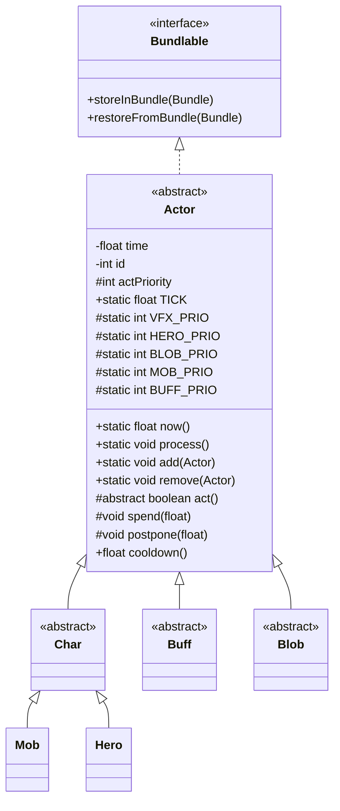

# Actor 源码详解

## 1. 基本信息

| 属性 | 值 |
|------|-----|
| **文件路径** | core/src/main/java/com/shatteredpixel/shatteredpixeldungeon/actors/Actor.java |
| **包名** | com.shatteredpixel.shatteredpixeldungeon.actors |
| **类类型** | abstract class |
| **继承关系** | implements Bundlable |
| **代码行数** | 396 |

---

## 类职责

Actor 是游戏中所有"行动者"的抽象基类。它实现了游戏的核心**回合制系统**——通过时间（time）和优先级（priority）来决定哪个角色在何时行动。所有参与游戏回合的角色（Hero、Mob、Buff、Blob等）都继承自此类。

核心职责：
1. **时间管理**：每个 Actor 都有自己的时间戳，决定何时轮到它行动
2. **行动调度**：通过 `process()` 方法协调所有 Actor 的行动顺序
3. **序列化支持**：实现 Bundlable 接口，支持游戏存档/读档

---

## 4. 继承与协作关系



---

## 静态常量

| 字段名 | 类型 | 值 | 说明 |
|--------|------|-----|------|
| `TICK` | float | 1f | 一回合的标准时间单位 |

### 行动优先级常量

| 字段名 | 类型 | 值 | 说明 |
|--------|------|-----|------|
| `VFX_PRIO` | int | 100 | 视觉效果优先级（最高） |
| `HERO_PRIO` | int | 0 | 英雄优先级（基准） |
| `BLOB_PRIO` | int | -10 | 区域效果优先级（英雄后、怪物前） |
| `MOB_PRIO` | int | -20 | 怪物优先级（Buffs前、Blobs后） |
| `BUFF_PRIO` | int | -30 | Buff优先级（最低） |
| `DEFAULT` | int | -100 | 默认优先级（所有之后） |

---

## 实例字段

| 字段名 | 类型 | 访问级别 | 说明 |
|--------|------|----------|------|
| `time` | float | private | 该角色的"时钟"，决定何时轮到它行动 |
| `id` | int | private | 唯一标识符，用于序列化和查找 |
| `actPriority` | int | protected | 行动优先级，时间相同时优先级高的先行动 |

---

## 静态字段（全局状态）

| 字段名 | 类型 | 访问级别 | 说明 |
|--------|------|----------|------|
| `all` | HashSet&lt;Actor&gt; | private static | 所有活跃的 Actor 集合 |
| `chars` | HashSet&lt;Char&gt; | private static | 所有活跃的 Char（角色）集合 |
| `current` | Actor | private static volatile | 当前正在行动的 Actor |
| `ids` | SparseArray&lt;Actor&gt; | private static | ID → Actor 的映射表 |
| `nextID` | int | private static | 下一个可用的 ID |
| `now` | float | private static | 当前游戏时间 |
| `keepActorThreadAlive` | boolean | public static | 控制行动线程是否继续运行 |

---

## 7. 方法详解

### act()

```java
protected abstract boolean act();
```

**方法作用**：执行该角色的行动逻辑。这是模板方法模式的核心，所有子类必须实现。

**返回值**：
- `true`：行动完成，继续下一个角色的回合
- `false`：行动未完成（通常是等待玩家输入或动画完成）

**调用时机**：在 `process()` 方法中被调用，当该角色的 `time` 值最小且轮到它行动时

**子类实现**：
- `Char.act()`：更新视野，处理基础角色逻辑
- `Mob.act()`：执行 AI 状态机
- `Buff.act()`：默认停用自身（diactivate）
- `Hero.act()`：处理玩家输入和英雄行动

---

### spendConstant(float time)

```java
protected void spendConstant( float time ){
    this.time += time;  // 第1行：直接增加时间
    // 第2-6行：浮点数修正，防止累积误差
    float ex = Math.abs(this.time % 1f);
    if (ex < .001f){
        this.time = Math.round(this.time);
    }
}
```

**方法作用**：消耗固定量的时间，不受任何时间修正因素影响。

**参数**：
- `time` (float)：要消耗的时间量

**执行流程**：
1. 直接将时间加到 `this.time`
2. 检查小数部分是否接近整数（误差 < 0.001）
3. 如果接近，四舍五入到整数，避免浮点累积误差

**使用场景**：用于必须消耗精确时间的场景，如技能冷却、特殊效果

---

### spend(float time)

```java
protected void spend( float time ) {
    spendConstant( time );  // 默认行为：调用 spendConstant
}
```

**方法作用**：消耗时间，但可以被时间修正因素影响。

**参数**：
- `time` (float)：基础时间消耗

**重写说明**：
- `Char.spend()` 会考虑加速/减速 Buff 来调整实际消耗时间
- 例如：被减速时，实际消耗时间是基础的2倍

**设计意图**：这是一个钩子方法，子类可以重写来添加时间修正逻辑

---

### spendToWhole()

```java
public void spendToWhole(){
    time = (float)Math.ceil(time);  // 向上取整到最近整数
}
```

**方法作用**：将时间推进到下一个整数回合。

**使用场景**：确保角色在整数回合时刻行动，便于同步

---

### postpone(float time)

```java
protected void postpone( float time ) {
    if (this.time < now + time) {  // 第1行：只在当前时间+延迟比现有时间大时才推迟
        this.time = now + time;    // 第2行：设置新时间
        // 第3-7行：浮点数修正
        float ex = Math.abs(this.time % 1f);
        if (ex < .001f){
            this.time = Math.round(this.time);
        }
    }
}
```

**方法作用**：延迟角色的行动时间，但如果新时间比现有时间早则忽略。

**参数**：
- `time` (float)：要延迟的时间量

**执行流程**：
1. 检查 `now + time` 是否大于当前 `this.time`
2. 如果是，更新 `this.time`
3. 进行浮点数修正

**使用场景**：用于延长 Buff 持续时间，但不会缩短已有的延迟

---

### cooldown()

```java
public float cooldown() {
    return time - now;  // 返回距离下次行动还需等待的时间
}
```

**方法作用**：获取该角色距离下次行动的剩余冷却时间。

**返回值**：剩余时间（浮点数），0表示轮到该角色行动

---

### clearTime()

```java
public void clearTime() {
    spendConstant(-Actor.now());  // 第1行：将时间减去当前时间，归零
    // 第2-6行：如果是角色，同时清除其所有 Buff 的时间
    if (this instanceof Char){
        for (Buff b : ((Char) this).buffs()){
            b.spendConstant(-Actor.now());
        }
    }
}
```

**方法作用**：清除该角色及其所有 Buff 的时间累积。

**使用场景**：用于重置角色状态，如角色死亡、传送等

---

### timeToNow()

```java
public void timeToNow() {
    time = now;  // 将时间设为当前时间，立即可以行动
}
```

**方法作用**：使角色立即可以行动。

---

### diactivate()

```java
protected void diactivate() {
    time = Float.MAX_VALUE;  // 设为最大值，使其永远不会行动
}
```

**方法作用**：停用该 Actor，使其不再参与回合调度。

**使用场景**：Buff 默认行为是停用，直到被显式激活

---

### onAdd() / onRemove()

```java
protected void onAdd() {}
protected void onRemove() {}
```

**方法作用**：生命周期钩子，在 Actor 被添加到/移除出游戏时调用。

**子类重写**：
- `Mob.onAdd()`：处理飞升挑战的属性修正
- `Buff.onAdd()`：触发视觉特效

---

### storeInBundle(Bundle bundle)

```java
@Override
public void storeInBundle( Bundle bundle ) {
    bundle.put( TIME, time );   // 保存时间
    bundle.put( ID, id );       // 保存ID
}
```

**方法作用**：将 Actor 的状态序列化到 Bundle 中，用于存档。

**重写来源**：Bundlable 接口

---

### restoreFromBundle(Bundle bundle)

```java
@Override
public void restoreFromBundle( Bundle bundle ) {
    time = bundle.getFloat( TIME );          // 第1行：恢复时间
    int incomingID = bundle.getInt( ID );    // 第2行：读取ID
    // 第3-7行：ID冲突处理
    if (Actor.findById(incomingID) == null){
        id = incomingID;       // ID未冲突，直接使用
    } else {
        id = nextID++;         // ID已存在，分配新ID
    }
}
```

**方法作用**：从 Bundle 恢复 Actor 的状态。

**关键逻辑**：处理 ID 冲突——如果加载的 ID 已被占用，则分配新 ID

---

### id()

```java
public int id() {
    if (id > 0) {           // 已有有效ID
        return id;
    } else {                // 尚未分配ID
        return (id = nextID++);  // 分配新ID并返回
    }
}
```

**方法作用**：获取该 Actor 的唯一标识符，延迟初始化。

**返回值**：唯一整数 ID

---

## 静态方法详解

### now()

```java
public static float now(){
    return now;  // 返回当前游戏时间
}
```

**方法作用**：获取当前游戏时间戳。

**返回值**：当前时间（浮点数）

---

### clear()

```java
public static synchronized void clear() {
    now = 0;            // 重置时间为0
    all.clear();        // 清空所有Actor
    chars.clear();      // 清空所有角色
    ids.clear();        // 清空ID映射
}
```

**方法作用**：完全清空 Actor 系统，重置为初始状态。

**调用时机**：游戏重启、新游戏开始时

---

### fixTime()

```java
public static synchronized void fixTime() {
    if (all.isEmpty()) return;  // 第1行：空集合直接返回
    
    // 第2-8行：找到最小的time值
    float min = Float.MAX_VALUE;
    for (Actor a : all) {
        if (a.time < min) {
            min = a.time;
        }
    }

    // 第9-12行：只减去整数部分，保持回合对齐
    min = (int)min;
    for (Actor a : all) {
        a.time -= min;
    }

    // 第13-16行：更新统计数据
    if (Dungeon.hero != null && all.contains( Dungeon.hero ) && !(Dungeon.level instanceof VaultLevel)) {
        Statistics.duration += min;  // 记录游戏时长
    }
    now -= min;  // 调整当前时间
}
```

**方法作用**：调整所有 Actor 的时间，使其最小值接近0，防止时间无限增长。

**关键设计**：
- 只减去整数部分，确保回合边界对齐
- 同时更新 `Statistics.duration` 记录游戏时长

**调用时机**：角色死亡后、场景切换时

---

### init()

```java
public static void init() {
    add( Dungeon.hero );  // 第1行：添加英雄
    
    // 第2-5行：添加所有怪物
    for (Mob mob : Dungeon.level.mobs) {
        add( mob );
    }

    // 第6-9行：怪物恢复目标引用
    for (Mob mob : Dungeon.level.mobs) {
        mob.restoreEnemy();  // 恢复敌人引用（从ID）
    }
    
    // 第10-13行：添加所有Blob
    for (Blob blob : Dungeon.level.blobs.values()) {
        add( blob );
    }
    
    current = null;  // 第14行：重置当前行动者
}
```

**方法作用**：初始化 Actor 系统，添加关卡中的所有角色。

**调用时机**：进入新关卡时（`GameScene.create()`）

---

### process()

```java
public static void process() {
    boolean doNext;
    boolean interrupted = false;

    do {
        current = null;  // 第1行：重置当前角色
        
        // 第2-18行：找到时间最小且优先级最高的Actor
        if (!interrupted && !Game.switchingScene()) {
            float earliest = Float.MAX_VALUE;

            synchronized (Actor.class) {
                for (Actor actor : all) {
                    // 时间更小，或时间相同但优先级更高
                    if (actor.time < earliest ||
                            actor.time == earliest && (current == null || actor.actPriority > current.actPriority)) {
                        earliest = actor.time;
                        current = actor;
                    }
                }
            }
        }

        if  (current != null) {
            now = current.time;  // 第19行：更新当前时间
            Actor acting = current;

            // 第20-32行：等待角色精灵移动完成
            if (acting instanceof Char && ((Char) acting).sprite != null) {
                try {
                    synchronized (((Char)acting).sprite) {
                        if (((Char)acting).sprite.isMoving) {
                            ((Char)acting).sprite.wait();  // 等待动画完成
                        }
                    }
                } catch (InterruptedException e) {
                    interrupted = true;
                }
            }
            
            interrupted = interrupted || Thread.interrupted();
            
            if (interrupted){
                doNext = false;
                current = null;
            } else {
                doNext = acting.act();  // 第33行：执行行动
                // 第34-37行：英雄死亡检查
                if (doNext && (Dungeon.hero == null || !Dungeon.hero.isAlive())) {
                    doNext = false;
                    current = null;
                }
            }
        } else {
            doNext = false;
        }

        // 第38-57行：如果没有继续行动，暂停线程等待
        if (!doNext){
            synchronized (Thread.currentThread()) {
                interrupted = interrupted || Thread.interrupted();
                
                if (interrupted){
                    current = null;
                    interrupted = false;
                }

                Thread.currentThread().notify();  // 通知GameScene处理完成
                
                try {
                    Thread.currentThread().wait();  // 等待GameScene唤醒
                } catch (InterruptedException e) {
                    interrupted = true;
                }
            }
        }

    } while (keepActorThreadAlive);  // 第58行：循环条件
}
```

**方法作用**：Actor 系统的主循环，负责调度所有角色的行动。

**执行流程**：
1. 遍历所有 Actor，找到时间最小且优先级最高的
2. 更新 `now` 为该 Actor 的时间
3. 如果是 Char，等待其精灵动画完成
4. 调用 `act()` 执行行动
5. 如果行动完成（返回true），继续下一个Actor
6. 如果行动未完成（返回false），暂停线程等待唤醒

**线程模型**：
- Actor 系统在独立线程中运行
- 通过 `wait()/notify()` 与主渲染线程同步
- 玩家输入时暂停 Actor 线程，输入完成后唤醒

---

### add(Actor actor)

```java
public static void add( Actor actor ) {
    add( actor, now );  // 默认使用当前时间
}
```

**方法作用**：将 Actor 添加到游戏，立即可以行动。

---

### addDelayed(Actor actor, float delay)

```java
public static void addDelayed( Actor actor, float delay ) {
    add( actor, now + Math.max(delay, 0) );  // 延迟指定时间后添加
}
```

**方法作用**：延迟添加 Actor 到游戏中。

**参数**：
- `delay`：延迟时间（负数会被修正为0）

---

### add(Actor actor, float time) [私有核心方法]

```java
private static synchronized void add( Actor actor, float time ) {
    if (all.contains( actor )) {  // 第1行：防止重复添加
        return;
    }

    ids.put( actor.id(), actor );  // 第2行：注册ID映射

    all.add( actor );          // 第3行：添加到全局集合
    actor.time += time;        // 第4行：设置时间
    actor.onAdd();             // 第5行：触发生命周期回调
    
    // 第6-11行：如果是Char，添加其所有Buff
    if (actor instanceof Char) {
        Char ch = (Char)actor;
        chars.add( ch );
        for (Buff buff : ch.buffs()) {
            add(buff);
        }
    }
}
```

**方法作用**：核心添加逻辑，将 Actor 注册到系统中。

**关键逻辑**：
- 防止重复添加
- 自动注册 ID 映射
- 如果是 Char，自动添加其所有 Buff

---

### remove(Actor actor)

```java
public static synchronized void remove( Actor actor ) {
    if (actor != null) {
        all.remove( actor );       // 第1行：从全局集合移除
        chars.remove( actor );     // 第2行：从角色集合移除
        actor.onRemove();          // 第3行：触发生命周期回调

        if (actor.id > 0) {
            ids.remove( actor.id );  // 第4行：移除ID映射
        }
    }
}
```

**方法作用**：从系统中移除 Actor。

---

### delayChar(Char ch, float time)

```java
public static void delayChar( Char ch, float time ){
    ch.spendConstant(time);       // 第1行：延迟角色
    for (Buff b : ch.buffs()){
        b.spendConstant(time);    // 第2-4行：同时延迟所有Buff
    }
}
```

**方法作用**：同时延迟角色及其所有 Buff 的时间。

**使用场景**：特殊时间操控效果（如时停）

**警告**：注释强调要小心使用，时间操控很复杂

---

### findChar(int pos)

```java
public static synchronized Char findChar( int pos ) {
    for (Char ch : chars){
        if (ch.pos == pos)    // 找到在该位置的角色
            return ch;
    }
    return null;              // 该位置没有角色
}
```

**方法作用**：查找指定位置的角色。

**参数**：
- `pos`：地图格子索引

**返回值**：该位置的 Char，没有则返回 null

---

### findById(int id)

```java
public static synchronized Actor findById( int id ) {
    return ids.get( id );  // 通过ID快速查找
}
```

**方法作用**：通过 ID 查找 Actor。

**时间复杂度**：O(1)，使用 SparseArray

---

### all() / chars()

```java
public static synchronized HashSet<Actor> all() {
    return new HashSet<>(all);  // 返回副本，防止并发修改
}

public static synchronized HashSet<Char> chars() { 
    return new HashSet<>(chars);  // 返回副本
}
```

**方法作用**：获取所有 Actor/Char 的副本集合。

**返回副本原因**：防止遍历时外部修改导致 ConcurrentModificationException

---

## 与其他类的交互

### 被哪些类使用

| 类名 | 如何使用 |
|------|----------|
| `Dungeon` | 初始化和管理 Actor 系统 |
| `GameScene` | 启动 Actor 线程，同步渲染和逻辑 |
| `Level` | 在关卡中添加/移除 Actor |
| `Hero` | 作为主角参与回合系统 |
| `Mob` | 作为敌人参与回合系统 |
| `Buff` | 作为状态效果参与回合系统 |
| `Blob` | 作为区域效果参与回合系统 |

### 使用了哪些类

| 类名 | 用于什么目的 |
|------|-------------|
| `Bundle` | 序列化/反序列化 |
| `SparseArray` | ID 到 Actor 的映射 |
| `HashSet` | 存储所有 Actor 和 Char |
| `Dungeon` | 访问游戏状态 |
| `Statistics` | 记录游戏统计数据 |

---

## 11. 使用示例

### 创建自定义 Actor

```java
public class CustomEffect extends Actor {
    private int duration;
    
    public CustomEffect(int duration) {
        this.duration = duration;
        actPriority = VFX_PRIO;  // 视觉效果优先级最高
    }
    
    @Override
    protected boolean act() {
        duration--;
        if (duration <= 0) {
            // 效果结束，移除自身
            Actor.remove(this);
            return true;
        }
        // 下一回合继续
        spend(TICK);
        return true;
    }
}

// 使用
Actor.add(new CustomEffect(5));  // 添加一个持续5回合的效果
```

### 查找角色

```java
// 查找指定位置的角色
Char ch = Actor.findChar(targetPos);
if (ch != null && ch.alignment == Char.Alignment.ENEMY) {
    // 处理敌人
}

// 通过ID查找
Actor actor = Actor.findById(savedId);
```

---

## 注意事项

### 时间系统设计要点

1. **浮点数精度**：使用 `ex < .001f` 检查并修正浮点误差
2. **回合对齐**：`fixTime()` 只减整数部分，保持回合边界
3. **优先级系统**：时间相同时，优先级高的先行动

### 线程安全

1. `process()` 在独立线程运行
2. `all`, `chars`, `ids` 的访问都需要 `synchronized`
3. `current` 是 `volatile`，确保跨线程可见性

### 常见的坑

1. **忘记调用 spend()**：Actor 会一直占用回合
2. **重复添加**：会被静默忽略
3. **ID 冲突**：读档时可能重新分配 ID

### 最佳实践

1. 继承 Actor 时，确保 `act()` 最终返回 `true`
2. 使用 `postpone()` 而非直接修改 `time`
3. 移除 Actor 前调用 `onRemove()` 清理资源

---

## 关键设计模式

### 模板方法模式

```java
// 父类定义算法框架
public abstract class Actor {
    protected abstract boolean act();  // 子类实现
}

// 子类实现具体行为
class Mob extends Actor {
    @Override
    protected boolean act() {
        // 怪物AI逻辑
    }
}
```

### 优先级队列模式

Actor 系统本质上是一个基于时间和优先级的调度器：
- 时间最小的先行动
- 时间相同则优先级高的先行动

### 对象池模式

- `all` 集合管理所有活跃 Actor
- `ids` 映射支持快速查找
- `chars` 是 Char 的专用子池