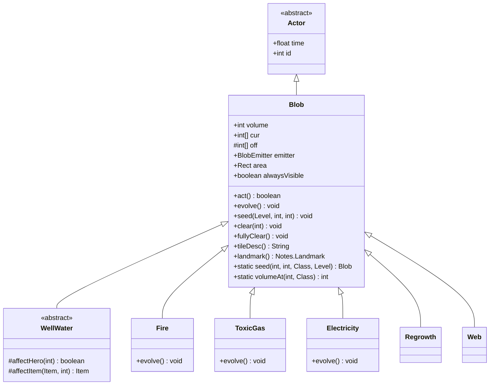

# Blob 源码详解

## 1. 基本信息

| 属性 | 值 |
|------|-----|
| **文件路径** | core/src/main/java/com/shatteredpixel/shatteredpixeldungeon/actors/blobs/Blob.java |
| **包名** | com.shatteredpixel.shatteredpixeldungeon.actors.blobs |
| **类类型** | class（非抽象） |
| **继承关系** | extends Actor |
| **代码行数** | 283 |

---

## 类职责

Blob 是游戏中所有"区域效果"的基类。区域效果是覆盖地图上多个格子的持续性效果，如：
- **气体**：毒气、麻痹气体、腐蚀气体
- **火焰**：普通火、地狱火
- **特殊效果**：生长、电能、蛛网

核心职责：
1. **空间管理**：跟踪效果在每个格子上的强度
2. **扩散模拟**：实现气体/火焰的扩散行为
3. **视觉表现**：管理粒子发射器
4. **序列化**：支持存档/读档

---

## 4. 继承与协作关系



---

## 实例字段

| 字段名 | 类型 | 默认值 | 说明 |
|--------|------|--------|------|
| `volume` | int | 0 | 总量（所有格子的强度之和） |
| `cur` | int[] | null | 当前帧每个格子的强度 |
| `off` | int[] | null | 下一帧每个格子的强度（离屏缓冲） |
| `emitter` | BlobEmitter | null | 粒子发射器 |
| `area` | Rect | new Rect() | 效果覆盖的矩形区域 |
| `alwaysVisible` | boolean | false | 是否始终可见（即使不在视野内） |

---

## 7. 方法详解

### act()

```java
@Override
public boolean act() {
    spend( TICK );  // 消耗1回合
    
    if (volume > 0) {
        // 第1-5行：设置区域（首次）
        if (area.isEmpty())
            setupArea();

        volume = 0;  // 重置总量，evolve()会重新计算

        evolve();  // 执行扩散/衰减逻辑
        
        // 第6-8行：交换缓冲区
        int[] tmp = off;
        off = cur;
        cur = tmp;

        // 第9-12行：更新格子标记
        for (int i : cellsToFlagUpdate){
            Dungeon.level.updateCellFlags(i);
        }
        cellsToFlagUpdate.clear();
        
    } else {
        // 第13-18行：清空区域
        if (!area.isEmpty()) {
            area.setEmpty();
            System.arraycopy(cur, 0, off, 0, cur.length);  // 清理off
        }
    }
    
    return true;
}
```

**方法作用**：每回合执行区域效果的演化。

**重写来源**：Actor.act()

**执行流程**：
1. 消耗时间
2. 如果有效果存在：
   - 执行 `evolve()` 计算下一帧
   - 交换缓冲区
   - 更新格子标记
3. 如果没有效果：清空区域

---

### evolve()

```java
protected void evolve() {
    boolean[] blocking = Dungeon.level.solid;  // 障碍格子
    int cell;
    
    // 遍历区域内的所有格子
    for (int i=area.top-1; i <= area.bottom; i++) {
        for (int j = area.left-1; j <= area.right; j++) {
            cell = j + i*Dungeon.level.width();
            if (Dungeon.level.insideMap(cell)) {
                if (!blocking[cell]) {
                    // 第1-20行：计算周围格子的强度影响
                    int count = 1;
                    int sum = cur[cell];  // 当前格子

                    // 左邻居
                    if (j > area.left && !blocking[cell-1]) {
                        sum += cur[cell-1];
                        count++;
                    }
                    // 右邻居
                    if (j < area.right && !blocking[cell+1]) {
                        sum += cur[cell+1];
                        count++;
                    }
                    // 上邻居
                    if (i > area.top && !blocking[cell-Dungeon.level.width()]) {
                        sum += cur[cell-Dungeon.level.width()];
                        count++;
                    }
                    // 下邻居
                    if (i < area.bottom && !blocking[cell+Dungeon.level.width()]) {
                        sum += cur[cell+Dungeon.level.width()];
                        count++;
                    }

                    // 第21-30行：计算新值
                    // 新值 = (周围平均值) - 1，最小为0
                    int value = sum >= count ? (sum / count) - 1 : 0;
                    off[cell] = value;

                    // 第31-45行：更新区域边界
                    if (value > 0){
                        if (i < area.top)
                            area.top = i;
                        else if (i >= area.bottom)
                            area.bottom = i+1;
                        if (j < area.left)
                            area.left = j;
                        else if (j >= area.right)
                            area.right = j+1;
                    }

                    volume += value;  // 累加总量
                } else {
                    off[cell] = 0;  // 障碍格子不有效果
                }
            }
        }
    }
}
```

**方法作用**：执行效果扩散的核心算法。

**扩散算法**：
1. 对区域内每个非障碍格子
2. 计算自身和相邻4格的平均值
3. 新值 = 平均值 - 1（衰减）
4. 更新区域边界

**设计意图**：模拟气体/火焰的自然扩散行为

---

### seed(Level level, int cell, int amount)

```java
public void seed( Level level, int cell, int amount ) {
    // 初始化数组（如果需要）
    if (cur == null) cur = new int[level.length()];
    if (off == null) off = new int[cur.length];

    cur[cell] += amount;  // 增加指定格子的强度
    volume += amount;     // 增加总量

    area.union(cell%level.width(), cell/level.width());  // 扩展区域
}
```

**方法作用**：在指定位置添加效果种子。

**参数**：
- `level` (Level)：关卡
- `cell` (int)：格子索引
- `amount` (int)：强度

---

### clear(int cell)

```java
public void clear( int cell ) {
    if (volume == 0) return;
    volume -= cur[cell];  // 减少总量
    cur[cell] = 0;        // 清除该格子
}
```

**方法作用**：清除指定格子的效果。

---

### fullyClear()

```java
public void fullyClear(){
    volume = 0;
    area.setEmpty();
    cur = new int[Dungeon.level.length()];
    off = new int[Dungeon.level.length()];
}
```

**方法作用**：完全清除所有效果。

---

### setupArea()

```java
public void setupArea(){
    for (int cell=0; cell < cur.length; cell++) {
        if (cur[cell] != 0){
            area.union(cell%Dungeon.level.width(), cell/Dungeon.level.width());
        }
    }
}
```

**方法作用**：根据 cur 数组计算区域边界。

---

### use(BlobEmitter emitter)

```java
public void use( BlobEmitter emitter ) {
    this.emitter = emitter;
}
```

**方法作用**：绑定粒子发射器。

---

### onBuildFlagMaps(Level l)

```java
public void onBuildFlagMaps( Level l ){
    // 默认不做任何事，只有部分blob影响地形标记
}
```

**方法作用**：在关卡构建标记地图时调用。

**重写示例**：
- `Web` 会标记格子为不可通行
- `Fire` 会标记格子为危险

---

### onUpdateCellFlags(Level l, int cell)

```java
public void onUpdateCellFlags( Level l, int cell){
    // 应用地形标记到单个格子
}
```

**方法作用**：更新单个格子的地形标记。

---

### tileDesc()

```java
public String tileDesc() {
    return null;
}
```

**方法作用**：返回格子描述文本（用于信息提示）。

---

### landmark()

```java
public Notes.Landmark landmark(){
    return null;
}
```

**方法作用**：返回关联的地标（如井水类型）。

---

## 静态方法详解

### seed(int cell, int amount, Class&lt;T&gt; type, Level level)

```java
public static<T extends Blob> T seed( int cell, int amount, Class<T> type, Level level ) {
    // 第1-3行：获取或创建Blob实例
    T gas = (T)level.blobs.get( type );
    
    if (gas == null) {
        gas = Reflection.newInstance(type);  // 动态创建
        
        // 第4-7行：防止"额外回合"
        // 如果当前行动者优先级低于Blob，则延迟1回合
        if (Actor.curActorPriority() < gas.actPriority) {
            gas.spend(1f);
        }
    }
    
    if (gas != null){
        level.blobs.put( type, gas );  // 注册到关卡
        gas.seed( level, cell, amount );  // 添加种子
    }
    
    return gas;
}
```

**方法作用**：创建或获取Blob并在指定位置添加种子。

**参数**：
- `cell` (int)：格子索引
- `amount` (int)：强度
- `type` (Class&lt;T&gt;)：Blob类型
- `level` (Level)：关卡

**返回值**：Blob实例

**防止额外回合**：新创建的Blob如果由低优先级Actor触发，会延迟1回合行动

---

### volumeAt(int cell, Class&lt;? extends Blob&gt; type)

```java
public static int volumeAt( int cell, Class<? extends Blob> type){
    Blob gas = Dungeon.level.blobs.get( type );
    if (gas == null || gas.volume == 0) {
        return 0;
    } else {
        return gas.cur[cell];  // 返回指定格子的强度
    }
}
```

**方法作用**：查询指定格子上的特定Blob强度。

**返回值**：该格子上的效果强度（整数）

---

## 序列化方法详解

### storeInBundle(Bundle bundle)

```java
@Override
public void storeInBundle( Bundle bundle ) {
    super.storeInBundle( bundle );
    
    if (volume > 0) {
        // 第1-10行：找到有效数据的起始和结束位置
        int start;
        for (start=0; start < Dungeon.level.length(); start++) {
            if (cur[start] > 0) {
                break;
            }
        }
        int end;
        for (end=Dungeon.level.length()-1; end > start; end--) {
            if (cur[end] > 0) {
                break;
            }
        }
        
        // 第11-15行：只保存有效部分
        bundle.put( START, start );
        bundle.put( LENGTH, cur.length );
        bundle.put( CUR, trim( start, end + 1 ) );  // 裁剪数组
    }
}

private int[] trim( int start, int end ) {
    int len = end - start;
    int[] copy = new int[len];
    System.arraycopy( cur, start, copy, 0, len );
    return copy;
}
```

**方法作用**：保存Blob状态到Bundle。

**优化**：只保存非零数据部分，节省存储空间

---

### restoreFromBundle(Bundle bundle)

```java
@Override
public void restoreFromBundle( Bundle bundle ) {
    super.restoreFromBundle( bundle );

    if (bundle.contains( CUR )) {
        cur = new int[bundle.getInt(LENGTH)];
        off = new int[cur.length];

        int[] data = bundle.getIntArray(CUR);
        int start = bundle.getInt(START);
        for (int i = 0; i < data.length; i++) {
            cur[i + start] = data[i];
            volume += data[i];
        }
    }
}
```

**方法作用**：从Bundle恢复Blob状态。

---

## 与其他类的交互

### 被哪些类继承

| 类名 | 说明 |
|------|------|
| `WellWater` | 井水效果（抽象类） |
| `Fire` | 火焰 |
| `ToxicGas` | 毒气 |
| `ParalyticGas` | 麻痹气体 |
| `CorrosiveGas` | 腐蚀气体 |
| `Electricity` | 电能 |
| `Regrowth` | 生长 |
| `Web` | 蛛网 |
| `Inferno` | 地狱火 |
| `Blizzard` | 暴风雪 |

### 使用了哪些类

| 类名 | 用于什么目的 |
|------|-------------|
| `Actor` | 基础回合系统 |
| `Level` | 访问关卡数据 |
| `BlobEmitter` | 粒子效果 |
| `Rect` | 矩形区域 |
| `Bundle` | 序列化 |

---

## 主要子类

### Fire（火焰）

```java
public class Fire extends Blob {
    @Override
    protected void evolve() {
        // 自定义扩散逻辑：考虑可燃物
        // 对角色造成伤害
        // 点燃物品
    }
}
```

### ToxicGas（毒气）

```java
public class ToxicGas extends Blob {
    @Override
    protected void evolve() {
        super.evolve();  // 使用默认扩散
        // 对范围内角色施加中毒
    }
}
```

### WellWater（井水）

```java
public abstract class WellWater extends Blob {
    @Override
    protected void evolve() {
        // 不扩散，保持在原位
    }
    
    abstract protected boolean affectHero(int pos);
    abstract protected Item affectItem(Item item, int pos);
}
```

---

## 11. 使用示例

### 创建自定义Blob

```java
public class CustomGas extends Blob {
    @Override
    protected void evolve() {
        // 自定义扩散逻辑
        super.evolve();  // 或使用默认扩散
        
        // 对范围内角色造成效果
        for (int i = area.left; i < area.right; i++) {
            for (int j = area.top; j < area.bottom; j++) {
                int cell = i + j * Dungeon.level.width();
                if (cur[cell] > 0) {
                    Char ch = Actor.findChar(cell);
                    if (ch != null) {
                        // 对角色造成效果
                    }
                }
            }
        }
    }
    
    @Override
    public String tileDesc() {
        return "一团奇怪的气体。";
    }
}
```

### 生成Blob

```java
// 在指定位置生成毒气
Blob.seed(pos, 100, ToxicGas.class);

// 查询某位置的毒气强度
int strength = Blob.volumeAt(pos, ToxicGas.class);

// 清除指定位置的Blob
ToxicGas gas = Dungeon.level.blobs.get(ToxicGas.class);
if (gas != null) {
    gas.clear(pos);
}
```

---

## 注意事项

### 双缓冲机制

Blob 使用 `cur` 和 `off` 两个数组实现双缓冲：
- `cur`：当前帧数据
- `off`：下一帧数据（计算结果）
- 每回合交换两个数组

**原因**：避免计算过程中读写冲突

### 性能优化

1. **区域裁剪**：只处理有效区域内的格子
2. **序列化裁剪**：只保存非零数据
3. **延迟初始化**：`cur` 和 `off` 在首次使用时创建

### 常见的坑

1. **忘记调用 super.evolve()**：自定义扩散逻辑时可能导致问题
2. **直接修改 cur**：应该通过 `seed()` 或 `clear()` 修改
3. **区域未更新**：扩散到边界外时需要手动扩展 `area`

### 最佳实践

1. 继承时重写 `evolve()` 实现自定义行为
2. 使用静态 `seed()` 方法创建Blob
3. 重写 `tileDesc()` 提供玩家提示
4. 对于需要影响地形的Blob，重写 `onBuildFlagMaps()`