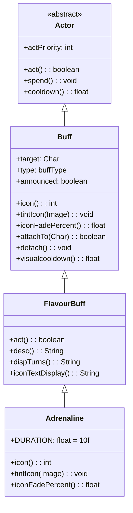

# Adrenaline 类文档

## 1. 基本信息

| 属性 | 值 |
|------|-----|
| **文件路径** | core/src/main/java/com/shatteredpixel/shatteredpixeldungeon/actors/buffs/Adrenaline.java |
| **包名** | com.shatteredpixel.shatteredpixeldungeon.actors.buffs |
| **文件类型** | class |
| **继承关系** | extends FlavourBuff |
| **代码行数** | 52 |
| **所属模块** | core |

## 2. 文件职责说明

### 核心职责
Adrenaline（激素涌动）是一个正面Buff，代表角色处于激素涌动飙升状态。该Buff继承自FlavourBuff，是一个简单的计时型Buff，持续10回合。

### 系统定位
位于Buff系统的末端实现层，作为FlavourBuff的具体实现之一，负责提供激素涌动状态的视觉表现（图标和颜色），不包含具体的游戏效果逻辑。

### 不负责什么
- 不实现实际的移动速度提升或攻击速度提升逻辑（由其他系统通过检查此Buff实现）
- 不处理Buff的应用条件判断
- 不处理Buff的叠加逻辑

## 3. 结构总览

### 主要成员概览
- `DURATION` - 静态常量，定义Buff持续时间
- `type` - 继承自Buff，设置为POSITIVE（正面Buff）
- `announced` - 继承自Buff，设置为true（会公告）

### 主要逻辑块概览
- 实例初始化块：设置Buff类型和公告属性
- icon()方法：返回Buff图标索引
- tintIcon()方法：设置图标颜色
- iconFadePercent()方法：计算图标淡出百分比

### 生命周期/调用时机
1. 通过Buff.affect()或Buff.append()创建并附加到角色
2. 每回合调用父类FlavourBuff.act()进行计时
3. 计时结束后自动detach()

## 4. 继承与协作关系

### 父类提供的能力
继承自FlavourBuff：
- `act()` - 计时结束自动移除
- `desc()` - 提供带回合数的描述
- `dispTurns()` - 格式化显示回合数
- `iconTextDisplay()` - 返回剩余回合数的文本显示

继承自Buff：
- `target` - 目标角色引用
- `type` - Buff类型（正面/负面/中性）
- `announced` - 是否公告
- `attachTo()` - 附加到目标
- `detach()` - 从目标移除
- `spend()` - 消耗时间
- `cooldown()` - 获取剩余冷却时间
- `visualcooldown()` - 获取视觉冷却时间（cooldown+1）

### 覆写的方法
- `icon()` - 返回BuffIndicator.UPGRADE
- `tintIcon(Image)` - 设置红色高光
- `iconFadePercent()` - 计算剩余时间比例

### 依赖的关键类
- `FlavourBuff` - 父类，提供计时型Buff的基础实现
- `BuffIndicator` - 提供Buff图标常量
- `Image` - Noosa图像类，用于图标着色

### 使用者
- 给予激素涌动效果的能力或物品
- 检查激素涌动状态的战斗逻辑



## 5. 字段/常量详解

### 静态常量
| 常量名 | 类型 | 值 | 说明 |
|--------|------|-----|------|
| DURATION | float | 10f | Buff默认持续时间（回合数） |

### 实例字段
| 字段名 | 类型 | 默认值 | 说明 |
|--------|------|--------|------|
| type | buffType | POSITIVE | 继承自Buff，在实例初始化块中设置为正面Buff |
| announced | boolean | true | 继承自Buff，在实例初始化块中设置为true，表示添加/移除时会显示消息 |

### 初始化块
```java
{
    type = buffType.POSITIVE;
    announced = true;
}
```

## 6. 构造与初始化机制

### 构造器
无显式构造器，使用默认构造器。

### 初始化块
实例初始化块在对象创建时执行：
1. 设置 `type = buffType.POSITIVE` - 标记为正面Buff
2. 设置 `announced = true` - 启用公告功能

### 初始化注意事项
- 实际持续时间通过 `Buff.affect()` 或 `Buff.append()` 方法调用时传入的duration参数设置
- 不应直接实例化，应使用Buff类的静态工厂方法

## 7. 方法详解

### icon()

**可见性**：public

**是否覆写**：是，覆写自Buff

**方法职责**：返回Buff在UI中显示的图标索引。

**参数**：无

**返回值**：int - 返回 `BuffIndicator.UPGRADE`，表示使用升级图标

**前置条件**：无

**副作用**：无

**核心实现逻辑**：
```java
@Override
public int icon() {
    return BuffIndicator.UPGRADE;
}
```

**边界情况**：无特殊边界情况处理。

---

### tintIcon(Image icon)

**可见性**：public

**是否覆写**：是，覆写自Buff

**方法职责**：为Buff图标设置颜色色调，使其在视觉上与其他使用相同基础图标的Buff区分。

**参数**：
- `icon` (Image) - 需要着色的图标图像对象

**返回值**：void

**前置条件**：icon参数不应为null

**副作用**：修改传入的Image对象的颜色

**核心实现逻辑**：
```java
@Override
public void tintIcon(Image icon) {
    icon.hardlight(1, 0, 0);  // RGB: 红色高光
}
```
使用 `hardlight(1, 0, 0)` 将图标染成红色，表示激素涌动状态的视觉效果。

**边界情况**：无特殊边界情况处理。

---

### iconFadePercent()

**可见性**：public

**是否覆写**：是，覆写自Buff

**方法职责**：计算Buff图标的淡出百分比，用于UI显示剩余时间的视觉效果。

**参数**：无

**返回值**：float - 返回一个0到1之间的值，表示图标应显示的完整度。值越大表示剩余时间越多。

**前置条件**：无

**副作用**：无

**核心实现逻辑**：
```java
@Override
public float iconFadePercent() {
    return Math.max(0, (DURATION - visualcooldown()) / DURATION);
}
```
计算公式：`(总时长 - 已过时间) / 总时长`
- `visualcooldown()` 返回已过去的回合数（cooldown + 1）
- `Math.max(0, ...)` 确保结果不会为负数

**边界情况**：当visualcooldown()超过DURATION时，返回0。

## 8. 对外暴露能力

### 显式 API
| 方法 | 说明 |
|------|------|
| `icon()` | 获取Buff图标索引 |
| `tintIcon(Image)` | 设置图标颜色 |
| `iconFadePercent()` | 获取图标淡出百分比 |
| `DURATION` | 获取默认持续时间常量 |

### 内部辅助方法
无（所有方法都是覆写父类方法）。

### 扩展入口
可通过覆写以下方法进行扩展：
- `icon()` - 使用不同的图标
- `tintIcon()` - 使用不同的颜色

## 9. 运行机制与调用链

### 创建时机
当角色获得激素涌动效果时，通过以下方式创建：
1. `Buff.affect(hero, Adrenaline.class, Adrenaline.DURATION)` - 添加或刷新
2. `Buff.append(hero, Adrenaline.class, Adrenaline.DURATION)` - 强制添加新实例
3. `Buff.prolong(hero, Adrenaline.class, Adrenaline.DURATION)` - 延长持续时间

### 调用者
- 激素药水或其他给予激素涌动效果的物品/能力
- Buff系统在渲染UI时调用icon()和tintIcon()

### 被调用者
- `BuffIndicator` - 用于显示Buff图标
- `visualcooldown()` - 继承自Buff，用于计算剩余时间

### 系统流程位置
```
[物品/能力使用]
    ↓
[Buff.affect() / Buff.append() / Buff.prolong()]
    ↓
[Adrenaline实例创建并附加到角色]
    ↓
[每回合FlavourBuff.act()被调用]
    ↓
[计时结束，detach()移除Buff]
```

## 10. 资源、配置与国际化关联

### 引用的 messages 文案
| 键名 | 中文翻译 | 用途 |
|------|---------|------|
| actors.buffs.adrenaline.name | 激素涌动 | Buff名称显示 |
| actors.buffs.adrenaline.desc | 由肾上腺素带来的纯粹的潜能爆发，激素涌动能够增强一名角色的移动和攻击速度。\n\n激素涌动允许角色拥有2倍的移动速度和1.5倍的攻击速度。\n\n激素涌动持续时间：%s回合 | Buff描述（继承自FlavourBuff的desc()方法使用） |

### 依赖的资源
- BuffIndicator.UPGRADE 图标资源

### 中文翻译来源
- 文件路径：`core/src/main/assets/messages/actors/actors_zh.properties`
- 键名前缀：`actors.buffs.adrenaline.`

## 11. 使用示例

### 基本用法

```java
import com.dustedpixel.dustedpixeldungeon.actors.buffs.Adrenaline;
import com.dustedpixel.dustedpixeldungeon.actors.buffs.Buff;

// 为英雄添加激素涌动Buff，持续10回合
Buff.affect(hero, Adrenaline .class, Adrenaline.DURATION);

// 检查角色是否有激素涌动Buff
if(hero.

buff(Adrenaline .class) !=null){
        // 角色处于激素涌动状态，应用速度加成
        // 2倍移动速度，1.5倍攻击速度
        }

// 延长激素涌动持续时间（不叠加，只延长）
        Buff.

prolong(hero, Adrenaline .class, Adrenaline.DURATION);
```

### 移除Buff示例
```java
// 移除激素涌动Buff
Buff.detach(hero, Adrenaline.class);
```

## 12. 开发注意事项

### 状态依赖
- 依赖父类FlavourBuff的计时机制
- 依赖Buff类的target字段获取目标角色

### 生命周期耦合
- 与Actor系统耦合，Buff作为Actor的子类参与回合调度
- 与Char系统耦合，必须附加到Char才能正常工作

### 常见陷阱
1. **不要直接实例化**：应使用Buff类的静态工厂方法
2. **持续时间设置**：必须通过Buff.affect()等方法的duration参数设置，实例初始化块只设置类型和公告属性
3. **实际效果实现**：此Buff只提供状态标记和视觉表现，实际的速度加成需要在移动和攻击逻辑中检查此Buff来实现

## 13. 修改建议与扩展点

### 适合扩展的位置
- 如果需要修改图标外观，覆写 `icon()` 和 `tintIcon()` 方法
- 如果需要自定义淡出效果，覆写 `iconFadePercent()` 方法

### 不建议修改的位置
- DURATION常量 - 修改可能影响游戏平衡
- 实例初始化块中的type和announced设置

### 重构建议
- 如果多个Buff使用相同的计时机制但需要不同的持续时间，可考虑在父类FlavourBuff中添加更灵活的持续时间管理

## 14. 事实核查清单

- [x] 是否已覆盖全部字段：是，覆盖了DURATION常量和继承的type、announced字段
- [x] 是否已覆盖全部方法：是，覆盖了icon()、tintIcon()、iconFadePercent()三个覆写方法
- [x] 是否已检查继承链与覆写关系：是，Actor → Buff → FlavourBuff → Adrenaline
- [x] 是否已核对官方中文翻译：是，使用actors_zh.properties中的"激素涌动"
- [x] 是否存在任何推测性表述：否，所有内容基于源码分析
- [x] 示例代码是否真实可用：是，使用Buff类的标准API
- [x] 是否遗漏资源/配置/本地化关联：否，已列出messages键名和图标资源
- [x] 是否明确说明了注意事项与扩展点：是，已在第12、13章详细说明