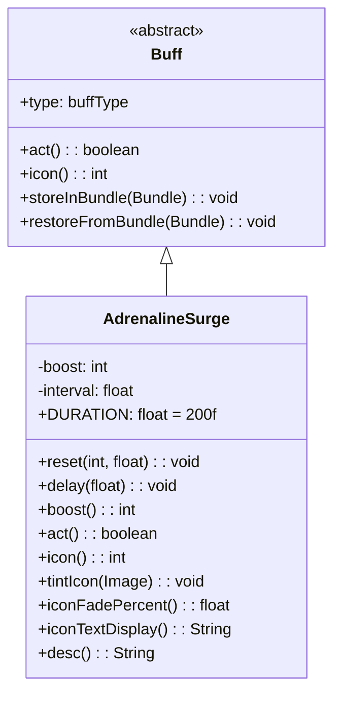

# AdrenalineSurge 类文档

## 1. 基本信息
| 属性 | 值 |
|------|-----|
| 文件路径 | core/src/main/java/com/shatteredpixel/shatteredpixeldungeon/actors/buffs/AdrenalineSurge.java |
| 包名 | com.shatteredpixel.shatteredpixeldungeon.actors.buffs |
| 类类型 | class |
| 继承关系 | extends Buff |
| 代码行数 | 106 |

## 2. 类职责说明
AdrenalineSurge（激素涌动激增）是一个正面Buff，提供力量和力量增益效果。与简单的Adrenaline不同，该Buff具有递减的boost值，每个间隔周期减少1点，直到为0时移除。主要用于药剂效果等提供临时属性增益的场景。

## 4. 继承与协作关系


## 静态常量表
| 常量名 | 类型 | 值 | 说明 |
|--------|------|-----|------|
| DURATION | float | 200f | 最大显示持续时间 |
| BOOST | String | "boost" | Bundle存储键 - boost值 |
| INTERVAL | String | "interval" | Bundle存储键 - 间隔值 |

## 实例字段表
| 字段名 | 类型 | 修饰符 | 说明 |
|--------|------|--------|------|
| boost | int | private | 当前的增益点数 |
| interval | float | private | boost递减的时间间隔 |

## 7. 方法详解

### reset(int boost, float interval)
**签名**: `public void reset(int boost, float interval)`
**功能**: 重置Buff的增益值和递减间隔。
**参数**:
- boost: int - 新的增益点数
- interval: float - boost递减的间隔（回合数）
**返回值**: void
**实现逻辑**:
```java
this.boost = boost;           // 设置新的增益值
this.interval = interval;     // 设置递减间隔
spend(interval - cooldown()); // 设置下一次act的等待时间
```

### delay(float value)
**签名**: `public void delay(float value)`
**功能**: 延迟Buff的下一次触发。
**参数**:
- value: float - 要延迟的回合数
**返回值**: void
**实现逻辑**:
```java
spend(value);  // 增加等待时间
```

### boost()
**签名**: `public int boost()`
**功能**: 获取当前的增益点数。
**返回值**: int - 当前的boost值。
**实现逻辑**:
```java
return boost;  // 直接返回boost字段
```

### act()
**签名**: `public boolean act()`
**功能**: Buff的主要逻辑方法，每间隔执行一次，减少boost值。
**返回值**: boolean - 返回true表示成功执行。
**实现逻辑**:
```java
boost--;               // 减少增益点数
if (boost > 0) {       // 如果还有增益剩余
    spend(interval);   // 等待下一个间隔
} else {               // 增益耗尽
    detach();          // 移除Buff
}
return true;
```

### icon()
**签名**: `public int icon()`
**功能**: 返回Buff图标的索引标识符。
**返回值**: int - 返回BuffIndicator.UPGRADE（升级图标）。

### tintIcon(Image icon)
**签名**: `public void tintIcon(Image icon)`
**功能**: 为Buff图标设置颜色色调。
**参数**:
- icon: Image - 需要着色的图标图像
**实现逻辑**:
```java
icon.hardlight(1f, 0.5f, 0);  // 设置橙红色高光效果
```

### iconFadePercent()
**签名**: `public float iconFadePercent()`
**功能**: 计算Buff图标的淡出百分比。
**返回值**: float - 图标完整度比例。
**实现逻辑**:
```java
return Math.max(0, (DURATION - visualcooldown()) / DURATION);
```

### iconTextDisplay()
**签名**: `public String iconTextDisplay()`
**功能**: 返回图标上显示的文本（剩余时间）。
**返回值**: String - 剩余时间的字符串表示。
**实现逻辑**:
```java
return Integer.toString((int)visualcooldown());  // 返回可视化冷却时间
```

### desc()
**签名**: `public String desc()`
**功能**: 返回Buff的详细描述文本。
**返回值**: String - 包含boost值和剩余时间的描述。
**实现逻辑**:
```java
return Messages.get(this, "desc", boost, dispTurns(visualcooldown()));
// 从消息资源获取描述，包含两个参数：boost值和剩余回合数
```

### storeInBundle(Bundle bundle)
**签名**: `public void storeInBundle(Bundle bundle)`
**功能**: 将Buff状态保存到Bundle中，用于游戏存档。
**参数**:
- bundle: Bundle - 存储数据的Bundle对象
**实现逻辑**:
```java
super.storeInBundle(bundle);      // 调用父类方法
bundle.put(BOOST, boost);         // 保存boost值
bundle.put(INTERVAL, interval);   // 保存interval值
```

### restoreFromBundle(Bundle bundle)
**签名**: `public void restoreFromBundle(Bundle bundle)`
**功能**: 从Bundle恢复Buff状态，用于读取存档。
**参数**:
- bundle: Bundle - 包含存储数据的Bundle对象
**实现逻辑**:
```java
super.restoreFromBundle(bundle);          // 调用父类方法
boost = bundle.getInt(BOOST);             // 恢复boost值
interval = bundle.getFloat(INTERVAL);     // 恢复interval值
```

## 11. 使用示例
```java
// 添加激素涌动激增Buff，提供2点力量增益，每100回合递减
AdrenalineSurge surge = Buff.affect(hero, AdrenalineSurge.class);
surge.reset(2, 100f);

// 检查当前增益值
int currentBoost = surge.boost();

// 延迟递减
surge.delay(10f);
```

## 注意事项
1. boost值会随时间递减，直到为0时Buff自动移除
2. interval决定了boost递减的频率
3. 需要通过reset()方法初始化boost和interval值

## 最佳实践
1. 使用Buff.affect()创建Buff后立即调用reset()设置参数
2. 在需要临时属性增益的场景使用此Buff
3. 注意设置合理的interval值以控制递减速度