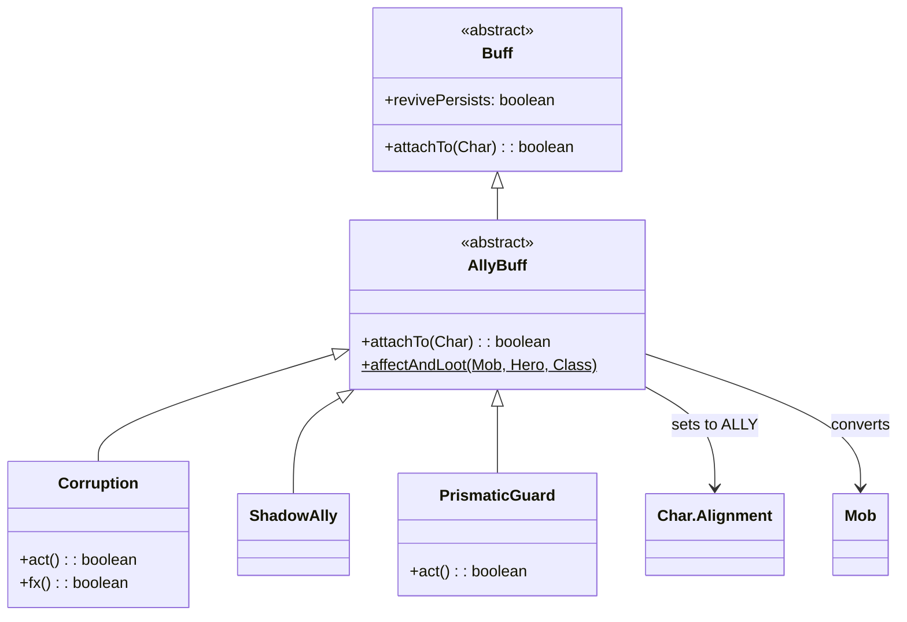

# AllyBuff 类文档

## 1. 基本信息

| 属性 | 值 |
|------|-----|
| 文件路径 | core/src/main/java/com/shatteredpixel/shatteredpixeldungeon/actors/buffs/AllyBuff.java |
| 包名 | com.shatteredpixel.shatteredpixeldungeon.actors.buffs |
| 类类型 | abstract class |
| 继承关系 | extends Buff |
| 代码行数 | 85 行 |
| 许可证 | GNU GPL v3 |

## 2. 类职责说明

`AllyBuff` 是将敌人转化为盟友的Buff的抽象基类，负责：

1. **阵营转换** - 将目标的阵营设为盟友
2. **状态清理** - 移除不兼容的状态（如PinCushion）
3. **战利品处理** - 提供`affectAndLoot()`方法处理经验值和掉落
4. **持久化标记** - 设置`revivePersists`保证跨存档保持

## 4. 继承与协作关系



## 实例初始化块

```java
{
    revivePersists = true;  // Buff在角色复活后持久化
}
```

## 7. 方法详解

### attachTo(Char target)

**签名**: `@Override public boolean attachTo(Char target)`

**功能**: 将Buff附加到目标，同时转换阵营。

**参数**:
- `target`: Char - 目标角色

**返回值**: `boolean` - 附加成功返回true

**实现逻辑**:
```java
// 第43-54行：
if (super.attachTo(target)) {
    target.alignment = Char.Alignment.ALLY;  // 设置为盟友阵营
    if (target.buff(PinCushion.class) != null) {
        target.buff(PinCushion.class).detach();  // 移除针垫状态
    }
    return true;
}
return false;
```

### affectAndLoot(Mob enemy, Hero hero, Class<? extends AllyBuff> buffCls)

**签名**: `public static void affectAndLoot(Mob enemy, Hero hero, Class<? extends AllyBuff> buffCls)`

**功能**: 应用盟友Buff并处理战利品/经验值，模拟敌人死亡效果。

**参数**:
- `enemy`: Mob - 要转化的敌人
- `hero`: Hero - 英雄
- `buffCls`: Class<? extends AllyBuff> - 要应用的Buff类型

**实现逻辑**:

```
第58-83行：转化并奖励流程
├─ 第59行：记录敌人是否原本是敌对阵营
├─ 第60行：应用AllyBuff
├─ 第62-82行：如果成功转化且原本是敌人
│  ├─ 第63行：触发掉落判定
│  ├─ 第65-69行：更新统计数据
│  │  ├─ enemiesSlain++
│  │  ├─ validateMonstersSlain()
│  │  └─ 记录图鉴
│  ├─ 第71行：处理飞升挑战
│  ├─ 第73-77行：计算并授予经验
│  └─ 第79-81行：武僧子职业获得能量
```

## 11. 使用示例

### 创建自定义盟友Buff

```java
public class MyAllyBuff extends AllyBuff {
    
    @Override
    public int icon() {
        return BuffIndicator.CORRUPT;
    }
    
    @Override
    public String desc() {
        return "这个敌人现在是你的盟友。";
    }
}
```

### 应用盟友Buff（带战利品）

```java
// 转化敌人并获得经验/掉落
AllyBuff.affectAndLoot(enemy, hero, Corruption.class);

// 简单转化（无战利品）
Buff.affect(enemy, MyAllyBuff.class);
```

### 检查盟友状态

```java
// 检查是否为盟友
if (enemy.alignment == Char.Alignment.ALLY) {
    // 这是一个盟友
}

// 检查具体的Buff
if (enemy.buff(Corruption.class) != null) {
    // 被腐化的盟友
}
```

## 子类列表

| 子类 | 功能 | 来源 |
|------|------|------|
| Corruption | 腐化敌人成为盟友 | 腐化法杖 |
| PrismaticGuard | 棱镜守护 | 棱镜幻象 |
| ShadowAlly | 暗影盟友 | 暗影铭文 |
| AllyFungalSleeper | 真菌沉睡者 | 特殊情况 |

## 注意事项

1. **阵营互斥** - 盟友Buff会改变阵营，影响所有阵营相关逻辑
2. **掉落处理** - 使用`affectAndLoot()`确保获得战利品
3. **经验计算** - 等级超过敌人maxLvl时经验为0
4. **武僧联动** - 武僧子职业会自动获得能量

## 最佳实践

### 标准转化流程

```java
// 推荐使用affectAndLoot确保奖励
public void convertEnemy(Mob enemy, Hero hero) {
    // 检查是否可以转化
    if (enemy.properties.contains(Char.Property.BOSS)) {
        GLog.w("无法转化Boss！");
        return;
    }
    
    // 转化并奖励
    AllyBuff.affectAndLoot(enemy, hero, Corruption.class);
    GLog.p("敌人已被腐化！");
}
```

## 相关文件

| 文件 | 说明 |
|------|------|
| Buff.java | 父类 |
| Corruption.java | 腐化Buff实现 |
| Char.java | 角色基类，包含Alignment |
| Mob.java | 怪物基类 |
| Badges.java | 成就系统 |
| Statistics.java | 统计数据 |
| Bestiary.java | 图鉴系统 |