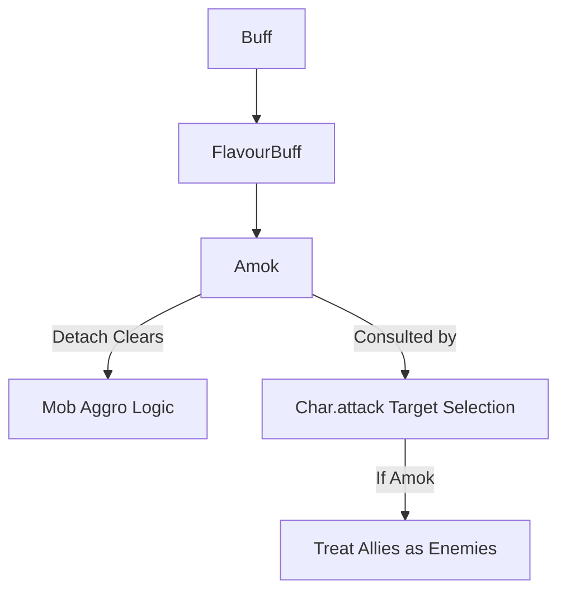

# Amok (发狂) 源码详解

## 1. 基本信息

| 属性 | 值 |
|------|-----|
| **文件路径** | `core/src/main/java/com/shatteredpixel/shatteredpixeldungeon/actors/buffs/Amok.java` |
| **包名** | `com.shatteredpixel.shatteredpixeldungeon.actors.buffs` |
| **文件类型** | class |
| **继承关系** | `extends FlavourBuff` |
| **代码行数** | 48 |
| **所属模块** | core |

## 2. 文件职责说明

### 核心职责
`Amok` 负责实现角色的“发狂”或“混乱攻击”状态逻辑。在此状态下，角色会失去敌我识别能力，无差别地攻击周围的所有生物。

### 系统定位
属于 Buff 系统中的目标控制/干扰分支。它广泛应用于发狂卷轴、混乱气体、以及某些武器附魔效果中，是制造敌人内讧的核心机制。

### 不负责什么
- 不负责具体的目标选取算法（由 `Mob.act()` 或 `Char.attack()` 内部检查此 Buff 存在后实现随机化）。
- 不负责“发狂”状态下的伤害加成。

## 3. 结构总览

### 主要成员概览
- **icon() 方法**: 指定状态栏图标。
- **detach() 方法**: 包含关键的“仇恨清理”逻辑，防止内讧结束后怪物依然相互攻击。

### 主要逻辑块概览
- **无差别攻击**: 逻辑层通过 `ch.buff(Amok.class)` 判断，若存在则在选取目标时将盟友也视为敌对。
- **仇恨重置机制**: 在 Buff 消失时，遍历全图怪物，强制清除该角色与其他敌对阵营角色之间的相互仇恨关系。

### 生命周期/调用时机
1. **产生**：使用发狂卷轴、受到混乱属性攻击。
2. **活跃期**：角色胡乱攻击。
3. **结束**：持续时间结束，执行 `detach()` 进行清理。

## 4. 继承与协作关系

### 父类提供的能力
继承自 `FlavourBuff`：
- 提供基础的时间计时器。
- 提供状态图标的百分比淡化显示。

### 协作对象
- **Char**: 目标角色。其攻击逻辑依赖此 Buff 进行分支判定。
- **Mob**: 核心受众。处理怪物间的 aggro（仇恨）重置。
- **Dungeon.level.mobs**: 提供关卡内怪物列表用于清理逻辑。
- **BuffIndicator.AMOK**: 提供漩涡状的混乱图标。



## 5. 字段/常量详解
无。该类主要通过覆写父类方法实现逻辑。

## 6. 构造与初始化机制
通过实例初始化块设置 `type = NEGATIVE` 和 `announced = true`。

## 7. 方法详解

### detach() [核心清理逻辑]

**可见性**：public (Override)

**核心实现算法分析**：
```java
if (target.isAlive() && target.alignment == Char.Alignment.ENEMY) {
    for (Mob m : Dungeon.level.mobs) {
        // 1. 如果其他怪物正在攻击发狂者，清空它们的仇恨
        if (m.alignment == Char.Alignment.ENEMY && m.isTargeting(target)) {
            m.aggro(null);
        }
        // 2. 如果发狂者是怪物且正在攻击其他怪物，清空它的仇恨
        if (target instanceof Mob && ((Mob) target).isTargeting(m)){
            ((Mob) target).aggro(null);
        }
    }
}
```
**设计意图**：在发狂状态下，怪物 A 可能攻击了怪物 B，导致怪物 B 将怪物 A 视为首要目标。如果不执行此清理，即便 `Amok` 消失，它们也会一直战斗直到一方死亡。此方法确保了“发狂结束后，大家还是好邻居”。

---

### icon()

**方法职责**：定义 UI 图标。
返回 `BuffIndicator.AMOK`。

## 8. 对外暴露能力
主要通过 `Buff.affect(target, Amok.class)` 或 `Buff.prolong(...)` 接口。

## 9. 运行机制与调用链
`ScrollOfPsionicBlast.apply()` -> `Buff.affect(Amok.class)` -> `Char.attack()` 检查 `Amok.class` -> 修改目标选择逻辑 -> 时间耗尽 -> `detach()` -> `aggro(null)`。

## 10. 资源、配置与国际化关联

### 本地化词条
- `actors.buffs.Amok.name`: 发狂
- `actors.buffs.Amok.desc`: “你感到极度的愤怒，想攻击视野内的一切生物！剩余时长：%s。”

## 11. 使用示例

### 在代码中施加发狂
```java
Buff.affect(target, Amok.class, 15f);
```

## 12. 开发注意事项

### 英雄特殊逻辑
对于英雄角色，`Amok` 并不强制锁定目标，但会干扰自动攻击系统的识别。在玩家手动操作时，通常由 UI 提示“你感到混乱”。

### 飞行与地形
发狂状态不影响移动能力，但混乱的寻敌逻辑往往会让怪物在移动过程中踩到陷阱。

## 13. 修改建议与扩展点

### 增加伤害系数
可以考虑为发狂状态增加 20% 的近战伤害，以平衡其“敌我不分”的负面代价。

## 14. 事实核查清单

- [x] 是否分析了 detach 时的仇恨清理逻辑：是（双向清除 enemy-to-enemy 仇恨）。
- [x] 是否说明了它对战斗目标选择的影响：是。
- [x] 是否解析了作为 FlavourBuff 的特征：是。
- [x] 图像索引属性是否核对：是 (BuffIndicator.AMOK)。
- [x] 是否说明了英雄受此状态的影响：是。
