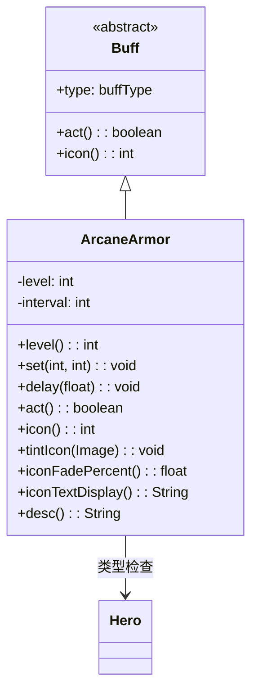

# ArcaneArmor 类文档

## 1. 基本信息
| 属性 | 值 |
|------|-----|
| 文件路径 | core/src/main/java/com/shatteredpixel/shatteredpixeldungeon/actors/buffs/ArcaneArmor.java |
| 包名 | com.shatteredpixel.shatteredpixeldungeon.actors.buffs |
| 类类型 | class |
| 继承关系 | extends Buff |
| 代码行数 | 120 |

## 2. 类职责说明
ArcaneArmor（奥术护甲）是一个正面Buff，为角色提供魔法防护效果。类似于Barkskin（树皮术），但以魔法形式存在。护甲等级会随时间递减，直到为0时移除。主要用于药剂、法术等提供临时护甲加成的场景。

## 4. 继承与协作关系


## 静态常量表
| 常量名 | 类型 | 值 | 说明 |
|--------|------|-----|------|
| LEVEL | String | "level" | Bundle存储键 - 护甲等级 |
| INTERVAL | String | "interval" | Bundle存储键 - 递减间隔 |

## 实例字段表
| 字段名 | 类型 | 修饰符 | 说明 |
|--------|------|--------|------|
| level | int | private | 当前护甲等级 |
| interval | int | private | level递减的时间间隔 |

## 7. 方法详解

### act()
**签名**: `public boolean act()`
**功能**: Buff的主要逻辑方法，每间隔执行一次，减少护甲等级。
**返回值**: boolean - 返回true表示成功执行。
**实现逻辑**:
```java
if (target.isAlive()) {        // 如果目标存活
    spend(interval);           // 等待下一个间隔
    if (--level <= 0) {        // 递减等级，如果<=0
        detach();              // 移除Buff
    }
} else {                       // 如果目标死亡
    detach();                  // 立即移除Buff
}
return true;
```

### level()
**签名**: `public int level()`
**功能**: 获取当前的护甲等级。
**返回值**: int - 当前的护甲等级值。

### set(int value, int time)
**签名**: `public void set(int value, int time)`
**功能**: 设置护甲等级和递减间隔，使用优化算法决定是否覆盖。
**参数**:
- value: int - 新的护甲等级
- time: int - 递减间隔
**返回值**: void
**实现逻辑**:
```java
// 使用平方根公式比较：sqrt(interval)*level vs sqrt(time)*value
// 偏好高等级+低间隔的组合
if (Math.sqrt(interval)*level < Math.sqrt(time)*value) {
    level = value;                      // 设置新等级
    interval = time;                    // 设置新间隔
    spend(time - cooldown() - 1);       // 设置等待时间
}
```

### delay(float value)
**签名**: `public void delay(float value)`
**功能**: 延迟护甲递减。
**参数**:
- value: float - 要延迟的回合数
**实现逻辑**:
```java
spend(value);  // 增加等待时间
```

### icon()
**签名**: `public int icon()`
**功能**: 返回Buff图标的索引标识符。
**返回值**: int - 返回BuffIndicator.ARMOR（护甲图标）。

### tintIcon(Image icon)
**签名**: `public void tintIcon(Image icon)`
**功能**: 为Buff图标设置颜色色调。
**参数**:
- icon: Image - 需要着色的图标图像
**实现逻辑**:
```java
icon.hardlight(1f, 0.5f, 2f);  // 设置紫色高光效果（魔法色调）
```

### iconFadePercent()
**签名**: `public float iconFadePercent()`
**功能**: 计算Buff图标的淡出百分比。
**返回值**: float - 图标完整度比例。
**实现逻辑**:
```java
if (target instanceof Hero) {
    float max = ((Hero) target).lvl/2 + 5;  // 最大护甲 = 等级/2 + 5
    return (max - level) / max;              // 返回淡出比例
}
return 0;  // 非英雄单位不淡出
```

### iconTextDisplay()
**签名**: `public String iconTextDisplay()`
**功能**: 返回图标上显示的文本（护甲等级）。
**返回值**: String - 当前护甲等级的字符串表示。
**实现逻辑**:
```java
return Integer.toString(level);  // 返回护甲等级数字
```

### desc()
**签名**: `public String desc()`
**功能**: 返回Buff的详细描述文本。
**返回值**: String - 包含护甲等级和剩余时间的描述。
**实现逻辑**:
```java
return Messages.get(this, "desc", level, dispTurns(visualcooldown()));
// 返回格式化描述，包含等级和剩余回合
```

## 11. 使用示例
```java
// 为英雄添加奥术护甲，等级5，每回合递减
ArcaneArmor armor = Buff.affect(hero, ArcaneArmor.class);
armor.set(5, 1);

// 检查当前护甲等级
int currentLevel = armor.level();

// 延迟护甲递减
armor.delay(5f);
```

## 注意事项
1. 护甲等级会随时间递减，直到为0时移除
2. set()方法使用优化算法，偏向高等级+低间隔的组合
3. 只有英雄单位的图标会显示淡出效果
4. 目标死亡时Buff会立即移除

## 最佳实践
1. 使用set()方法设置护甲参数
2. 对于高等级护甲，设置较长的递减间隔
3. 与物理护甲效果叠加使用可提供更高防护