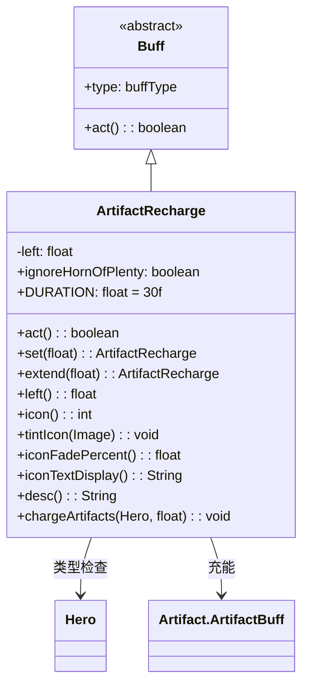

# ArtifactRecharge 类文档

## 1. 基本信息
| 属性 | 值 |
|------|-----|
| 文件路径 | core/src/main/java/com/shatteredpixel/shatteredpixeldungeon/actors/buffs/ArtifactRecharge.java |
| 包名 | com.shatteredpixel.shatteredpixeldungeon.actors.buffs |
| 类类型 | class |
| 继承关系 | extends Buff |
| 代码行数 | 135 |

## 2. 类职责说明
ArtifactRecharge（神器充能）是一个正面Buff，使英雄携带的所有神器获得充能效果。每个回合为所有非诅咒的神器Artibuff提供充能。支持排除特定神器（如丰收之角）。主要用于神器充能药剂、某些天赋效果等场景。

## 4. 继承与协作关系


## 静态常量表
| 常量名 | 类型 | 值 | 说明 |
|--------|------|-----|------|
| DURATION | float | 30f | 默认显示持续时间 |
| LEFT | String | "left" | Bundle存储键 - 剩余回合 |
| IGNORE_HORN | String | "ignore_horn" | Bundle存储键 - 忽略丰收之角标志 |

## 实例字段表
| 字段名 | 类型 | 修饰符 | 说明 |
|--------|------|--------|------|
| left | float | private | 剩余充能回合数 |
| ignoreHornOfPlenty | boolean | public | 是否忽略丰收之角充能 |

## 7. 方法详解

### act()
**签名**: `public boolean act()`
**功能**: Buff的主要逻辑方法，每回合为神器充能。
**返回值**: boolean - 返回true表示成功执行。
**实现逻辑**:
```java
if (target instanceof Hero) {
    float chargeAmount = Math.min(1, left);  // 计算充能量（最小为1）
    if (chargeAmount > 0) {
        // 遍历目标所有Buff
        for (Buff b : target.buffs()) {
            // 检查是否是神器Buff
            if (b instanceof Artifact.ArtifactBuff) {
                // 如果是丰收之角且设置了忽略，跳过
                if (b instanceof HornOfPlenty.hornRecharge && ignoreHornOfPlenty) {
                    continue;
                }
                // 为非诅咒神器充能
                if (!((Artifact.ArtifactBuff) b).isCursed()) {
                    ((Artifact.ArtifactBuff) b).charge((Hero) target, chargeAmount);
                }
            }
        }
    }
}
left--;                              // 减少剩余回合
if (left < 0) {                      // 回合耗尽
    detach();                        // 移除Buff
} else {
    spend(TICK);                     // 等待下一回合
}
return true;
```

### set(float amount)
**签名**: `public ArtifactRecharge set(float amount)`
**功能**: 设置充能回合数（如果新值更大）。
**参数**:
- amount: float - 充能回合数
**返回值**: ArtifactRecharge - 返回自身用于链式调用。
**实现逻辑**:
```java
if (left < amount) left = amount;  // 只在新值更大时更新
return this;                       // 返回自身
```

### extend(float amount)
**签名**: `public ArtifactRecharge extend(float amount)`
**功能**: 延长充能回合数。
**参数**:
- amount: float - 要延长的回合数
**返回值**: ArtifactRecharge - 返回自身用于链式调用。
**实现逻辑**:
```java
left += amount;  // 直接增加剩余回合
return this;     // 返回自身
```

### left()
**签名**: `public float left()`
**功能**: 获取剩余充能回合数。
**返回值**: float - 剩余回合数。

### icon()
**签名**: `public int icon()`
**功能**: 返回Buff图标的索引标识符。
**返回值**: int - 返回BuffIndicator.RECHARGING（充能图标）。

### tintIcon(Image icon)
**签名**: `public void tintIcon(Image icon)`
**功能**: 为Buff图标设置颜色色调。
**参数**:
- icon: Image - 需要着色的图标图像
**实现逻辑**:
```java
icon.hardlight(0, 1f, 0);  // 设置绿色高光效果
```

### iconFadePercent()
**签名**: `public float iconFadePercent()`
**功能**: 计算Buff图标的淡出百分比。
**返回值**: float - 图标完整度比例。
**实现逻辑**:
```java
return Math.max(0, (DURATION - left) / DURATION);
// 计算已消耗的比例
```

### iconTextDisplay()
**签名**: `public String iconTextDisplay()`
**功能**: 返回图标上显示的文本（剩余回合）。
**返回值**: String - 剩余回合的字符串表示。
**实现逻辑**:
```java
return Integer.toString((int)left + 1);  // 返回剩余回合+1（向上取整效果）
```

### desc()
**签名**: `public String desc()`
**功能**: 返回Buff的详细描述文本。
**返回值**: String - 包含剩余时间的描述。

### chargeArtifacts(Hero hero, float turns)
**签名**: `public static void chargeArtifacts(Hero hero, float turns)`
**功能**: 静态方法，直接为英雄的神器充能指定回合数。
**参数**:
- hero: Hero - 目标英雄
- turns: float - 充能回合数
**返回值**: void
**实现逻辑**:
```java
// 遍历英雄所有Buff
for (Buff b : hero.buffs()) {
    // 检查是否是神器Buff且非诅咒
    if (b instanceof Artifact.ArtifactBuff && !((Artifact.ArtifactBuff) b).isCursed()) {
        if (!((Artifact.ArtifactBuff) b).isCursed()) {
            ((Artifact.ArtifactBuff) b).charge(hero, turns);  // 充能
        }
    }
}
```

## 11. 使用示例
```java
// 为英雄添加神器充能Buff，持续20回合
ArtifactRecharge recharge = Buff.affect(hero, ArtifactRecharge.class);
recharge.set(20f);

// 延长充能时间
recharge.extend(10f);

// 设置忽略丰收之角
recharge.ignoreHornOfPlenty = true;

// 静态方法直接充能
ArtifactRecharge.chargeArtifacts(hero, 5f);
```

## 注意事项
1. 诅咒的神器不会被充能
2. ignoreHornOfPlenty标志可以排除丰收之角
3. 使用链式调用设置参数：`Buff.affect(hero, ArtifactRecharge.class).set(20f)`
4. 静态方法chargeArtifacts()不会创建Buff，只是直接充能

## 最佳实践
1. 使用set()初始化，extend()延长
2. 需要排除特定神器时设置相应标志
3. 与神器搭配使用效果最佳