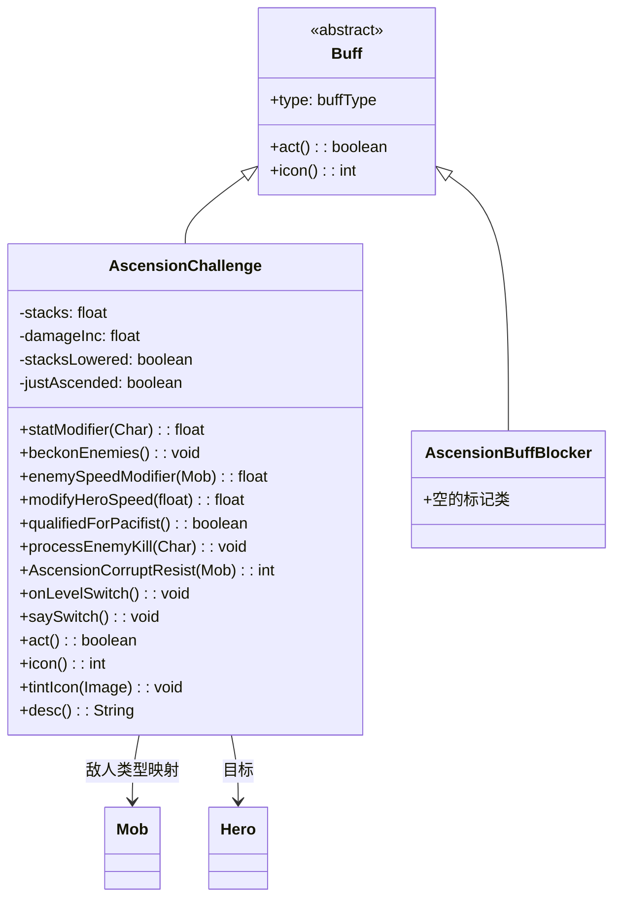

# AscensionChallenge 类文档

## 1. 基本信息
| 属性 | 值 |
|------|-----|
| 文件路径 | core/src/main/java/com/shatteredpixel/shatteredpixeldungeon/actors/buffs/AscensionChallenge.java |
| 包名 | com.shatteredpixel.shatteredpixeldungeon.actors.buffs |
| 类类型 | class |
| 继承关系 | extends Buff |
| 代码行数 | 417 |

## 2. 类职责说明
AscensionChallenge（飞升挑战）是一个特殊的Buff，实现游戏的飞升模式挑战机制。当英雄携带护身符进行飞升时激活，随着层数增加产生渐进式的难度提升效果：召唤敌人、敌人加速、英雄减速、持续伤害等。击杀敌人可以减少叠加层数，提供成就进度奖励。

## 4. 继承与协作关系


## 静态常量表
| 常量名 | 类型 | 值 | 说明 |
|--------|------|-----|------|
| STACKS | String | "enemy_stacks" | Bundle存储键 - 叠加层数 |
| DAMAGE | String | "damage_inc" | Bundle存储键 - 累积伤害 |
| STACKS_LOWERED | String | "stacks_lowered" | Bundle存储键 - 层数是否已降低 |

## 实例字段表
| 字段名 | 类型 | 修饰符 | 说明 |
|--------|------|--------|------|
| stacks | float | private | 当前叠加层数 |
| damageInc | float | private | 累积伤害值 |
| stacksLowered | boolean | private | 是否已通过击杀降低层数 |
| justAscended | boolean | private | 是否刚完成飞升（用于消息触发） |
| modifiers | HashMap | private static | 敌人类型到属性修正系数的映射 |
| revivePersists | boolean | - | 设置为true，英雄复活后保留 |

## 7. 方法详解

### statModifier(Char ch)
**签名**: `public static float statModifier(Char ch)`
**功能**: 静态方法，获取角色在飞升挑战中的属性修正系数。
**参数**:
- ch: Char - 目标角色
**返回值**: float - 属性修正系数（1表示无修正）。
**实现逻辑**:
```java
// 如果没有飞升挑战进行中，返回1
if (Dungeon.hero == null || Dungeon.hero.buff(AscensionChallenge.class) == null) {
    return 1;
}
// 处理变形老鼠
if (ch instanceof Ratmogrify.TransmogRat) {
    ch = ((Ratmogrify.TransmogRat) ch).getOriginal();
}
// 检查是否被阻止飞升加成
if (ch.buff(AscensionBuffBlocker.class) != null) {
    return 1f;
}
// 在映射表中查找修正系数
for (Class<?extends Mob> cls : modifiers.keySet()) {
    if (cls.isAssignableFrom(ch.getClass())) {
        return modifiers.get(cls);
    }
}
return 1;  // 默认无修正
```

### beckonEnemies()
**签名**: `public static void beckonEnemies()`
**功能**: 召唤远处敌人向英雄靠近（2层以上激活）。
**实现逻辑**:
```java
// 检查是否有飞升挑战且层数>=2
if (Dungeon.hero.buff(AscensionChallenge.class) != null
        && Dungeon.hero.buff(AscensionChallenge.class).stacks >= 2f) {
    for (Mob m : Dungeon.level.mobs) {
        // 距离>8的敌人被召唤
        if (m.alignment == Char.Alignment.ENEMY && m.distance(Dungeon.hero) > 8) {
            m.beckon(Dungeon.hero.pos);
        }
    }
}
```

### enemySpeedModifier(Mob m)
**签名**: `public static float enemySpeedModifier(Mob m)`
**功能**: 获取敌人的速度修正系数（4层以上敌人非战斗状态2倍速）。
**参数**:
- m: Mob - 目标敌人
**返回值**: float - 速度修正系数。
**实现逻辑**:
```java
// 4层以上，敌人阵营，非追击/逃跑状态
if (Dungeon.hero.buff(AscensionChallenge.class) != null
        && m.alignment == Char.Alignment.ENEMY
        && Dungeon.hero.buff(AscensionChallenge.class).stacks >= 4f
        && m.state != m.HUNTING && m.state != m.FLEEING) {
    return 2;  // 双倍速度
}
return 1;
```

### modifyHeroSpeed(float speed)
**签名**: `public static float modifyHeroSpeed(float speed)`
**功能**: 修正英雄速度（6层以上速度减半且上限为1）。
**参数**:
- speed: float - 原始速度
**返回值**: float - 修正后的速度。
**实现逻辑**:
```java
// 6层以上，速度减半且上限为1
if (Dungeon.hero.buff(AscensionChallenge.class) != null
        && Dungeon.hero.buff(AscensionChallenge.class).stacks >= 6f) {
    return Math.min(speed/2f, 1f);
}
return speed;
```

### processEnemyKill(Char enemy)
**签名**: `public static void processEnemyKill(Char enemy)`
**功能**: 处理敌人被击杀，减少叠加层数。
**参数**:
- enemy: Char - 被击杀的敌人
**实现逻辑**:
```java
AscensionChallenge chal = Dungeon.hero.buff(AscensionChallenge.class);
if (chal == null) return;

// 处理变形老鼠
if (enemy instanceof Ratmogrify.TransmogRat) {
    enemy = ((Ratmogrify.TransmogRat) enemy).getOriginal();
    if (enemy == null) return;
}

// 被阻止的不计数
if (enemy.buff(AscensionBuffBlocker.class) != null) return;

// 检查是否在修正列表中
boolean found = false;
for (Class<?extends Mob> cls : modifiers.keySet()) {
    if (cls.isAssignableFrom(enemy.getClass())) {
        found = true;
        break;
    }
}
if (!found) return;

// 减少层数
float oldStacks = chal.stacks;
if (enemy instanceof Ghoul || enemy instanceof RipperDemon) {
    chal.stacks -= 0.5f;  // 特定敌人减半
} else {
    chal.stacks -= 1;
}
chal.stacks = Math.max(0, chal.stacks);

// 首次降低或每2层显示消息
if (!chal.stacksLowered) {
    chal.stacksLowered = true;
    GLog.p(Messages.get(AscensionChallenge.class, "weaken"));
} else if (chal.stacks < 8f && (int)(chal.stacks/2) != (int)(oldStacks/2f)) {
    GLog.p(Messages.get(AscensionChallenge.class, "weaken"));
}

// 满级英雄获得经验
if (oldStacks > chal.stacks && Dungeon.hero.lvl == Hero.MAX_LEVEL) {
    Dungeon.hero.earnExp(Math.round(10*(oldStacks - chal.stacks)), chal.getClass());
}

BuffIndicator.refreshHero();
```

### onLevelSwitch()
**签名**: `public void onLevelSwitch()`
**功能**: 处理楼层切换，增加叠加层数或恢复状态。
**实现逻辑**:
```java
// 如果向更高层（数值更小）移动
if (Dungeon.depth < Statistics.highestAscent) {
    Statistics.highestAscent = Dungeon.depth;
    justAscended = true;
    
    if (Dungeon.bossLevel()) {
        // Boss层：恢复饥饿和生命
        Dungeon.hero.buff(Hunger.class).satisfy(Hunger.STARVING);
        Buff.affect(Dungeon.hero, Healing.class).setHeal(Dungeon.hero.HT, 0, 20);
    } else {
        // 普通层：增加2层叠加
        stacks += 2f;
        
        // 重置英雄锁住的门
        for (int i = 0; i < Dungeon.level.length(); i++) {
            if (Dungeon.level.map[i] == Terrain.HERO_LKD_DR) {
                Level.set(i, Terrain.DOOR, Dungeon.level);
            }
        }
        
        // 清除现有敌人，生成新敌人
        for (Mob mob : Dungeon.level.mobs.toArray(new Mob[0])) {
            if (!mob.reset()) {
                Dungeon.level.mobs.remove(mob);
            }
        }
        Dungeon.level.spawnMob(12);
    }
}
// 深度<20时，商店老板逃跑
if (Statistics.highestAscent < 20) {
    for (Mob m : Dungeon.level.mobs.toArray(new Mob[0])) {
        if (m instanceof Shopkeeper) {
            ((Shopkeeper) m).flee();
        }
    }
}
```

### act()
**签名**: `public boolean act()`
**功能**: Buff的主要逻辑，处理召唤敌人和持续伤害。
**返回值**: boolean - 返回true表示成功执行。
**实现逻辑**:
```java
beckonEnemies();  // 召唤远处敌人

// 8层以上且非Boss层：持续伤害
if (stacks >= 8 && !Dungeon.bossLevel()) {
    damageInc += (stacks-4)/4f;  // 累积伤害
    if (damageInc >= 1) {
        target.damage((int)damageInc, this);
        damageInc -= (int)damageInc;
        
        // 英雄死亡处理
        if (target == Dungeon.hero && !target.isAlive()) {
            Badges.validateDeathFromFriendlyMagic();
            GLog.n(Messages.get(this, "on_kill"));
            Dungeon.fail(Amulet.class);
        }
    }
} else {
    damageInc = 0;  // 重置伤害累积
}

spend(TICK);
return true;
```

## 11. 使用示例
```java
// 检查是否在飞升挑战中
if (Dungeon.hero.buff(AscensionChallenge.class) != null) {
    // 获取敌人属性修正
    float modifier = AscensionChallenge.statModifier(enemy);
    enemy.HT *= modifier;
    enemy.HP *= modifier;
}

// 检查是否获得和平主义者成就资格
if (AscensionChallenge.qualifiedForPacifist()) {
    // 英雄没有降低过叠加层数
}

// 阻止特定敌人获得飞升加成
Buff.affect(enemy, AscensionChallenge.AscensionBuffBlocker.class);
```

## 注意事项
1. 飞升挑战是游戏的高级挑战模式，难度很高
2. 层数越高，效果越强：2层召唤、4层加速、6层减速、8层伤害
3. 击杀敌人可以降低层数，提供成就进度
4. Boss层会恢复状态但不增加层数
5. revivePersists=true确保英雄复活后保留此Buff

## 最佳实践
1. 使用静态方法检查和获取修正值
2. 通过击杀敌人降低难度
3. 在Boss层前准备好恢复道具
4. 使用AscensionBuffBlocker标记特殊敌人