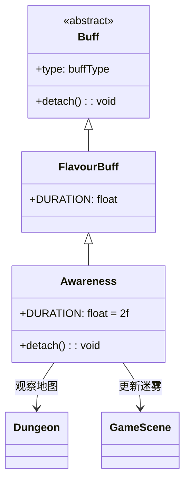

# Awareness 类文档

## 1. 基本信息
| 属性 | 值 |
|------|-----|
| 文件路径 | core/src/main/java/com/shatteredpixel/shatteredpixeldungeon/actors/buffs/Awareness.java |
| 包名 | com.shatteredpixel.shatteredpixeldungeon.actors.buffs |
| 类类型 | class |
| 继承关系 | extends FlavourBuff |
| 代码行数 | 41 |

## 2. 类职责说明
Awareness（感知）是一个正面Buff，使角色获得临时感知能力，能够发现隐藏的陷阱、秘密门等。当Buff移除时会触发地图观察更新，刷新视野。主要用于探知药剂、某些天赋效果等场景。

## 4. 继承与协作关系


## 静态常量表
| 常量名 | 类型 | 值 | 说明 |
|--------|------|-----|------|
| DURATION | float | 2f | 默认持续时间（回合数） |

## 实例字段表
| 字段名 | 类型 | 修饰符 | 说明 |
|--------|------|--------|------|
| type | buffType | - | 继承自Buff，设置为POSITIVE（正面Buff） |

## 7. 方法详解

### detach()
**签名**: `public void detach()`
**功能**: 重写移除方法，在Buff移除时触发地图观察和视野更新。
**返回值**: void
**实现逻辑**:
```java
super.detach();              // 调用父类移除方法
Dungeon.observe();           // 触发地图观察
GameScene.updateFog();       // 更新游戏场景中的迷雾效果
```

## 11. 使用示例
```java
// 为英雄添加感知Buff，持续2回合
Buff.affect(hero, Awareness.class, Awareness.DURATION);

// 检查是否有感知Buff
if (hero.buff(Awareness.class) != null) {
    // 英雄可以发现隐藏物体
}

// 使用Buff.prolong延长持续时间
Buff.prolong(hero, Awareness.class, 5f);
```

## 注意事项
1. Awareness是一个简单的FlavourBuff，持续时间较短
2. 主要效果在detach()时触发，更新视野
3. 实际的感知逻辑（发现陷阱、密门等）在Dungeon.observe()中实现
4. 默认持续时间只有2回合，需要快速行动

## 最佳实践
1. 使用Buff.affect()添加带有持续时间的感知
2. 在探索未知区域前使用效果最佳
3. 可以配合其他探索工具使用
4. 注意持续时间较短，合理安排行动