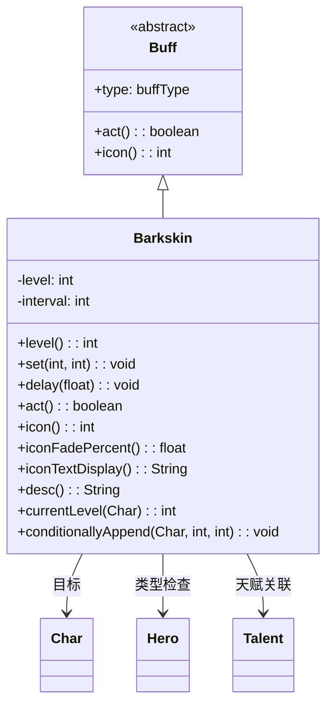

# Barkskin 类文档

## 1. 基本信息
| 属性 | 值 |
|------|-----|
| 文件路径 | core/src/main/java/com/shatteredpixel/shatteredpixeldungeon/actors/buffs/Barkskin.java |
| 包名 | com.shatteredpixel.shatteredpixeldungeon.actors.buffs |
| 类类型 | class |
| 继承关系 | extends Buff |
| 代码行数 | 137 |

## 2. 类职责说明
Barkskin（树皮术）是一个正面Buff，为角色提供临时护甲加成。护甲等级会随时间递减，直到为0时移除。支持多个树皮术实例共存，只应用最高的护甲加成。主要用于树皮术药剂、天赋技能、植物效果等场景。

## 4. 继承与协作关系


## 静态常量表
| 常量名 | 类型 | 值 | 说明 |
|--------|------|-----|------|
| LEVEL | String | "level" | Bundle存储键 - 护甲等级 |
| INTERVAL | String | "interval" | Bundle存储键 - 递减间隔 |

## 实例字段表
| 字段名 | 类型 | 修饰符 | 说明 |
|--------|------|--------|------|
| level | int | private | 当前护甲等级 |
| interval | int | private | level递减的时间间隔 |

## 7. 方法详解

### act()
**签名**: `public boolean act()`
**功能**: Buff的主要逻辑方法，每间隔执行一次，减少护甲等级。
**返回值**: boolean - 返回true表示成功执行。
**实现逻辑**:
```java
if (target.isAlive()) {        // 如果目标存活
    spend(interval);           // 等待下一个间隔
    if (--level <= 0) {        // 递减等级，如果<=0
        detach();              // 移除Buff
    }
} else {                       // 如果目标死亡
    detach();                  // 立即移除Buff
}
return true;
```

### level()
**签名**: `public int level()`
**功能**: 获取当前的护甲等级。
**返回值**: int - 当前的护甲等级值。

### set(int value, int time)
**签名**: `public void set(int value, int time)`
**功能**: 设置护甲等级和递减间隔（只在更高时覆盖）。
**参数**:
- value: int - 新的护甲等级
- time: int - 递减间隔
**返回值**: void
**实现逻辑**:
```java
if (level <= value) {              // 只在新值>=当前值时更新
    level = value;                 // 设置新等级
    interval = time;               // 设置新间隔
    spend(time - cooldown() - 1);  // 设置等待时间
}
```

### delay(float value)
**签名**: `public void delay(float value)`
**功能**: 延迟护甲递减。
**参数**:
- value: float - 要延迟的回合数
**实现逻辑**:
```java
spend(value);  // 增加等待时间
```

### icon()
**签名**: `public int icon()`
**功能**: 返回Buff图标的索引标识符。
**返回值**: int - 返回BuffIndicator.BARKSKIN（树皮术图标）。

### iconFadePercent()
**签名**: `public float iconFadePercent()`
**功能**: 计算Buff图标的淡出百分比。
**返回值**: float - 图标完整度比例。
**实现逻辑**:
```java
if (target instanceof Hero) {
    // 计算最大护甲值（基于天赋）
    float max = ((Hero) target).lvl * ((Hero) target).pointsInTalent(Talent.BARKSKIN)/2;
    max = Math.max(max, 2 + ((Hero) target).lvl/3);
    return Math.max(0, (max - level) / max);
}
return 0;
```

### iconTextDisplay()
**签名**: `public String iconTextDisplay()`
**功能**: 返回图标上显示的文本（护甲等级）。
**返回值**: String - 当前护甲等级的字符串表示。

### desc()
**签名**: `public String desc()`
**功能**: 返回Buff的详细描述文本。
**返回值**: String - 包含护甲等级和剩余时间的描述。

### currentLevel(Char ch)
**签名**: `public static int currentLevel(Char ch)`
**功能**: 静态方法，获取角色所有树皮术Buff中的最高等级。
**参数**:
- ch: Char - 目标角色
**返回值**: int - 最高的护甲等级值。
**实现逻辑**:
```java
int level = 0;
for (Barkskin b : ch.buffs(Barkskin.class)) {
    level = Math.max(level, b.level);  // 取最大值
}
return level;
```

### conditionallyAppend(Char ch, int level, int interval)
**签名**: `public static void conditionallyAppend(Char ch, int level, int interval)`
**功能**: 静态方法，条件性地添加或更新树皮术Buff。
**参数**:
- ch: Char - 目标角色
- level: int - 护甲等级
- interval: int - 递减间隔
**返回值**: void
**实现逻辑**:
```java
// 查找相同间隔的Buff
for (Barkskin b : ch.buffs(Barkskin.class)) {
    if (b.interval == interval) {
        b.set(level, interval);  // 更新现有Buff
        return;
    }
}
// 没找到则添加新Buff
Buff.append(ch, Barkskin.class).set(level, interval);
```

## 11. 使用示例
```java
// 为英雄添加树皮术Buff，等级5，每回合递减
Barkskin.conditionallyAppend(hero, 5, 1);

// 获取当前护甲等级
int armor = Barkskin.currentLevel(hero);

// 延迟递减
for (Barkskin b : hero.buffs(Barkskin.class)) {
    b.delay(5f);
}
```

## 注意事项
1. 支持多个实例共存，只应用最高的护甲值
2. 护甲等级会随时间递减，直到为0时移除
3. conditionallyAppend()方法会复用相同间隔的Buff
4. 目标死亡时Buff会立即移除

## 最佳实践
1. 使用静态方法conditionallyAppend()添加Buff
2. 使用currentLevel()获取实际护甲值
3. 设置合理的间隔值以控制递减速度
4. 与其他护甲效果叠加使用可提供更高防护