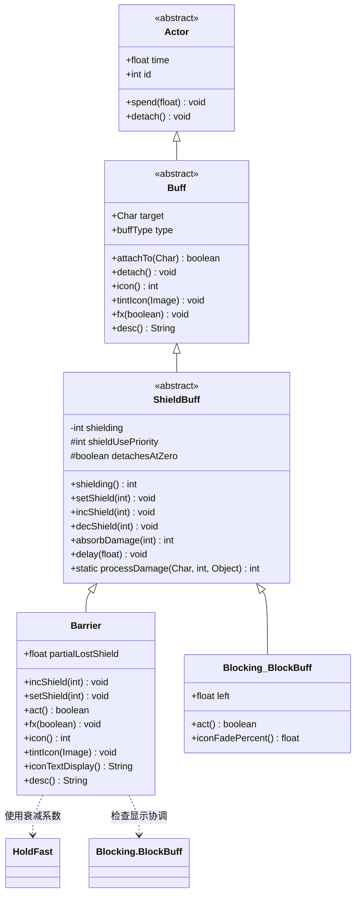

# Barrier 源码详解

## 1. 基本信息

| 属性 | 值 |
|------|-----|
| **文件路径** | core/src/main/java/com/shatteredpixel/shatteredpixeldungeon/actors/buffs/Barrier.java |
| **包名** | com.shatteredpixel.shatteredpixeldungeon.actors.buffs |
| **类类型** | public class |
| **继承关系** | extends ShieldBuff |
| **代码行数** | 112 |

---

## 类职责

Barrier（护盾）是游戏中**通用护盾状态效果**的具体实现。它为角色提供一个会随时间**逐渐衰减**的护盾层，可以吸收伤害。

核心职责：
1. **伤害吸收**：提供可吸收伤害的护盾值
2. **时间衰减**：护盾值随时间逐渐减少（每回合衰减）
3. **视觉反馈**：为角色添加护盾视觉效果
4. **优先级管理**：与其他护盾状态协调显示

**与其他护盾的区别**：
- **Barrier**：通用护盾，随时间衰减，无固定持续时间
- **Blocking.BlockBuff**：格挡附魔护盾，5回合固定持续时间，衰减较快
- **LightShield**：牧师光盾，特定机制

---

## 4. 继承与协作关系



---

## 静态常量表

| 常量名 | 值 | 用途 |
|--------|-----|------|
| `TICK` | (继承自Actor) | 回合时间单位，值为1.0f |
| `PARTIAL_LOST_SHIELD` | "partial_lost_shield" | Bundle存储键，用于序列化部分衰减值 |

---

## 实例字段表

| 字段名 | 类型 | 默认值 | 说明 |
|--------|------|--------|------|
| `partialLostShield` | float | 0 | 累积的部分护盾衰减值（用于实现渐进衰减） |
| `type` | buffType | POSITIVE | 继承自Buff，设置为正面效果 |
| `shielding` | int | 0 | 继承自ShieldBuff，当前护盾值 |
| `shieldUsePriority` | int | 0 | 继承自ShieldBuff，护盾使用优先级（最低） |
| `detachesAtZero` | boolean | true | 继承自ShieldBuff，护盾为0时自动移除 |

---

## 7. 方法详解

### 类初始化块

```java
{
    type = buffType.POSITIVE;  // 设置为正面效果
}
```

**说明**：实例初始化块，设置Barrier为正面状态效果。这会影响：
- 状态图标的颜色显示（绿色）
- 状态栏的排序位置

---

### incShield(int amt)

```java
@Override
public void incShield(int amt) {
    super.incShield(amt);        // 第1行：调用父类方法增加护盾值
    partialLostShield = 0;       // 第2行：重置累积衰减值为0
}
```

**方法作用**：增加护盾值并重置衰减累积。

**参数**：
- `amt` (int)：要增加的护盾量

**重写原因**：增加护盾时重置衰减累积，确保护盾不会立即开始衰减。

**调用链**：
```
incShield(amt)
  → super.incShield(amt)        // ShieldBuff: shielding += amt
  → partialLostShield = 0       // 重置衰减累积
```

---

### setShield(int shield)

```java
@Override
public void setShield(int shield) {
    super.setShield(shield);                      // 第1行：调用父类方法设置护盾值
    if (shielding() == shield) {                  // 第2行：检查设置是否成功
        partialLostShield = 0;                    // 第3行：成功则重置衰减累积
    }
}
```

**方法作用**：设置护盾值（仅在新值>=当前值时生效）并重置衰减累积。

**参数**：
- `shield` (int)：要设置的护盾量

**重写原因**：
1. 父类`setShield`只在`新值 >= 当前值`时更新护盾
2. 只有更新成功时才重置衰减累积

**为什么需要检查**：
```java
// 父类 ShieldBuff.setShield 的实现：
public void setShield(int shield) {
    if (this.shielding <= shield)    // 只有新值 >= 当前值才更新
        this.shielding = shield;
}
```
所以需要检查`shielding() == shield`确认更新成功。

---

### act()

```java
@Override
public boolean act() {

    // 第1-2行：计算本回合的衰减累积
    partialLostShield += Math.min(1f, shielding()/20f) * HoldFast.buffDecayFactor(target);
    
    // 第3-7行：当累积值>=1时，扣除1点护盾
    if (partialLostShield >= 1f) {
        absorbDamage(1);          // 吸收1点"伤害"（实际是扣除护盾）
        partialLostShield = 0;    // 重置累积值
    }
    
    // 第8-10行：护盾耗尽时移除状态
    if (shielding() <= 0){
        detach();
    }
    
    // 第11行：消耗一个回合的时间
    spend( TICK );
    
    return true;
}
```

**方法作用**：每回合执行护盾衰减逻辑。

**衰减公式详解**：

```
每回合累积衰减值 = min(1, shielding/20) × HoldFast衰减系数
```

**衰减速率表**（无HoldFast天赋时）：

| 护盾值 | 每回合累积 | 衰减周期 |
|--------|-----------|---------|
| 1-20 | shielding/20 | 20回合减1点 |
| 20+ | 1.0 | 1回合减1点 |
| 40+ | 1.0 | 1回合减1点 |

**HoldFast天赋影响**：

HoldFast（坚守）天赋可减缓护盾衰减：
- 等级1：衰减系数 = 0.5（衰减速度减半）
- 等级2：衰减系数 = 0.25（衰减速度1/4）
- 等级3：衰减系数 = 0（护盾不衰减！）

**举例说明**：
- 护盾10点，无天赋：累积 = 10/20 = 0.5，每2回合减1点
- 护盾10点，HoldFast Lv1：累积 = 0.5 × 0.5 = 0.25，每4回合减1点
- 护盾30点，无天赋：累积 = min(1, 30/20) = 1，每回合减1点

---

### fx(boolean on)

```java
@Override
public void fx(boolean on) {
    if (on) {
        // 添加护盾视觉效果
        target.sprite.add(CharSprite.State.SHIELDED);
    } else if (target.buff(Blocking.BlockBuff.class) == null) {
        // 只在没有BlockBuff时移除视觉效果
        target.sprite.remove(CharSprite.State.SHIELDED);
    }
}
```

**方法作用**：管理护盾的视觉效果。

**参数**：
- `on` (boolean)：true=添加效果，false=移除效果

**视觉协调逻辑**：
- Barrier和BlockBuff共用同一个视觉效果（SHIELDED）
- 移除时需检查另一种护盾是否存在
- 防止错误移除其他护盾的视觉效果

**CharSprite.State.SHIELDED 效果**：
- 角色周围显示护盾光环
- 通常为半透明的护盾层效果

---

### icon()

```java
@Override
public int icon() {
    return BuffIndicator.ARMOR;  // 返回护甲图标索引（值为20）
}
```

**方法作用**：返回状态效果的图标索引。

**返回值**：`BuffIndicator.ARMOR`（护甲图标）

**图标说明**：显示为一个盾牌形状的图标

---

### tintIcon(Image icon)

```java
@Override
public void tintIcon(Image icon) {
    icon.hardlight(0.5f, 1f, 2f);  // 设置图标颜色（青蓝色调）
}
```

**方法作用**：为状态图标着色。

**颜色参数**：
- R: 0.5f（红色通道）
- G: 1.0f（绿色通道，满）
- B: 2.0f（蓝色通道，高亮）

**视觉效果**：青蓝色/冰蓝色的护盾图标

**颜色对比**：
- Barrier: `(0.5f, 1f, 2f)` - 青蓝色
- BlockBuff: `(0.5f, 1f, 2f)` - 相同颜色（共用视觉效果）

---

### iconTextDisplay()

```java
@Override
public String iconTextDisplay() {
    return Integer.toString(shielding());  // 返回当前护盾值的字符串
}
```

**方法作用**：返回在大图标上显示的文本。

**返回值**：当前护盾值的字符串形式

**用途**：桌面版UI中，在护盾图标上显示具体护盾数值

---

### desc()

```java
@Override
public String desc() {
    return Messages.get(this, "desc", shielding());  // 获取本地化描述
}
```

**方法作用**：返回状态效果的详细描述。

**返回值**：格式化的本地化描述文本

**消息格式**：
```
desc=一个可以吸收伤害的护盾。当前护盾值：%d。
```

---

### storeInBundle(Bundle bundle)

```java
private static final String PARTIAL_LOST_SHIELD = "partial_lost_shield";

@Override
public void storeInBundle(Bundle bundle) {
    super.storeInBundle(bundle);                              // 第1行：存储父类数据
    bundle.put(PARTIAL_LOST_SHIELD, partialLostShield);       // 第2行：存储衰减累积值
}
```

**方法作用**：将状态数据序列化保存。

**保存的数据**：
- `shielding`：当前护盾值（父类保存）
- `partial_lost_shield`：衰减累积值（子类保存）

---

### restoreFromBundle(Bundle bundle)

```java
@Override
public void restoreFromBundle(Bundle bundle) {
    super.restoreFromBundle(bundle);                              // 第1行：恢复父类数据
    partialLostShield = bundle.getFloat(PARTIAL_LOST_SHIELD);    // 第2行：恢复衰减累积值
}
```

**方法作用**：从序列化数据恢复状态。

**恢复的数据**：
- `shielding`：当前护盾值（父类恢复）
- `partial_lost_shield`：衰减累积值（子类恢复）

---

## 与其他类的交互

### 被哪些类使用

| 类名 | 使用方式 |
|------|---------|
| `ScrollOfReversion` | 还原卷轴可为英雄添加护盾 |
| `Cleric` | 牧师的某些技能可产生护盾 |
| `Blocking` | 格挡附魔检查Barrier的存在 |
| `HoldFast` | 提供护盾衰减减缓效果 |

### 与其他护盾状态的协调

| 类名 | shieldUsePriority | 特点 |
|------|------------------|------|
| `Barrier` | 0（默认） | 通用护盾，最后被消耗 |
| `Blocking.BlockBuff` | 2 | 短期护盾，优先被消耗 |
| `Cleric Ascended Form Shield` | 1 | 中等优先级 |

**消耗顺序**：优先级高的护盾先被消耗伤害。

---

## 11. 使用示例

### 基本用法

```java
// 给角色添加10点护盾
Barrier barrier = Buff.affect(hero, Barrier.class);
barrier.setShield(10);

// 增加护盾（叠加）
barrier.incShield(5);  // 现在有15点护盾

// 检查护盾值
int currentShield = hero.shielding();  // 通过Char的方法获取总护盾
int barrierShield = barrier.shielding();  // 获取Barrier的护盾值
```

### 护盾衰减示例

```java
// 20点护盾，无天赋
barrier.setShield(20);
// 回合1：累积 = min(1, 20/20) = 1，扣除1点，剩余19
// 回合2：累积 = min(1, 19/20) = 0.95，累积值0.95
// 回合3：累积 = 0.95 + 0.9 = 1.85 >= 1，扣除1点，剩余18
// ...

// 10点护盾，HoldFast Lv2
barrier.setShield(10);
// 每回合累积 = min(1, 10/20) × 0.25 = 0.5 × 0.25 = 0.125
// 需要8回合才能累积到1.0，扣除1点护盾
```

### 结合HoldFast天赋

```java
// HoldFast天赋对护盾衰减的影响
// 假设角色有20点护盾

// 无天赋：每回合累积 = min(1, 20/20) × 1 = 1
// 结果：每回合减1点护盾

// HoldFast Lv1：每回合累积 = 1 × 0.5 = 0.5
// 结果：每2回合减1点护盾

// HoldFast Lv2：每回合累积 = 1 × 0.25 = 0.25
// 结果：每4回合减1点护盾

// HoldFast Lv3：每回合累积 = 1 × 0 = 0
// 结果：护盾永不衰减！
```

### 伤害吸收流程

```java
// 当角色受到伤害时，ShieldBuff.processDamage 被调用
int damage = 15;
int remainingDamage = ShieldBuff.processDamage(hero, damage, source);

// 如果Barrier有20点护盾：
// 1. processDamage 找到所有 ShieldBuff
// 2. 按优先级排序（BlockBuff优先）
// 3. 依次调用 absorbDamage
// 4. Barrier.absorbDamage(15) 返回 0（全部吸收）
// 5. Barrier.shielding 变为 5
```

### 自定义护盾效果

```java
// 创建一个不衰减的护盾变体
public class PermanentBarrier extends Barrier {
    @Override
    public boolean act() {
        // 不执行衰减逻辑，只消耗回合
        spend(TICK);
        return true;
    }
    
    @Override
    public String desc() {
        return Messages.get(this, "desc", shielding());
    }
}
```

---

## 注意事项

### 护盾设置逻辑

```java
// setShield 只会增加护盾，不会减少
barrier.setShield(10);  // 护盾 = 10
barrier.setShield(5);   // 护盾仍然是 10！
barrier.setShield(15);  // 护盾 = 15（更大，所以更新）
```

### 衰减机制

1. **渐进衰减**：使用`partialLostShield`实现平滑衰减
2. **护盾上限影响**：护盾越高衰减越快（最高每回合减1点）
3. **天赋交互**：HoldFast天赋可大幅减缓衰减

### 视觉效果协调

```java
// Barrier和BlockBuff共用SHIELDED视觉效果
// 必须在两者都不存在时才移除视觉效果

// 错误示例：直接移除
target.sprite.remove(CharSprite.State.SHIELDED);  // 可能错误移除BlockBuff的效果

// 正确示例：检查其他护盾
if (target.buff(Blocking.BlockBuff.class) == null) {
    target.sprite.remove(CharSprite.State.SHIELDED);
}
```

### 护盾优先级

```java
// shieldUsePriority 决定伤害消耗顺序
// 默认值0（最低优先级）
// Blocking.BlockBuff 的优先级为2（最高）

// 这意味着：
// - BlockBuff 先被消耗
// - Barrier 最后被消耗
```

---

## 最佳实践

### 1. 使用正确的方法添加护盾

```java
// 推荐：使用 setShield 设置基础护盾
Barrier barrier = Buff.affect(target, Barrier.class);
barrier.setShield(baseAmount);

// 推荐：使用 incShield 增加护盾
barrier.incShield(bonusAmount);

// 不推荐：直接操作 shielding 字段（它是私有的）
```

### 2. 考虑护盾衰减

```java
// 计算护盾持续时间（无天赋）
// 衰减公式：每回合累积 = min(1, shielding/20)
// 衰减周期 ≈ 护盾值 × (20/shielding 或 1)

// 对于低护盾值（<=20），持续时间较长
// 对于高护盾值（>20），每回合减1点
```

### 3. 检查护盾存在

```java
// 推荐方式
Barrier barrier = target.buff(Barrier.class);
if (barrier != null && barrier.shielding() > 0) {
    // 处理护盾相关逻辑
}

// 或使用 Char.shielding() 获取总护盾
int totalShield = target.shielding();
```

### 4. 协调视觉效果

```java
// 自定义护盾类时，注意视觉协调
@Override
public void fx(boolean on) {
    if (on) {
        target.sprite.add(CharSprite.State.SHIELDED);
    } else if (target.buff(Barrier.class) == null 
            && target.buff(Blocking.BlockBuff.class) == null) {
        target.sprite.remove(CharSprite.State.SHIELDED);
    }
}
```

### 5. 序列化完整性

```java
// 确保所有新增字段都被序列化
private static final String MY_FIELD = "my_field";

@Override
public void storeInBundle(Bundle bundle) {
    super.storeInBundle(bundle);
    bundle.put(MY_FIELD, myField);
}

@Override
public void restoreFromBundle(Bundle bundle) {
    super.restoreFromBundle(bundle);
    myField = bundle.getFloat(MY_FIELD);
}
```

---

## 设计模式分析

### 护盾系统设计

Barrier采用了以下设计特点：

1. **继承复用**：继承ShieldBuff获得核心护盾功能
2. **模板方法**：重写`act()`实现自定义衰减逻辑
3. **状态管理**：使用`partialLostShield`实现渐进衰减
4. **视觉协调**：与其他护盾类协调视觉效果

### 衰减系统设计

```
累积器模式：
- partialLostShield：累积器
- 每回合增加：min(1, shielding/20) × 系数
- 累积值>=1时：扣除护盾，重置累积器

优点：
- 实现平滑衰减
- 支持小数累积
- 易于调整衰减速率
```

---

## 相关文件

| 文件 | 关系 |
|------|------|
| `ShieldBuff.java` | 父类，提供护盾核心功能 |
| `Buff.java` | 祖父类，提供状态效果基础 |
| `HoldFast.java` | 提供衰减系数计算 |
| `Blocking.java` | BlockBuff的实现，视觉协调 |
| `BuffIndicator.java` | 图标定义 |
| `CharSprite.java` | 视觉效果定义 |