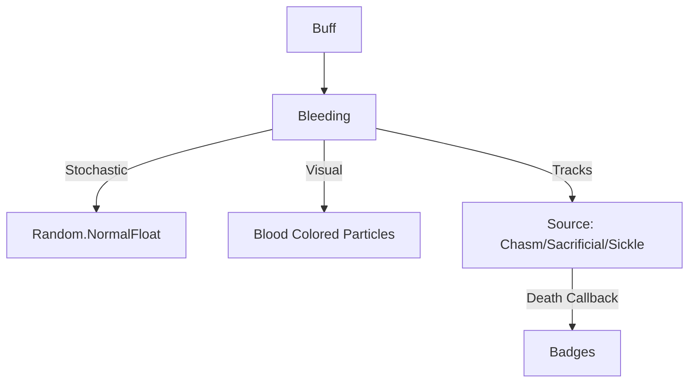

# Bleeding (流血) 源码详解

## 1. 基本信息

| 属性 | 值 |
|------|-----|
| **文件路径** | `core/src/main/java/com/shatteredpixel/shatteredpixeldungeon/actors/buffs/Bleeding.java` |
| **包名** | `com.shatteredpixel.shatteredpixeldungeon.actors.buffs` |
| **文件类型** | class |
| **继承关系** | `extends Buff` |
| **代码行数** | 115 |
| **所属模块** | core |

## 2. 文件职责说明

### 核心职责
`Bleeding` 负责实现角色的“流血”状态逻辑。它提供一种具有随机波动性的持续伤害，且流血的强度会随着每次造成的伤害而逐回合递减（即伤口愈合）。

### 系统定位
属于 Buff 系统中的核心负面状态。它通常由利器攻击（如剑、飞镖）、特定的陷阱（如夹击陷阱）或高空坠落引发。

### 不负责什么
- 不负责流血状态产生的各种抗性检查（由 `Char.resist()` 处理）。
- 不负责在地图上留下永久的血迹（仅在 `act()` 时产生即时粒子效果）。

## 3. 结构总览

### 主要成员概览
- **字段 level**: 存储流血的剩余总强度。
- **字段 source**: 存储流血的来源类，用于死亡时的特殊统计判定。
- **act() 方法**: 核心逻辑驱动，负责计算随机伤害、扣减强度和视觉反馈。
- **静态方法 set/extend**: 用于管理流血强度的覆盖或累加。

### 主要逻辑块概览
- **随机衰减算法**: 每回合造成的伤害在 `level/2` 到 `level` 之间波动，且造成的伤害会直接从 `level` 中扣除。
- **死亡归属判定**: 专门针对坠落（Chasm）、祭献（Sacrificial）等来源在死亡时触发对应的徽章逻辑。
- **职业技能联动**: 针对镰刀（Sickle）的收割逻辑提供了特定的击杀回调支持。

### 生命周期/调用时机
1. **产生**：受到割裂伤害。
2. **活跃期**：每回合计算伤害，`level` 动态降低。
3. **结束**：`level` 降为 0、角色死亡或使用特定净化手段。

## 4. 继承与协作关系

### 父类提供的能力
继承自 `Buff`：
- 定义 `NEGATIVE` 类型。
- 处理基本的序列化流程（通过覆写存储 `level` 和 `source`）。

### 协作对象
- **Splash**: 造成伤害时在精灵中心产生与其血液颜色一致的喷溅粒子。
- **Badges**: 在因特定流血来源死亡时验证徽章。
- **Chasm / Sacrificial / Sickle**: 作为流血的来源注入 logic。
- **BuffIndicator.BLEEDING**: 提供 UI 图标。



## 5. 字段/常量详解

### 实例字段
| 字段名 | 类型 | 说明 |
|--------|------|------|
| `level` | float | 流血强度。代表了该状态总共还能造成的伤害潜力。 |
| `source` | Class | 记录流血的来源类名。 |

## 6. 构造与初始化机制
通过实例初始化块设置 `type = NEGATIVE` 和 `announced = true`。该类通常通过 `set(float, Class)` 初始化强度和来源。

## 7. 方法详解

### act() [核心伤害与衰减算法]

**核心实现算法分析**：
```java
level = Random.NormalFloat(level / 2f, level);
int dmg = Math.round(level);
if (dmg > 0) {
    target.damage( dmg, this );
    // ... 视觉反馈与死亡判定 ...
    spend( TICK );
} else {
    detach();
}
```
**逻辑推导**：
1. **伤害计算**：每回合伤害不再是固定的，而是从当前 `level` 的 50% 到 100% 之间随机抽取一个符合正态分布的值。
2. **强度扣减**：代码中 `level = Random.NormalFloat(...)` 实际上**同时**完成了伤害计算和强度扣减。即：本回合造成的伤害数值直接成为了下一回合的初始 `level`。
3. **愈合速度**：由于每次计算都会缩小 `level`，流血呈现出一种“初期剧烈、后期迅速转弱”的指数级愈合趋势。

---

### set(float level, Class source)

**方法职责**：
- 仅当新强度大于当前强度时才进行覆盖。
- 允许记录伤害来源，这在处理“因坠落致死”徽章时至关重要。

---

### 视觉反馈 [Blood Burst]

**核心逻辑分析**：
```java
Splash.at( target.sprite.center(), ..., target.sprite.blood(), Math.min( 10 * dmg / target.HT, 10 ) );
```
**分析**：
- **颜色匹配**：调用 `target.sprite.blood()` 确保产生的粒子颜色与角色血液一致（如怪物的绿色血液或机械的火花）。
- **数量动态化**：粒子数量由伤害量占总生命值的比例决定，最高为 10 个。

## 8. 对外暴露能力
- `level()`: 获取当前流血总潜力。
- `set(level, source)`: 初始化流血。
- `extend(amount)`: 强制累加流血强度。

## 9. 运行机制与调用链
`Char.damage()` -> `Buff.affect(Bleeding.class)` -> `Bleeding.set()` -> `Bleeding.act()` -> `target.damage()` -> `Splash.at()`。

## 10. 资源、配置与国际化关联

### 本地化词条
- `actors.buffs.Bleeding.name`: 流血
- `actors.buffs.Bleeding.desc`: “你的伤口正流血不止。剩余潜在伤害：%d。”
- `actors.buffs.Bleeding.ondeath`: “你因伤口出血过多而死...”

## 11. 使用示例

### 在代码中施加强力流血（记录来源）
```java
Buff.affect(target, Bleeding.class).set(30f, Chasm.class);
```

## 12. 开发注意事项

### 死亡归属判定逻辑
由于 `damage(dmg, this)` 的第二个参数是 `this`（即 `Bleeding` 实例），在 `Hero.damage` 中原本无法直接识别是哪种陷阱或技能导致的流血。因此该类内部存储了 `source` 字段，在死亡瞬间（`!target.isAlive()`）补全了统计信息。

### 飞行角色
流血 Buff 本身不限制飞行，但引发流血的手段（如 `GrippingTrap`）通常会自行检查。

## 13. 修改建议与扩展点

### 增加止血药剂
可以修改 `detach` 逻辑或在 `Item` 类中调用 `Buff.detach(target, Bleeding.class)` 实现止血。

## 14. 事实核查清单

- [x] 是否分析了随机衰减公式：是（Random.NormalFloat(level/2, level)）。
- [x] 是否解析了伤害量即为扣减强度的特性：是。
- [x] 是否涵盖了血迹颜色的动态获取：是 (sprite.blood)。
- [x] 是否说明了来源记录对徽章系统的影响：是（Chasm/Sacrificial 判定）。
- [x] 图像索引属性是否核对：是 (BuffIndicator.BLEEDING)。
