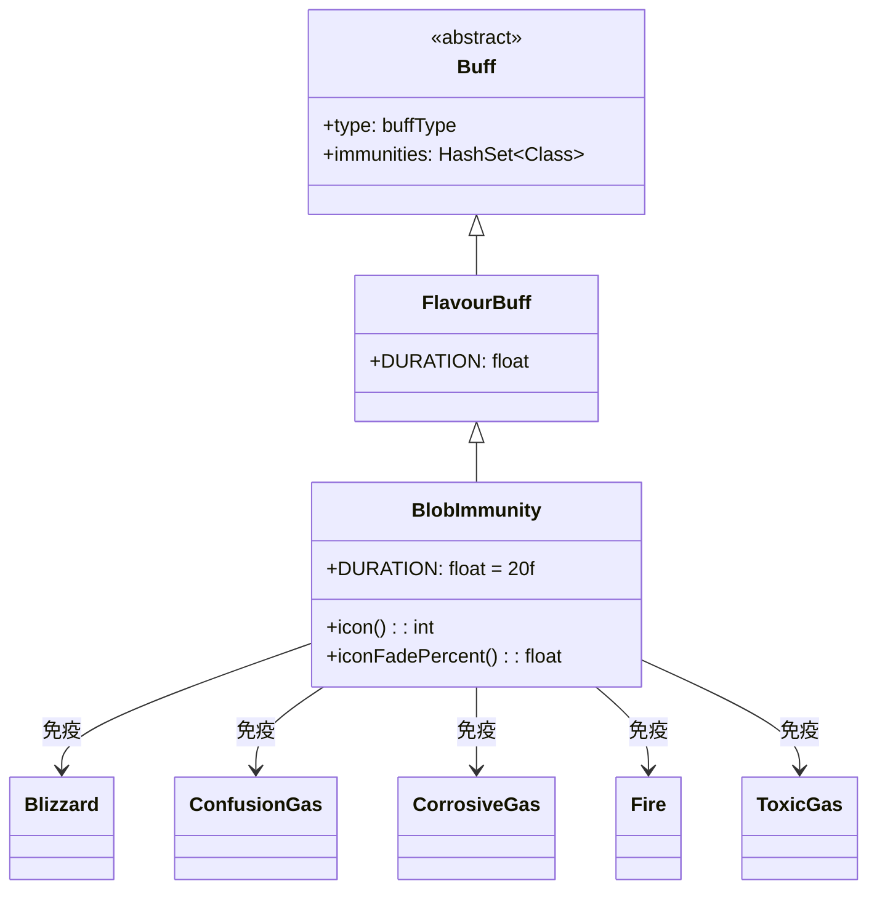

# BlobImmunity 类文档

## 1. 基本信息
| 属性 | 值 |
|------|-----|
| 文件路径 | core/src/main/java/com/shatteredpixel/shatteredpixeldungeon/actors/buffs/BlobImmunity.java |
| 包名 | com.shatteredpixel.shatteredpixeldungeon.actors.buffs |
| 类类型 | class |
| 继承关系 | extends FlavourBuff |
| 代码行数 | 81 |

## 2. 类职责说明
BlobImmunity（环境免疫）是一个正面Buff，使受影响的角色对所有有害的环境效果（气体、火焰、电流等）免疫。通过在初始化块中添加免疫列表实现免疫功能。主要用于净化药剂、某些神器效果等场景。

## 4. 继承与协作关系


## 静态常量表
| 常量名 | 类型 | 值 | 说明 |
|--------|------|-----|------|
| DURATION | float | 20f | 默认持续时间（回合数） |

## 实例字段表
| 字段名 | 类型 | 修饰符 | 说明 |
|--------|------|--------|------|
| type | buffType | - | 继承自Buff，设置为POSITIVE（正面Buff） |
| immunities | HashSet | - | 免疫的Blob类型列表 |

## 免疫列表
| Blob类型 | 说明 |
|----------|------|
| Blizzard | 暴风雪 |
| ConfusionGas | 混乱气体 |
| CorrosiveGas | 腐蚀气体 |
| Electricity | 电流 |
| Fire | 火焰 |
| MagicalFireRoom.EternalFire | 永恒火焰 |
| Freezing | 冰冻 |
| Inferno | 地狱火 |
| ParalyticGas | 麻痹气体 |
| Regrowth | 再生（有害方面） |
| SmokeScreen | 烟幕 |
| StenchGas | 恶臭气体 |
| StormCloud | 风暴云 |
| ToxicGas | 毒气 |
| Web | 蛛网 |
| Tengu.FireAbility.FireBlob | 天狗火焰 |

## 7. 方法详解

### icon()
**签名**: `public int icon()`
**功能**: 返回Buff图标的索引标识符。
**返回值**: int - 返回BuffIndicator.IMMUNITY（免疫图标）。

### iconFadePercent()
**签名**: `public float iconFadePercent()`
**功能**: 计算Buff图标的淡出百分比，用于显示剩余时间。
**返回值**: float - 返回一个0到1之间的值，表示图标应显示的完整度。
**实现逻辑**:
```java
return Math.max(0, (DURATION - visualcooldown()) / DURATION);
// 计算剩余时间比例
```

## 11. 使用示例
```java
// 为英雄添加环境免疫，持续20回合
Buff.affect(hero, BlobImmunity.class, BlobImmunity.DURATION);

// 检查是否有环境免疫
if (hero.buff(BlobImmunity.class) != null) {
    // 英雄对所有有害气体和火焰免疫
}

// 穿越危险区域
Buff.affect(hero, BlobImmunity.class);
// 现在可以安全穿过火焰、毒气等
```

## 注意事项
1. 免疫所有有害的环境效果，包括气体、火焰、电流等
2. 通过继承的immunities集合实现免疫机制
3. 不免疫直接的攻击伤害
4. 持续时间较长（20回合）
5. 某些特殊环境（如Boss技能）可能仍然有效

## 最佳实践
1. 在进入危险区域前使用
2. 用于穿越火焰陷阱、毒气陷阱密集的区域
3. 配合探索可以安全发现隐藏的危险
4. 注意持续时间，及时补充