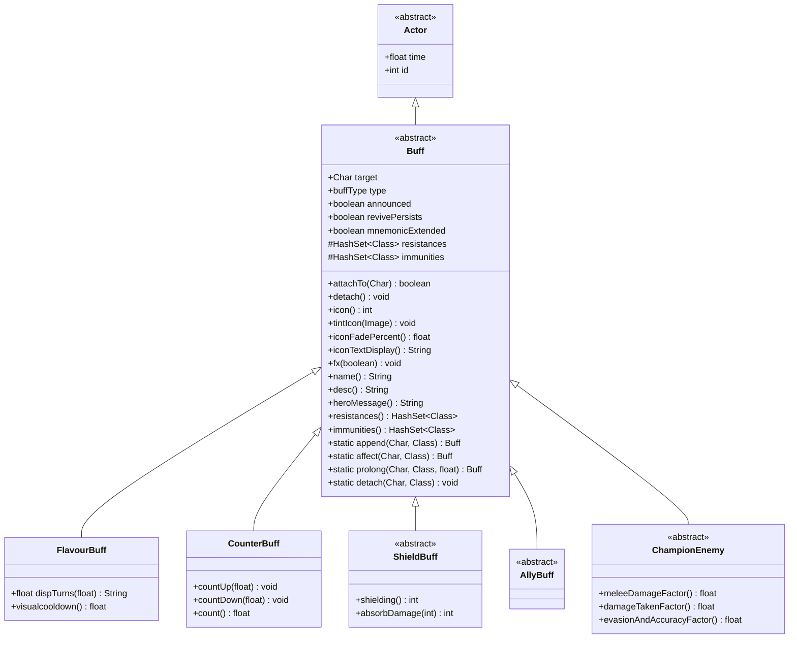

# Buff 源码详解

## 1. 基本信息

| 属性 | 值 |
|------|-----|
| **文件路径** | core/src/main/java/com/shatteredpixel/shatteredpixeldungeon/actors/buffs/Buff.java |
| **包名** | com.shatteredpixel.shatteredpixeldungeon.actors.buffs |
| **类类型** | abstract class |
| **继承关系** | extends Actor |
| **代码行数** | 208 |

---

## 类职责

Buff 是游戏中所有"状态效果"的抽象基类。状态效果可以是：
- **正面效果**：祝福、急速、护盾等
- **负面效果**：中毒、燃烧、麻痹等
- **中性效果**：标记、计数等

核心职责：
1. **附加管理**：将状态效果附加到角色上
2. **持续时间**：管理状态效果的生命周期
3. **视觉表现**：提供状态图标和特效
4. **抗性/免疫**：定义状态效果的抗性和免疫

---

## 4. 继承与协作关系



---

## 枚举定义

### buffType（状态类型）

```java
public enum buffType { 
    POSITIVE,   // 正面效果（绿色显示）
    NEGATIVE,   // 负面效果（红色显示）
    NEUTRAL     // 中性效果（白色显示）
}
```

**用途**：决定状态图标颜色和提示方式

---

## 实例字段

| 字段名 | 类型 | 默认值 | 说明 |
|--------|------|--------|------|
| `target` | Char | null | 状态效果附加的目标角色 |
| `type` | buffType | NEUTRAL | 状态类型 |
| `announced` | boolean | false | 是否在获得/失去时显示提示 |
| `revivePersists` | boolean | false | 是否在复活后保留 |
| `mnemonicExtended` | boolean | false | 是否被记忆祈祷法术延长 |
| `resistances` | HashSet&lt;Class&gt; | new | 该状态提供的抗性 |
| `immunities` | HashSet&lt;Class&gt; | new | 该状态提供的免疫 |

---

## 7. 方法详解

### attachTo(Char target)

```java
public boolean attachTo( Char target ) {

    // 第1-4行：检查目标是否免疫
    if (target.isImmune( getClass() )) {
        return false;  // 免疫则无法附加
    }
    
    this.target = target;  // 设置目标

    // 第5-12行：尝试添加到目标
    if (target.add( this )){
        if (target.sprite != null) fx( true );  // 启动视觉特效
        return true;
    } else {
        this.target = null;  // 添加失败，清除引用
        return false;
    }
}
```

**方法作用**：将状态效果附加到目标角色。

**参数**：
- `target` (Char)：目标角色

**返回值**：是否成功附加

**失败原因**：
- 目标免疫该状态
- 目标处于净化状态（阻止负面状态）
- 目标处于观战冻结状态

---

### detach()

```java
public void detach() {
    if (target.remove( this ) && target.sprite != null) {
        fx( false );  // 移除视觉特效
    }
}
```

**方法作用**：从目标角色移除该状态效果。

**执行流程**：
1. 从目标的Buff集合中移除
2. 移除视觉特效
3. 从Actor系统中移除

---

### act()

```java
@Override
public boolean act() {
    diactivate();  // 默认行为：停用自身
    return true;
}
```

**方法作用**：执行状态效果的回合逻辑。

**重写来源**：Actor.act()

**默认行为**：立即停用（不做任何事情）

**说明**：大多数状态效果通过持续时间管理而非主动行动。重写此方法的状态效果通常是主动生效的（如燃烧每回合造成伤害）。

---

### icon()

```java
public int icon() {
    return BuffIndicator.NONE;  // 默认无图标
}
```

**方法作用**：返回状态效果的图标索引。

**返回值**：BuffIndicator中的图标索引

**重写说明**：子类应返回对应的图标索引，如 `BuffIndicator.BLESS`

---

### tintIcon(Image icon)

```java
public void tintIcon( Image icon ){
    // 默认不做任何事
}
```

**方法作用**：修改状态图标的基础颜色。

**参数**：
- `icon` (Image)：要修改的图标图像

**使用场景**：某些状态需要动态改变图标颜色（如根据等级）

---

### iconFadePercent()

```java
public float iconFadePercent(){
    return 0;  // 默认不淡化
}
```

**方法作用**：返回图标淡化百分比（0-1）。

**返回值**：淡化比例

**使用场景**：状态即将结束时淡化图标提示玩家

---

### iconTextDisplay()

```java
public String iconTextDisplay(){
    return "";  // 默认无文本
}
```

**方法作用**：返回在大图标上显示的文本。

**返回值**：显示文本

**使用场景**：桌面版UI中显示数值（如剩余回合数）

---

### fx(boolean on)

```java
public void fx(boolean on) {
    // 默认不做任何事
}
```

**方法作用**：管理状态效果的视觉特效。

**参数**：
- `on` (boolean)：true=启动特效，false=移除特效

**重写示例**：
```java
@Override
public void fx(boolean on) {
    if (on) target.sprite.add(CharSprite.State.BURNING);
    else target.sprite.remove(CharSprite.State.BURNING);
}
```

---

### heroMessage()

```java
public String heroMessage(){
    String msg = Messages.get(this, "heromsg");
    if (msg.isEmpty()) {
        return null;
    } else {
        return msg;
    }
}
```

**方法作用**：返回英雄获得此状态时的提示消息。

**返回值**：提示消息，无则返回null

---

### name()

```java
public String name() {
    return Messages.get(this, "name");
}
```

**方法作用**：返回状态效果的名称。

---

### desc()

```java
public String desc(){
    return Messages.get(this, "desc");
}
```

**方法作用**：返回状态效果的详细描述。

---

### dispTurns(float input)

```java
protected String dispTurns(float input){
    return Messages.decimalFormat("#.##", input);
}
```

**方法作用**：格式化回合数为显示文本。

**参数**：
- `input` (float)：回合数

**返回值**：格式化的字符串（如 "3.5"）

---

### visualcooldown()

```java
public float visualcooldown(){
    return cooldown() + 1f;  // 加1因为Buff在英雄行动后行动
}
```

**方法作用**：返回视觉上的剩余冷却时间。

**返回值**：调整后的剩余回合数

**说明**：Buff在英雄行动后执行，所以显示时需要+1

---

### resistances()

```java
public HashSet<Class> resistances() {
    return new HashSet<>(resistances);  // 返回副本
}
```

**方法作用**：返回该状态提供的抗性列表。

---

### immunities()

```java
public HashSet<Class> immunities() {
    return new HashSet<>(immunities);  // 返回副本
}
```

**方法作用**：返回该状态提供的免疫列表。

---

## 静态方法详解

### append(Char target, Class&lt;T&gt; buffClass)

```java
public static<T extends Buff> T append( Char target, Class<T> buffClass ) {
    T buff = Reflection.newInstance(buffClass);  // 创建新实例
    buff.attachTo( target );                      // 附加到目标
    return buff;
}
```

**方法作用**：创建新状态并附加到目标（允许重复）。

**参数**：
- `target` (Char)：目标角色
- `buffClass` (Class&lt;T&gt;)：状态类

**返回值**：新创建的状态实例

---

### append(Char target, Class&lt;T&gt; buffClass, float duration)

```java
public static<T extends FlavourBuff> T append( Char target, Class<T> buffClass, float duration ) {
    T buff = append( target, buffClass );                // 创建并附加
    buff.spend( duration * target.resist(buffClass) );   // 设置持续时间（考虑抗性）
    return buff;
}
```

**方法作用**：创建新状态并设置持续时间。

**参数**：
- `duration` (float)：基础持续时间

**说明**：实际持续时间 = 基础时间 × 目标抗性

---

### affect(Char target, Class&lt;T&gt; buffClass)

```java
public static<T extends Buff> T affect( Char target, Class<T> buffClass ) {
    T buff = target.buff( buffClass );  // 检查是否已存在
    if (buff != null) {
        return buff;  // 已存在，返回现有实例
    } else {
        return append( target, buffClass );  // 不存在，创建新的
    }
}
```

**方法作用**：获取或创建状态（防止重复）。

**返回值**：已存在或新创建的状态实例

---

### affect(Char target, Class&lt;T&gt; buffClass, float duration)

```java
public static<T extends FlavourBuff> T affect( Char target, Class<T> buffClass, float duration ) {
    T buff = affect( target, buffClass );
    buff.spend( duration * target.resist(buffClass) );
    return buff;
}
```

**方法作用**：获取或创建状态并设置持续时间。

---

### prolong(Char target, Class&lt;T&gt; buffClass, float duration)

```java
public static<T extends FlavourBuff> T prolong( Char target, Class<T> buffClass, float duration ) {
    T buff = affect( target, buffClass );
    buff.postpone( duration * target.resist(buffClass) );  // 延长而非覆盖
    return buff;
}
```

**方法作用**：延长现有状态的持续时间，不存在则创建。

**参数**：
- `duration` (float)：要延长的持续时间

**与 affect 的区别**：
- `affect`：覆盖现有持续时间
- `prolong`：累加到现有持续时间

---

### count(Char target, Class&lt;T&gt; buffclass, float count)

```java
public static<T extends CounterBuff> T count( Char target, Class<T> buffclass, float count ) {
    T buff = affect( target, buffclass );
    buff.countUp( count );  // 增加计数
    return buff;
}
```

**方法作用**：获取或创建计数状态并增加计数。

---

### detach(Char target, Class&lt;? extends Buff&gt; cl)

```java
public static void detach( Char target, Class<? extends Buff> cl ) {
    for ( Buff b : target.buffs( cl )){
        b.detach();  // 移除所有该类型的状态
    }
}
```

**方法作用**：从目标移除所有指定类型的状态。

---

## 与其他类的交互

### 被哪些类继承

| 类名 | 说明 |
|------|------|
| `FlavourBuff` | 简单持续时间状态 |
| `CounterBuff` | 计数状态 |
| `ShieldBuff` | 护盾状态 |
| `AllyBuff` | 盟友标记状态 |
| `ChampionEnemy` | 冠军敌人状态 |
| 所有具体状态 | 如Bless、Curse、Poison等 |

### 使用了哪些类

| 类名 | 用于什么目的 |
|------|-------------|
| `Actor` | 基础回合系统 |
| `Char` | 状态附加目标 |
| `BuffIndicator` | 状态图标显示 |
| `Messages` | 国际化文本 |
| `Reflection` | 动态实例化 |

---

## 主要子类

### FlavourBuff（风味状态）

```java
public class FlavourBuff extends Buff {
    // 主要用于只有持续时间、没有复杂逻辑的状态
    // 如：祝福、诅咒、急速等
}
```

**特点**：
- 简单的持续时间管理
- 通常不会主动行动
- 提供 `dispTurns()` 和 `visualcooldown()` 方法

---

### CounterBuff（计数状态）

```java
public class CounterBuff extends Buff {
    protected float count = 0;
    
    public void countUp(float inc) { count += inc; }
    public void countDown(float inc) { count -= inc; }
    public float count() { return count; }
}
```

**用途**：跟踪数值计数而非时间
- 连击计数
- 能量计数
- 累积伤害

---

### ShieldBuff（护盾状态）

```java
public abstract class ShieldBuff extends Buff {
    public abstract int shielding();           // 当前护盾量
    public int absorbDamage(int dmg) { ... }   // 吸收伤害
}
```

**用途**：提供伤害吸收护盾
- 屏障
- 狂暴护盾
- 神圣护盾

---

## 11. 使用示例

### 创建自定义状态

```java
public class CustomBuff extends FlavourBuff {
    {
        type = buffType.POSITIVE;  // 正面效果
        announced = true;          // 显示提示
    }
    
    @Override
    public int icon() {
        return BuffIndicator.BLESS;  // 使用祝福图标
    }
    
    @Override
    public String desc() {
        return "这是一个自定义状态，剩余 " + dispTurns(cooldown()) + " 回合。";
    }
    
    @Override
    public void fx(boolean on) {
        if (on) target.sprite.add(CharSprite.State.GLOWING);
        else target.sprite.remove(CharSprite.State.GLOWING);
    }
}
```

### 应用状态

```java
// 简单附加
Buff.append(hero, Bless.class, 10f);

// 防止重复
Buff.affect(hero, Haste.class, 5f);

// 延长持续时间
Buff.prolong(hero, Invisibility.class, 10f);

// 移除状态
Buff.detach(hero, Poison.class);
```

### 定义抗性/免疫

```java
public class FireShield extends Buff {
    {
        immunities.add(Burning.class);      // 免疫燃烧
        resistances.add(WandOfFireblast.class);  // 抗火系法杖
    }
}
```

---

## 注意事项

### 状态添加规则

1. **免疫检查**：附加前检查目标是否免疫
2. **净化状态**：净化状态下无法添加负面状态
3. **观战冻结**：观战冻结状态下无法添加任何状态

### 持续时间计算

1. **抗性影响**：实际时间 = 基础时间 × 目标抗性
2. **显示调整**：`visualcooldown()` 返回 +1 的值
3. **延长 vs 覆盖**：`prolong` 累加，`affect` 覆盖

### 常见的坑

1. **忘记设置类型**：`type` 默认为 NEUTRAL
2. **图标未定义**：默认返回 NONE（不显示）
3. **特效未清理**：`fx(false)` 必须清理 `fx(true)` 添加的特效

### 最佳实践

1. 继承 `FlavourBuff` 用于简单持续时间状态
2. 重写 `icon()` 和 `desc()` 提供视觉反馈
3. 使用 `announced = true` 提示玩家重要状态变化
4. 在 `resistances`/`immunities` 中定义该状态的交互规则