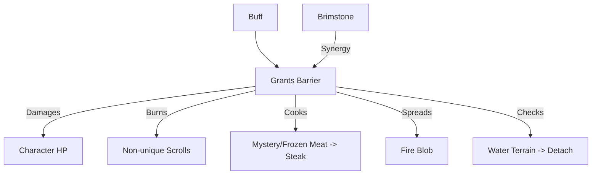

# Burning (燃烧) 源码详解

## 1. 基本信息

| 属性 | 值 |
|------|-----|
| **文件路径** | `core/src/main/java/com/shatteredpixel/shatteredpixeldungeon/actors/buffs/Burning.java` |
| **包名** | `com.shatteredpixel.shatteredpixeldungeon.actors.buffs` |
| **文件类型** | class |
| **继承关系** | `extends Buff implements Hero.Doom` |
| **代码行数** | 185 |
| **所属模块** | core |

## 2. 文件职责说明

### 核心职责
`Burning` 负责实现角色“着火”状态的逻辑。它会造成持续伤害、破坏角色背包中的可燃物品、并在环境中传播火焰。

### 系统定位
属于 Buff 系统中的核心负面状态。它与环境系统（`Fire` Blob）、物品系统（卷轴、生肉）以及战斗系统深度耦合。

### 不负责什么
- 不负责地表火焰的扩散（由 `Fire` 类负责）。
- 不负责火焰对掉落在地面物品的破坏（由 `Heap.burn()` 负责）。

## 3. 结构总览

### 主要成员概览
- **常量 DURATION**: 默认持续时间（8 回合）。
- **字段 left**: 剩余燃烧回合数。
- **字段 burnIncrement**: 记录连续燃烧的回合数，用于判定物品烧毁。
- **act() 方法**: 每回合的逻辑驱动，包含伤害计算、物品破坏和环境传播。

### 主要逻辑块概览
- **相互排斥**: 获得燃烧时会自动移除 `Chill`（冰冷）状态。
- **动态伤害**: 伤害随地牢深度线性增长。
- **背包破坏**: 针对英雄，概率烧毁非唯一卷轴或将生肉烤熟。
- **灭火逻辑**: 接触水面或站在水中时自动熄灭。
- **环境交互**: 若角色站在易燃物上，燃烧状态会产生新的地表火。

### 生命周期/调用时机
1. **产生**：被火焰攻击、踩踏火堆或由于特定陷阱。
2. **活跃期**：每回合造成伤害并检查物品破坏。
3. **熄灭**：时间耗尽、跳入水中或使用药水。

## 4. 继承与协作关系

### 父类提供的能力
继承自 `Buff`：
- 提供 `attachTo` / `detach` 基础逻辑。
- 定义 `NEGATIVE` 类型。

### 实现的接口契约
- **Hero.Doom**: 处理燃烧致死时的成就验证和失败记录。

### 协作对象
- **Fire (Blob)**: 用于在 `act()` 中产生新的环境火焰。
- **Brimstone (Glyph)**: 处理硫磺刻印提供的护盾转化。
- **ChargrilledMeat**: 处理生肉被烧成烤肉的物品转换。
- **Chill**: 互斥状态。



## 5. 字段/常量详解

### 静态常量
| 常量名 | 类型 | 值 | 说明 |
|--------|------|-----|------|
| `DURATION` | float | 8f | 初始默认时长 |

### 实例字段
| 字段名 | 类型 | 说明 |
|--------|------|------|
| `left` | float | 剩余燃烧时间 |
| `acted` | boolean | 是否已执行过至少一次伤害（用于灭火判定） |
| `burnIncrement` | int | 内部计数器，影响物品烧毁概率 |

## 6. 构造与初始化机制
通过实例初始化块设置 `type = NEGATIVE` 和 `announced = true`。获得燃烧时会立即通过 `Buff.detach(target, Chill.class)` 解除冰冷状态。

## 7. 方法详解

### act() [核心逻辑循环]

**逻辑流程分析**：
1. **灭火检查**：若已造成过伤害且当前位于水面，立即 `detach()`。
2. **免疫检查**：若目标不再活跃或对火焰免疫，则退出。
3. **伤害计算**：
   ```java
   int damage = Random.NormalIntRange( 1, 3 + Dungeon.scalingDepth()/4 );
   ```
   **分析**：基础伤害 1-3，每 4 层深度最大值增加 1。
4. **英雄物品破坏逻辑** [核心惩罚]：
   - 累加 `burnIncrement`。
   - **概率触发**：`Random.Int(3) < (burnIncrement - 3)`。
     - 第 1-3 回合：概率为 0。
     - 第 4 回合：1/3 概率。
     - 第 5 回合：2/3 概率。
     - 第 6 回合及之后：100% 概率。
   - **烧毁逻辑**：随机选择一个非唯一卷轴（销毁）或生肉（转为烤肉）。
5. **环境传播**：如果脚下是易燃物且无火，产生强度为 4 的 `Fire` 种子。

---

### reignite(Char ch, float duration)

**方法职责**：重新点燃或延长燃烧。

**特殊联动：硫磺刻印 (Brimstone)**：
如果角色免疫燃烧且拥有硫磺刻印：
```java
float shieldChance = 2*(Armor.Glyph.genericProcChanceMultiplier(ch) - 1f);
// 为角色生成护盾 (Barrier)
```
**设计意义**：将负面状态转化为正面增益，体现了刻印的特殊防御性。

---

### fx(boolean on)

**方法职责**：控制视觉效果。
通过 `target.sprite.add(CharSprite.State.BURNING)` 在精灵周围显示动态火焰粒子。

## 8. 对外暴露能力
- `reignite()`: 用于刷新燃烧时长。
- `extend()`: 增加燃烧时长。

## 9. 运行机制与调用链
`Fire.act()` -> `Buff.affect(Burning.class)` -> `Burning.act()` -> `hero.damage()` -> `item.detach()`。

## 10. 资源、配置与国际化关联

### 本地化词条
- `actors.buffs.Burning.name`: 燃烧
- `actors.buffs.Burning.burnsup`: “你的%s烧着了！”
- `actors.buffs.Burning.ondeath`: “你被烧成了一堆灰烬...”

## 11. 使用示例

### 在脚本中手动点燃角色
```java
Buff.affect(target, Burning.class).reignite(target, 10f);
```

## 12. 开发注意事项

### 容器保护
烧毁逻辑不会深入到容器内部。这意味着放在卷轴包（Scroll Case）里的卷轴是安全的。

### 盗贼交互
如果盗贼偷走了物品但处于燃烧状态，其手中的非唯一卷轴也会被销毁，或者肉会被烤熟。

## 13. 修改建议与扩展点

### 改变烧毁目标
可以修改 `ArrayList<Item> burnable` 的填充逻辑，使药水在高温下有概率爆炸。

## 14. 事实核查清单

- [x] 是否解析了伤害成长公式：是 (`1 ~ 3+depth/4`)。
- [x] 是否说明了物品烧毁的概率曲线：是 (4回合起步，逐步增加)。
- [x] 是否涵盖了水面灭火的判定：是。
- [x] 是否解析了与 Chill 的互斥逻辑：是。
- [x] 是否涵盖了硫磺刻印的特殊护盾机制：是。
- [x] 图像图标索引是否核对：是 (BuffIndicator.FIRE)。
